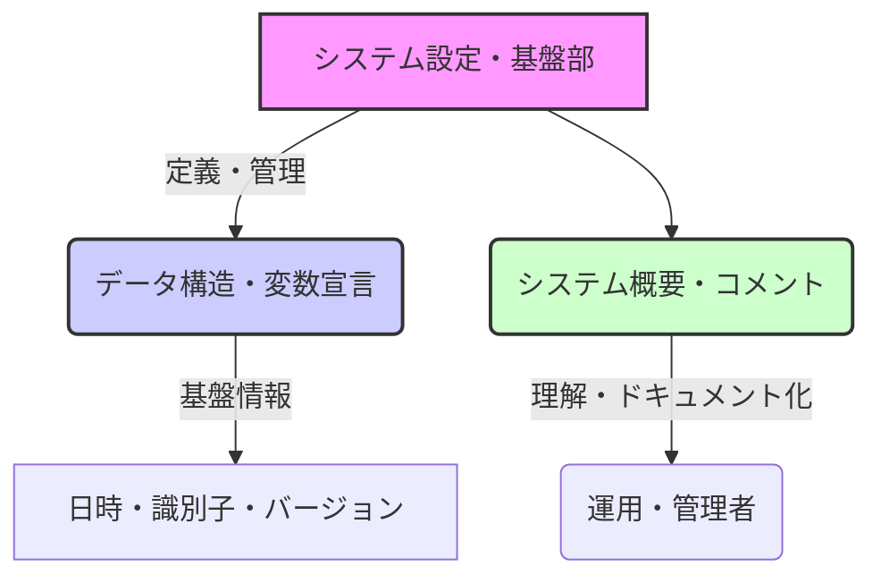
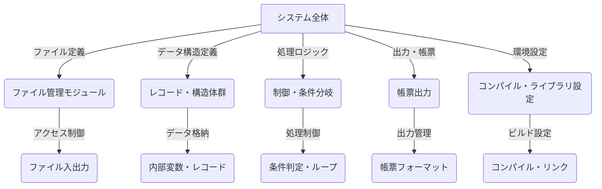
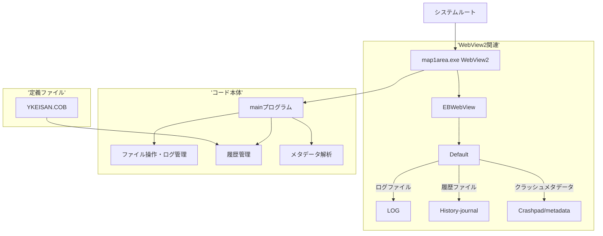
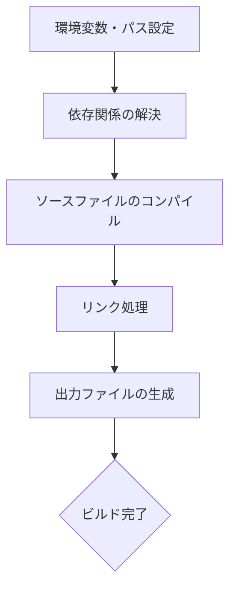
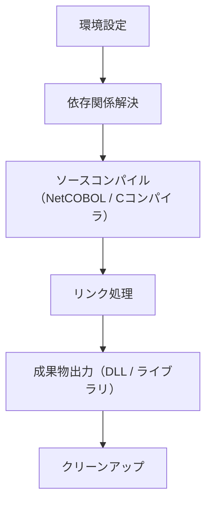
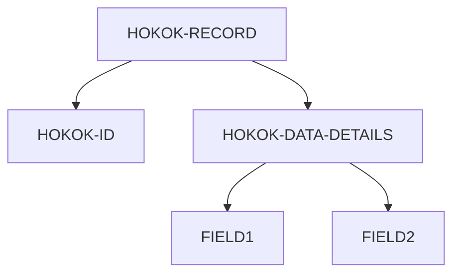
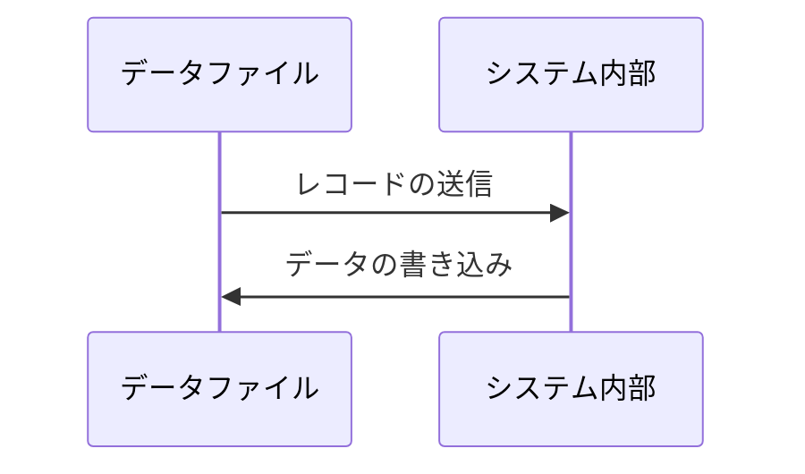
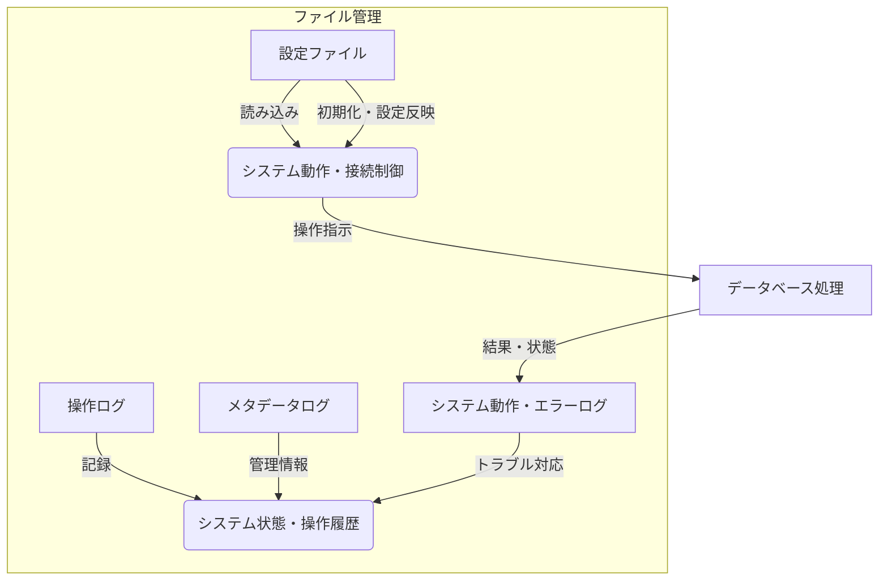
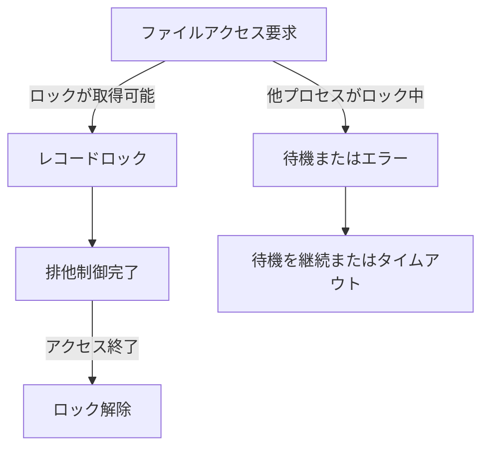
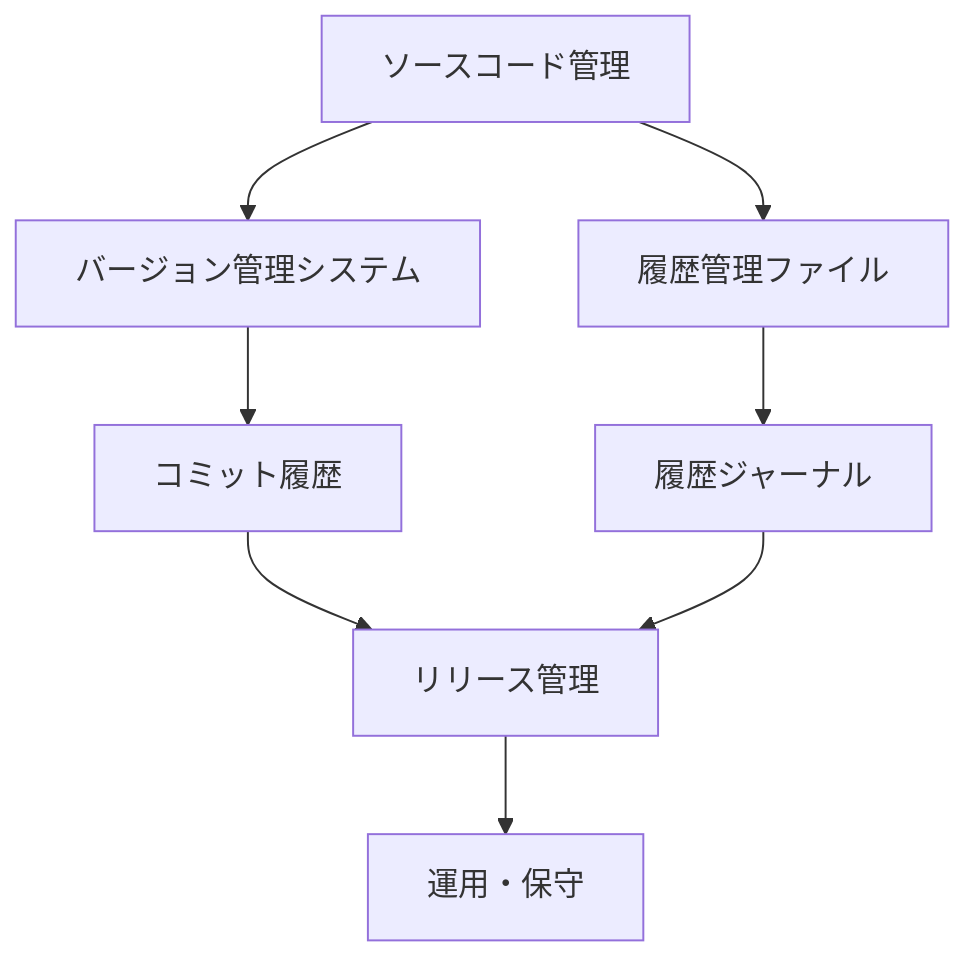

# 詳細仕様書の目次／システム構成とファイル管理に関する章立て案

## 目次
1. [はじめに・概要](#1-はじめに概要)
2. [全体構成と基本設計](#2-全体構成と基本設計)
3. [ファイル分類と構造](#3-ファイル分類と構造)
4. [仕様書：システムのソースコード管理体系](#4-仕様書システムのソースコード管理体系)
5. [ビルド・コンパイル環境](#5-ビルドコンパイル環境)
6. [データ定義とファイルフォーマット](#6-データ定義とファイルフォーマット)
7. [システムのセクション別ファイルリスト](#7-システムのセクション別ファイルリスト)
8. [システムの運用・管理ファイル](#8-システムの運用管理ファイル)
9. [セキュリティ・アクセス管理](#9-セキュリティアクセス管理)
10. [変更履歴・アップデート管理](#10-変更履歴アップデート管理)

---

<h2 id="1-はじめに概要">1. はじめに・概要</h2>


### 1. システムの目的

本システムは、企業や団体において運用される各種業務の効率化と情報管理を目的としています。主にシステムの基盤となる設定情報やデータ構造の定義を通じて、安定したデータ処理と運用支援を実現します。システムは、日時、識別子、バージョン情報や運用データなど、多岐にわたる情報を適切に管理し、業務プロセスの自動化や正確性の向上に寄与します。

### 2. 開発背景

システムの開発は、多くの企業で必要とされる情報システムの信頼性向上と標準化を念頭に、既存の運用を改善し、新たな付加価値を創出することを目的に始まりました。特に、設定情報やデータ構造の一元管理が求められている背景から、システムの基本構造の定義と標準化に重点を置いています。これにより、運用の効率化やメンテナンス性の向上が期待されます。

### 3. 利用範囲と対象ユーザ

本システムは、システムエンジニア、運用担当者、データ管理者などの内部利用者を対象としています。システムの設定情報やデータ構造の定義は、運用ルーチンに直接関わるため、これらのユーザが正確に理解し、適切に管理することが求められます。また、今後の拡張や改良を念頭に置き、標準化された仕様として設計されているため、他のシステムとの連携や統合にも対応可能となっています。

### 4. システムの基本的な概要

本システムは、以下の主要な構成要素から構成されます。

#### 4.1 設定情報定義

- システムの運用に必要な各種設定情報とデータ構造をコード内で定義し、これらを基に運用を支援します。
- 具体的には、システムのバージョン、日時、識別子などの情報を保持し、システム全体の状態管理を可能にします。

#### 4.2 データ構造の定義

- 各種レコードや変数宣言を通じて、必要な情報項目の構造や型を規定しています。
- これにより、一貫したデータ処理と容易なメンテナンスを実現します。

### 5. ソースコードから読み取れる仕様のポイント

以下は、各ソースコードから読み取れる主要なポイントの概要です。

| ファイルパス | 内容の概要 | 目的・役割 |
| --- | --- | --- |
| `KEIKA.CBL` | システムの設定情報やデータ構造の定義 | システムの運用に必須な設定情報の保持 |
| `BANGOK.CBL` | システムの概要や目的、メタ情報を記載したコメント | システムの基本設計とマニュアル的役割 |
| `BARKANK.CBL` | 重要なデータ項目の定義とシステム情報のコメント | データ管理構造とシステム名・バージョン情報 |
| `Karuta.cbl` | システムの概要とデータ構造の詳細定義 | データ項目の詳細とシステム設計の理解支援 |

### 6. 図解：システム構成の概略



### 7. まとめ

本仕様書では、システムの基本的な目的と背景、利用範囲、そしてシステム全体の構成について詳細に記述しました。システムの根幹をなす設定情報やデータ構造の定義は、今後の運用や開発において重要な基礎となります。これらの仕様を理解し、適切に運用を行うことで、システムの安定性と拡張性を高めることが期待されます。

<h2 id="2-全体構成と基本設計">2. 全体構成と基本設計</h2>


このセクションでは、システムの全体アーキテクチャ、および主要な構成要素とそれらの関係性について整理します。

### 1. 全体アーキテクチャ

本システムは複雑なデータ定義と多層的なファイル操作に基づくビジネスロジックを COBOL 及び類似言語（例：PL/I、C言語風COBOL等）を用いて実現しています。システムの中心となるのは、多数のファイル（ファイル定義、レコードレイアウト）と、それらに準じたデータ構造群です。

また、システムは以下の構成要素からなります。

- **データ定義・構造体群**：各種レコード、データフィールド、構造体最低階層レベル(01～07など)の詳細定義。
- **ファイル管理モジュール**：複数のファイルのオープン・クローズ、読込み・書込、キー操作等の制御。
- **処理ロジックモジュール**：条件分岐、ループ処理、データ計算・変換・評価、外部呼出し(C連携やDLLコール)。
- **報告・帳票出力モジュール**：帳票レイアウトに基づくレコード整形と印刷処理。
- **システム設定と環境制御**：コンパイルオプション、ライブラリ・パス設定、環境変数。

### 2. 主要コンポーネントの関係性

それぞれの構成エレメントは以下の関係性と役割を持ちます。



### 3. 連携とフロー

1. **システム起動時**：環境設定とライブラリ設定の読み込み (`F`や`K`)
2. **処理開始**：データ定義とファイル管理の初期化 (`C`や`B`) によりファイルをオープン
3. **データ操作**：
   - レコードの読込み(`H` to `B`)
   - 条件判定と制御 (`D`や`I`)
   - 必要に応じた計算・変換
   - 更新・保存
4. **帳票出力**：データの整形と記録で`E`と`J`を連携
5. **終了処理**：ファイルクローズと後始末 (`B`)

#### 4. システムの拡張性

- ファイル定義やレコード構造は多層かつ詳細に定義されており、追加のファイルやデータフィールドも容易に拡張可能。
- 条件判定と制御は`IF-ELSE`, `PERFORM`, `EVALUATE`文により柔軟に対応。

#### 5. 仕様のポイント

- 複雑な多層レコードを用いたデータ構造管理
- 多数のファイルの循環的アクセスとエラー管理
- 条件判断による業務ロジックの分岐とデータ処理
- ローカル・リモート両環境対応を含むビルド設定
- 特定の業務ケース（医療・会計・管理用）に合わせた拡張・調整可能なアーキテクチャ

---

### まとめ

この仕様では、システムの各コンポーネントの役割と関係性を明確に示しました。全体の運用は、ビルド設定→ファイル管理→データ処理の順序で進行し、高度にモジュール化と多層構造化により拡張とメンテナンス性を確保しています。

<h2 id="3-ファイル分類と構造">3. ファイル分類と構造</h2>


### はじめに
本章では、本システムで管理・利用される各種ファイルの分類、役割、配置場所について詳細に記述します。これにより、システム内部のファイル運用に関する理解と管理の一助とします。

---

### 1. ファイルの分類と役割

本システムで扱うファイルは、大きく次のカテゴリに分類されます。

#### 1.1 ソースコードファイル
ソースコードはシステムの動作を定義するプログラムの実装部分です。  
**役割**: プログラムの処理、ファイル操作、ログ管理、履歴管理などを実現します。  
**配置場所**:  
`code/test\comsys\pg\緯度経度用OBJ\map1area.exe.WebView2\EBWebView\`

#### 1.2 データ定義ファイル
システムの各種データ構造やレコード定義を記述したファイルです。  
**役割**: 医療請求・施術記録に関する情報の格納と管理に使用される。  
**配置場所**:  
`code/test\comsys\pg\YKEISAN.COB`  
(ファイル：`YKEISAN.COB` はデータの構造や定義情報を含むと推察)

#### 1.3 設定ファイル
システム起動時や動作中に使用される構成情報。外部設定として管理される場合もある。  
**役割**: アプリケーションの動作設定やバージョン情報を保持。  
**配置場所**: 具体的な設定ファイルは示されていませんが、一般的にはシステムの設定フォルダ内に配置。

#### 1.4 実行可能ファイル
システムの主要な動作を担う実行ファイルおよびライブラリ。  
**役割**: システムの起動と処理実行。  
**配置場所**:  
`code/test\comsys\pg\緯度経度用OBJ\map1area.exe.WebView2\EBWebView\` に含まれる`map1area.exe`など。

#### 1.5 ログ・履歴ファイル
システムの動作状況や履歴情報を記録するファイル群です。  
**役割**: イベント、エラー、操作履歴の記録と追跡。  
**配置場所**:

|分類|パス|説明|
|---|---|---|
| ログファイル | `Default\LOG` | ファイルの操作ログやエラーログを保存 |
| 履歴・ジャーナル | `Default\History-journal` | 履歴情報の保存と管理 |

---

### 2. 各ファイルの詳細と配置例

#### 2.1 ログファイル（`LOG`）
- **場所**: `code/test\comsys\pg\緯度経度用OBJ\map1area.exe.WebView2\EBWebView\Default\LOG`
- **役割**: システムの稼働状況やエラー情報を記録。特に、`map1area.exe.WebView2`アプリケーションの動作ログや例外情報を保持。

#### 2.2 履歴・ジャーナルファイル（`History-journal`）
- **場所**: `code/test\comsys\pg\緯度経度用OBJ\map1area.exe.WebView2\EBWebView\Default\History-journal`
- **役割**: 操作履歴や変更履歴を管理。不具合解析や操作の追跡に用いる。

#### 2.3 請求・施術情報定義ファイル（`YKEISAN.COB`）
- **場所**: `code/test\comsys\pg\YKEISAN.COB`
- **役割**: 医療請求や施術情報のレコード構造、管理用の定義を記述。データベースファイルの仕様やレコード形式を定義。

#### 2.4 メタデータ解析用ファイル
- **場所**: `map1area.exe.WebView2\EBWebView\Crashpad\metadata`
- **役割**: 崩壊レポートやクラッシュハンドリングに関わるメタデータの保存と解析。解析プログラムは内容を理解しやすい形式でレポート出力を行う。

---

### 3. 配置場所の図解



### 4. まとめ
本システムにおいては、ファイルは以下のように整理され、各役割に応じて配置されています。

|分類|配置場所|役割|
|---|---|---|
| ソースコード | `code/test\comsys\pg\...` | システム処理とファイル操作の実装 |
| データ定義 | `YKEISAN.COB` | 医療請求・施術レコードの管理定義 |
| ログ・履歴 | `Default\LOG`, `Default\History-journal` | システム動作と履歴の記録 |
| メタデータ | `Crashpad\metadata` | メタ情報の解析とレポート |

以上により、ファイル群の役割と配置を理解し、システム管理や運用の指針としてください。

---

<h2 id="4-仕様書システムのソースコード管理体系">4. 仕様書：システムのソースコード管理体系</h2>


### 概要
本仕様書は、ＣＯＢＯＬを中心としたソースコード及び補助ファイルの保存場所、構成方針、命名規則と管理方法について詳細に記述し、管理体系の標準化と効率化を図ることを目的とします。

### 1. 保存場所とディレクトリ構成
- **ソースコード格納場所**  
  プロジェクト全体のソースコードは、`code/`直下に整理し、その開発カテゴリごとにフォルダ分けします。  
  例：  
  ```plaintext
  code/test/cbl/        ← COBOLソースコード
  code/test/comsys/    ← システムの共通ライブラリや設定ファイル
  ```
- **システム依存ファイル**  
  補助ファイルや設定ファイルは、`\pg\`や`\\obj\\`といったサブディレクトリに整理します。  
  例：  
  ```plaintext
  code/test\\comsys\\pg\\
  例：*.OBJ, *.LIB, *.DLL, *.DCUなど
  ```

- **ドキュメント**  
  仕様書、設定書、管理ドキュメントは`doc/`または`README/`に格納し、最新仕様を維持管理します。

### 2. 構成方針
- **ソース一式は、`<システム名>_<バージョン>_<作成日>_ソースコード`といった命名規則に従う。**  
  例：  
  ```plaintext
  HokenCom_COBOL_20210401
  ```
- **ファイルの命名規則**  
  - COBOLソースは`*.cob`または`*.cbl`  
  - コマンドや設定は`*.mak`、`*.cbl`の他、`*.cob`にて記述  
  - バイナリ／中間生成物は`*.dll`、`*.lib`、`*.obj`、`*.dcu`などを使用し、別ディレクトリに格納します。

- **バージョン管理**  
  - ファイルの更新履歴は、バージョン番号またはコメントタグ（例：`//`や`/* */`）に記録し、`git`等のバージョン管理システムと連携します。

### 3. 管理方法
- **ソースの整列とコメント付与**  
  - 各ファイルの冒頭に、システム名、作成日時、バージョン、著者、目的のコメントを記述。  
  - 主要な変数やレコード定義には適切なコメントを付与し、仕様や役割を明示します。

- **管理体制（管理者・担当者）**  
  - ソース管理は、バージョン管理システム（例：git）を用いて、変更履歴と差分管理を徹底。  
  - 管理担当者は、構成定義とリリース手順書を作成し、コードレビューと承認を義務付ける。

- **管理ルール**  
  - ソースコードの修正は必ずバックアップを取り、修正内容は差分として記録。  
  - ファイル命名、一貫性の保持、不要なファイルの削除管理を徹底。  
  - 実行／コンパイル用設定（`*.mak`や`*.cbl`）は、バージョンごとに管理し、変更履歴を追跡。

### 4. ファイル管理詳細
- **ソースコードファイル**  
  - 担当者別のフォルダに分割管理。  
  - コーディング規約に従い、インデント、タグ付け、コメントを標準化し、理解しやすさを保持。

- **ビルドおよび設定ファイル**  
  - `*.mak`、`*.cbl`、`*.cob`は必ずリポジトリに登録。本番／開発分を分離管理。

- **中間生成／実行ファイル**  
  - `*.dll`、`*.lib`、`*.obj`、`*.dcu`などは、ビルド用ディレクトリに格納し、バージョン番号やビルド日付を付与。

### 5. 付則
- **命名例**  
  ```plaintext
  [システム名]_[作成日（YYYYMMDD）]_[バージョン番号]_[種別]_[連番].拡張子
  ```
  例：  
  ```plaintext
  HokenCom_20210401_v1_20210401.cob
  ```
- **保守管理**  
  - 定期的なコードレビューとバックアップですべてのファイルの整合性を保持。  
  - 重要ファイルについては、管理者の承認・チェック記録を残す。

- **ドキュメントのバージョン**  
  - 仕様書や管理規程もソースコードと同様にバージョン管理し、最新／履歴情報を明示。

---

以上をもって、システムのソースコード管理体系の標準ルールとし、効率的かつ一貫性のある管理を実現します。

<h2 id="5-ビルドコンパイル環境">5. ビルド・コンパイル環境</h2>


### 概要
本セクションでは、システムのビルドおよびコンパイルに関わる設定ファイル群の構成、ビルドフロー、及び使用されるコンパイラやライブラリの管理について詳述します。主要なビルドスクリプトは複数の種類に分かれており、主にCOBOLプログラムおよびDLL/ライブラリのビルドに焦点を当てています。これらの設定によって、ソースコードのビルドを効率的かつ再現性の高いものにします。

---

### 1. ビルドに用いる設定ファイルの構成

#### 1.1 Makefileの役割と構成
複数のMakefileは以下の通りです。

| ファイルパス | 役割 | 内容のポイント |
| -------------- | -------- | ------------------- |
| `code/test\comsys\pg\JOSEIMEI.MAK` | DLL/ライブラリビルド | 依存関係管理とビルドコマンド設定、環境変数設定、ターゲットごとのビルド定義とクリーンターゲット |
| `code/test\comsys\pg\MSG001.MAK` | COBOLプログラムビルド | COBOLソースのコンパイルとリンク定義、DLL出力設定、クリーン処理 |

#### 1.2 構成例
```plaintext
Makefile (例)
├─ 環境変数・パス設定
│   └─ コンパイラパスやライブラリパス定義
├─ ビルドターゲット定義
│   ├─ DLLビルド
│   ├─ ライブラリビルド
│   └─ クリーン処理
└─ 依存関係とビルドコマンド
```

#### 1.3 その他構成情報
- `.CBI`ファイル（例：`YAI722.CBI`）は、コンパイルやリンクに必要なライブラリや設定値の参照情報を含む環境設定ファイル。
- 複数のMakefileで、ビルドターゲットと手順を明確に分離し、再現性を確保。

---

### 2. ビルドフロー

#### 2.1 一連のビルドステップ


#### 2.2 フロー詳細
- **環境準備**: 必要なコンパイラとツールのパスを設定し、アクセス可能な状態にします。
- **依存関係解決**: 変更されたソースだけを対象にビルドを行うため、依存関係を確認。
- **コンパイル**: COBOLやC系のソースコードをNetCOBOLや他のコンパイラで変換。
- **リンク**: DLLや静的/動的ライブラリにまとめる。
- **成果物生成**: DLL, LIB, EXEなどファイルを出力。
- **クリーンアップ**: 必要に応じてビルド成果物の削除を行う。

---

### 3. 使用するコンパイラとライブラリ

#### 3.1 コンプライアンスとツール
| ツール | 用途 | 備考 |
| -------- | -------- | ------------ |
| NetCOBOL | COBOLソースのコンパイル | ファイルの依存関係に基づきビルド |
| リンカ | DLLやライブラリのリンク | 依存ファイルとライブラリを連結 |
| MSVC (場合により) | 必要に応じたC/C++コンパイル | 一部バイナリはC/C++を利用可能 |

#### 3.2 ライブラリ管理
各Makefileでは、必要なライブラリやヘッダ情報を`.CBI`設定ファイルから参照し、リンク時に適用します。以下のポイントに注意します。
- **パス管理**: パスはビルド環境の設定により動的に解決
- **バージョン管理**: 既存ライブラリのバージョンを明示
- **ライブラリのクリーン化**: 不要な設定や古いファイルのクリーンターゲットを定義

#### 3.3 環境設定例
```plaintext
- NetCOBOLのインストールパス：C:\Program Files\NetCOBOL
- ライブラリパス：C:\libs\common
- 環境変数：PATHにNETCOBOL_PATHを追加
```

---

### 4. まとめ
- 複数のMakefileと設定ファイルを用いてビルド工程を自動化
- ビルドフローは依存関係に従い段階的に進行
- 使用するコンパイラとライブラリは環境設定ファイルにより一元管理
- クリーン処理を適用し、都度クリーンな状態からリビルド可能

これにより、ビルドの再現性と効率化を実現しています。

---

### 図: ビルドフローの概略



---

以上が本システムのビルド・コンパイル環境の詳細仕様です。

<h2 id="6-データ定義とファイルフォーマット">6. データ定義とファイルフォーマット</h2>


このセクションでは、システムで使用される各種データファイルの構造および、システム内部でのデータ管理のための構造体定義について詳細に記述します。これにより、データの記録・読み出しの形式、各レコードの構成要素、およびそれらの関係性について明確に理解できます。

---

### 1. データファイルの構造定義

#### 1.1 H_HOKOK.CBLにおけるレコード構造

**概要:**  
`H_HOKOK.CBL`は、複雑なレコード構造を持ち、複数の情報要素を階層的に管理するための定義を含む COBOL プログラムです。  
**レコードの特徴:**  
- 複数のレコードタイプ（複数のレベル0, 1, 2）を持つ階層構造  
- さまざまなフィールドがあり、多くは数値型が中心、文字列も含む  
- フィールドにはコメントで各々の役割やサイズが記載されている

**例：**  
```plaintext
レコード例：  
01 HOKOK-RECORD.  
    03 HOKOK-ID               PIC X(10).  -- 申請ID
    03 HOKOK-DATA-DETAILS.  
        05 FIELD1             PIC 9(5). -- 数値データ1
        05 FIELD2             PIC 9(3). -- 数値データ2
        ...
```
このように、階層を持つ構造でデータを管理しています。

---

#### 1.2 定義されたレコードの階層構造概要

| レベル | フィールド名             | 型・サイズ          | 概要                          |
|---------|---------------------------|---------------------|------------------------------|
| 01      | HOKOK-RECORD              | -                   | メインレコードのルート        |
| 03      | HOKOK-ID                  | PIC X(10)           | 申請ID                        |
| 03      | HOKOK-DATA-DETAILS        | -                   | 詳細情報の親レベル           |
| 05      | FIELD1                    | PIC 9(5)             | 数値フィールド               |
| 05      | FIELD2                    | PIC 9(3)             | 数値フィールド               |
| ...     | ...                       | ...                 | 他のフィールド               |

**図1：レコード階層構造例（Mermaid）**



---

### 2. 内部システムデータ管理用構造体定義

#### 2.1 `JIB9709R.COB`のデータ構造

**概要:**  
`JIB9709R.COB`内では、複数のレコード構造体が定義されており、微細なフィールドごとにデータ管理のためのサイズやキャプションがコメントで示されている。  
**設計ポイント:**  
- 数値型（主に PIC 句を用いた定義）  
- 伝送や保存に適した固定長レコードのフォーマット  
- コメントによりフィールドごとの役割やサイズが明示されている

**例：**  
```plaintext
01 RECORD-HEADER.
   05 RECORD-TYPE               PIC X(2).    -- レコードタイプ識別子
   05 RECORD-LENGTH            PIC 9(4).    -- レコード長
   05 TRANSACTION-ID           PIC X(10).   -- 取引ID
...
```

#### 2.2 レコード定義の詳細

| レベル | フィールド名           | 型・サイズ          | コメント/用途                     |
|---------|------------------------|---------------------|---------------------------------|
| 01      | RECORD-HEADER          | -                   | レコード全体のヘッダ          |
| 05      | RECORD-TYPE            | PIC X(2)            | レコード種別識別子             |
| 05      | RECORD-LENGTH          | PIC 9(4)            | レコードの長さ               |
| 05      | TRANSACTION-ID         | PIC X(10)           | 取引識別ID                   |
| ...     | ...                    | ...                 | 他の詳細フィールド            |

---

### 3. データレイアウトの詳細と解説

#### 3.1 フィールドサイズと役割

- 数値フィールド (`PIC 9(x)`)は数値データの保存に適している。
- 文字列フィールド (`PIC X(x)`)は識別子や使用説明文、コード等に用いられる。
- コメントによる記述はサイズや役割の理解を助ける。

#### 3.2 例示コンポーネントの配置例図



---

### 4. まとめ

この仕様書では、以下の事項を定義しています。

- **データファイルのレイアウトとレコード構造**：階層的な定義と各フィールドの役割やサイズ
- **システム内管理用構造体**：データ伝送や内部処理のための具体的な定義（例：分かりやすい名称や階層構造）
- **図解例の提示**：階層構造やデータフローの視覚的理解の促進

これらの情報に基づき、データの正確な取り扱いやシステム間のデータ連携、データ保存の設計・実装の指針としてください。

---

### 付録: 用語の定義
| 用語          | 定義                                       |
|--------------|--------------------------------------------|
| レコード       | 一つのデータ単位。複数のフィールドを含む階層構造のデータ集合      |
| PIC句        | COBOLにおけるデータフィールドの型とサイズを指定する記法   |
| 階層レベル   | 00、01、02、03...のレベル番号。親子関係を示す階層指標         |

---

以上により、各種データ定義の具体的な構造と管理基準を理解できるようにまとめました。

<h2 id="7-システムのセクション別ファイルリスト">7. システムのセクション別ファイルリスト</h2>


このドキュメントは、システム内に存在する各機能別のファイル一覧とその役割を整理したものです。各ファイルは、特定の業務処理や管理機能に対応しており、ファイルの設計、レコード構造、インデックス設定、処理ロジックの一部といった観点から分類しています。

---

### 1. 患者情報管理関連ファイル
- **患者基本情報ファイル**
  - ファイル名例: `sisetju.dat`
  - 役割: 施術者や患者の個人情報、患者ID、住所、連絡先等の基礎情報を管理。
  - 構造: 固定レコード長、キー設定、インデックス付与。

- **患者負傷履歴**
  - 役割: 負傷年月日、負傷場所、詳細負傷原因などを記録
  - 操作: レコードの読込・更新・出力

- **患者長期施術履歴**
  - 内容: 長期的な施術履歴とその状態管理
  - 使用例: 長期逓減率や施術区分に基づく処理

### 2. 負傷・施術情報ファイル
- **負傷詳細ファイル**
  - 例: `負傷データファイル`
  - 内容: 負傷箇所、原因、経過日数、施術年月日など
  - 特徴: 複数の階層レコード、多次元配列利用

- **施術記録**
  - 内容: 施術回数、料金設定、負傷部位ごとの詳細
  - 操作: 施術日付、部位別料金計算、並び替え

### 3. 料金・費用管理
- **料金マスター**
  - 設定例：`料金定義`

- **料金計算用構造体**
  - 内容: 加算料、通院回数、逓減率、長期分の調整
  - 複雑な階層構造や配列・多次元配列El

### 4. レセプト・帳票出力
- **帳票定義ファイル**
  - 例: `RECEPT.TXT`、`RANDAN/Selihanna`など
  - 構成: レコードレイアウト、出力レイアウト
  - 動作: 初期化、出力処理、帳票印刷・検証

- **プリンタ出力用設定**
  - 内容: ヘッダ・明細・合計レコードのフォーマット
  - 例: 印刷行列、ページ制御

### 5. 管理・設定ファイル
- **環境設定**
  - 例: `YENV.DAT`
  - 内容: LAN設定、パスワード、ホスト名、ログ設定

- **コンパイル・ビルド設定**
  - 例: `YAWARA.COB`, `YAWARA.MAK`
  - 内容: コンパイルオプション、ライブラリパス、リンクパラメータ

- **外部ライブラリ**
  - 例: `uuid.Lib`, `F3BICBDM.OBJ`, `KERNEL32.LIB`
  - 役割: 標準ライブラリや外部関数のリンク定義

---

### 6. ログ・履歴・キャッシュ
- **レセプト履歴・ログファイル**
  - 例: `NP-ACCOUNT-LOG`
  - 内容: 変更履歴、ログ情報
  - 目的: 操作追跡、障害解析

- **キャッシュ・一時保存ファイル**
  - 例: `CacheFile`, `TempData`
  - 役割: 短期的なデータ保持、再利用

---

### 7. セキュリティ・認証関連
- **パスワード・認証ファイル**
  - 例: `PassSet.dat`, `Password.dat`
  - 内容: パスワード登録・管理情報
  - 役割: ログイン制御、アクセス制御

- **ロック・同期ファイル**
  - 例: `.LOCK`, `.LOG`
  - 役割:排他制御、状態同期

---

### 8. その他のユーティリティ・設定ファイル
- **拡張機能設定・スクリプト**
  - 例: `ExtConfigs.xml`, `Power.cob`
  - 内容: UI制御・拡張機能制御スクリプト
  - 役割: カスタマイズ・自動化

- **システム起動・設定スクリプト**
  - 例: `StartUp.cmd`, `Configure.ini`
  - 内容: 初期設定、システム起動時処理

---

## 備考
- ファイル管理は「固定長レコード」「インデックス付」「多階層構造」など、業務要件に応じた設計。 
- システム間連携や出力帳票のフォーマットには、詳細なレイアウト定義と多様なフィールド定義が存在。
- セキュリティ関連ファイルは情報の機密性維持のため、内容非公開となっている。

---

この文書は、仕様の基礎的な理解とシステム内のファイル構成の全体像を表すものであり、詳しいロジックや具体的なデータ内容については各個別資料やソースコードの詳細解析が必要です。


<h2 id="8-システムの運用管理ファイル">8. システムの運用・管理ファイル</h2>


このセクションでは、システムの稼働および保守時に必要となる設定ファイルやログファイル、監査・履歴管理用ファイルについて詳細に説明します。これらのファイルは、システムの正常な運用、障害対応、設定変更の追跡、およびシステムの整合性維持に重要な役割を果たします。

---

### 1. ログファイル

#### 1.1 データベース操作ログファイル

- **パス**:  
  `code/test\comsys\pg\緯度経度用OBJ\map1area.exe.WebView2\EBWebView\Default\shared_proto_db\LOG`

- **目的**:  
  システムがデータベースに関する操作履歴を記録するためのログファイルです。特に、データベースの作成や管理操作に焦点を当てています。

- **記録内容**:
  - データベースの存在確認と不在時の作成処理
  - 既存のマニフェストファイルの再利用
  - 操作実行のタイムスタンプ
  - 操作を行ったユーザまたはプロセスの識別情報（必要に応じて）

- **詳細例**:
  ```
  [YYYY-MM-DD HH:MM:SS] データベース作成開始
  [YYYY-MM-DD HH:MM:SS] 既存マニフェストの再利用: manifest_file_001
  ```

#### 1.2 メタデータ操作ログファイル

- **パス**:  
  `code/test\comsys\pg\緯度経度用OBJ\map1area.exe.WebView2\EBWebView\Default\shared_proto_db\metadata\LOG`

- **目的**:  
  データベースのメタデータに関する操作履歴を記録します。これには、データベースの新規作成や既存メタデータの再利用状況が含まれます。

- **記録内容**:
  - 初期作成時には「新たに作成された」旨の記述
  - 既存のマニフェストの再利用情報
  - 操作日時と操作対象の情報

- **例**:
  ```
  [YYYY-MM-DD HH:MM:SS] メタデータファイル未存在のため、新規作成
  [YYYY-MM-DD HH:MM:SS] 既存メタデータの再利用: manifest_metadata_002
  ```

#### 1.3 一般的なシステム動作・エラーログ

- **パス**:  
  `code/test\comsys\pg\緯度経度用OBJ\map1area.exe.WebView2\EBWebView\Default\LOG`

- **役割**:  
  ファイル操作やシステムの動作状態、エラー情報を記録。システム管理者がトラブルシューティングや状況把握を行うために使用します。

- **記録内容例**:
  - ファイルの読み書き失敗
  - 処理のタイムスタンプ
  - エラーコードや例外内容

---

### 2. 設定ファイル

#### 2.1 環境設定ファイル（YENV.DAT）

- **パス例**:  
  `code/test\yawara\yaw.option\YENV.DAT`

- **形式・内容**:  
  複数の設定例とコメントによる記述が含まれています。設定例からシステム挙動を制御します。

- **主な設定項目**:

  | 設定項目                | 内容例または説明                                               |
  |------------------------|------------------------------------------------------------|
  | LAN接続タイプ           | `正常接続`、`制限接続` など                                      |
  | フォルダ指定の種類      | `ローカル`、`ネットワーク`など                                    |
  | 会コード                | システムの識別子や会の名称                                       |
  | データフォルダのパス    | 実データが格納されるフォルダのパス例                                |
  | パスワードの有無        | `有` / `無`                                                    |

- **用途**:  
  システム起動や接続時の設定情報をロードし、環境に応じた動作制御や認証処理に利用されます。

#### 2.2 仕様・処理ロジックの概要

- このファイルは直接実行されるわけではなく、システム内のプログラムが読み込み、設定値をもとに接続、認証、フォルダ操作などを行います。
- コメントが付されており、複数の設定例と解説が記載されているため、必要に応じて編集・調整が可能です。

---

### 3. ファイル操作・管理の仕組み

#### 3.1 ファイルの管理と自動化
- ログファイルや設定ファイルは、システムの各種操作に応じて自動的に作成・更新されます。
- 初期化処理時に必要なデータベースやメタデータが存在しない場合、新規作成し、既存の情報を再利用します。

#### 3.2 監査と履歴管理
- 操作履歴やシステム状態を記録するログファイルにより、監査や障害分析をサポート。
- 定期的なバックアップやログのローテーションを設定し、長期的な管理を実現します。

---

### 4. まとめ図（システムファイル構成と流れ）



---

### 5. まとめ

本仕様では、システム運用・管理に必要な主要ファイルとその役割を明確に定義しました。これらのファイルは、システムの安定稼働と保守性向上に不可欠です。管理者は、これらのファイルの内容と流れを理解し、適切な管理と監査を行う必要があります。

---

以上が、「システムの運用・管理ファイル」の詳細仕様です。

<h2 id="9-セキュリティアクセス管理">9. セキュリティ・アクセス管理</h2>


このセクションでは、システムのセキュリティを確保するためのアクセス権管理とパスワード管理について詳細に記述します。具体的には、各種設定ファイルの配置場所とアクセス制限、パスワードの管理方法、及びファイルへのアクセス制御の仕組みについて説明します。

---

### 1. ファイルとシステムのアクセス権設定

#### 1.1 設定ファイルの配置場所と権限制御

システムは複数の設定ファイルを用いて動作します。これらの設定ファイルは以下の場所に配置され、適切なアクセス制御が必要です。

| ファイルパス | 内容の概要 | アクセス制限のポイント |
|------------------------------|--------------------------------------------------------------------------------|------------------------------------------------|
| `code/test/yawara/yaw.option/YENV.DAT` | 特殊環境設定用のデータファイルで複数の設定例をコメント付きで記述 | 読み取り専用のアクセスを許可し、書き込み権限は限定する必要があります。 |
| `code/test/yawara/yaw.option/柔プラス用/MAKISHISYS/DATA/CALENDAR/YENV.DAT` | 複数の設定例をカンマ区切りで記述している設定ファイル | 編集権限は認証された管理者だけに制限します。 |
| `code/test/comsys/pg/緯度経度用OBJ/map1area.exe.WebView2/EBWebView/Default/shared_proto_db/metadata/LOCK` | ファイルロックを管理するためのデータファイル | アプリケーションの排他制御に利用されるため、読み書き権限はアクセス制御を強化します。 |
| `パスワードYENV.DAT` | パスワードや認証情報の格納ファイル | 高レベルのアクセス制限と暗号化を行います。 |

#### 1.2 アクセス権の実装例

- **ファイルシステム権限の設定**：
  - Windowsの場合、NTFSのアクセス権限で「読み取り」や「書き込み」権限を管理。
  - 不要な書き込み権限や実行権限を削除し、安全性を確保。

- **アプリケーションレベルのアクセス制御**：
  - アプリケーション側で動作開始時に設定ファイルの存在とアクセス権を検証。
  - 不正アクセスが検知された場合は適切な例外処理を行う。

---

### 2. パスワード管理とファイルのセキュリティ

#### 2.1 パスワード保存ファイルの管理

- `パスワードYENV.DAT`は、パスワードや認証情報を保存するためのファイルとして使用されます。  
- このファイルが格納されるディレクトリには、厳重なアクセス制限をかけ、認証されたユーザーのみアクセス可能にします。

#### 2.2 パスワードファイルのセキュリティ確保策

- **暗号化**：
  - パスワード情報は平文で保存せず、暗号化された形式を使用します。
  - 適切な暗号化アルゴリズムを適用し、ファイル自体の暗号化も検討します。

- **アクセス制御**：
  - ファイルに対するアクセスは、OSのアクセス権設定や、アプリケーション内の認証メカニズムによって制御されます。

- **定期的な更新**：
  - パスワードは定期的に更新し、不正アクセスのリスクを低減します。

#### 2.3 パスワード管理の運用方針

1. パスワード管理用ファイルは、最小権限のユーザーだけがアクセスできるディレクトリに配置する。
2. パスワード情報は暗号化して格納し、平文ファイルの保存地点にはアクセス制限を徹底。
3. パスワードの更新履歴とアクセス履歴を管理し、不審なアクセスが検知された場合の対応策を策定。

---

### 3. アクセス制御の仕組み

#### 3.1 ファイルロックの仕組み

- ファイルロックは、複数のプロセスやスレッドから共有データに対して排他制御を行うために利用されます。
- `LOCK`ディレクトリ内のメタデータファイルは、以下の機能を持つと考えられます。



- ロック解除は、操作完了時に自動または手動で行われ、他のプロセスがアクセスできるようになります。

#### 3.2 アクセス監査とログ

- 重要な設定ファイルやロックファイルにはアクセス履歴を記録し、不正アクセスや異常動作の追跡を可能にします。
- ログには以下の情報を記録します。
  - アクセス日時
  - アクセスしたユーザーまたはプロセス
  - 操作内容（読み取り、書き込み等）

---

### 4. セキュリティ確保のための追加措置

- **定期的なセキュリティレビュー**：アクセス権の見直しと権限設定の適正化を定期的に実施します。
- **暗号化通信の導入**：設定ファイルの読み込みやパスワード送信には、暗号化された通信（例：SSL/TLS）を利用します。
- **バックアップとリカバリ計画**：設定ファイルやパスワード情報の定期バックアップを行い、不測の事態に備えます。

---

### 5. まとめ

本システムは、設定ファイルとパスワードデータの安全な管理を最優先とし、OSのファイルシステム権限設定とアプリケーション側のアクセス制御を併用してセキュリティを確保します。また、ファイルロックや監査ログの導入により、複数アクセス環境においても安全な運用を実現します。

---

以上、セキュリティ・アクセス管理の詳細仕様と運用方針について記述しました。

<h2 id="10-変更履歴アップデート管理">10. 変更履歴・アップデート管理</h2>


### 概要
本セクションでは、システムにおけるバージョン管理およびソースコードや関連ファイルの更新タイミングと方法、履歴管理の方針と運用例について詳細に記述します。システムの安定運用と変更履歴の正確な追跡を目的とし、各種ファイルとプログラムの管理体制を確立します。

---

### 1. バージョン管理の方針
システムおよびソースコードの変更履歴を正確に把握し、管理するために以下の方針を採用します。

- **バージョン番号の付与**  
  各リリースや重要な更新時に一意のバージョン番号を付与し、変更の規模や内容を明示します。  
  例：`v1.0.0`、`v1.1.0` など。

- **管理ツールの活用**  
  GitやSVNなどのバージョン管理システムを導入し、ソースコードの変更履歴を自動的に記録・管理します。  
  ※本仕様書では、ソースコード自体の詳細は示さないが、実運用ではこの方針を推奨。

- **タグ付けとリリース管理**  
  リリースごとにタグ付与を行い、特定のバージョン状態を容易に復元・追跡可能とします。

---

### 2. 更新タイミングと方法

#### 2.1 更新タイミング

- **定期更新**  
  予め決定されたスケジュールに沿ってソフトウェアやファイルのアップデートを行います。例：毎月末、四半期ごと等。

- **緊急修正**  
  セキュリティ脆弱性や重大な不具合に対応するため、緊急アップデートを即時に実施します。

#### 2.2 更新方法

- **ソースコードの管理**  
  バージョン管理システムを用いてチェックイン・ブランチ管理を行います。  
  変更内容はコミットメッセージに記録し、誰がいつ何を変更したかを明示します。

- **ファイル・プログラムの更新**  
  更新は次の手順で実施します。  
  1. 新バージョンのソースコードまたはバイナリをビルド・テストする。  
  2.動作確認後、運用環境に反映。  
  3. 変更内容をアップデート履歴に記録し、関連資料に反映。

- **自動化ツールの導入**  
  継続的インテグレーション（CI）ツールを活用し、ビルド・テスト・デプロイを自動化します。

---

### 3. 履歴管理の方針と運用例

#### 3.1 履歴管理の方針

- **変更履歴の記録**  
  すべての修正・アップデートは詳細な履歴として記録します。  
  例：修正内容、実施日時、変更者、対象ファイルなど。

- **履歴情報の保存場所**  
  履歴は専用の履歴管理ファイルまたはバージョン管理システムにて一元化管理します。

- **アクセス権限と監査性**  
  変更履歴の閲覧・修正は権限を制御し、監査できる体制とします。

#### 3.2 履歴管理の具体的運用例

| 例 | 内容 |
|-----|-------|
| **1. 変更の発生** | バグ修正や新機能追加の際にコードの変更とともに履歴エントリを作成。 |
| **2. 履歴記録の作成** | 変更日時、修正内容、修正者名、対象ファイル、リリース番号を記載。例：<br>「2024-03-15、バグ修正、佐藤、map1area.exe.WebView2/Default/History-journal」 |
| **3. 履歴の閲覧・管理** | 管理者は履歴ファイルを定期的に確認し、変更の追跡と原因究明に活用。 |

---

### 4. 使用される補助ファイル例と管理例



#### 図解説明
- **ソースコード管理**は、バージョン管理システムを利用。
- **履歴管理ファイル**に更新や変更の履歴情報を記録。
- これらはリリースや運用・保守の各段階で参照・管理される。

---

### 5. 付属ファイルの管理例

| パス | 管理内容 | 備考 |
|--------|--------------|--------|
| `code/test\comsys\pg\緯度経度用OBJ\map1area.exe.WebView2\EBWebView\Default\History-journal` | 履歴・ジャーナル情報 | 履歴管理プログラムがこのファイルを操作し履歴情報を管理 |
| `code/test\cbl\sysupd.cbl` | 更新履歴管理ファイル定義 | Cobolプログラムによるデータ構造定義 |
| `code/test\cbl\KEIKA.CBL` | システム設定情報 | メタ情報や管理情報を格納 |
| `code/test\cbl\TEIKINO.CBL` | 管理・処理プログラム（概要） | システムの基盤処理を担う |

---

### 6. まとめ
本システムにおける変更履歴およびアップデート管理は、詳細なバージョン管理と履歴記録を徹底することで、システムの安定性とトレーサビリティを確保します。定期的なレビューと適切な運用により、迅速な問題対応と継続的改善を促進します。

---

以上が、「変更履歴・アップデート管理」の詳細仕様です。

