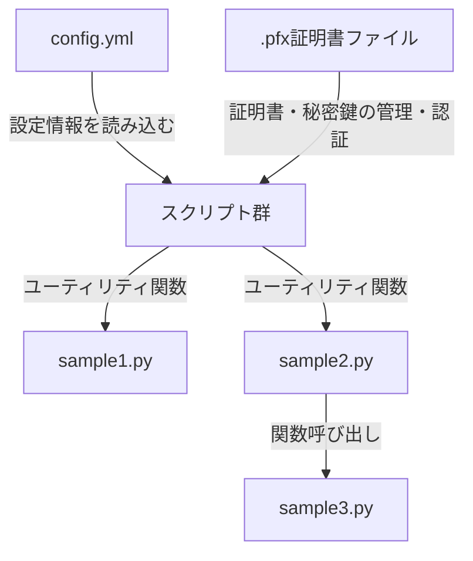
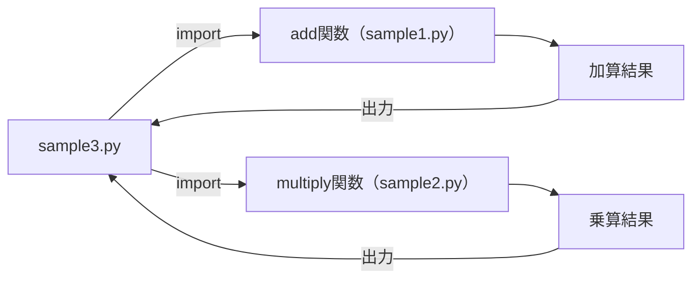
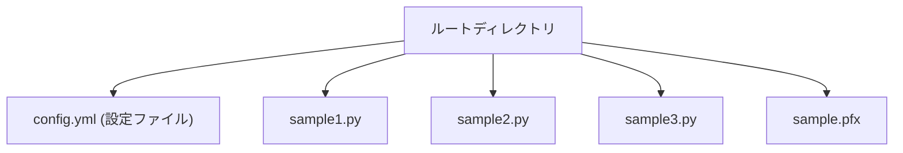

# システム仕様書：コードサンプルと構成の概要

## 目次
1. [システム概要](#1-システム概要)
2. [ファイル構成と役割](#2-ファイル構成と役割)
3. [設定ファイル：config.ymlの詳細](#3-設定ファイル：configymlの詳細)
4. [ソースコードの概要と役割](#4-ソースコードの概要と役割)
5. [その他のファイルの役割と取り扱い](#5-その他のファイルの役割と取り扱い)
6. [システム構成の図とフローチャート](#6-システム構成の図とフローチャート)

---

## 1. システム概要


### 目的

本システムは、多様な設定ファイルやライブラリ、証明書を扱うプログラムの動作を効率的に管理・実行することを目的としています。これにより、ソフトウェアの構成や動作仕様を柔軟に制御し、安全かつ効率的な運用を実現します。特に、証明書や秘密鍵の取り扱いを含むセキュリティ関連の処理をサポートし、暗号化や認証に必要な処理を安全に行える仕組みを提供します。

### 背景

現代の情報システムは、多層的な構成と複雑な設定管理を必要としています。これには、環境ごとに異なる設定ファイルや証明書の利用、複数のプログラム間でのライブラリや関数の連携などが含まれます。これらを一元的に管理し、システム全体の動作や設定の整合性を確保することが、信頼性とセキュリティ向上に不可欠です。

また、暗号化通信や証明書の検証などのセキュリティ処理についても、高い信頼性と簡便性を両立させる必要があります。これらの要求を満たすために設計された本システムは、設定の柔軟性とセキュリティ確保を両立させることを目指しています。

### 機能概要

#### 1. 設定ファイルの読み込みと管理

- YAMLフォーマットの設定ファイル（例：`config.yml`）を読み込み、アプリケーションの動作や構成情報を取得します。
- 設定項目には、動作モードやパス情報、環境変数などを含むことが想定され、安全かつ効率的な設定反映を支援します。

#### 2. 証明書や鍵の取り扱い

- PFX形式の証明書ファイル（例：`.pfx`）を扱い、証明書の読込みや検証を行います。
- システム内部で暗号処理や認証処理に利用されるため、必要に応じて証明書情報の抽出や検証を行います。

#### 3. ライブラリや関数の定義と呼び出し

- 基本的な数値演算（加算・掛算）を行うシンプルな関数群（例：`add`、`multiply`）を定義し、必要に応じて呼び出し・結果出力を行います。
- これらの関数は、他モジュールからインポートして複合的な処理に利用可能です。

#### 4. 基本的な処理例の実装

- 複数の関数の呼び出し例（例：和・積の計算結果の表示）をサンプルとして提供し、実行例を示します。

#### 全体像

本システムは、設定・証明書・数値演算といった複合的な機能を一体化し、セキュリティおよび設定管理を効率化します。これにより、運用の自動化やセキュリティ強化が促進され、堅牢なシステム構築を実現します。

---

### 各機能の詳細ハイライト

```mermaid
graph TD
    A[設定ファイル (YAML)] -->|読み込み| B[設定内容]
    C[証明書ファイル (.pfx)] -->|検証・読込み| D[証明書情報]
    E[数値演算関数群] -->|呼び出し| F(処理結果)
    G[サンプル実行例] -->|結果表示| H(ユーザ提示)
```

これにより、システムは設定・証明書・演算処理を連携させ、全体の動作とセキュリティを担保しながら、多機能な処理基盤を提供します。

## 2. ファイル構成と役割


このセクションでは、システムに含まれる各ファイルの一覧と、それぞれの役割・機能について詳細に解説します。システム全体の構成理解を助けることを目的とし、ファイルの配置場所、内容概要、目的、及びシステム内での役割を明確にします。

---

### 1. 設定ファイル

#### `code/code_sample_python/config.yml`
- **配置場所**: `code/code_sample_python/`ディレクトリに存在
- **ファイルの種類**: YAMLフォーマットの設定ファイル
- **役割・機能**:
  - アプリケーションの動作や挙動に関する設定情報を保持
  - キーと値のペアで構成され、プログラムやスクリプトがこれらの設定値を読み取り、動作や機能の制御に利用
  - 例示された内容は非公開だが、通常この種のファイルにはポート番号、ファイルパス、APIキーなどの構成情報が記述される
  - **概要**: アプリケーションの設定値や構成情報を管理・維持するための重要なファイル

---

### 2. 証明書・秘密鍵ファイル

#### `code/code_sample_python/sample.pfx`
- **配置場所**: `code/code_sample_python/`ディレクトリに存在
- **ファイルの種類**: `.pfx`形式の証明書または秘密鍵ファイル
- **役割・機能**:
  - このファイルには通常、証明書や秘密鍵が格納されていると推測される
  - ファイルの中身は非公開であり、具体的な暗号資産情報は判明しない
  - **想定される利用用途**:
    - SSL/TLS通信の証明書・鍵の管理
    - 暗号化・復号化処理
    - 認証・署名に関わる操作
  - **注意点**: 高度なセキュリティを要し、アクセスには適切な権限や手順が必要とされる

---

### 3. スクリプトファイル群

#### `code/code_sample_python/sample1.py`
- **配置場所**: `code/code_sample_python/`ディレクトリ内
- **役割・機能**:
  - 二つの数値を受け取り、その和を返す関数`add`を定義している
  - **内容概要**:
    - `add(a, b)`のような直線的なシンプルな関数
    - 変数定義や条件分岐はなく、基本的な加算処理のみを行う
  - **システム内での役割**:  
    - 数値演算のユーティリティ
    - 他のモジュールから呼び出されて、計算結果の返送に利用

---

#### `code/code_sample_python/sample2.py`
- **配置場所**: `code/code_sample_python/`ディレクトリ内
- **役割・機能**:
  - 引数として受け取った2つの値を掛け合わせる関数`multiply`を定義
  - **内容概要**:
    - `multiply(a, b)`関数は、aとbの積を計算して返すシンプルな処理
    - 具体的には`return a * b`により計算
  - **システム内での役割**:
    - 数値の掛け算を行う計算ユーティリティ
    - 他モジュールからの呼び出しを想定

---

#### `code/code_sample_python/sample3.py`
- **配置場所**: `code/code_sample_python/`ディレクトリ内
- **役割・機能**:
  - 他モジュールから`add`関数と`multiply`関数をインポートし、
    2つの数値に対して加算と乗算を実行
  - **内容概要**:
    - 変数`x`と`y`にそれぞれ5と3を設定し、`add`と`multiply`を使った演算結果を出力
    - 加算結果と乗算結果を画面に表示
  - **システム内での役割**:
    - 関数の呼び出し例を示すサンプルスクリプト
    - ユーザ・開発者にとっての実用的な動作例提示

---

### 4. ファイル配置と関連性の図示



---

### まとめ
- **`config.yml`**はアプリケーションの動作設定を担う
- **`sample.pfx`**は証明書または秘密鍵の格納場所
- **`sample1.py`と`sample2.py`**はシンプルな演算（加算・乗算）を行うユーティリティ
- **`sample3.py`**はこれらの関数を用いた例示スクリプト
- これらのファイルはシステムの基盤を形成し、設定・証明書管理と数値演算処理を担う役割を明確に分担している

以上が、提供されたファイル群の一覧と、それぞれの役割や機能の詳細な解説です。

## 3. 設定ファイル：config.ymlの詳細


### 1. 仕様書の概要
`config.yml`は、YAMLフォーマットの設定ファイルであり、アプリケーションの動作や挙動に関する各種設定情報を格納しています。本ファイルは人間が読みやすく記述されており、アプリケーションの起動時や動作中に適切な設定値を読み込むことで、システムの動作を制御します。

### 2. 役割
- アプリケーションの各種パラメータの集中管理
- 環境依存の設定値（例：データベース接続情報、ファイルパス、認証情報）を定義
- 設定の変更や調整をコードの修正なしに行える仕組みを提供
- システムの動作モードや機能の有効・無効を制御

### 3. 記述内容と構造
`config.yml`は、以下の構造要素によって構成される。

- **トップレベルのキーと値のペア**  
  例: `database`, `application`, `security` など
- **ネストされたマッピング**  
  サブカテゴリや詳細設定のための階層構造を持つ
- **リスト（シーケンス）**  
  複数の値を列挙する場合に使用

#### 例：設定項目の一般的な例構造
```yaml
application:
  name: SampleApp
  mode: production
  debug: false

database:
  host: localhost
  port: 5432
  name: sample_db
  user: admin
  password: secure_password

security:
  enable_ssl: true
  certificate_path: /path/to/certificate.crt
  key_path: /path/to/privkey.key

logging:
  level: info
  output: /var/log/sample_app.log
```

※上記はあくまで例示であり、実際の`config.yml`の内容は非公開のため推測を含まない。

### 4. 利用目的
- **アプリケーションの設定値の読み取り**  
  アプリケーションの起動時にパラメータをロードし、動作環境・仕様に応じて動作を調整。
  
- **環境別の設定管理**  
  開発・検証・本番環境それぞれに応じた設定を保持し、環境切替を容易に。
  
- **セキュリティ設定の管理**  
  認証や暗号化に関わる情報を一元化し、適切な利用を促す。

- **動作モードの切り替え**  
  デバッグモードや詳細ログ出力のON/OFFなどを設定可能。

### 5. 設定項目一覧（例示）
| 項目名               | 内容・説明                         | 設定例                         |
|---------------------|----------------------------------|------------------------------|
| application.name     | アプリケーションの名称            | SampleApp                   |
| application.mode     | 実行モード（例：development、production） | production                  |
| application.debug    | デバッグモード有無（true/false）   | false                        |
| database.host        | データベースサーバのホスト名      | localhost                     |
| database.port        | データベースのポート番号          | 5432                           |
| database.name        | 接続するデータベース名            | sample_db                     |
| database.user        | データベースのユーザ名            | admin                         |
| database.password    | パスワード                      | secure_password               |
| security.enable_ssl  | SSL通信の有効化（true/false）      | true                          |
| security.certificate_path | 証明書ファイルのパス            | /path/to/certificate.crt    |
| security.key_path    | 秘密鍵ファイルのパス              | /path/to/privkey.key        |
| logging.level        | ログ出力レベル（例：debug、info） | info                          |
| logging.output       | ログファイル出力先                | /var/log/sample_app.log     |

### 6. 利用方法
アプリケーションは、`config.yml`をプログラムの起動時に読み込む仕様となっており、読み込まれた設定値は各モジュールで参照される。基本的な流れは以下のとおり。

1. 起動スクリプトまたは設定管理モジュールで`config.yml`をロード
2. YAMLパーサを用いて内容を解析
3. 解析結果を設定値として保持
4. 必要な箇所で設定値を参照しシステムの動作や構成を調整

---

## 付記
- センシティブな内容（例：認証情報やパスワード）が含まれる項目は非公開のため、具体的な値や詳細な設定内容は記載しない。
- 設定ファイルの具体的な記述例は推測を避けた上で、一般的な用途と構造を説明している。

## 4. ソースコードの概要と役割


このセクションでは、`sample1.py`から`sample3.py`までの各ソースコードが持つ役割と処理内容について詳細に解説します。さらに、それぞれの関数の仕様や、モジュール間の連携方法についても説明します。

---

### sample1.pyの役割と処理内容

#### 概要

`sample1.py`は、電子式の加算処理を行う非常にシンプルな関数`add`を定義しています。 この関数は、二つの引数を受取り、その和を計算・返却します。

#### 詳細

- **関数名**: `add`
- **引数**:
  - `a`: 加算対象の最初の値（数値型）
  - `b`: 加算対象の二つ目の値（数値型）
- **戻り値**:
  - `a + b` の演算結果
- **処理内容**:
  - 受け取った二つの引数を単純に加算し、その結果を直接返すのみのシンプルな実装
  - 変数や条件制御構文は使用しない、直線的な構成

#### 役割のポイント

このスクリプトは、他のモジュールから`add`関数を呼び出すための関数定義を提供し、数値の加算を行う基本的なユーティリティとして機能します。

---

### sample2.pyの役割と処理内容

#### 概要

`sample2.py`は、掛け算を行う`multiply`関数を定義しています。 この関数も非常にシンプルで、二つの引数の積を返します。

#### 詳細

- **関数名**: `multiply`
- **引数**:
  - `a`: 乗算対象の一つ目の値（数値型）
  - `b`: 乗算対象の二つ目の値（数値型）
- **戻り値**:
  - `a * b` の演算結果
- **処理内容**:
  - 受け取った二つの引数の積を、そのまま返す
  - 実装はシンプルで、演算は`return a * b`一行で完結

#### 役割のポイント

このコードもまた、他のモジュールから`multiply`関数を呼び出して数値の掛算を行うためのユーティリティとして設計されている。

---

### sample3.pyの役割と処理内容

#### 概要

`sample3.py`は、他のモジュールから`add`と`multiply`をインポートし、2つの数値（`x=5`、`y=3`）に対して加算と乗算を行い、その結果を標準出力に表示します。

#### 詳細

- **インポート**:
  - `[import]`文を使って`add`関数と`multiply`関数を別モジュール（恐らく`sample1.py`と`sample2.py`）から読み込む
- **変数設定**:
  - `x = 5`
  - `y = 3`
- **演算処理**:
  - `add(x, y)`により和を計算し、その結果を`result_add`に格納
  - `multiply(x, y)`により積を計算し、その結果を`result_multiply`に格納
- **出力**:
  - それぞれの結果をコンソールに表示（`print`を使用）
- **処理の流れ**:
  1. 関数のインポート
  2. 定数`x`と`y`の設定
  3. それらの関数による演算
  4. 結果の出力

#### 役割のポイント

このスクリプトは、`add`と`multiply`の関数を使った基本的な呼び出し例を示し、関数のインポートと結果の表示方法を実演しています。

---

### モジュール間の連携と構成図

`sample3.py`は`sample1.py`と`sample2.py`から関数をインポートし、これらの関数を利用して処理を行います。



---

### まとめ

- `sample1.py`はシンプルな加算関数`add`を提供し、他スクリプトからの呼び出しを想定した基礎的な関数定義を行っています。
- `sample2.py`は単純な掛算関数`multiply`を提供し、これも他のスクリプトで利用されることを意図しています。
- `sample3.py`はこれらの関数をインポートし、実際に演算を行い結果を出力する例示スクリプトとして機能します。

本仕様は、それぞれの処理の役割や関数の仕様、モジュール間の連携方法について詳細を説明し、改良や拡張の際の設計基準となることを目的としています。

## 5. その他のファイルの役割と取り扱い


### sample.pfxファイルの役割と推測される用途

`sample.pfx`ファイルは、ファイル名から推測するに、証明書や秘密鍵を格納するためのPKCS#12形式のバイナリファイルです。具体的な内容については、ファイルの中身は非表示のため判明しませんが、一般的に`.pfx`または`.p12`の拡張子を持つファイルは次のような役割を担います。

- **証明書の格納**: 公開鍵証明書や中間証明書を含む。
- **秘密鍵の格納**: 対応する秘密鍵を安全に格納し、必要に応じてプログラムから読み出す。
- **認証と暗号化**: SSL/TLS通信やデジタル署名のための暗号化操作に用いられる。

#### 役割とシステム内での位置付け

- **認証・通信のセキュリティ**: システムがSSL/TLS通信を行う場合や、証明書による認証を必要とする場面で利用される。
- **セキュリティ資産**: 秘密鍵を安全に格納し、耐タンパのセキュリティを確保するための重要な資産。
- **証明の検証**: クライアントまたはサーバーが相手の証明書を検証するときに利用される。

#### 重要性

- **安全性維持**: `.pfx`ファイルには秘密鍵が含まれることから、適切なアクセス制御や管理が不可欠。
- **システムの信頼性**: システムの認証・暗号化の基盤となるため、その取り扱いと保護がシステムの信頼性に直結する。

### 付記

- このファイルは一般的にシステムやアプリケーションのセキュリティ設定の一部として使用される。
- セキュリティ対策として、ファイルの保管場所やアクセス権限に十分注意を払う必要がある。

---

※内容は推測に基づくため、実際のシステム設計や実装に合わせて適切な取り扱いと管理を行ってください。

## 6. システム構成の図とフローチャート


### 概要
本ドキュメントは、システムの全体像を把握できるように、ファイル構成と処理の流れを図示したものです。システム関連のファイル群の階層構造と、処理の流れを視覚的に理解できるフローチャートを併記しています。これにより、システムの構成要素の役割と処理の全体像を把握できることを目的とします。

### 1. システムのファイル構成



#### 各ファイルの役割
- **config.yml**：YAML形式の設定ファイル。アプリケーションの動作や設定情報を保持。
- **sample1.py**：二つの数値の加算を行う関数`add`を定義。単純な演算ユーティリティ。
- **sample2.py**：二つの数値の乗算を行う関数`multiply`を定義。
- **sample3.py**：`add`と`multiply`関数をインポートし、具体的な数値を用いて演算を行い結果を出力。
- **sample.pfx**：証明書や秘密鍵を格納するファイル。内容非表示。

### 2. 処理の流れ

```mermaid
flowchart TD
  スタート --> |設定読み込み| A[設定ファイル（config.yml）]
  A --> B[ユーティリティ関数の準備]
  B --> C[加算関数(add)を参照]
  B --> D[乗算関数(multiply)を参照]
  C --> E[数値x=5, y=3を設定]
  D --> E
  E --> |加算| F[add(x, y)]
  E --> |乗算| G[multiply(x, y)]
  F --> H[結果を取得]
  G --> I[結果を取得]
  H --> J[結果表示]
  I --> J
  J --> |処理終了| 終了
```

#### 流れの詳細
1. **設定の読み込み**：`config.yml`から必要な設定情報を取得。
2. **関数の準備**：`sample1.py`と`sample2.py`に定義された関数`add`と`multiply`をそれぞれ参照。
3. **数値設定**：演算に用いる二つの数値`x=5`、`y=3`を定義。
4. **演算の実行**：
   - 加算関数`add(x, y)`を呼び出し結果を取得。
   - 乗算関数`multiply(x, y)`を呼び出し結果を取得。
5. **結果の表示**：取得した結果を画面に出力。
6. **処理終了**：システムの処理を終了。

### 3. 補足
- 本システムはモジュール間の関数呼び出しと結果の出力までの一連の流れを持つシンプルな構成です。
- 設定ファイル`config.yml`はシステム全体の動作に関わるパラメータを保持しますが、詳細情報は非公開です。
- セキュリティ上の理由から証明書ファイル`sample.pfx`の中身は本仕様書には記述していません。

---

これらの図とフローチャートを併用して、システムの全体像と処理の流れを明確に理解することが可能です。

