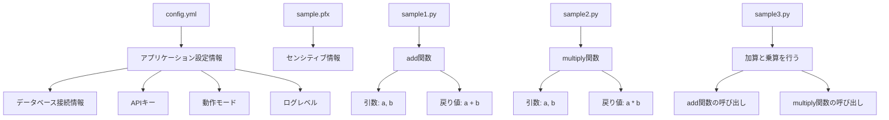

# Python サンプルコード仕様書

## 目次
1. [概要](#1-概要)
2. [システム要件](#2-システム要件)
3. [ファイル構成](#3-ファイル構成)
4. [使用例](#4-使用例)
5. [エラーハンドリング](#5-エラーハンドリング)
6. [保守・運用](#6-保守・運用)
7. [将来の拡張性](#7-将来の拡張性)

---

## 1. 概要


本仕様書では、Pythonでの数値計算に関するサンプルコードの内容を整理し、各ファイルの役割や機能を明確にします。対象となる読者は、Pythonにおける数値計算の基礎的な理解を持ち、サンプルコードを通じてその実際の実装や利用方法を学ぼうとする開発者や技術者です。仕様の目的は、ファイル間の関係や各ファイルが提供する機能を明瞭にし、コードの再利用およびメンテナンスを容易にすることです。

### ファイルの概要

以下に、本サンプルコードに含まれる各ファイルの役割と機能の要約を示します。

| ファイル名                                      | 機能の概要                                     | 内容の詳細                                         |
| --------------------------------------------- | ---------------------------------------- | ------------------------------------------- |
| `config.yml`                                 | 設定情報を格納するYAML形式のファイル              | アプリケーションの設定に関する情報を保持し、データベース接続やAPIキー、動作モードなどを管理。具体的な情報は非表示。 |
| `sample.pfx`                                 | センシティブなファイル                          | 内容が非表示で、詳細な情報は記述できません。                     |
| `sample1.py`                                 | 2つの数値を加算する関数を定義したスクリプト         | 関数`add`を定義し、2つの引数の和を返す。                       |
| `sample2.py`                                 | 2つの数値を掛け算する関数を定義したスクリプト      | 関数`multiply`を定義し、2つの引数の積を計算して返す。          |
| `sample3.py`                                 | 2つの数の和と積を計算して表示するプログラム        | `sample1`と`sample2`の関数を利用し、結果をプリントする。       |

#### 各ファイルの詳細な役割



上記の図は、各ファイルがどのように相互に関連し、アプリケーション全体の機能を構成しているかを示しています。

本仕様書は、コードの理解を深めることを目指しており、開発者が効果的にコードを利用できるようサポートします。

## 2. システム要件


このセクションでは、Pythonサンプルコードが適切に動作するための環境要件やインストール手順について詳述します。

### 必要なPythonのバージョン

本システムでは、以下のPythonバージョンのいずれかが必要です：

- Python 3.6.0 以上が推奨されます。

### 必要なライブラリ

本プロジェクトで使用される主要なライブラリは次の通りです：

- 特定のライブラリ名は記載されていませんが、加算や乗算を行う標準機能を用いるため、特別なライブラリは必要ありません。Pythonの組み込み機能であるため、追加のパッケージインストールは不要です。

### ライブラリのインストール手順

以下の手順に従って、必要な環境を設定します。

1. **Pythonのインストール**
   - Pythonが未インストールの場合は、公式サイト（[python.org](https://www.python.org/)）からインストーラをダウンロードし、インストールしてください。インストール時に「Add Python to PATH」にチェックを入れることを忘れないでください。

2. **仮想環境の作成（オプション）**
   - プロジェクトの依存関係を管理するために、仮想環境を使用することを推奨します。以下のコマンドを使用して仮想環境を作成します：
     ```bash
     python -m venv myenv
     ```
   - 環境をアクティブにするためには、次のコマンドを実行します：
     - Windowsの場合：
       ```bash
       myenv\Scripts\activate
       ```
     - macOS/Linuxの場合：
       ```bash
       source myenv/bin/activate
       ```

3. **ライブラリのインストール**
   - 必要なライブラリがある場合は、`requirements.txt`ファイルがプロジェクトに含まれていることを確認し、以下のコマンドを実行してインストールします：
     ```bash
     pip install -r requirements.txt
     ```

以上の手順を実行することで、システムは正常に動作するための準備が整います。また、実行するスクリプト（`sample.py`、`sample2.py`、`sample3.py`）は、必要なモジュールが正しくインポートされていることを確認してください。

## 3. ファイル構成


システムには以下のファイルが含まれており、それぞれ異なる役割を果たしています。

### `config.yml`

- **役割**: このYAML形式の設定ファイルは、アプリケーションの設定情報を管理するために使用されます。YAMLは人間が読みやすい形式で情報を階層的に記述できるため、設定や構成の管理に適しています。
- **主要項目**:
  - データベースの接続情報：データベースのホスト、ユーザー名、パスワード、データベース名等が通常含まれます。
  - APIキー：外部サービスと連携するために必要な認証情報。
  - アプリケーションの動作モード：開発環境（開発用）や本番環境（運用用）など。
  - ログレベルの設定：アプリケーションのログ出力の詳細度を設定。
  
具体的な変数や値については、内容が非表示のため記述できませんが、この設定ファイルはアプリケーションの管理やデプロイ時に重要な役割を果たします。

### `sample.pfx`

- **役割**: センシティブである理由による取り扱いが必要なファイルです。内容は非表示となります。 

### `sample1.py`

- **役割**: このスクリプトに関する情報は非表示ですが、他のスクリプトと連携して機能を提供することが期待されています。

### `sample2.py`

- **役割**: 
  - **関数名**: `multiply`
  - **機能概要**: このスクリプトでは、2つの数値を掛け算するための関数`multiply(a, b)`を定義しています。
  - **引数**:
    - `a`: 掛け算の第一の数値。
    - `b`: 掛け算の第二の数値。
  - **戻り値**: `a * b` の計算結果を返します。
  
この関数は数値型に対して正しく動作し、例えば`multiply(2, 3)`とすると`6`を返します。主に他のコード内で再利用可能な数値演算を行う部分として機能します。

### `sample3.py`

- **役割**: 
  - このスクリプトは、`sample1`と`sample2`というモジュールからそれぞれ`add`と`multiply`という関数をインポートしています。
  - **主な機能**: 変数`x`と`y`に代入された整数値を使用して加算（`add`）と乗算（`multiply`）を行い、その結果をコンソールに表示します。
    - `x`に5、`y`に3を代入。
    - `add(x, y)`を呼び出し、結果を表示。
    - `multiply(x, y)`を呼び出し、結果を表示。
  
このスクリプトは、加算と乗算の結果をコンソール上に表示するシンプルなプログラムです。関数`add`と`multiply`の詳細は非表示となっています。

## 4. 使用例


このセクションでは、提供されたサンプルコードに基づく実行例とその出力結果を具体的に説明します。それぞれのコードがどのようなシナリオで使用されるかを示し、実行方法や注意点についても簡潔にまとめています。

### 4.1 `sample1.py`（加算処理）

#### 概要
このスクリプトは、2つの数値を加算するための関数`add`を定義しています。

#### 使用例
以下は、このスクリプトを使用する際の例です。

```python
from sample1 import add

result = add(8, 5)
print(result)  # 出力: 13
```

#### 実行方法
1. `sample1.py`をインポートします。
2. `add`関数に2つの数値を渡します。
3. 結果をプリントします。

#### 注意点
- 引数には数値を与える必要があります。
- 加算処理は整数及び浮動小数点数に対応しています。

---

### 4.2 `sample2.py`（乗算処理）

#### 概要
このスクリプトは、2つの数値を掛け算するための関数`multiply`を定義しています。

#### 使用例
以下は、このスクリプトを使用する際の例です。

```python
from sample2 import multiply

result = multiply(7, 4)
print(result)  # 出力: 28
```

#### 実行方法
1. `sample2.py`をインポートします。
2. `multiply`関数に2つの数値を渡します。
3. 計算結果をプリントします。

#### 注意点
- 関数は整数および浮動小数点数に対して正しく動作します。
- 引数には数値以外を渡すとエラーになります。

---

### 4.3 `sample3.py`（加算と乗算の組み合わせ）

#### 概要
このスクリプトは、`sample1`と`sample2`からそれぞれ`add`と`multiply`をインポートし、加算と乗算を行うプログラムです。

#### 使用例
以下は、このスクリプトを使用する際の例です。

```python
from sample1 import add
from sample2 import multiply

x = 5
y = 3

sum_result = add(x, y)
product_result = multiply(x, y)

print(f"Sum: {sum_result}")      # 出力: Sum: 8
print(f"Product: {product_result}")  # 出力: Product: 15
```

#### 実行方法
1. `sample1`および`sample2`をインポートします。
2. 変数`x`と`y`に数値を代入します。
3. `add`関数と`multiply`関数を呼び出します。
4. 結果をプリントします。

#### 注意点
- 引数には数値を与える必要があります。
- 各関数は異なる機能を持つため、正しいモジュールをインポートすることが重要です。

## 5. エラーハンドリング


このセクションでは、サンプルコードで想定されるエラーの種類とその対処方法について説明します。エラーが発生した場合には、具体的なエラーメッセージや対処法を示し、読者がエラーに対処できるような実用的な情報を提供します。

### 5.1 想定されるエラー

#### 1. モジュールインポートエラー
**エラー内容**: 
```plaintext
ModuleNotFoundError: No module named 'sample1'
```
**対処法**:
- `sample1` または `sample2` モジュールが存在しない場合、上記のようなエラーが発生します。モジュール名が正しいことを確認し、Pythonのパスに適切に配置されているかもチェックしてください。

#### 2. 型関連エラー
**エラー内容**: 
```plaintext
TypeError: can't multiply sequence by non-int of type 'str'
```
**対処法**:
- 関数 `multiply` では数値を掛け算することが期待されています。もし引数に数値以外（例えば、文字列やリスト）を渡した場合、このエラーが発生します。入力される引数が予期される型であることを確認してください。例えば、`multiply(2, '3')`とするとこのエラーが発生します。

#### 3. ZeroDivisionError（被除数がゼロの場合）
**エラー内容**: 
```plaintext
ZeroDivisionError: division by zero
```
**対処法**:
- `add` 関数の内部で割り算を行っている場合、除数がゼロになるとこのエラーが発生します。引数をチェックし、ゼロの場合には適切なメッセージを表示するか、処理をキャンセルするようにします。

#### 4. 設定ファイル読み込みエラー
**エラー内容**: 
```plaintext
FileNotFoundError: [Errno 2] No such file or directory: 'config.yml'
```
**対処法**:
- 設定ファイル（`config.yml`）が見つからない場合には上記のエラーが発生します。ファイルのパスが正しいか、またはファイルがリポジトリに含まれていることを確認してください。

#### 5. その他の想定外エラー
**エラー内容**:
```plaintext
Exception: An unexpected error occurred.
```
**対処法**:
- 予測できないエラーが発生した場合には、エラーハンドリングとして例外をキャッチし、ログを記録することを推奨します。`try-except`文を利用し、エラーに関する情報をコンソールまたはファイルに出力します。

### 5.2 エラー処理の手順

1. 各関数に対して引数のバリデーションを行い、適切な型を確認する。
2. 必要に応じて、エラートラップを設定し、`try-except`ブロックを利用して例外処理を実施する。
3. エラーメッセージをユーザーにわかりやすい形で表示し、解決方法を明示する。
4. ロギングを実装して、発生したエラーの詳細情報を記録し、問題分析に役立てる。

これらの手順を実施することで、エラーが発生した場合でも、ユーザーに対して的確なフィードバックを提供することが可能となります。

## 6. 保守・運用


このセクションでは、サンプルコードに関する保守や運用の方針について説明します。特にコードの更新および管理の重要性に触れ、バージョン管理ツールの使用を含む具体的な運用フローを記載します。

### コードの更新および管理

コードの更新は、アプリケーションの性能やセキュリティを維持するために不可欠です。以下に、コードの更新および管理における重要なポイントを示します。

1. **定期的なレビュー**:
   - コードベースは定期的にレビューを行い、バグ修正や機能追加の必要性を判断します。
   - コードが意図通りに動作しているか、最適化の余地がないかをチェックします。

2. **テストの実施**:
   - 新しいコードをデプロイする前に、ユニットテストや統合テストを実施します。
   - 自動テストの活用を推奨し、開発サイクルを短縮します。

3. **ドキュメンテーションの更新**:
   - コードの変更があった場合、その変更内容に応じてドキュメントも更新します。
   - 新機能や変更点について、ユーザーや開発者向けにわかりやすく説明します。

### バージョン管理ツールの使用

コードベースを効率的に管理するために、バージョン管理ツールの使用が推奨されます。Gitなどのバージョン管理システムでは、以下の流れで運用を行うことが一般的です。

1. **リポジトリの作成**:
   - プロジェクト毎にリポジトリを作成し、全てのソースコードをバージョン管理します。

2. **ブランチ戦略**:
   - 主な開発は`main`ブランチで行い、各機能開発やバグ修正は個別のブランチで作業します。
   - 完了した機能は`main`ブランチにマージします。

3. **コミットメッセージ**:
   - コード変更時は、意図が明確に伝わるコミットメッセージを記述します。
   - 他の開発者が変更内容を理解しやすいように、具体的な内容を盛り込みます。

4. **プルリクエストの使用**:
   - 新機能や修正を`main`ブランチに統合する際にはプルリクエストを作成し、チームメンバーからのレビューを受けます。
   - プルリクエストの内容は、変更の目的や影響範囲を明記します。

5. **リリース管理**:
   - 新しいバージョンをリリースする際には、リリースノートを作成し、変更点を明記します。
   - リリース後は、ユーザーからのフィードバックを収集し、改善点を特定します。

### まとめ

保守および運用に関しては、コードの定期的な更新、効果的なバージョン管理、テストの実施、ドキュメンテーションの整備が非常に重要です。これにより、アプリケーションの品質を維持しつつ、新しい機能や改善を効果的に取り入れることが可能となります。こうした運用のフローは、開発の効率化やエラーの早期発見・修正に寄与し、持続可能な開発環境を実現します。

## 7. 将来の拡張性


このセクションでは、今後の機能追加やコードの拡張に関する提案を示します。アプリケーションの拡張性を高めるための優先される機能や、まず取り組むべきポイントについて具体的に示します。

### 1. 機能追加の提案

- **ユーザーインターフェースの改善**
  - 現在の計算結果の出力をコンソールにのみ行っていますが、視覚的にわかりやすいユーザーインターフェース（UI）を追加することで、ユーザーの体験を向上させることができます。
  - WebベースのUIやデスクトップアプリケーションに変換することを検討して、より直感的な操作を提供できます。

- **エラーハンドリングの強化**
  - 数値以外の引数が渡された場合の処理を追加することにより、より堅牢なコードを実現し、ユーザーへのフィードバックも向上させます。

- **多言語対応**
  - ユーザーベースの拡大を狙い、多言語対応を目指すことができます。国際化のためのライブラリを導入し、設定ファイルを言語ごとに準備することが考えられます。

### 2. 拡張機能の優先順位

1. **エラーハンドリングの強化** 
   - コードが正常に動作しない場合や不正な入力があった場合に、どのように対処するかを明確化することで、信頼性を向上させるため、最優先で実施します。

2. **単体テストの導入**
   - 各関数（`add`および`multiply`）に対する単体テストを作成し、コードの回帰テストを行うことで、将来的な変更による影響を抑えます。

3. **ユーザーインターフェースの改善**
   - UIの改善を通じて使いやすさを向上させ、ユーザーエンゲージメントを高めるための計画を開始します。

4. **多言語対応の導入**
   - ユーザー層の拡大を視野に入れ、多言語対応を実装します。

### 3. 将来的な展望

これらの拡張により、アプリケーションはより多機能かつユーザーフレンドリーになります。また、エラーハンドリングや単体テストの強化により、コードの品質が高まり、メンテナンスが容易になるでしょう。さらに、ユーザーインターフェースの改善や多言語対応の実施を通じて、幅広いユーザーに対応できる強固な基盤を構築していくことが期待されます。 

将来にわたってアプリケーションが進化し、成長を続けるための具体的なステップとして、上記のポイントを検討することが重要です。

