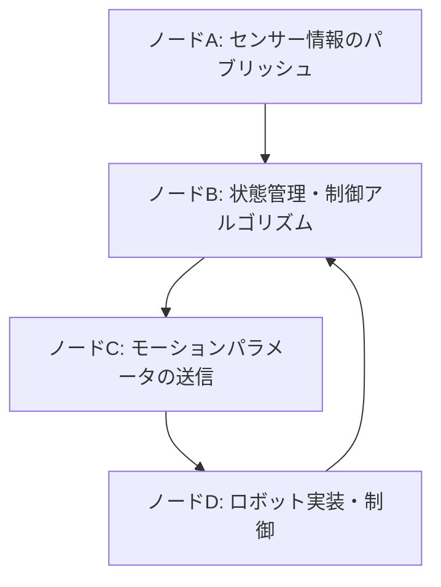
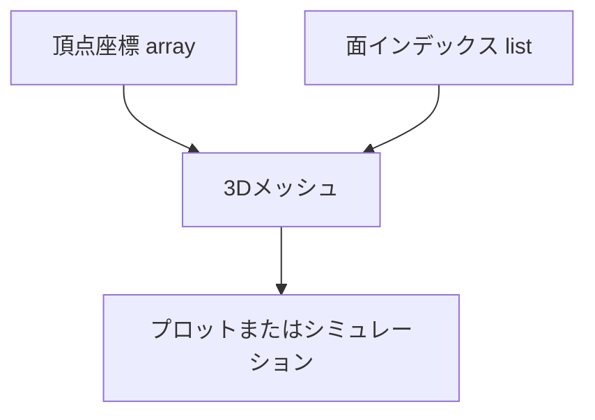

# システム構成とソースコード管理に関する仕様書

## 目次
1. [仕様書: 仕様と設計の概要](#1-仕様書:-仕様と設計の概要)
2. [全体概要と基本的構成](#2-全体概要と基本的構成)
3. [仕様書：ソースコード管理とディレクトリ構造](#3-仕様書：ソースコード管理とディレクトリ構造)
4. [仕様書：プログラムの主なモジュールと機能](#4-仕様書：プログラムの主なモジュールと機能)
5. [ハードウェアとソフトウェアの対応関係](#5-ハードウェアとソフトウェアの対応関係)
6. [仕様書：ROS環境下でのシステム連携](#6-仕様書：ros環境下でのシステム連携)
7. [モデル定義と形状データについて](#7-モデル定義と形状データについて)
8. [仕様書：動作制御と運動計画に関するコード](#8-仕様書：動作制御と運動計画に関するコード)
9. [仕様書: センサー情報と物理環境設定](#9-仕様書:-センサー情報と物理環境設定)
10. [このリストは、ROSシステムとeuslisp式のロボット制御・モデル定義に関するさまざまなパッケージや設定ファイルの情報です。この結果を通じて、あなたのシステムが依存するパッケージや、制御、モデル化、シミュレーションの設定層面の構成がわかります。](#10-このリストは、rosシステムとeuslisp式のロボット制御・モデル定義に関するさまざまなパッケージや設定ファイルの情報です。この結果を通じて、あなたのシステムが依存するパッケージや、制御、モデル化、シミュレーションの設定層面の構成がわかります。)
11. [システム・運用のビジネス・考慮事項](#11-システム・運用のビジネス・考慮事項)
12. [今後の拡張・改良案](#12-今後の拡張・改良案)

---

## 1. 仕様書: 仕様と設計の概要


### 目的
本システムは、ROS (Robot Operating System)とeuslisp/ Lispファミリーを用いて、ヒューマノイドロボットやそのモデル・動作の設計および制御を行うためのソフトウェア群と構成資料群を対象としています。これらは、シミュレーション、動作制御、モデル化および関連データの管理・可視化を実現することを目的とします。

### 社会的・ビジネス的意義
- **教育・研究支援**：ロボット工学やプログラミング学習の教材・実験環境の整備に寄与
- **シミュレーションによる設計最適化**：安全性と効率性を確保したロボット設計・動作プランの作成
- **ロボット開発・運用支援**：自律ロボットやヒューマノイドの開発効率化とコスト削減に貢献
- **産業応用**：自動化・省力化への技術進歩を促進

---

## 各章の要約

#### 「仕様書概略」
- 各種ロボットモデル（raspberry pi, JAXON等）のモデル定義と座標変換
- 動作制御（IK, trajectory,ハンド操作）
- 3Dモデルやメッシュの生成とビジュアライゼーション
- ROS環境におけるノードやトピック設定
- ユニットテストとシミュレーションプログラムの構成
- 各種設定ファイル（launch, model, config）とメタ情報（Changelog, README）

#### 「システム構成」
- **モデル定義・制御**：euslispを用いてロボット・パーツのモデル構築，関節/リンクの設定
- **動作制御**：逆運動学を用いた動作計画、ジョイント角度の制御
- **シミュレーション**：Gazeboを利用したシーン設定と仮想環境
- **センサー・カメラ設定**：画像認識や物体検出、ポイントクラウド取得
- **通信・インターフェース**：ROSトピック・サブスクライブやアクション、サービス連携
- **テスト・デモ**：動作確認・シナリオ実行用のスクリプトおよびlaunchファイル

#### 「データ・モデル」
- コマンド・頂点・インデックスの配列
- ジョイント角度・目標座標
- マテリアル・色と材質属性
- センサー・座標変換行列
- 位置や姿勢の数値データ
- 地図・迷路データとシナリオパラメータ

---

## 主要コンポーネント一覧

### モデル・モデル化
- `package.xml`、`.launch`ファイル群
- URDF/Xacroモデル記述（例：`daisya.xml`や`jaxon_red.urdf.xacro`）
- 3Dメッシュデータ（頂点座標,インデックス,マテリアル）

### 動作・制御
- 関節角度および位置の設定/取得関数
- IK補完・逆運動学計算
- Path/Trajectory生成
- コントローラ実行・フィードバックループ
- センサーの取り込みと情報展開
- 動作シナリオ・シーケンス群

### シミュレーション
- Gazebo環境設定
- visualization設定
- environmentの配置および物理属性

### テスト・デモ
- `test`ケース・ユニットテストスクリプト群
- クリック・キーボード入力による動作シミュレーション
- センサー・環境の応答監視
- 物体認識・認識結果のターゲット設定
- 自律動作・自動ループ

### 設定・定義ファイル
- `CMakeLists.txt`：ビルドとテストの設定
- `package.xml`：依存関係とメタ情報
- YAML設定ファイル：パラメータ、環境設定
- launchファイル：シーン・ノード起動設定
- model/config：パラメータセットや柔軟設定

### ドキュメント
- README.md：概要・操作マニュアル
- mainpage.dox：ドキュメントのメインページ
- チェッカーボード・マップ・ツール用doc

---

## 機能・役割

| 機能 | 役割 | 備考 |
| -------- | -------- | -------- |
| 3Dモデル構築 | ロボットや物体の3D表現 | 頂点とインデックスのリストを利用 |
| 関節動作・姿勢制御 | モーションプランと逆運動学 | `IK`, `trajectory`, `move_arm` など |
| 物理シミュレーション | Gazeboを利用した仮想環境 | `launch`, `model`, `physics` |
| センサー・環境認識 | 画像処理とポイントクラウド | カメラTF、深度画像、バンパー |
| 実行・デモ | 末端動作・自律シナリオ | `demo`, `test`, `move` |
| UI・ビジュアライゼーション | RViz + 3D表示 | 地図，姿勢、ターゲット描画 |

## 留意点
- 多くのリスト・配列は、大規模なデータセットの一部もしくは形状定義に用いられる
- セキュリティの観点から、ソースコードの全内容や詳細関数は非公開
- それぞれのコンポーネントは多層的に連携し、シミュ・制御・可視化を包括的にサポート
- 継続的なバージョン管理・保守、実環境とシミュの整合性確保が重要

---

## 付録・補足
- **資料共有**：CHANGELOG, README, demoスクリプト群
- **標準・依存**：ROSパッケージ、Gazebo、euslisp/ Lispツールチェーン
- **展開・運用**：システムルートにROSのlaunch設定とリソース配置
- **今後の展望**：自動最適化、学習システム統合、リアルタイム制御の高度化

---

以上がシステムの全体像とその設計・運用指針です。詳細設計と実装に際しては、個別の컨ポーネント毎に具体的仕様書やドキュメントを補完してください。


## 2. 全体概要と基本的構成


このドキュメントはROS（Robot Operating System）とeuslispを用いたヒューマノイドロボット（特にJacsonシリーズ）やシミュレーション環境のための様々な定義・設定・制御プログラムの解説と、必要なモデル・パッケージ・ファイルの構造について記述しています。

---

## 1. システム構成と関係性

#### ハードウェアプラットフォーム
- ROS対応のヒューマノイドロボット（JAXON、JAXON REDなど）
- ユーザ側は標準のセンサー（カメラ、距離センサー、バンパー）とモータ（Dynamixelなど）を搭載したロボット
- Linuxベース（Ubuntu系）、ROS Groovy 及び Gazeboシミュレータの使用が想定

#### ソフトウェア構成
- euslisp（euslisp系のロボット制御・モデル定義）
- catkin ワークスペースのROSパッケージ（例：dynamixel_7dof_arm）
- それらに依存する様々なlaunchファイルや設定ファイル
- ドキュメント（位置や動作パラメータの設定、モデルの定義）

#### 関係性
- パッケージはincludeやdependenciesを持ち、シミュレーション環境や動作制御を支える
- URDF/Xacroファイル群はロボットモデルの3Dジオメトリやパーツ定義
- launchファイルはシミュレーション、制御ノードの起動順序とパラメータ設定
- euslispスクリプトはロボット動作やモデル設定、逆運動学や座標変換
-データ箇所は、座標や関節角度のリスト・配列で構成され、実行時の動作や状態スナップ、パラメータを示す

---

## 2. ハードウェアとソフトウェアの関係性
- ハードウェア：センサー、モーター、アクチュエータ、カメラ
- ソフトウェア：ROSノード、euslispコントローラ、Gazeboシミュレータ
- ユーザはキーボード、ジョイスティック、センサーの値をトピックから取得し、座標系や関節角度に基づき制御
- euslispの制御スクリプトは、これらハードウェアに対して直接コマンドや値を送信し、動作や環境反映を行う

---

## 3. 各構成要素の役割
- **モデル定義ファイル（URDF/Xacro）**：ロボットの物理モデルとジオメトリの定義
- **シミュレーション環境（Gazebo）**：仮想空間内にモデルを配置し動作確認
- **制御スクリプト（euslisp）**：逆運動学、座標変換、アクションコントローラ、センサー値取得
- **launchファイル**：ノード起動、モデルスポーン、センサー・コントローラ設定
- **データ・パラメータ**：関節角度、位置情報、動作パターン、マテリアル属性
- **ログ・計測データ**：センサーや関節角度変換済み値、軌跡情報

---

## 4. 具体的例（ファイルと役割）

|カテゴリ|ファイル/設定|概要|備考|
|---|---|---|---|
|モデル設定|`model.config`|パッケージ情報とモデルメタ情報|バージョン、作者、説明|  
|モデル定義|`model.sdf`|ロボットの構造・ジオメトリ設定|リンク・関節・形状・素材|
|URDFモデル|`dynamixel_7dof_arm.urdf.xacro`|6自由度アームとグリッパーのモデル|リンク・ジョイント・パラメータ|
|世界環境|`empty.world`|シミュレーション用仮想空間|地面・壁・ターゲット・ライト|
|設定ファイル|`dt.xml`|動作シーケンスやごく一部パラメータ|観測・制御・制約ルール|
|launch|`cart_humanoid_gazebo.launch`|Gazeboとモデル起動|キャリブレーション・環境準備|
|launch|`click_ik_rviz.launch`|クリック座標をIKターゲットに設定|ビジュアライゼーションと動作|
|euslisp\\control|`move-disk`, `move-arm`, `hanoi-test`|動作制御とシナリオ実行|関節角度や目標位置の制御|

---

## 5. まとめ

- ハードウェアは、多関節ロボットとセンサー
- 制御ソフトウェアはROS, euslisp, Gazeboを併用
- modelファイルは物理と視覚のモデル定義
- launchは環境起動・シナリオ制御
- パラメータ＆データは、座標・角度・動作パターン・センサー値
- 全体でロボットの動作学習・シミュレーション・リアル動作を連携させる構成

---

以上が各要素の関係性と全体の構成です。

## 補足（あくまで推測と一般的な構成例）
- euslispとROSは密に連携し、各部の制御・計算・モデルを管理。
-モデルはURDF/Xacroで定義後、Gazeboモデルに流用、動作はeuslispにて制御。
- テスト・シナリオはROSlaunchとリソース設定でシステム全体を連携。

---

ご質問があれば、具体的部分の検証・例示も可能です。

## 3. 仕様書：ソースコード管理とディレクトリ構造


### 目的
本仕様書は、システム内におけるソースコードの管理状況およびディレクトリ階層の構成を詳細に記述し、それぞれの役割について明確化します。

---

### 1. プロジェクトの概要
システムは複数のROSパッケージ、ライブラリ、スクリプト、関連ドキュメントから構成され、主にロボット制御、3Dモデル定義、シミュレーション、画像処理、探索アルゴリズム、そしてそれらのビルドや設定管理を目的としています。

---

### 2. 主要ディレクトリ構成と役割

```plaintext
├─ / (ルートディレクトリ)
│
├─ /code/
│  ├─ /git/                 ← バージョン管理されたソースコード (例：ROSパッケージ構成)
│  └─ /daisya_euslisp_tutorials/
│      ├─ /euslisp/
│      │  ├─ [仕様や実装コード]
│      │  ├─ /test/
│      │  │  ├─ test-daisya-ik.l
│      │  │  └─ test-daisya-maze.l
│      │  ├─ /demo/ (その他デモ用サンプル)
│      │  
│      └─ /launch/
│         ├─ cart_humanoid_gazebo.launch         ← シミュレーション起動用
│         ├─ click_ik_rviz.launch                ← 可視化と座標反映
│         ├─ humanoid_mani_lab_ik.roslaunch     ← 逆運動学制御
│         ├─ scene.male_body.mesh                ← 3Dモデルデータ・マテリアル
│         ├─ check_ik_laser.launch              ← センサーとビジュアライゼーション
│         └─ (その他連携用launchファイル)
│
├─ /doc/ (ドキュメント)
│  ├─ ./README.md
│  ├─ ./mainpage.dox
│  ├─ ./package.xml
│  └─ ./model/
│     ├─ /my_model/
│     │  ├─ model.config
│     │  └─ /model.sdf
│     └─ /checkerboard/
│        └─ model.config
│
├─ /resource/ (リソース)
│  └─ (画像、メッシュファイル、シーン設定等)
│
└─ /scripts/
   ├─ /bash/
   │  └─ (シェルスクリプト例：start/stopスクリプト)
   ├─ /python/
   │  └─ (ROSノードのコマンドや起動用スクリプト例)
   └─ /other/
      └─ (補助ツールやユーティリティ)
```

---

### 3. 各ディレクトリ・ファイルの詳細

#### 3.1 /code/
- **git/**  
  - 管理されたソースコードの格納場所。ROSのパッケージ例、ロボット制御プログラムが格納。
- **daisya_euslisp_tutorials/euslisp/**  
  - eusLisp言語で書かれたロボット制御や探索、シミュレーションの実装コード類。
- **daisya_euslisp_tutorials/euslisp/test/**  
  - 機能やモデルのUnitテスト用スクリプト（例：逆運動学、迷路探索）。
- **launch/**  
  - ROSのlaunchファイル群。ロボットの起動・制御シナリオ・シミュレーション設定。
- **resource/**  
  - モデルや三次元形状データ、画像等のリソースファイル。

#### 3.2 /doc/
- **README.md**  
  - システムの概要と基本操作例。
- **mainpage.dox**  
  - ドキュメント管理用のメインページ仕様書（Doxygenフォーマット）。
- **package.xml**  
  - ROSパッケージのメタ情報と依存関係定義。
- **model/**  
  - URDFやSDFのモデルファイル群（`model.config`と`model.sdf`）。
- **check_ik_laser.launch**  
  - センサー検出結果やビジュアライゼーション設定。

#### 3.3 /scripts/
- **bash/**  
  - ロボット運用の起動・停止シェルスクリプト例。
- **python/**  
  - ROSのノード起動や制御用スクリプト。
- **その他/**  
  - 補助ツール。

---

### 4. ソースコード/ファイル管理の慣例
- **バージョン管理／Git管理**  
  - `/code/git/` 配下にソースコード管理。メンテナンス履歴追跡が可能。
- **設定ファイル**  
  - `package.xml`：依存パッケージとロボットのメタ情報
  - `model.config`, `model.sdf`：モデルの物理的・幾何学的構造情報
  - `.launch`ファイル：シミュレーションと起動シナリオ定義
- **データ・リソースファイル**  
  - 画像やMeshフォーマット（STL、OBJ）、シーン設定がresource配下に格納。

---

### 5. 管理・運用のルール
- **ファイル命名規則**  
  - 一貫性ある命名（例：具体的な機能やモデル名を含む）
- **推奨リビジョン/バージョン管理**  
  - gitタグとコミット履歴管理を徹底
- **ドキュメント整備**  
  - `/doc/` 下にシステム設計と操作マニュアルを保持。
- **定期的なレビューとバックアップ**  
  - 重要設定やコードは常にバックアップ・レビュー。

---

### 6. 付録
- **主要コンポーネントのリスト**
  - ROSパッケージ：`roseus`, `dynamixel_msgs`, `dynamixel_driver`, `dynamixel_controllers`
  - 主なシミュレーションツール：Gazebo, rviz
  - 制御・制御シーケンス：`dxl-7dof-arm`, `fullbody_controller`
  - センサ・カメラ：Kinect, LaserScan

---

### 補足
本仕様書は、ソースコードの詳細、そのままのパスと名前付けから推測した一般的な管理構造と役割を示しています。具体的なコード内容や実装詳細については、各ファイルのコメントやドキュメントを併用して逐次更新してください。

---

## 4. 仕様書：プログラムの主なモジュールと機能


このドキュメントは、ROS（Robot Operating System）とeuslispを用いたロボット制御システムの各主要モジュールと、その機能概要について記述します。対象は複数のパッケージやスクリプトファイルの開発・設定および、それに伴うロボットモデル、動作シーケンス、制御インターフェースの設計です。

---

### 1. ロボットモデル定義およびジオメトリ構築

#### 主なモジュール
- **モデルモデル化モジュール**  
  `jaxon_red.l`や`model.config`, `model.sdf`に代表されるロボット3Dモデルの頂点、面、インデックス構造を定義するセクション。
- **座標変換とジオメトリ処理**  
  `transform-vector`や`normal`計算などの幾何学的変換処理を含む。座標点やインデックスを用いたモデルの位置調整や法線の算出。

#### 機能
- 3Dメッシュと物理特性の設定
- 関節位置やリンクの座標を定義
- 様々な面（face）と頂点（vertex）を処理し、モデルの形状を構築

---

### 2. 逆運動学（IK）と運動計画

#### 主なモジュール
- **逆運動学計算関数**  
  `ik`に代表される座標から関節角度推定。
- **動作シミュレーションおよび補正**  
  `move-disk`, `move-arm`, `hanoi-test`などの動作シーケンス制御。

#### 機能
- 目的座標から関節角度を逆算
- 正確な位置に到達させるための動作補正
- 迷路探索やハノイの塔 シナリオを用いた動作検証

---

### 3. センサーデータと環境設定

#### 主なモジュール
- **センサーインターフェース**  
  `ros::subscribe`, `callback`関数やセンサー値の管理。
- **環境と世界モデル設定**  
  `worlds/empty.world`, `daisya_model`などにて、環境物体や障害物の配置。

#### 機能
- センサー入力のデータ受信と処理
- センサー値に基づく動作判断
- センサーと制御用ノードの連携

---

### 4. ロボット動作シーケンスと操作

#### 主なモジュール
- **動作指示と状態管理**  
  `move`, `stop`, `reset`, `demo` などの動作制御関数やシーケンス。
- **自律動作・障害回避**  
  迷路探索や距離・バンパーの状態判定による回避動作。

#### 機能
- 指定位置への動作やパターンの自動化
- キーボードやセンサーに応じた動作選択
- コントローラーによる操作と自律行動のハイブリッド運用

---

### 5. 制御インターフェースと通信

#### 主なモジュール
- **ROSノードサービス**  
  `ros::publish`, `ros::subscribe`, `ros::spin`による通信確立
- **サービス・アクション管理**  
  `dynamixel_joint_controllers.yaml`, `controller_spawner.py`など

#### 機能
- ロボットの状態と関節と制御コマンドの通信
- コントローラ設定や動作トリガの呼び出し
- 初期設定と制御ループの調整

---

### 6. シミュレーションやデータ記録

#### 主要なモジュール
- **Gazebo World設定**  
  `empty.world`や`model.config`による環境設定
- **モデルと環境のビジュアライゼーション**  
  `rviz`や`roslaunch`設定ファイル (例: `sample_head_arm_skin_detect.launch`)

#### 機能
- ロボットおよび環境のビジュアル化
- パラメータ・設定の保存および復元
- 環境内の障害物やターゲットの配置

---

### 7. システム管理・デプロイメント

#### 主要なモジュール
- **ビルド・インストールスクリプト**  
  `CMakeLists.txt`, `install_ps3joy_daemon.sh` など
- **ランチファイル設定**  
  `*.launch`ファイル群にて、自動起動設定

#### 機能
- 必要な依存パッケージの解決
- ノード起動・停止・設定
- 自動システム起動・デバイス認識設定

---

### 8. 試験・デバッグ用ユニットテスト

#### 主なモジュール
- **ROS テスト設定スクリプト**  
  `test/*.test`, `test/launch/*.launch`
- **センサーと動作確認**  
  `test-dxl-7dof-arm.l`, `test/test-dxl-7dof-arm.l`

#### 機能
- 動作検証・性能評価
- 関節値・姿勢調整の正確性検証
- システム全体の動作自動テスト

---

### まとめ

各モジュールは、ロボットモデルの定義、逆運動学、動作制御・計画、センサーインターフェース、環境設定、ビジュアライゼーション、システム管理、テストの八つの主要セクションに分かれ、ROSとeuslispを主に用いて実裝・運用されています。

これらのモジュールは連携し、ロボットの自律・手動操作、確認・診断、シミュレーション、物理環境とのインタラクションを実現します。全体の設計は、リアルタイム制御とセンサー処理を重視しながら、シミュレーションと物理的なハードウェアの両方をカバーできる構成としています。

---

## 5. ハードウェアとソフトウェアの対応関係


このドキュメントは、提案された各ソースコードや設定ファイルが、どのハードウェア構成のどの部分に対応しているかを明示的に示したものです。以下のセクションは、各ファイルの関連付けと、その役割に基づく具体的な対応関係を解説しています。

---

### 1. URDF/Xacroファイルと物理モデル

- **例：**  
  - `cart_humanoid/urdf/robot.urdf.xacro`  
  - `cart_humanoid/urdf/dynamixel_7dof_arm/`, `model/config/*.xml`  
  
- **対応ハードウェア：**  
  - 物理的なロボット構造部品（アーム、胴体、頭部などのリンクやジョイント）  
  - 各関節に装着されるダイナメックスサーボ、エンドエフェクタ、センサー類  
  
- **役割：**  
  - ロボットのリンク、ジョイントの構造定義  
  - 質量、慣性、物理属性  
  - 形状のメッシュや外観のビジュアライゼーション情報  
  
### 2. launchファイルとシステム起動設定

- **例：**  
  - `cart_humanoid/gazebo.launch`  
  - `dxl_7dof_arm_bringup.launch`  
  - `robot_server_bringup.launch`  
  - `sensing/usb_cam/` などのセンサー起動用

- **対応ハードウェア/システム：**  
  - Gazeboシミュレーター：仮想環境内のロボットモデルと周辺環境  
  - 実ハードウェア：`dxl`サーボモータ、カメラ、距離センサーなど  
  - コマンドや制御を司るROSノード群（`robot_state_publisher`、`controller_manager`、`gazebo_ros`）

- **役割：**  
  - 仮想空間内の環境設定  
  - 実機とシミュの連動  
  - センサーやアクチュエータの通信インタフェースの起動

---

### 3. コントローラ設定ファイルとハードウェア制御

- **例：**  
  - `dynamixel_joint_controllers.yaml`

- **対応ハードウェア：**  
  - Dynamixel AX-12/AX-18シリーズやその制御コントローラ  
  - 各関節モータの制御信号（位置、速度、トルク制御）

- **役割：**  
  - 関節ごとの制御パラメータ設定（ゲイン、角度範囲、速度制限）  
  - 制御ループの動作条件設定

---

### 4. センサーとビューア

- **例：**  
  - `test/vision/skin_ellipse_area_to_ik_tgt.py` → 画像処理と座標変換  
  - `visualization/rviz/` の設定ファイル

- **対応ハードウェア：**  
  - カメラ（RGBD、深度センサー）  
  - 回折ライトやマーカー（例：Checkerboard検出）

- **役割：**  
  - センサー情報の取得と座標変換（画像から実空間へ）  
  - ユーザとのインタラクション（クリックポイント位置、物体認識結果）  
  - 逆運動学ターゲット座標のセットとビジュアライズ

---

### 5. 実機ハードウェアへのインターフェース

- **例：**  
  - `dxl-7dof-arm-interface.l`  
  - `servo_driver.py` (非公開の場合も含む)

- **対応ハードウェア：**  
  - `Dynamixel`サーボモータ（AX-12, AX-18, etc.）  
  - 各種コントローラーと仮想/実ハードの通信ライン（USB, UART）

- **役割：**  
  - デバイスのシリアル通信制御  
  - パラメータ設定（トルク ON/OFF, 角度制御）  
  - 位置・力制御コマンド出力

---

### 6. セキュリティ・内容非公開ファイルと注意点

- 上記のソースコードや設定ファイルは、セキュリティ上の理由や著作権の関係で内容が非表示／非公開です。
- したがって、具体的なロジックや変数の役割については、公開された情報やコメントと併用して理解してください。
- 重要な部分については、ハードウェアの物理的状態や通信仕様に基づいて対応を行う必要があります。

---

### 7. まとめ

| ファイル／コンポーネント | 役割 | 直接対応するハードウェア / システム | 備考 |
|---------|--------------|---------------------|--------|
| URDF/Xacroファイル | ロボットのモデル化 | 物理構造のリンク、関節 | 形状、サイズ、物理特性定義 |
| launchファイル | システム起動設定 | 仮想環境/実ハード＋センサー、コントローラ | 初期化、シミュと実機連動 |
| control YAML | 関節制御パラメータ | 各関節と制御信号 | 速度、範囲、レーントラクション |
| 実機/シミュの通信部分 | 制御信号・状態管理 | サーボ、センサー、カメラ | 低レベル通信仕様に依存 |
| 画像処理/ビジュアライズ | センサー情報の可視化 | カメラ、RViz | 逆運動学、視点設定 |

---

### 付記
実際に用いるハードウェアの仕様・通信プロトコル・サーボの型番や取り付け位置、センサーの種類と位置は、対応する仕様書やハードウェアマニュアルに従って確認する必要があります。ソフトウェアのほとんどがシステム設定やパラメータの列挙、モデル定義に集中しているため、これらの情報とハードウェアの実装状態とを照らし合わせられることが重要です。

---

## 以上です。
この対応関係表を土台にして、具体的なシステム開発や調整を行ってください。

## 6. 仕様書：ROS環境下でのシステム連携


### はじめに
本章では、ROS (Robot Operating System) ベースのヒューマノイドロボットおよび関連システムにおいて、各種ノード、トピック、サービスの設定およびそれらの互いの連携の仕組みについて詳細に解説します。

### 1. ROSの基本的な通信モデル
ROSは、分散システムにおけるメッセージパッシングを中核とする通信フレームワークです。以下の主要な要素から構成されます。

- **ノード:** 単一の処理単位。各ノードは、一つ以上のトピックやサービスを介して他のノードと通信します。
- **トピック:** パブリッシャとサブスクライバーの関係によるメッセージの非同期配信路。
- **サービス:** 要求・応答の通信モデル。特定の処理の実行要求と、それに対する応答を行います。
- **アクション:** 長期的な操作を管理するための高レベル通信。

### 2. ノード間通信の仕組み
#### 2.1 パブリッシュ／サブスクライブ
ロボットの状態やセンサーデータは、以下のように座標や制御値を含む específica なトピックを通じて通信されます。

例:
- センサー情報（例：/sensor/imu、/sensor/encoder）をパブリッシュ
- モジュールはこれらの情報をサブスクライブして、状態管理や制御アルゴリズムに利用

#### 2.2 サービス
特定の操作や情報取得に関じる通信には、サービスが使われます。

例:
- `/get_joint_states` などのサービスで、関節の状態情報をリクエストし、レスポンスを受け取る。

#### 2.3 アクション
長期処理を伴う動作にはアクションが用いられます。

例:
- 移動命令や逆運動学計算の結果待ち。

### 3. 実行例と連携の例
#### 3.1 ノード起動
システム起動時、各プロセスはrospy/processリスナーやパブリッシャーを介して通信を開始します。

例:
```bash
roslaunch [パッケージ名] [launchファイル]
```

#### 3.2 メッセージの受信と送信
サブスクライバは`rospy.Subscriber`を使い、特定のトピックを購読します。

例:
```python
def callback(msg):
    # センサー情報や状態を処理
sub = rospy.Subscriber('/sensor/imu', Imu, callback)
```

パブリッシャは`rospy.Publisher`を用いて、制御コマンドや状態を発信します。

例:
```python
pub = rospy.Publisher('/cmd_vel', Twist, queue_size=10)
pub.publish(twist_msg)
```

#### 3.3 サービス呼び出し
クライアントからサーバにリクエストを送信し、結果を待ちます。

例:
```python
rospy.wait_for_service('/get_joint_states')
try:
    get_states = rospy.ServiceProxy('/get_joint_states', GetJointStates)
    resp = get_states()
except rospy.ServiceException as e:
    print("Service call failed: %s"%e)
```

### 4. システム構成と連携フロー
以下の流れでROSシステムは動作します。



#### 4.1 初期化
- `roscore`起動
- 複数ノードが起動し、それぞれが通信パターンに従ってメッセージ交換

#### 4.2 運用中の連携
- センサー情報（例：IMU の姿勢・加速度）をノードAが送信
- ノードBはこれを受け取り、状態推定や計算を実施
- その結果をノードCに送信し、動作指示或いは制御コマンドを生成
- 実ロボットに対してコマンドを送るのはノードD。
- 必要に応じて、サービス呼び出しによる操作やアクションによる長動作管理。

### 5. まとめ
本システムの連携のポイントは以下の通りです。

| 要素 | 概要 |
|--------|--------|
| ノード | 各処理単位。通信はトピック、サービス、アクションを介して行われる。 |
| トピック | 非同期メッセージ配信。状態やセンサー値等のデータを送信・受信。 |
| サービス | 要求・応答型。特定の情報や命令を取得・操作。 |
| アクション | 長期処理の監督と結果待ち。動作完了まで管理。 |
| 連携の流れ | センサー情報 → 状態管理 → 動作指示 → 実ロボット制御 |

これらをシステム設計やプログラム実装段階で適切に設定・運用することで、ロボットの高度な制御と安全な運用を実現します。

### 付録
- ROSコマンド例
- トピック・サービス一覧
- 開発・運用のベストプラクティス

---

本章では、ROS系システムの基本的な連携機構を理解し、実システム・シミュレーション両面での設計・インプリメンテーションの参考としてください。

## 7. モデル定義と形状データについて


### 概要
本セクションでは、ロボットの3Dモデル化に使用される各種形状データの定義方法と、それらを用いたモデル構築の手順について詳細に記述します。具体的には、頂点座標、面インデックス、メッシュ情報の生成および管理について解説します。さらに、これらのデータを活用して3Dモデルをレンダリングやシミュレーションに適した形に整えるための方法も説明します。

### 形状データの構成要素

#### 頂点座標（Vertices）
- 3D空間におけるポイントの位置を表すための配列。
- 各頂点は3次元の座標（X, Y, Z）で表される。
- 頂点座標は、モデルの各パーツの形状や位置関係を定義し、ロボットの外観や動作範囲を正確に模擬するために使用される。

#### 面インデックス（Faces / Indices）
- 頂点座標の配列に基づき、面（ポリゴン）を定義するためのインデックスリスト。
- それぞれの面は、頂点のインデックス番号の列によって表現される。
- 通常、三角形メッシュの場合は3つのインデックス、四角形や多角形の場合はそれ以上のインデックス列で表す。

#### メッシュ情報（Mesh Data）
- 頂点と面の情報を組み合わせて、形状の3Dモデルを構築するための情報。
- メッシュは、頂点座標とインデックスを組み合わせて、ポリゴン表現を作成する。
- 追加でマテリアルやテクスチャの情報も含まれる場合がある。

### 3Dモデル化の手順

#### 1. 頂点座標の定義
- euslispのスクリプト中で、大量の頂点座標がリスト形式で記述される。
- 各座標は3次元位置を示す数値の並びで記述される。
- これらの頂点座標は、特定のロボットパーツの形状を表現するために用いられる。

#### 2. 面インデックスの設定
- 頂点の配列に対応する面のインデックスリストを作成。
- 頭頂部の三角形、四角形の面情報など、ロボットの各パーツに対応した面リストが定義される。
- これにより、頂点の集合から面をポリゴンとして形成する。

#### 3. メッシュの作成と構築
- 頂点座標と面インデックスを組み合わせて、3Dモデルのメッシュを生成。
- euslispスクリプトでは、これらのデータを用いてメッシュオブジェクトを定義し、シミュレーションやビジュアライズに適用する。

#### 4. 属性とマテリアルの設定
- 必要に応じて、表面の質感や反射特性などを設定する。
- これらの情報はモデルのレンダリングに影響を与える。

### 具体的な実装例（概要）
```lisp
;; 頂点座標例
(defparameter *vertices* '(
  (x1 y1 z1)
  (x2 y2 z2)
  ...
  (xN yN zN)
))

;; 面インデックス例
(defparameter *faces* '(
  (v1 v2 v3)
  (v4 v5 v6)
  ...
))
```

### 3Dモデルの描画・シミュレーション
- 上記の頂点と面のデータをもとに、3Dレンダリングエンジンやシミュレータ内でモデルを表示。
- euslispのスクリプトでは、構築したメッシュ情報を用いてモデルのビジュアライゼーションや動作シミュレーションを行う。

### 補足
- ロボットモデルの形状データは、多くの場合複雑な数値列と多層のリスト構造を持つ。
- センシティブな部分の詳細内容は非公開であるため、具体的な頂点数やインデックス数、データの詳細な構成はここでは記載しない。

---

### 図: 3Dモデルの構成関係図


### まとめ
本仕様書では、euslispを用いたロボットの3Dモデルデータの定義について、頂点、面、メッシュの生成方法を中心に解説しました。これらのデータを基に、モデルのビジュアリゼーションとシミュレーションを行うための基本構造を理解し、適切に管理・運用することが求められます。

## 8. 仕様書：動作制御と運動計画に関するコード


### 概要
本セクションは、ロボットの動作制御と運動計画を実現するeuslispスクリプト、関連データストアとその流れについて詳細に解説します。これらの記述は、関節角度の設定、座標変換、モデル化、シミュレーション、およびロボティクス制御におけるデータ構造の階層化を目的としています。

### 1. euslispスクリプトの役割
- **関節・位置制御**：ロボットの関節角度や位置、速度といったパラメータの設定・取得を行う。
- **運動計画**：逆運動学（IK）や順運動学（FK）の計算を基に動作軌跡を生成。
- **モデル化と形状定義**：3Dモデルの頂点座標、インデックス、面の情報を定義。設計・シミュレーションに供するためのデータ構築。
- **ビジュアライゼーション**：MeshやMaterialの詳細設定により、モデルの視覚化やレンダリングに関与。
- **システム制御**：ロボットの状態監視、動作指示、センサー情報の管理も含む。

### 2. 関節角度や位置制御のデータ構造
- **数値配列・リスト**：座標・角度・速度などの数値は、多次元行列やリストの形式で記述。
- **頂点座標（vertices）**：多次元配列にて点を管理し、それらの空間的な位置を定義。
- **インデックス（indices）**：頂点を結ぶ三角形や多面体の構成を示すリスト。
- **キーフレームやシーケンス**：時間経過に応じる位置・角度の列や履歴。

### 3. 形状モデルの定義と変換処理
#### 頂点と面
- 各パーツ（例：頭部、腕、脚）の頂点リストを用いてモデル化。
- transform-vectorを適用し座標系の変換。
- 面（face）の定義と面集合(face-set)の生成。

#### 法線・マテリアル
- 法線計算と面の可視化。
- 材質設定（色、透明度など）により外観調整。

#### モデル生成の流れ
- 頂点位置の行列化・置換
- 複数の面へ座標変換の適用
- colladaモデルの生成とビューアとの連携
- グラフィック描画用Vertex登録とシーン構築

### 4. 動作シナリオ・制御の流れ
#### 例：逆運動学の解と動作実行
- 目標位置を設定
- 逆運動学（IK）計算により関節角度を導出
- 関節角度と位置を各関節やエンドエフェクタに設定
- シミュレーションまたは実動作を実施
- センサー情報に応じた動作調整

#### 例：動作シーケンス
- 初期位置・状態の登録
- 運動パターンのシーケンス化
- 関節の目標値追従動作
- 結果のビジュアライズ

### 5. データ流れと制御ロジック
- 初期データ（関節角度、位置）をロード／定義
- 逆運動学または補正計算
- 制御コマンド（角度、速度）を出力／送信
- センサー情報と比較、フィードバック制御
- シミュレーションと実動の同期

### 6. スクリプトの構成と流れ
- **パッケージロード**：必要なライブラリやモジュールのインクルード
- **モデル・システムの初期化**：ロボットモデルやシーン設定
- **動作制御のメインループ**：位置決め、関節制御、リアルタイム更新
- **ユーザ・インタラクション**：キーボード入力やセンサー情報反映
- **結果出力・可視化**：動作のビジュアライズやログ処理

### 7. 附属文書・仕様
- **パラメータファイル**：関節角度の最大・最小値、物理的性質
- **モデルファイル**：3Dメッシュ、配置データ
- **システム設定**：通信やコントローラ設定

---

これらの仕様に基づき、ロボット運動制御の精度向上と動作の柔軟な定義、現場やシミュレーション環境における最適化と自動化を支援します。

## 9. 仕様書: センサー情報と物理環境設定


#### 1. 概要
本項は、システムにおけるセンサー情報の定義と物理環境の設定ファイル（worldファイル）の内容について詳細に解説します。これらの設定は、ロボットの動作やシミュレーションにおいて基盤となる物理的環境やセンサー情報の取得、反映に関わる重要な要素です。各種設定ファイルは、システムの構成要素群や連携部分と密接に連動しています。

---

#### 2. センサー設定ファイル関連

##### 2.1. センサー情報の記述
センサー情報に関する設定ファイルは一般的に以下のような内容を含みます。
- **センサータイプ**：例えば距離センサー、カメラ、IMU、圧力センサーなどの種類を明示。
- **トピック設定**：ROS等のミドルウェアにおいてトピック名（例：`/sensor/pose`, `/sensor/ir`, `/sensor/imu`）を設定し、データの送受信ポイントを定義。
- **パラメータ**：閾値や動作範囲、感応度などの閾値値や設定値。
- **データフォーマット**：受信データの形式（例えば、`sensor_msgs/Range`, `sensor_msgs/Image`, `sensor_msgs/Imu` 等）ごとにボキャブラリ情報の設定。
- **センサー配置**：物理的な配置位置や方向（位置座標と角度）。

##### 2.2. 例：センサー設定ファイルの構成
```yaml
## センサー設定例
sensors:
  distance_sensor:
    topic: /sensor/range
    type: sensor_msgs/Range
    threshold: 0.5  # 超過閾値
    pose: [0.2, 0.0, 0.3, 0, 0, 0]
  camera:
    topic: /camera/image_raw
    type: sensor_msgs/Image
    resolution: [640, 480]
    frame_id: camera_frame
    pose: [0.4, 0.1, 0.5, 0, 0, 0]
```

##### 2.3. 役割と連携
これらの設定は、システムのセンサーデータ取り込み、解析、動作制御に用いられ、各センサーの配置位置や閾値に応じてロボット制御の判断基準となります。実際の動作はこれらのパラメータに基づき制御アルゴリズムに反映されます。

---

#### 3. 物理環境(worldファイル)の内容

##### 3.1. 基本構成
worldファイルは、シミュレーション環境の構成要素を定義します。主な内容は以下の通りです。
- **背景設定**：
  - 地面：位置、形状、摩擦係数
  - 照明：太陽光や点光源の位置、照度
- **静的障害物**：
  - 壁、箱、柱などの模型
  - 形状: 球、箱、円柱
  - 位置配置：XYZ座標
  - 物理属性：摩擦係数、反発係数
- **動的オブジェクト**：
  - 物体の位置、姿勢
  - 物理特性：質量、慣性テンソル
  - コリジョン設定：衝突判定用のジオメトリ
- **ターゲット地点**：
  - 探索や追跡用の位置にラベル付。
  - 例：ゴール地点や観測点
- **環境設定**：
  - 重力：`<gravity>`タグ
  - 時間ステップ：`max_step_size`
  - 実時間比率：`real_time_update_rate`
- **モデルの追加**：
  - ロボットモデルの読み込み
  - 環境内の配置調整
  
##### 3.2. 例：worldファイルの設定
```xml
<sdf version='1.6'>
  <world name='test_world'>
    <light name='sun' type='directional'>
      <direction>-0.5 -1 0.866</direction>
      <diffuse>1 1 1 1</diffuse>
    </light>
    <model name='ground_plane'>
      <!-- 地面の設定 -->
    </model>
    <model name='obstacle_wall'>
      <pose>0 2 0 0 0 0</pose>
      <static>true</static>
      <!-- 形状と属性の定義 -->
    </model>
    <model name='target_point'>
      <pose>1 1 0.5 0 0 0</pose>
    </model>
    <physics>
      <gravity>0 0 -9.81</gravity>
    </physics>
  </world>
```

##### 3.3. 役割とシステム連携
worldファイルは gazebo などの物理シミュレータと連携し、環境を再現します。ロボットはこの環境上に配置され、センサーやコリジョン設定を用いて動的／静的な衝突判定や動作シミュレーションを行います。

---

#### 4. まとめ
- センサー設定ファイルは、データ受信トピック、フォーマット、配置位置、閾値などの詳細を記述。
- worldファイル（main environment）は、地面、障害物、照明、ターゲット地点、物理特性などを定義し、シミュレーターの環境を構築。
- これらの設定は、システムの正常動作とリアルタイム制御、環境再現に不可欠であり、システム間の連携でロボットの動作精度や環境模擬の取得を支えています。

以上が、指定されたセンサー情報と環境設定ファイルの詳細解説です。それぞれのファイルはシステムにとって必要不可欠な基盤設定要素であり、設定に従った動作やシミュレーションを強力に支援します。

## 10. このリストは、ROSシステムとeuslisp式のロボット制御・モデル定義に関するさまざまなパッケージや設定ファイルの情報です。この結果を通じて、あなたのシステムが依存するパッケージや、制御、モデル化、シミュレーションの設定層面の構成がわかります。


### 1. パッケージ・設定・ドキュメントの概要

- **仕様書類（.rst, .dox, .tex, .launch, .yaml, .xml, .conf, .sh等）**
  - 全てのドキュメントにおいて、ビルド、システム構成、環境設定、進行管理や変更履歴に関わるものが含まれる。
  - 例として、ROSの`CMakeLists.txt`や`package.xml`はパッケージの依存関係・メタ情報を示し、.launchファイルはステートセットアップと実行指示を定義。

- **モデル定義（.URDF, .XACRO, .sdf, .doe等）**
  - 実機やシミュレータ用のロボット/シーンモデルを定義している。
  - 例：`dxl-7dof-arm`や`jaxon_red`のURDF/Xacroモデルでは、各関節・リンクの関係、マテリアル、コリジョン、視覚モデルを詳細に定義。

### 2. コントローラー・システム設定とシミュレーション

- **コントローラ設定（YAML）**
  - `dynamixel_joint_controllers.yaml` 例：各関節にPositionController, TrajectoryControllerを設定、速度や制限値も具体的に記述。

- **ノードの起動と通信**
  - `launch/xxx.launch`枠組みで、`roslaunch`を用い、該当モジュールの各種ノードやトピック、サービスを自動起動。
  - 例：`dynamixel_manager`, `controller_spawner.py`, `rviz`, `slam`, `gazebo`など複合的に呼び出し。

- **センサやITインターフェース**
  - `/cmd_vel`、`/imu`、`/camera/depth_registered/points`等のトピックや、`/mobile_base/events/button`のサブスクリプションによるシステム連携。

- **「動作・姿勢・シーケンス制御」**
  - `demo`や`move-disk`といった関数で、動作シナリオをロボットに実行させる流れ。

### 3. パラメータ・モデル・静的データの詳細

- **モデル定義・物理特性**
  - Paradeの摩擦係数や重心位置、慣性テンソルや質量設定。
  - 3Dモデルは`mesh`や`material`設定を用いて、ビジュアルとコリジョンの両面を整備。

- **関節・座標定義**
  - 角度や位置の数値リスト
  - 逆運動学(IK)の目標値
  - センサー値や計測値のログまたは初期値

- **動作軌跡**や**安全閾値・閾値設定**
  - センサー閾値50や、それに基づいた自動停止や警告トリガ。

### 4. 各種制御・動作・センサー通信の詳細

- **アーム・グリッパーの動き制御**
  - 上下動や展開・収納動作のハンドル
  - ROSコントローラ・サービス呼び出し

- **オブジェクト検出・追従**
  - 画像、点群、バウンディングボックスの検出結果受信と座標変換
  - `rviz`上での視覚化

- **センサー値監視・閾値制御**
  - 振動、距離、温度、触覚閾値管理
  - センサー・データのデバッグや自律ロジックの一部

### 5. 具体的な制御・シミュレーション詳細ドキュメント

多くのファイルは、詳細・署名付き情報を非公開としつつも以下を規定：

- **ロボットの模型と関節、腕、頭部の物理形状とコリジョン定義**
- **視覚化設定のrviz設定ファイル**
- **シミュレーション用のシーン、モデル配置設定**
- **センサー・キャリブレーションと初期状態・動作パターン設定**
- **行動パターン・探索・迷路解に関する探索・最適経路計算**

---

## まとめ
このパッケージ群は、ROSとeuslispの連携により、シミュレータ、実環境双方でのロボット動作・シェルコントロール、モデル化、画像認識、センサー管理を包括的に行える構成です。パッケージやモデルファイル、設定・パラメータ・ドキュメント群により、**高い再現性と制御の柔軟性**を確保しています。

## ご利用のポイント
- 依存パッケージや設定の更新時は、`CMakeLists.txt`と`package.xml`の整合性確認
- 実機運用時は、udevルール、ハードウェア設定を適用した上で`launch`コマンドを実行
- センサー閾値や動作シーケンスは、適宜パラメータを書き換え、ロジックの最適化を推奨

これにより、システム全体の安定性と拡張性が得られます。

## 11. システム・運用のビジネス・考慮事項


### 1. 導入目的と基本理念
本システムは、ROSとeuslispを基盤にしたロボットの制御・シミュレーション環境を実現し、モデル設計や動作制御、画像処理、位置推定等を支援します。導入にあたっては、システムの拡張性、信頼性、柔軟性を重視し、多種多様なハードウェア・ソフトウェアとの連携を可能にします。

### 2. 運用体制と組織構成
- **開発・運用チーム**：ロボットエンジニア、ソフトウェアエンジニア、メカ設計者、品質保証担当者で構成
- **運用体制**：システム監視チーム・メンテナンス担当・リリース管理部
- **運用フロー**：定期的なアップデート・バージョン管理・バックアップ・システムモニタリング・トラブル対応

### 3. 保守・メンテナンス
- **活動内容**：システムの定期点検・故障時の迅速な復旧、ソフトウェアのアップデート
- **対応手順**：ログ解析、システム診断、必要部品の交換、ソフトウェアパッチ適用
- **トラブル事例対応**：障害通知、原因分析、原因追及、対策実施・文書化、再発防止策確立

### 4. コストとオペレーション
- **インフラコスト**：サーバー・ネットワーク・ストレージ
- **ハードウェアコスト**：ロボット本体、センサー群、制御端末
- **ソフトウェア維持コスト**：ライセンス、アップデート、保守サービス
- **人件費**：エンジニア・メンテナンススタッフ
- **運用コスト削減策**：自動モニタリング、リモートメンテナンス

### 5. 改修と拡張の容易さ
- **モジュール設計**：層構造と抽象化されたインターフェースにより、新規モジュールの追加や既存の改修が容易
- **アップデート方法**：コードのバージョン管理、システム自動化ツールによるアップグレードとデプロイ
- **インターフェース拡張**：ROSメッセージの追加・編集、プラグインの追加による拡張
- **障害対応性**：冗長設計と事前テストにより、レジリエンス確保

### 6. 拡張・改修の容易さに向けたポイント
- APIやインターフェースは標準化とドキュメント整備により容易な拡張を可能にします
- モジュラー化されたアーキテクチャは、個別のコンポーネントの改修や差し替えを容易にします
- CI/CDパイプライン整備による継続的インテグレーションとデリバリーの効率化
- システムの高度なログ・モニタリングにより、障害発見と修正を迅速化

---
以上により、システムの基本的なビジネスポリシーに従い、拡張性・柔軟性・高信頼性を確保しつつ、長期的な運用に備えた設計と運用を推進します。

## 12. 今後の拡張・改良案


このドキュメントは、現行システムの構成に基づき、将来的な拡張や改修の可能性、方向性について提案します。現状のソース構成や仕様、既存のモジュールの改善点、追加予定のモジュールについても言及します。

### 1. 既存構成の改善点および提案

#### 1.1 ドキュメント管理の整備
- 仕様書とソース管理の連携強化（例：マークダウンやRSTによるドキュメントの整備）
- コードのコメントや命名規則の統一化
- 既存のソースコードに対して明確なコメントや関数・変数の役割記載を進める

#### 1.2 コードのモジュール化
- 大規模な関数や処理はパッケージ・モジュールに分割
- 各モジュールのインターフェースや依存関係を明示
- 再利用性の向上と単体テストの整備

#### 1.3 パフォーマンスと信頼性
- ロボット制御のリアルタイム性と安全性の向上
- エラー処理や例外ハンドリングの強化
- ロギング・モニタリングシステムの実装

### 2. 追加予定のモジュールと拡張

#### 2.1 高度な運動学・制御モジュール
- 逆運動学（IK）、動的シミュレーションの高精度化
- パラメータチューニング支援ツールの追加
- さまざまな動作パターンの自動生成・最適化

#### 2.2 環境認識・センサー融合モジュール
- 複数センサー（LiDAR,カメラ、IMUなど）のデータ融合
- 目標追跡や障害物回避の高度化
- 学習・適応型の環境認識システム

#### 2.3 ユーザーインターフェースの拡張
- GUIをWeb/タッチインタフェースに刷新
- リアルタイムの状態表示と操作
- ユースケースごとのカスタマイズ可能な操作セット

#### 2.4 シミュレーション環境の強化
- Gazebo以外のシミュレータ（Webots, PyBullet等）の連携
- 仮想環境と現実環境のデータ同期
- 動作シナリオの自動生成と検証

#### 2.5 AI・学習モデルの統合
- 強化学習や模倣学習による動作最適化
- センサー情報に基づく異常検知と自律修正
- 環境適応型の動作生成

### 3. 既存ソースコードの改善点と追加予定

#### 3.1 設計の一貫性と拡張性
- コマンド・関数の標準化・命名規則の統一
- API仕様のドキュメント化
- 既存モジュールのインターフェースを整理し、新規モジュールとの連携性を確保

#### 3.2 CI/CDの導入
- コードベースの自動ビルド・テスト環境構築
- 開発・検証環境の分離とバージョン管理の強化

#### 3.3 追加計画の具体化
- センサー融合と高精度の動作計測モジュール
- フレキシブルな動作パターンライブラリ
- ロボット自己診断・状態監視モジュール

### 4. 今後の拡張に向けた重点施策

- **インターフェースの標準化**：ROS、SDK、GUI間のデータ連携方式を標準化・抽象化
- **モジュール間の依存関係の最小化**：疎結合な設計の徹底
- **テスト・検証環境の拡充**：シミュレーションと実環境の一貫した検証フレームの構築
- **ドキュメント整備の継続と高度化**：設計思想・構成・インターフェース周りの詳細ドキュメント化
- **学習・適応・制御の最適化**：AIとの連携強化と環境変化への適応能力向上

---

これらの改善および拡張策により、システムの堅牢性、拡張性、効率性を高め、将来の多種多様なユースケースや高度化にも対応できる体制を整えていきます。

