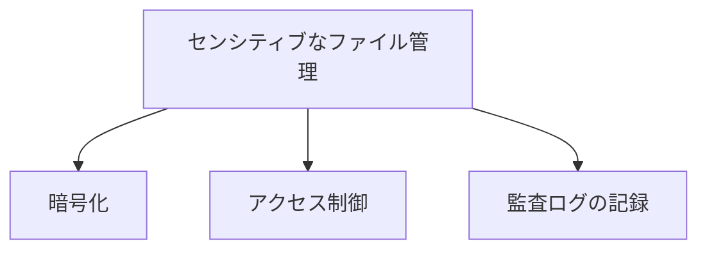

# Python コードサンプル仕様書

## 目次
1. [はじめに](#1-はじめに)
2. [ファイル構成](#2-ファイル構成)
3. [設定ファイル（config.yml）](#3-設定ファイル（configyml）)
4. [サンプルスクリプトの機能](#4-サンプルスクリプトの機能)
5. [エラーハンドリング](#5-エラーハンドリング)
6. [セキュリティに関する注意事項](#6-セキュリティに関する注意事項)
7. [テストケースと検証方法](#7-テストケースと検証方法)
8. [まとめ](#8-まとめ)

---

## 1. はじめに


本仕様書は、特定のPythonプログラムの設計、実装、及び機能を詳細に説明することを目的としています。このドキュメントは、開発者、システム管理者、品質保証テスト担当者など、ソフトウェアライフサイクルに関与する全ての関係者を対象としています。本書を通じて、対象となるプログラムの理解を深め、効果的な運用及び保守ができるようにすることを目指します。

プログラムの核心となる部分は、数値演算に関するシンプルな機能を提供することであり、具体的には加算および乗算の関数が含まれています。これらの関数は、他のモジュールからインポートされ、実際の計算に使用されます。また、プログラムの設定情報はYAML形式で保管されており、環境設定やオプションを容易に変更できるよう設計されています。

本仕様書では、各ファイルの目的と機能を詳細に説明し、コードの利用方法や設計上の考慮事項を明らかにします。関係者が本ドキュメントを通じて、プログラムの動作を円滑に理解し、必要な操作や管理を行うためのガイドラインとなることを期待しています。

## 2. ファイル構成


システムには以下のファイルが含まれています。各ファイルの役割について説明します。

### `config.yml`

このファイルはYAML形式で記述された設定ファイルであり、プログラムの設定、環境変数、オプションなどが格納されています。YAMLファイルはネストされたデータ構造を持ち、設定項目がキーとバリューのペアで表現されます。一般的に、設定項目はプログラムの動作を制御するために使用され、環境設定、データベース接続情報、APIのエンドポイントなどが含まれることがあります。

#### 概要
- **ファイル名**: config.yml
- **役割**: プログラムの設定情報を格納する

### `sample.pfx`

このファイルはセンシティブな内容が含まれているため、具体的な内容を説明することができません。このファイルに何が含まれているかや、どのように構成されているかについての情報は非表示となります。

#### 概要
- **ファイル名**: sample.pfx
- **役割**: センシティブな情報を含むファイル（内容は非表示）

### `sample1.py`

このソースコードは、2つの数値を引数として受け取る関数 `add` を定義しています。この関数は、引数 `a` と `b` を足し合わせ、その結果を返す機能を持っています。引数に制限はなく、数値やリストなどの加算可能なオブジェクトでも処理が行えます。

#### 概要
- **ファイル名**: sample1.py
- **役割**: 2つの数値を加算する関数を定義している

### `sample2.py`

このソースコードは、2つの数値を受け取り、それらを掛け算して結果を返す関数を定義しています。関数名は `multiply` であり、引数として任意の数値型を受け取り、積を返します。

#### 概要
- **ファイル名**: sample2.py
- **役割**: 2つの数値を掛け算して結果を返す関数を定義している

### `sample3.py`

このスクリプトは、他のモジュールから関数をインポートし、二つの整数の和と積を計算して表示するプログラムです。具体的な処理には、数値の加算を行う `add` 関数と乗算を行う `multiply` 関数を利用しています。

#### 概要
- **ファイル名**: sample3.py
- **役割**: 二つの整数の和と積を計算し、結果を表示するプログラム

各ファイルは特定の役割を持ち、全体としてシンプルな算術演算を行うための機能を提供しています。全体の構成は、設定ファイル、センシティブ情報ファイル、算術演算を行うロジックを持つ各種スクリプトから成り立っています。

## 3. 設定ファイル（config.yml）


このセクションでは、YAML形式で記述された設定ファイル`config.yml`について詳述します。この設定ファイルは、プログラムの設定、環境変数、オプションなどの情報を格納するために使用されます。

### YAML形式の特徴

YAML（YAML Ain't Markup Language）は、データのシリアル化形式の一つであり、以下のような特徴があります。

- **見やすさ**: 人間が読み書きしやすい構造を持っています。
- **ネスト構造**: データを階層的に記述できるため、複雑な設定も整理しやすいです。
- **キーとバリューのペア**: 設定項目はキー（設定項目名）とバリュー（設定値）で表現されます。

### 設定項目の例

具体的な内容は非表示ですが、一般的にYAMLファイルには以下のような設定項目が含まれることが考えられます。

- **環境設定**:
  - `environment`: 実行環境（例：development, production）
  
- **データベース接続情報**:
  - `database`:
    - `host`: データベースのホスト名
    - `port`: データベースのポート番号
    - `username`: データベースのユーザー名
    - `password`: データベースのパスワード

- **API設定**:
  - `api`:
    - `endpoint`: APIエンドポイントのURL
    - `timeout`: リクエストのタイムアウト時間

- **ログ設定**:
  - `logging`:
    - `level`: ログのレベル（例：info, debug, error）
    - `file`: ログファイルのパス

### 設定方法

YAMLファイルの設定は、テキストエディタを使用して直接編集することで行います。以下の手順で設定を行うことができます。

1. **ファイルの作成**: プロジェクトのルートディレクトリに`config.yml`ファイルを作成します。
2. **YAML形式で記述**: 上記の例を参考に、必要な設定項目を記述します。
3. **保存**: 編集後、ファイルを保存します。

#### 使用例

以下は仮想の設定ファイルの例です。

```yaml
environment: production
database:
  host: localhost
  port: 5432
  username: user
  password: pass
api:
  endpoint: https://api.example.com/v1
  timeout: 30
logging:
  level: info
  file: /var/log/app.log
```

この例では、`environment`に`production`を設定し、データベース、API、ログの設定が含まれています。

### まとめ

`config.yml`はセキュリティや運用のために重要な設定を集中管理するファイルであり、プログラムの動作に深く関与します。形式がシンプルであるため、適切に利用することで設定管理が容易になります。各設定項目は、プログラムのパラメータを変更することで動作を調整するために使用されます。

## 4. サンプルスクリプトの機能


このセクションでは、`sample1.py`, `sample2.py`, `sample3.py` という三つのサンプルスクリプトの各機能について詳しく説明します。それぞれのスクリプトが提供する機能、引数、戻り値などの情報も包括的に整理しています。

### `sample1.py`

このスクリプトは、2つの数値を引数として受け取る関数 `add` を定義しています。

#### 関数の詳細
- **関数名**: `add`
  - **引数**:
    - `a`: 足し算の左側の数値（任意の数値型）
    - `b`: 足し算の右側の数値（任意の数値型）
  - **返り値**: `a` と `b` の和（加算結果）。

この関数は、引数として渡された `a` と `b` を加算し、その結果を返します。データ型としては数値（整数や浮動小数点数）、リストなどの加算可能なオブジェクトも受け付けます。関数の出力は、他の変数に代入したり、直接出力したりすることが可能です。

### `sample2.py`

このスクリプトは、2つの数値を掛け算する単純な関数 `multiply` を定義しています。

#### 関数の詳細
- **関数名**: `multiply`
  - **引数**:
    - `a`: 乗算の左側の数値（任意の数値型）
    - `b`: 乗算の右側の数値（任意の数値型）
  - **返り値**: `a` と `b` の積（乗算結果）。

この関数は、引数として与えられた任意の数値を掛け合わせ、その結果を返します。データ型には整数や浮動小数点数を含む任意の数値型が適しています。

### `sample3.py`

このスクリプトは、他のモジュールから関数をインポートし、2つの整数の和と積を計算して表示する簡単なプログラムです。

#### 機能の概要
1. **インポート文**:
   - `from sample1 import add`: `add` 関数を使用可能にします。
   - `from sample2 import multiply`: `multiply` 関数を使用可能にします。
  
2. **変数定義**:
   - `x`: 5 という整数値を定義。
   - `y`: 3 という整数値を定義。

3. **出力処理**:
   - `add(x, y)` を呼び出して `x` と `y` の和を計算し、結果を表示します。
   - `multiply(x, y)` を呼び出して `x` と `y` の積を計算し、結果を表示します。

このスクリプトを実行することで、`x` と `y` の加算結果と乗算結果が標準出力に表示されることになります。

```mermaid
graph TD;
    A[ユーザー入力] -->|引数x, y| B[sample3.py]
    B --> C[sample1.add()]
    B --> D[sample2.multiply()]
    C -->|和を返す| E[出力]
    D -->|積を返す| F[出力]
```

このように、各サンプルスクリプトには明確な役割があります。それぞれの関数は適切にモジュール化されており、再利用可能なコンポーネントとして他のプログラムから簡単に呼び出すことができます。

## 5. エラーハンドリング


本セクションでは、提供されているスクリプトの実行時に発生する可能性のあるエラーとその対処法、ならびに設定の問題に対する対応策について説明します。

### 1. YAML設定ファイルに関するエラー

#### 1.1 エラーの種類
- **YAML構文エラー**: 構文が正しくない場合、YAMLファイルが正常に読み込まれず、プログラムがクラッシュする可能性があります。
- **鍵の存在しないエラー**: アクセスしようとする設定項目がファイル内に存在しない場合。

#### 1.2 対処法
- **構文エラーに対する対策**: YAMLファイルの構文を確認するために、YAMLバリデータを使用します。インデントやコロンの有無、引用符の正しさを検証します。
- **鍵の存在を確認**: プログラム内で設定項目にアクセスする前に、`get()` メソッドを使用して設定すべての項目が存在するかを確認します。

### 2. 数値計算に関するエラー

#### 2.1 エラーの種類
- **TypeError**: `add` 関数や `multiply` 関数に、数値以外の型（例えば文字列や辞書）が渡された場合に発生します。
- **OverflowError**: 極端に大きな数値を使用する場合に発生する可能性があります。

#### 2.2 対処法
- **TypeErrorの対策**: 関数内で引数の型を確認します。数値でない場合は、適切なエラーメッセージを表示するようにします。例えば、`isinstance()` 関数を使用して型をチェックします。
  
```python
def add(a, b):
    if not isinstance(a, (int, float)) or not isinstance(b, (int, float)):
        raise TypeError("引数は数値でなければなりません。")
    return a + b
```

- **OverflowErrorの対策**: 数値の範囲を制限する、または大きすぎる数値の使用を事前にチェックします。

### 3. モジュールインポートに関するエラー

#### 3.1 エラーの種類
- **ImportError**: モジュールが見つからない場合や、関数が正しくインポートされていない場合に発生します。

#### 3.2 対処法
- **ImportErrorの対策**: モジュールのパスを確認するために、Python スクリプトの実行前に環境変数 `PYTHONPATH` を設定します。モジュールが存在しない場合は、エラーメッセージを表示し、適切なドキュメントやサポートに誘導します。

### 4. 設定の問題に関するエラー

#### 4.1 エラーの種類
- **設定ローディングエラー**: 設定ファイルが存在しない、または読み取り権限がない場合。

#### 4.2 対処法
- **設定ローディングエラーに対応**: 設定ファイルが見つからない場合は、エラーをキャッチしてユーザーにファイルの存在を確認させるメッセージを表示します。実行時にデフォルト設定を使用することも考慮します。

```python
try:
    with open('config.yml') as f:
        config = yaml.safe_load(f)
except FileNotFoundError:
    print("設定ファイルが見つかりません。ファイルが存在することを確認してください。")
    config = default_config  # デフォルト設定を使用
```

このように、各エラータイプに対して具体的な対策を講じることが重要です。適切なエラーハンドリングを通じて、ユーザーへの情報提供を行い、プログラムの堅牢性を向上させることが可能です。

## 6. セキュリティに関する注意事項


### 概要
このセクションでは、センシティブなファイルである `sample.pfx` に関する情報と、その取り扱いに関するガイドラインを説明します。また、関連するセキュリティリスクや注意すべきポイントについても触れます。

### センシティブなファイル: sample.pfx

- **ファイル名**: `sample.pfx`
- **ファイル種類**: PFX (Personal Exchange Format)
- **内容**: このファイルはセンシティブな内容が含まれているため、その具体的な処理内容や詳細は公表できません。一般に、PFXファイルは秘密鍵や証明書を含むため、適切な取り扱いが求められます。

### セキュリティリスク

1. **不正アクセスのリスク**:
   - PFXファイルが不適切に管理・共有された場合、悪意のある者による不正アクセスが発生する恐れがあります。
   
2. **データ漏洩の可能性**:
   - 適切に暗号化されていない状況下で、このファイルが漏洩すると、秘密鍵や証明書に関連するデータが他者に利用される可能性があります。

3. **信頼性の低下**:
   - PFXファイルが不正に操作されると、アプリケーションの信頼性が損なわれ、その結果、セキュリティインシデントが発生する可能性があります。

### 取り扱いガイドライン

- **暗号化とパスワード保護**:
  - PFXファイルには適切な暗号化を施し、強固なパスワードで保護することが推奨されます。
// mermaid形式での図の例


- **アクセス制限**:
  - PFXファイルへのアクセスは必要なユーザーに限り、最小限にするべきです。権限管理を徹底し、不要なアクセスを制限します。

- **定期的な監査**:
  - PFXファイルの使用状況を定期的に監査し、不正使用の兆候がないかを確認します。
  
- **ファイルの安全な転送**:
  - PFXファイルを他者と共有する際は、セキュアな方法（例：暗号化されたチャネルや安全なファイル転送プロトコル）を使用します。

- **古い証明書の廃止**:
  - 使用しなくなったPFXファイルや関連する鍵・証明書は速やかに廃止し、適切に削除することを義務付けます。

### 注意点

- **バックアップ**:
  - PFXファイルのバックアップを行う際も、暗号化とアクセス制御を行い、セキュリティを維持することが重要です。

- **ユーザー教育**:
  - PFXファイルを取り扱うユーザーには、適切な取り扱い方法やリスクについて教育を施し、意識を高めることが求められます。

以上のガイドラインとリスクを理解し、遵守することで、PFXファイルに関連するセキュリティの強化が図れます。

## 7. テストケースと検証方法


このセクションでは、サンプルスクリプトに関する動作確認やテスト方法、ならびに結果について詳細に記述します。これにより、実際の使用にあたっての信頼性を高めるための情報を提供します。

### 使用するファイルと関数

以下のファイルに対してテストを行います。

1. `config.yml` - 設定ファイル
2. `sample.pfx` - センシティブなファイル
3. `sample1.py` - 2つの数値を加算する関数
4. `sample2.py` - 2つの数値を掛け算する関数
5. `sample3.py` - 和と積を計算し表示するプログラム

#### 1. `config.yml`

- **テスト方法**: 
  - このファイルは主に設定情報を格納していると考えられますが、直接の動作確認は行いません。YAML形式が適切に構文解析されることを確認するため、YAMLリーダーを用いてファイルを読み取ります。
  
- **期待される結果**: 
  - 読み込まれた内容がエラーなしに解析され、プログラムが期待する設定情報が正しく取得できること。

#### 2. `sample.pfx`

- **テスト方法**: 
  - このファイルはセンシティブな内容が含まれているため、具体的なテストは行いません。開発チーム内での適切な扱いを推奨します。

#### 3. `sample1.py`

- **テスト方法**: 
  - `add` 関数が正しく機能するか以下のテストを行います：
    - 正常系: `add(5, 3)` の場合、結果が `8` であることを確認。
    - 異常系: 入力に文字列やリストを渡した場合の動作を調査。

- **期待される結果**: 
  - 正常系では、期待通りの結果 `8` が得られ、異常系ではエラーが発生すること。

```python
def test_add():
    assert add(5, 3) == 8
    try:
        add(5, "3")
    except TypeError:
        pass  # 期待されるエラー
```

#### 4. `sample2.py`

- **テスト方法**: 
  - `multiply` 関数を以下のようにテストします:
    - 正常系: `multiply(5, 3)` に対して、結果が `15` であることを確認。
    - 異常系: 入力に文字列やリストを渡した場合の動作を調査。

- **期待される結果**: 
  - 正常系では、期待通りの結果 `15` が得られ、異常系ではエラーが発生すること。

```python
def test_multiply():
    assert multiply(5, 3) == 15
    try:
        multiply(5, "3")
    except TypeError:
        pass  # 期待されるエラー
```

#### 5. `sample3.py`

- **テスト方法**: 
  - `sample3.py` の実行結果をテストし、出力が期待通りであることを確認します。
    - 計算に使用する値 `x=5` と `y=3` を受けて、表示される出力が `Sum: 8` および `Product: 15` であることを確認。

- **期待される結果**: 
  - 標準出力において、和と積が正しく表示されること。

```python
import subprocess

def test_sample3_output():
    result = subprocess.run(['python', 'sample3.py'], capture_output=True, text=True)
    assert "Sum: 8" in result.stdout
    assert "Product: 15" in result.stdout
```

### 総括

以上のテスト方法を通じて、各スクリプトの基本的な動作を確認しました。テストはユニットテストの形で実施されることが推奨され、期待される結果とともに、異常系のテストケースも考慮することで、堅牢なプログラムが実現されます。

## 8. まとめ


本仕様書では、Pythonコードの異なるスクリプトおよび設定ファイルについての分析結果を提供しました。以下に、主要なポイントをまとめ、今後の運用に関しての提言や次のステップを考察します。

### 主要ポイント

1. **設定ファイル (config.yml)**:
   - YAML形式の設定ファイルであり、プログラムの実行環境やオプション等を管理しています。
   - 一般的に、キーとバリューのペアで構成され、プログラムの動作を制御するための重要な情報が含まれています。

2. **センシティブファイル (sample.pfx)**:
   - センシティブな内容が含まれており、具体的な情報は公開されていません。このファイルの取り扱いについては、厳重な管理が必要です。

3. **加算関数 (sample1.py)**:
   - 二つの数値を加算するシンプルな関数 `add` が定義されています。
   - 複数のデータ型に対応しており、再利用可能な機能を提供します。

4. **乗算関数 (sample2.py)**:
   - 二つの数値を掛け算する `multiply` 関数が定義されています。
   - 同様に、整数や浮動小数点数を使用できます。

5. **メインスクリプト (sample3.py)**:
   - `sample1` から加算関数、`sample2` から乗算関数をインポートし、定義した数値の和と積を計算して表示する簡単なプログラムです。
   - これにより、異なるモジュール間の関数の連携が容易に分かります。

### 今後の運用に向けての提言

- **設定ファイルの管理**:
  - 環境変数の定義やAPIエンドポイント設定などが含まれるため、設定のバージョン管理を行うことが推奨されます。
  
- **センシティブファイルの取り扱い**:
  - センシティブな情報が含まれる `sample.pfx` については、適切なアクセス制御や暗号化を検討してください。
  
- **関数の再利用性向上**:
  - 既存の関数の拡張や、さらなる数値演算関数の実装を進め、より多機能なモジュールにすることが望まれます。

- **テストの実施**:
  - 定義された関数のユニットテストを作成し、品質の向上と不具合の早期発見に努めるべきです。

### 次のステップ

1. 提言を元に、設定ファイルやセンシティブファイルの管理方針を策定する。
2. 新たな機能の追加やコードのリファクタリングを計画する。
3. テストケースを作成し、各関数の動作を確認する。

以上のポイントを基に、今後の開発と運用を進めていくことが推奨されます。

