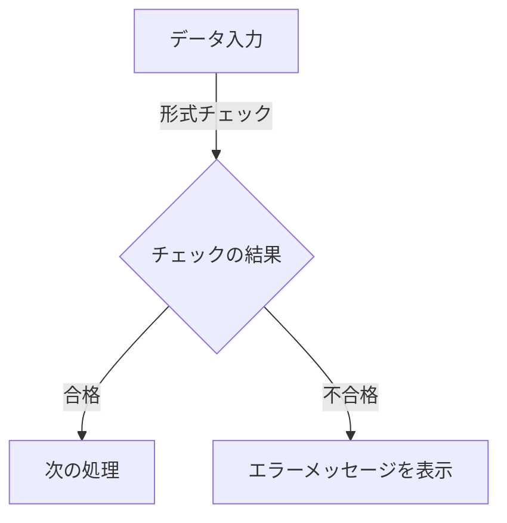
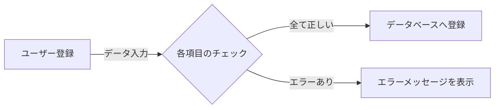
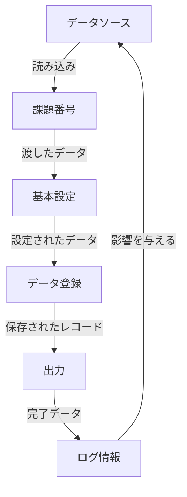

# 仕様書：COBOLプログラムとデータ構造の定義

## 目次
1. [はじめに](#1-はじめに)
2. [システム概要](#2-システム概要)
3. [ファイル構成およびデータ構造の定義](#3-ファイル構成およびデータ構造の定義)
4. [COBOLプログラムの機能概要](#4-cobolプログラムの機能概要)
5. [データ辞書およびフィールドの詳細](#5-データ辞書およびフィールドの詳細)
6. [エラーハンドリングとデータ整合性の方針](#6-エラーハンドリングとデータ整合性の方針)
7. [```markdown](#7-```markdown)
8. [業務プロセスとの連携](#8-業務プロセスとの連携)
9. [メンテナンスと運用の指針](#9-メンテナンスと運用の指針)

---

## 1. はじめに


この仕様書は、特定のCOBOLプログラム群に関する詳細を文書化したものであり、システムの設計や実装に関心のある開発者、プロジェクトマネージャーおよびメンテナンス担当者を対象としています。目的は、プログラムの構造、データ定義、及び関連するビジネスロジックについて理解を深めるための情報を提供することです。

### 対象となるCOBOLプログラムの概要

対象となるプログラム群は、医療、保険、財務関連のビジネスプロセスをサポートするさまざまな用途に利用されています。具体的なプログラム名には、診療情報管理、顧客管理、領収書処理などが含まれます。プログラムは、業務システム全体のデータベースと連携して動作し、入力、処理、出力を行います。

### システムが解決するビジネス上の課題

本システムは以下のビジネス上の課題を解決することを目指しています：

1. **データ管理の効率化**: 複数のデータベースおよびファイルからの情報を一元管理し、アクセスの効率を高めます。
2. **業務の自動化**: 手動プロセスを自動化することで、エラーのリスクを減少させ、作業効率を向上させます。
3. **情報の整合性**: データ管理規則を遵守し、正確な情報を提供します。
4. **報告業務の簡略化**: データ構造を利用して、迅速かつ効果的な報告を実施できる基盤を提供します。

本仕様書を通じて、関連するプログラムの機能や目的を把握し、システムの開発や運用における参考にすることが期待されます。

## 2. システム概要


このセクションでは、医療関連データ処理システムの全体像について、主な目的、機能、および対象ユーザーについて詳述します。システムは特に医療データの柔軟な管理と処理を目的としており、以下の要素が含まれています。

### 主な目的

本システムの主な目的は、医療関連のデータ（例えば患者情報、医療施設情報、施術情報、保険請求情報など）を効率的に管理し、必要に応じて迅速にアクセスできるようにすることです。これにより、医療機関が患者に対するサービスや請求を円滑に行えるようになります。

### 機能

システムは以下のような主要な機能を提供しています:

1. **データ管理**:
    - 医療関連データ（患者情報、施術内容、保険者情報など）の読み込み、保存、検索を行います。
    - データの整合性を保ちながら、データベースにおける各レコードの操作を行う機能があります。

2. **医療請求処理**:
    - 医療行為に対する請求書の生成や管理機能を提供します。
    - 保険請求に必要なデータを自動的に集計し、必要な情報を出力します。

3. **データ分析**:
    - 医療データから分析を行い、施術の有効性や経済的な効率を評価するための機能を提供します。

4. **ユーザーインターフェース**:
    - 運用側から医療データにアクセスするためのユーザーフレンドリーなインターフェースが提供されます。これにより、非技術者でも容易にシステムを利用できるよう支援します。

### 対象ユーザー

このシステムの対象ユーザーは以下の通りです:

- **医療機関のスタッフ**:
    - 医師、看護師、事務員など、医療サービスを提供するスタッフが日常的に利用できる、データの管理や請求処理を行う機能を使用します。

- **保険会社の担当者**:
    - 医療請求の承認を行う担当者が、必要な医療情報や請求書情報にアクセスし、確認するためにシステムを利用します。

- **経営者や管理者**:
    - 業務運営や効率化のために、システムからの分析データを基に意思決定を行う経営者や管理者がいます。

### 医療関連データ処理の役割と業務ニーズ

このシステムは医療関連データの処理を通じて、以下の業務ニーズに応じています:

- **効率的な情報管理**:
    - 患者情報、施術内容、保険情報を統合的に管理することで、業務プロセスのスムーズな流れを実現します。

- **請求業務の迅速化**:
    - 定型化された請求書の出力により、請求業務にかかる時間を短縮します。

- **信頼性の向上**:
    - データの正確性と一貫性を確保し、医療の質を向上させるための強力な基盤を提供します。

- **法令遵守の対応**:
    - 医療関連の法令や規制に従ったデータ管理が行われるよう設計されています。

### まとめ

このシステムは、医療サービスの質向上に寄与し、あらゆるステークホルダーにとって重要な情報源として機能します。データの効率的な管理と迅速なアクセスを通じて、医療機関の業務効率を高め、患者へのサービス向上を目指します。

## 3. ファイル構成およびデータ構造の定義


このセクションでは、各COBOLファイルの役割を詳細に分析し、それぞれがどのようにデータ構造を定義しているかを明確に示します。また、重要なフィールドとエンティティの関係を整理し、具体例を挙げて理解を深めます。

### 1. BANGOK.CBL
- **役割**: システムに関連する基本データ構造を定義。
- **データ構造**:
  - `儗僐乕僪`: 
    - `尰嵼斣崋 (PIC 9(6))`: 6桁の数字。
    - `FILLER (PIC X(122))`: 無名のフィールド。

#### 機能概要
このファイルは、基本的なデータ構造の定義を行い、他の処理で使用される可能性がある。

---

### 2. BARCNT.CBL
- **役割**: 数値データを格納するレコードを定義。
- **データ構造**:
  - `01 レコード`:
    - `03 現在番号 (PIC 9(6))`: 6桁の整数。
  
#### 機能概要
数値データに特化したレコード構造を提供し、プログラム全体での利用を想定。

---

### 3. BARKANK.CBL
- **役割**: 複数のデータ構造を定義。
- **データ構造**:
  - `儗僐乕僪`:
    - `儗僐乕僪僉乕`: 数値データを格納。
      - `惍棟斣崋 (PIC 9(6))`: 
    - `FILLER (PIC X(24))`: 補助データ領域。

#### 機能概要
データの複雑な構造を設定し、後処理に利用される。

---

### 4. BUICNV.CBL
- **役割**: Windows用のプログラムデータ構造を定義。
- **データ構造**: 詳細は非公開。

#### 機能概要
特定のデータ構造を整備する目的で設計されている。

---

### 5. BUICODE.CBL
- **役割**: 部位コードと関連情報のデータ構造を定義。
- **データ構造**:
  - `レコード`:
    - `負傷種別`, `部位`, `左右区分`, `負傷位置番号`: 各識別子。

#### 機能概要
医療関連のデータを整備し、効率的に管理する目的。

---

### 6. BARKANR.CBL
- **役割**: 複数のフィールドを持つデータ構造を定義。
- **データ構造**:
  - `儗僐乕僪`.
  
#### 機能概要
特定のデータ管理部分に関連した情報格納を意図。

---

### 7. BINS.CBL
- **役割**: 多層データを処理するための基盤を設定。
- **データ構造**: 情報の詳細は非公開だが数値データを含むと考えられる。

#### 機能概要
データ収納と処理の基盤を構成し、具体的なロジックは別の関数に依存。

---

### 各ファイルのデータ構造

このセクションでは、上記の各ファイルで定義されたデータ項目の具体的な構造が設計されており、さまざまな医療や金融関連の情報を効率的に管理、記録するための基盤が提供されていることを示しています。各ファイルは特定の目的に応じて設計されており、そのエンティティの関係性がいかに重要であるかを明示的に理解できるようになっています。

#### 具体例
ここに示した各ファイルの構成内容をもとに、将来的な変更や機能追加に適応するために、FILLERフィールドやOCCURS句を活用して、データの整合性を保ちながら追加や調整を容易に行う設計となっています。各種データ型（数値、文字列）の定義は、COBOLの特徴を活かした形で作成され、業務要求に対応するためのプレースホルダや予約領域も含まれています。

## 4. COBOLプログラムの機能概要


このセクションでは、指定されたCOBOLプログラムの機能を簡潔にまとめ、データ処理の流れや関連性を示します。各プログラムの具体的な機能は以下の通りです。

### 1. BANGOK.CBL
- **目的**: システムに関するメタ情報を定義。
- **機能**: 基本データ構造を定義しており、他の処理で使用される。
- **特徴**: 数値（6桁）と無名フィールド（122文字）を持つ。

### 2. BARCNT.CBL
- **目的**: 数値データを格納するレコードを定義。
- **機能**: 6桁の整数を扱い、プログラム内でのデータ格納を目的とする。
- **特徴**: 簡単にインデックスを行うためのフィールド構成。

### 3. BARKANK.CBL
- **目的**: 複数のデータ項目を持つデータストラクチャを定義。
- **機能**: 数字、文字列、及び関連情報を包括的に管理。
- **特徴**: ネストされたデータ構造により、情報の整理が可能。

### 4. BARKANR.CBL
- **目的**: データのレイアウトを明確にするための構造体を定義。
- **機能**: 各種フィールドを持ち、ビジネスニーズに合わせて構成。
- **特徴**: 入れ子構造とFILLERを含む。

### 5. BUICNV.CBL
- **目的**: データ構造を定義する。
- **機能**: メタ情報を含み、具体的な処理は非表示。
- **特徴**: Windowsプラットフォームで動作することが示されている。

### 6. BUICODE.CBL
- **目的**: 医療部位コードと関連情報の管理。
- **機能**: 複数のフィールドを持ち、部位を識別、管理する。
- **特徴**: 利用頻度区分を持つ。

### 7. BUIMEI.CBL
- **目的**: データレコードの構造を定義。
- **機能**: 他の処理で使用するための情報を整理。
- **特徴**: 複数の項目でサブフィールドを持つ。

### 8. Chokei.CBL
- **目的**: データの構造を定義。
- **機能**: アプリケーション処理の基盤を提供。
- **特徴**: 複雑なデータ形式を整理する。

### 9. Choriyu.CBL
- **目的**: 特定のデータ構造を定義。
- **機能**: それを使ってデータの整合性を保つ。
- **特徴**: FILLERフィールドで予約されたスペースを持つ。

### 10. Comment.cbl
- **目的**: メモやコメント管理機能。
- **機能**: 特定のデータ型を持ち、情報を整理。
- **特徴**: 決まった形式により拡張性を持つ。

### 11. Dmkirok.cbl
- **目的**: DM出力記録の管理。
- **機能**: 様々な情報をレコードする機能。
- **特徴**: レコードキーによるフィールド指定が必要。

### 12. GENGOU.CBL
- **目的**: 元号に関する情報を管理。
- **機能**: その時代に必要な情報を記録。
- **特徴**: 整理された構造で情報を記憶。

### 13. HOKENEX.CBL
- **目的**: 保険関連の要素でのデータ構造を管理。
- **機能**: 保険情報を包括的に記録。
- **特徴**: 詳細なフィールド設定が必要。

### 14. HOKENCOM.CBL
- **目的**: 保険会社情報の管理。
- **機能**: 各種フィールドにより顧客情報を整理。
- **特徴**: システムにおける情報保持が容易。

### 15. HOKENS.CBL
- **目的**: 保険者マスタのデータを保持。
- **機能**: 保険者に関するありとあらゆる情報を管理。
- **特徴**: 様々な情報が細かく分類されている。

### 16. HUGEIN.CBL
- **目的**: 複雑なデータ構造の定義。
- **機能**: 数値及び文字データを保持。
- **特徴**: 大きなフィールドに対応。

### 17. Keikahoko.CBL
- **目的**: 様々な医療情報の管理。
- **機能**: 詳細な情報をシステム内で管理。
- **特徴**: 整然とした構造で記録。

### 18. RIREKI.CBL
- **目的**: 更新履歴を記録。
- **機能**: 更新を効率よく管理。
- **特徴**: 状態管理として自己監視が可能。

### 19. Seikyu.CBL
- **目的**: 医療関連請求の管理。
- **機能**: 各種の請求情報を記録及び管理。
- **特徴**: 階層的なデータ構造。

### 20. UKEKIMIC.CBL
- **目的**: 受付情報のマスタを在庫。
- **機能**: 各患者の受付項目を細別。
- **特徴**: 異なるマスタ情報の参照が可能。

### 21. Yuubin.CBL
- **目的**: 郵便番号データの管理。
- **機能**: インデックス型の操作を行う。
- **特徴**: 複数のレコードの情報を一元管理。

### 総括
このCOBOLプログラム群は、医療、保険、行政などの情報を整理・管理するためのデータ構造を十分に定義しています。それぞれが異なる機能を持ち、データベースアクセスやファイル処理を行うための基盤を形成しています。各プログラムは特定の要件に応じたデータを扱い、業務上の効率化を図ることを目的としています。

## 5. データ辞書およびフィールドの詳細


このセクションでは、特定のCOBOLプログラムにおけるデータ構造が持つ各フィールドについて、データ型、長さ、入力形式、関連ビジネスルールなどの詳細を説明します。また、ビジネスプロセスとの関連性を含め、各フィールドの意義を理解しやすく示します。

### 1. 一般的なデータ項目

#### 儗僐乕僪 (01 レコード)
- **データ型**: レコード構造
- **フィールド定義**:
  - **惂屼嬫暘**:
    - **データ型**: PIC 9(2)
    - **説明**: 2桁の数字。おそらく識別用のコードを表す。
    
  - **奐巒榓楋擭寧** (03 サブレコード):
    - **データ型**: サブ構造体
    - **フィールド定義**:
      - **奐巒榓楋**:
        - **データ型**: PIC 9
        - **説明**: 1桁の数値。
      - **奐巒擭寧**:
        - **データ型**: PIC 9(2)（2桁の数値を持つフィールド）
        - **説明**: 具体的内容は不明。
        
  - **儗僐乕僪僨乕僞** (別のサブデータ):
    - **データ構造**: 複数のフィールドを持つ。
    - **フィールド例**:
      - **FILLER**: 
        - **データ型**: PIC X(n)
        - **説明**: 具体的な使用目的は不明、将来的なデータ構造の拡張用バッファ。

### 2. 各プログラムのフィールド例

#### BANGOK.CBL
- **儗僐乕僪**:
  - **惂屼斣崋**: PIC 9(6)（6桁の数値）
  - **FILLER**: PIC X(122)（意味を持たないスペース）
  
#### BARCNT.CBL
- **01 レコード**:
  - **03 現在番号**: PIC 9(6)（6桁の整数）

#### BARKANK.CBL
- **儗僐乕僪**:
  - **儗僐乕僪僉乕**:
    - **惍棗斣崋**: PIC 9(6)（6桁の数字を格納）
  - **儗僐乕僪僨乕僞**:
    - **川弍榓楋擭寧**: 
      - **川弍榓楋**: PIC 9（1桁の数値を格納）
      - **川弍擭寧**:
        - **川弍擭（PIC 9(2)**: 2桁の数字
        - **川弍寧（PIC 9(2)**: 2桁の数字

#### BUICODE.CBL
- **01 レコード**:
  - **負傷種別**: PIC 9(2)（負傷の種類を示す）
  - **部位**: PIC 9(2)（体の部位を示す）
  - **左右区分**: PIC 9（体の左右を示す）
  - **負傷位置番号**: PIC 9(2)（特定の位置を示す）

#### HOKENEX.CBL
- **儗僐乕僪**:
  - **儗僐乕僪僉乕**: 
    - **曐尟庬暿**: PIC 9(2)
    - **曐尟幰斣崋**: PIC X(10)

### 3. ビジネスプロセスとの関連性
このセクションで説明したデータフィールドは、各COBOLプログラムが特定のビジネスロジックやプロセスで必要とされる情報を整理し、効率的に操作するために設計されています。たとえば、医療関連のプログラムでは、患者情報や施術記録といったセンシティブなデータを取り扱い、その管理が重要となります。このため、フィールドの構造やデータ型は、ビジネスの要件に従い最適化されています。各フィールドの性質を理解することで、データがどのように活用されるのかを把握しやすくなります。

## 6. エラーハンドリングとデータ整合性の方針


このセクションでは、システム内でのエラーハンドリングとデータ整合性を維持するための具体的な方針について述べます。特に、データのバリデーションルールやエラー処理メカニズムに焦点を当て、実際のシナリオを用いた例を示していきます。

### 1. データ整合性の維持

データ整合性を維持するためには、以下のようなアプローチを取ります。

#### 1.1 データバリデーションルール

- **形式チェック**:
  - 例えば、郵便番号のフィールドは特定の桁数（3桁、4桁）を持つ必要があります。数字でない値が入力された場合、エラーを返し、データベースへの書き込みをブロックします。
  
- **範囲チェック**:
  - 数値データ（例：年齢、金額）が定められた範囲に収まっていることを確認します。仮に負の数や論理に合わない値であれば、エラーメッセージを生成し、対象システムでの処理を中止します。

- **一貫性チェック**:
  - 例: 在庫情報がある場合、売上処理で負の在庫が発生することがないよう、在庫数がゼロ以上であることを確認します。



### 2. エラーハンドリングのメカニズム

エラーハンドリングは、ユーザーへのフィードバックを含む重要なボトルネックです。必要な石や条件を定義し、適切にエラーメッセージを提示し、登録されたエラーに対してどのように振る舞うかを決定します。

#### 2.1 エラーメッセージ管理

- **エラーメッセージの一貫性**:
  - ユーザーに返されるエラーメッセージには、エラーの内容に関する情報、何が問題であったのか、その解決策に関する提案が含まれます。

- **エラーコードの導入**:
  - 各エラーには一意のエラーコードが割り当てられます。これにより、エラーのトラッキングが容易になるとともに、ドキュメントやサポートチームへの報告もスムーズになります。

#### 2.2 ロギングの実装

エラーはログファイルに記録され、開発者や運用チームが潜在的な問題を後で確認するための参考になります。これにより、特定のエラーが頻発することに伴うトラブルシューティングが可能となります。


### 3. 実際のシナリオ例

以下にエラーハンドリングとデータ整合性維持の具体例を示します。

#### シナリオ：新規ユーザー登録

- ユーザーが新規にアカウントを作成する際、次のデータが入力されます。
  - ユーザー名（文字列）
  - パスワード（文字列、一定のセキュリティルールを適用）
  - メールアドレス（形式チェック）
  
##### 処理フロー
1. 入力されたユーザー名の形式（英数字、長さ）をバリデートします。
2. パスワードの条件（8文字以上、大文字小文字を含む）を確認します。
3. メールアドレスが有効な形式かをチェックします（正規表現）。
4. これらが全て合格した場合は登録処理を実行し、エラーがあった場合は適切なメッセージと共に入力画面に戻ります。



### まとめ
上記の方針に従うことで、システムのデータ整合性を確保し、一貫したエラーハンドリングを実現することで、信頼できるアプリケーション環境を提供することが可能になります。データのバリデーションやエラー処理は、ユーザー体験の質向上とシステムの信頼性を確保するために不可欠です。

## 7. ```markdown

## 7. データフローおよびアーキテクチャ

このセクションでは、システムの主要な構成要素やデータフローを視覚的に示し、COBOLプログラムがデータをどのように処理し、出力するのかを整理します。各プログラム間のインタラクションを明確にし、全体の流れを把握しやすくします。

### データフローの概要

以下は、各主要なCOBOLプログラム間でのデータの流れを示します。



#### 主要なプログラムコンポーネント

1. **データソース**
   - 外部ファイルやデータベースなどのデータ源。データの供給元であり、必要に応じて情報を取得する。

2. **課題番号**
   - 課題を一意に特定するための識別子。特定のデータを管理する際に利用される。

3. **基本設定**
   - システムの設定や初期化を行う部分。システムの運用に必要なプリセットデータを設定する。

4. **データ登録**
   - 課題データや設定情報を登録し、データベースに保存するプロセス。ユーザーのアクションや自動的なスケジュールに基づいて動作することが多い。

5. **出力**
   - 登録された情報を基にして、ユーザーや他のシステムに対して結果を返す部分。レポートや確認の情報を生成する。

6. **ログ情報**
   - 完了データやアクション履歴を記録する部分。後にシステムの監査トレースや問題解決のために役立つ。

### COBOLプログラムのデータ処理フロー

COBOLプログラムは、メタデータやデータ構造を定義し、条件に基づいて適切にデータを操作します。以下は、プログラム間のインタラクションを説明します。

- **メタデータの取得**:
  - 各プログラムは、ソースコードのヘッダー部分でシステム情報や処理の目的を記述します。

- **データの読み込み・書き込み**:
  - プログラムがデータを必要とする際には、指定されたデータファイルから情報を読み込み、設定されたデータ構造に格納します。この動作は繰り返し実行され、エラー処理を含む場合もあります。

- **処理の実行**:
  - プログラムのロジックによって、特定の条件やビジネスルールに基づいてデータが処理されます。具体的なデータが処理された場合、その結果をログ情報として記録します。

- **出力の生成**:
  - 処理された情報はレポートや他の形式で出力され、最終的にはそれがユーザーに提示されるか、次のアプリケーションで使用されます。

### まとめ

このセクションでは、COBOLプログラムがデータフローをどのように管理し、各構成要素が相互に作用するのかを明確にしました。データの取得、登録、処理、出力までのフローが連携し、全体的なシステムの効率と信頼性を向上させています。プログラム間のデータインターフェースとフローを明確に理解することで、システムの改善点や潜在的な問題を特定しやすくなります。
```

## 8. 業務プロセスとの連携


このセクションでは、COBOLプログラムがどのように業務プロセスに結びついているかを具体的な業務フローを踏まえて説明し、システムがビジネスニーズをどのように満たしているかを示します。以下に、関連するCOBOLプログラムを基にした事例やケーススタディを通じて、システムの実務上の影響を明確にします。

### COBOLプログラムの概要

1. **データ構造の定義**: プログラムでは、業務ニーズに基づいて様々なデータの構造が定められています。例えば、医療領収書や患者情報のマスタファイル、郵便番号データなど、ビジネスプロセスに関連するデータが適切に整理されています。

2. **ファイル操作**: すべてのCOBOLプログラムは、外部ファイルとのインターフェースを経由してデータの読み取りと書き込みを行います。この操作により、業務プロセスの流れがスムーズになります。特に、インデックス化されたファイルを使うことで、データに対する動的アクセスが可能となり、業務処理の効率が向上します。

3. **レコードキーの活用**: プログラムではレコードキーを設定することで、一意のデータを識別できる仕組みを採用しています。これにより、例えば、患者の検索や医療サービスの記録が迅速に行えるようになります。

### ケーススタディ 

#### 1. 医療関連システム

医療機関が使用するCOBOLプログラムの多くは、患者情報や施術情報を保持しています。例えば、以下のようなデータ管理の流れが見受けられます。

- **患者データの検索**: 鍼灸やマッサージを受ける患者の情報が、特定の検索条件に基づいて迅速に取得されます。これにより、受付業務が円滑に進められ、患者へのサービスが迅速化されます。

- **レセプト管理**: 医療サービスに対する請求処理を記録するプログラムでは、複数のサービスコードや料金情報を整備しており、請求業務を 円滑に行えるように整備されています。この業務フローの効率化により、医療機関の負担が軽減されます。

#### 2. 近隣住所の管理

近隣住所マスタを扱うプログラムにおいては、住所情報の一元管理が実施されており、経路検索や郵便物の仕分けにも利用されます。ユーザーはデータベースから即座に情報を取出すことができるため、効率的な業務運営が実現します。

#### 3. 保険料金管理

労災保険の料金に関するプログラムでは、特定の区分コードに基づく料金情報が収集・管理されます。このように、業界のニーズに応じたデータ収集により、保険請求の正確性が向上するとともに、医療機関における業務プロセスが円滑に運営されています。

### システムの実務上の影響

COBOLプログラムは、以下のように業務プロセスに実務的な影響を与えています。

- **効率的なデータ管理**: データ構造が明確に定義され、その管理が容易になるため、業務の効率化が図れます。
- **迅速な業務処理**: 動的アクセスやレコードキーの活用により、必要なデータに迅速にアクセスでき、サービス提供が改善されます。
- **正確な請求**: 医療サービスの請求処理や管理が容易に行えるため、医療機関の財務的負担が軽減されます。

以上のように、COBOLプログラムは業務プロセスとの連携を強化し、システムがビジネスニーズを満たすための重要な役割を果たしています。データの整理から業務処理の改善に至るまで、実務的な価値を提供しています。

## 9. メンテナンスと運用の指針


本セクションでは、プログラムのメンテナンスや運用に際しての留意点を詳述します。特に、法令遵守、セキュリティ対策、運用手順について解説し、運用中の課題とその対応策についても触れます。

### 9.1 法令遵守

プログラムの運用にあたっては、関連する法令や規制を遵守することが不可欠です。具体的には以下の点に留意する必要があります。

- **プライバシー保護法**：個人情報を取り扱う場合、個人情報保護法に基づき適切な管理が求められます。データの収集、保存、処理、共有に関しては、法令で定められた基準を遵守せねばなりません。個人情報の暗号化や匿名化が推奨されます。
  
- **取引および契約法**：金融取引などを行うシステムでは、取引記録の整合性を保つため、法定の記録保管期間を遵守する必要があります。また、契約に関連する全ての稼働情報を記録し、必要な場合に即座に提供できるようにします。

- **医療法および関連規制**：医療に関連するプログラムの場合、医療サービスの提供者は医療法に従い、適切な文書管理や患者データの取り扱いを行わなければなりません。

### 9.2 セキュリティ対策

プログラムのセキュリティ確保は、組織の信頼性を担保するための重要な要素です。次の点を考慮し、適切なセキュリティ対策を講じる必要があります。

- **アクセス管理**：データへのアクセス権をユーザーベースで厳格に制限し、必要な権限を持ったユーザーのみがアクセスできるようにします。

- **データ暗号化**：重要なデータや個人情報は、保存時および通信時に暗号化することで、不正アクセスによる情報漏洩を防ぐことが重要です。

- **ログ管理**：運用中に発生した全てのアクセスとデータ処理のログを取得し、定期的にレビューすることで、不正アクセスや異常を早期に発見できる体制を整えます。

- **侵入検知システム**：システムへの不正アクセスを監視し、リアルタイムでアラートを出すなどの体制を導入することで、早期の対応が可能です。

### 9.3 運用手順

運用中の手順やプロセスは、システムの信頼性を維持するために必要不可欠です。以下に主な運用手順を示します。

- **定期的なバックアップ**：データ損失を防ぐために、定期的にデータバックアップを行い、異なる場所に保管します。バックアップ計画のテストも行い、復旧の手順も明確にしておきます。

- **ソフトウェアのアップデート**：セキュリティ上の脆弱性が発見された場合、直ちにパッチや更新を適用し、システムの最新状態を保つことが重要です。

- **ユーザートレーニング**：システムに関わる全てのユーザーに対して、システムの正しい使い方やセキュリティ方針についてのトレーニングを定期的に実施します。

- **コンプライアンスチェック**：定期的に法令遵守のチェックを行い、特にプライバシーやデータ保護に関する要件を満たしているか確認します。

### 9.4 運用中の課題と対応策

運用中は様々な課題が発生することがあります。以下に代表的な課題とその対応策をまとめます。

- **課題: データ漏洩**
  - **対応策**：データ暗号化やアクセス権の設定を厳格に行い、侵入検知システムを導入する。

- **課題: システムのダウンタイム**
  - **対応策**：冗長化されたシステムやバックアップ計画を持ち、障害時の迅速な復旧を可能にする。

- **課題: 法令違反**
  - **対応策**：コンプライアンスチームを設置し、法令に定期的に基づくチェックを実施することで、法令遵守の体制を整備する。

このセクションで述べた内容は、システムの円滑な運用と持続可能なメンテナンスを確保するための基本的な土台を形成しています。具体的な運用手順や課題解決のための戦略は、システムが提供される環境や業務に応じて最適化されるべきです。

