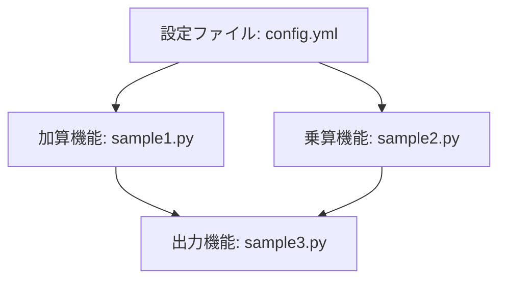
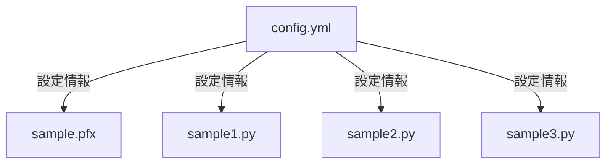

# Python Sample Code Application Specification

## 目次
1. [はじめに](#1-はじめに)
2. [システム概要](#2-システム概要)
3. [ファイル構成](#3-ファイル構成)
4. [1 config.yml](#4-1-configyml)
5. [2 sample.pfx](#5-2-samplepfx)
6. [3 sample1.py](#6-3-sample1py)
7. [4 sample2.py](#7-4-sample2py)
8. [5 sample3.py](#8-5-sample3py)
9. [動作環境](#9-動作環境)
10. [テスト計画](#10-テスト計画)
11. [保守・運用計画](#11-保守・運用計画)
12. [結論](#12-結論)

---

## 1. はじめに


本仕様書は、開発されたアプリケーション及び関連スクリプトの実装に関する詳細情報を提供することを目的としています。ここでは、全体の文書構成を理解するために必要な背景情報、対象読者、使用される用語の定義を行い、文書全体の一貫性を確保します。

### 1.1 目的

この文書は、以下の目的を持ちます：

- アプリケーションとコードの全体像を明確にする
- 開発チーム及び関連するステークホルダーに提供する技術文書のベースを形成する
- コードや設定に関連する情報を一元的に管理し、メンテナンスや将来の拡張を容易にする

### 1.2 対象読者

この仕様書は、以下の対象読者に向けて作成されています：

- ソフトウェア開発者：アプリケーションの設計・実装を行う技術者
- システムアーキテクト：アプリケーションの全体設計に関与する技術者
- テストエンジニア：ソフトウェアの品質保証を担当する技術者
- プロジェクトマネージャー：プロジェクトの進行を管理する責任者
- その他の関係者：アプリケーションの運用やメンテナンスに関与する全ての人々

### 1.3 用語の定義

以下に、本仕様書で使用される用語を定義します：

- **YAML**: データシリアライゼーション形式の一つで、人間が読みやすく、階層構造のデータを表現するのに適しています。
- **関数**: 特定のタスクを実行するコードのブロック。引数を取り、処理を行い、結果を返すことができます。
- **モジュール**: Pythonなどのプログラミング言語における、コードや関数が集約されたファイル。特定の機能を提供します。
- **スクリプト**: 特定の処理を自動化するためのプログラム。通常はインタラクティブに実行される小規模なプログラムです。
- **引数**: 関数に渡される値。関数が処理を行うために必要なデータを提供します。

このセクションを通じて示された情報は、本仕様書の理解に必要不可欠であり、後続のセクションにおいてもこれらの用語が引用される場合があります。文書全体を通して統一した理解を促すため、これらの用語を正しく使用します。

## 2. システム概要


本ドキュメントでは、アプリケーション全体の概要および主要機能について説明します。本アプリケーションは、Pythonで実装され、基本的な数学演算を行うための関数を提供します。以下に、各機能の詳細を示します。

### アプリケーションの概要

このアプリケーションは、ユーザーが与えた2つの数値に対して加算および乗算を行い、その結果を出力する基本的な計算機能を持っています。アプリケーションは、次の主要なコンポーネントから構成されています。

1. **設定ファイル**:
   - `config.yml`: アプリケーションの設定情報をYAML形式で記述したファイルです。このファイルには、データベース接続情報やAPIキーなどの設定が含まれています。

2. **基本的な数学関数**:
   - `sample1.py`: 2つの数値を加算するための `add` 関数を定義しています。
   - `sample2.py`: 2つの数値を乗算するための `multiply` 関数を定義しています。

3. **メインスクリプト**:
   - `sample3.py`: `sample1.py` と `sample2.py` から関数をインポートし、数値の和と積を計算して出力します。

### 主要機能

#### 1. 設定ファイル (`config.yml`)
このファイルはアプリケーションの設定情報を記述したYAML形式のファイルです。特に、以下のような内容が含まれますが、具体的な情報は省略されます。
- データベース接続情報
- APIキー
- 環境設定

#### 2. 加算機能 (`sample1.py`)
このコードは以下の内容を持っています:
- **関数名**: `add`
- **引数**: `a`, `b`（加算する2つの数値）
- **戻り値**: 引数 `a` と `b` の和を返します。

#### 3. 乗算機能 (`sample2.py`)
このコードは以下の内容を持っています:
- **関数名**: `multiply`
- **引数**: `a`, `b`（乗算する2つの数値）
- **戻り値**: 引数 `a` と `b` の積を返します。

#### 4. 出力機能 (`sample3.py`)
このスクリプトは以下のように構成されています:
1. **関数のインポート**:
   - `add`関数を`sample1`から、`multiply`関数を`sample2`からインポートします。

2. **変数の定義**:
   - `x = 5`
   - `y = 3`

3. **出力**:
   - `x` と `y` の和と乗算の結果を計算し、出力します。



この流れにより、ユーザーは指定した2つの数値を使って、加算と乗算の結果を簡単に得ることができます。全体として、シンプルながらも効果的な計算機能を提供しています。

## 3. ファイル構成


アプリケーションの主要なファイル構成および各ファイルの名称と役割について以下にまとめます。各ファイルは特定の機能や設定を担当しており、全体としてアプリケーションを構成する重要な要素です。



### ファイル一覧と役割

#### 1. config.yml
- **役割**: アプリケーションやスクリプトの設定情報を格納するためのYAML形式のファイルです。データベース接続情報やAPIキー、環境設定などが含まれています。人間が読みやすく、階層構造を表現する能力があります。

#### 2. sample.pfx
- **役割**: このファイルはセンシティブな内容を含んでいるため、役割についての詳細は提供できません。

#### 3. sample1.py
- **役割**: 2つの数値を加算する関数 `add` を定義しています。この関数は引数として2つの数を受け取り、その和を返します。

#### 4. sample2.py
- **役割**: 2つの数値を掛け算してその結果を返す関数 `multiply` を定義しています。関数は、引数として受け取った2つの数の積を計算します。

#### 5. sample3.py
- **役割**: `sample1` と `sample2` から関数をインポートし、2つの整数値の和と積を計算して表示するスクリプトです。また、変数 `x` と `y` に数値を代入し、計算結果を出力します。

## 4. 1 config.yml


### 概要
`config.yml`ファイルは、アプリケーションの設定情報をYAML形式で格納するために使用されます。この形式は、人間が読みやすく、階層構造を効果的に表現できる特徴があります。アプリケーションの設定には、データベース接続情報、APIキー、環境設定などが含まれることが一般的です。

### 設定項目
以下は、`config.yml`に含まれると考えられる一般的な設定項目の例です。実際の内容はセンシティブなため、具体的な設定項目は記載できませんが、デフォルト値や適用条件に関する詳細を説明します。

#### データベース接続設定
- **項目名**: `database`
  - **デフォルト値**: `sqlite`
  - **適用条件**: データが格納されるメディア（例: ファイル、RDBMSなど）を選択する場合。

#### API設定
- **項目名**: `api_key`
  - **デフォルト値**: `null`
  - **適用条件**: 外部APIと連携するためのキーが必要な場合。

#### 環境設定
- **項目名**: `environment`
  - **デフォルト値**: `development`
  - **適用条件**: アプリケーションが実行される環境に応じて `development`, `staging`, `production` のいずれかを選択する必要がある場合。

### 設定ファイルの構成
YAMLファイルは、キーと値のペアで構成される階層構造を持ちます。各セクションは特定の設定項目を示しており、対応する値が割り当てられています。この構造により、複雑な設定を簡単に管理できるようになっています。

```yaml
database: sqlite
api_key: null
environment: development
```

### 注意点
- YAMLファイルの作成に際しては、インデントに注意が必要です。空白群で階層が識別されるため、適切なフォーマットを維持することが重要です。
- センシティブな情報（APIキーやパスワードなど）は、直接ファイルに記述するのではなく、安全な方法で管理することが推奨されます。

## 5. 2 sample.pfx


このファイルはセンシティブな内容を含むため、詳細な説明は行いませんが、役割や必要性について端的に記述します。`sample.pfx`ファイルは、認証や暗号化に関連する情報を含む可能性があり、アプリケーションのアクセス制御や安全なデータ処理に不可欠な役割を果たします。このようなファイルは、デジタル証明書やプライベートキーを含み、ユーザーやシステムの認証を行う際に重要です。

## 6. 3 sample1.py


このセクションでは、`sample1.py` スクリプトにおける加算関数について詳述します。このスクリプトは、2つの数値を加算するためのシンプルな関数 `add` を定義しています。

### 関数の定義

- **関数名**: `add`
- **定義**: `def add(a, b):`
  - この行では、`add` という名前の関数を定義しています。引数として `a` と `b` を受け取ります。これらは加算を行うための数値です。

### 引数

- **`a`**: 
  - これは第一引数で、加算する数の一つです。数値型（整数または浮動小数点数）であることが望まれます。
  
- **`b`**: 
  - これは第二引数で、加算する数のもう一方です。こちらも数値型であることが求められます。

### 処理の流れ

1. `add` 関数が呼び出されると、引数 `a` と `b` に指定された値が関数に渡されます。
2. 関数内部で、`a` と `b` が加算されます。具体的には、次の処理が行われます:
   - `return a + b`
   - ここで、受け取った引数 `a` と `b` を加算した結果が関数の戻り値として返されます。

### 戻り値

- **戻り値の型**: 
  - 関数は、`a` と `b` の和を計算し、数値型（整数または浮動小数点数）でその結果を返します。

この関数を利用することにより、任意の2つの数を加算し、その計算結果を出力することができます。これは加算を行う基本的な実装であり、他のモジュールやスクリプトから簡単に呼び出すことが可能です。

## 7. 4 sample2.py


このセクションでは、`sample2.py`に含まれる関数の概要とその動作について説明します。

### 概要
`sample2.py`は、2つの数値を受け取り、それらの積を計算する関数 `multiply` を定義しています。この関数は、掛け算の基本的な実装を提供し、他のプログラムで簡単に再利用できるようになっています。

### 関数の詳細
- **関数名**: `multiply(a, b)`
  - 与えられた2つの引数 `a` と `b` を掛け算し、結果を返します。

### 引数
- `a`: 
  - 第一引数として渡される数値。掛け算の一方の数を表します。
- `b`: 
  - 第二引数として渡される数値。掛け算のもう一方の数を表します。

### 処理の流れ
1. `multiply` 関数が呼び出されると、引数 `a` と `b` が関数に渡されます。
2. 関数内部で `a * b` の計算が行われ、その結果が返されます。

この実装は、与えられた2つの数の掛け算を迅速かつ効率的に行うためのシンプルで効果的なアプローチを示しています。

## 8. 5 sample3.py


このセクションでは、`sample3.py`における和と積を計算するプログラムの動作について、出力形式とその特徴に焦点を絞って説明します。

### プログラムの概要

`sample3.py`は2つの外部モジュール（`sample1`、`sample2`）から関数をインポートし、指定された2つの整数の和と積を計算して表示するスクリプトです。このプログラムは、以下の重要なコンポーネントで構成されています。

#### 1. インポート文

- `from sample1 import add`: 
  - `sample1`モジュールから`add`関数をインポートします。この関数は、2つの数値の和を計算するために使用されます。
  
- `from sample2 import multiply`: 
  - `sample2`モジュールから`multiply`関数をインポートします。この関数は、2つの数値の積を計算するために使用されます。

#### 2. 変数の定義

- `x = 5`: 
  - 変数`x`に整数5を代入します。

- `y = 3`: 
  - 変数`y`に整数3を代入します。

#### 3. 出力

プログラムは、以下の2つの値を出力する目的で`print`関数を使用します：

- 和の出力：
  - `add(x, y)`を呼び出し、`x`と`y`の和を計算して表示します。

- 積の出力：
  - `multiply(x, y)`を呼び出し、`x`と`y`の積を計算して表示します。

このプログラムを実行すると、次の形式で出力が表示されます：

```
和: 8
積: 15
```

### 特徴

- **シンプルなユーザーインターフェース**：
  - 入力として扱う整数値は固定されており、プログラムの実行時に簡単に出力を確認できます。

- **モジュールの利用**：
  - 外部モジュールを利用することで、コードの再利用性を高めています。これにより、和と積の計算がそれぞれ独立した関数として管理され、他のプログラムでも簡単に使えるようになっています。

- **明確な出力形式**：
  - 和と積の値が明確にラベル付けされて出力されます。これにより、ユーザーは計算結果を一目で理解することができます。

このように、`sample3.py`は、基本的な数値計算を行うシンプルで効率的なプログラムです。出力形式は明瞭で、他のモジュールとの連携により機能を拡張することが可能です。

## 9. 動作環境


このセクションでは、アプリケーションが正常に動作するために必要な環境と依存関係について詳述します。

### 必要な環境

アプリケーションは以下の環境で正常に動作します。

- **オペレーティングシステム**:
  - Windows
  - macOS
  - Linux

- **Python バージョン**:
  - Python 3.6以上

### 依存関係

アプリケーションの動作には以下の外部モジュールが必要です。

- `sample1`:
  - 関数: `add`
  - 説明: 2つの整数値の和を計算します。

- `sample2`:
  - 関数: `multiply`
  - 説明: 2つの整数値の積を計算します。

### 設定ファイル

アプリケーションの設定は`config.yml`ファイルに保存されます。このファイルには以下の情報が含まれます。

- データベース接続情報
- APIキー
- 環境設定

YAML形式は人間が読みやすく、階層構造を表現するのに適しているため、設定の確認や変更が行いやすくなっています。

```mermaid
graph TD;
    A[アプリケーション] --> B[設定ファイル (config.yml)];
    A --> C[外部モジュール];
    C --> D[sample1];
    C --> E[sample2];
```

### 実行方法

アプリケーションを実行するには、Python環境で以下のコマンドを使用します。

```bash
python sample3.py
```

このコマンドは、`sample3.py`スクリプトを実行し、設定ファイルに基づいて計算を行います。

### 注意事項

- センシティブなファイルの内容は非表示です。特に`sample.pfx`ファイルの内容は公開されていませんので、取り扱いには注意が必要です。

## 10. テスト計画


本章では、アプリケーションの機能検証に向けたテスト計画の概要を示し、各ファイルまたは機能ごとの要点を簡潔に記載します。重要な検証項目を明確にし、焦点を絞ります。

### YAML設定ファイル (config.yml)

- **テストポイント**:
  - 設定項目の正確性: データベース接続情報およびAPIキーが正しいか。
  - 各環境設定の確認: 本番環境と開発環境の設定が正しく適用されているか。
  
- **重要な検証項目**:
  - スキーマに従った設定が行われているか。
  - 不足している設定項目がないか。
  
### センシティブファイル (sample.pfx)

- **テストポイント**:
  - このファイルはセンシティブな内容を含むため、テスト計画において具体的な検証項目は省略します。
  
- **重要な検証項目**:
  - 必要なファイルの存在確認およびアクセス権の設定が正しいか。

### 加算関数 (sample1.py)

- **テストポイント**:
  - 関数 `add(a, b)` の動作確認: 正しい引数を与えた際に期待通りの結果を返すか。
  - 異常系テスト: 非数値などの無効な引数に対する挙動確認。
  
- **重要な検証項目**:
  - 正常な数値が与えられたとき、正しく加算された結果が返されること。
  
### 乗算関数 (sample2.py)

- **テストポイント**:
  - 関数 `multiply(a, b)` の動作確認: 正しい引数を与えた際に期待通りの結果を返すか。
  - 異常系テスト: ゼロや負の数を与えた際の挙動確認。

- **重要な検証項目**:
  - 正常な数値が与えられたとき、正しく乗算された結果が返されること。

### エントリーポイントスクリプト (sample3.py)

- **テストポイント**:
  - 正しいモジュールから関数がインポートされているか。
  - 与えられた変数 `x` および `y` に基づいて、正しい結果が出力されるか。

- **重要な検証項目**:
  - `add`関数と `multiply`関数を正しく呼び出し、期待したとおりの加算および乗算の出力が得られること。
  
上述のテスト計画に基づいて、各ファイルの品質と期待通りの機能を確保するためのテスト実行を行うことが推奨されます。

## 11. 保守・運用計画


### 保守方針
アプリケーションの保守は、ソフトウェアの安定性と性能を維持するために重要です。以下の方針に基づいて保守作業を実施します。

1. **定期的なメンテナンス**: コードの品質を維持するために、定期的なコードレビューとリファクタリングを行います。これにより、複雑性を低減し、バグの早期発見を図ります。

2. **障害対応**: 障害が発生した場合は、迅速に問題を特定し、修正します。ログを活用して問題の根本原因を分析し、再発防止策を講じます。

3. **ドキュメントの更新**: 仕様や設計書、コードに関するドキュメントは、変更があった際に速やかに更新します。これにより、新しいメンバーがスムーズに作業を始められるようにします。

### 運用体制
運用に関する責任体制は以下の通りです。

- **運用チーム**: アプリケーションの運用及び監視を担当する専任の運用チームを設けます。チームは、アプリケーションのパフォーマンス監視、バックアップ手順の管理、セキュリティ対策を実施します。

- **ヘルプデスク**: ユーザーからの問い合わせやトラブルチケットを管理するヘルプデスクを設置します。ユーザーからのフィードバックを受け付け、運用チームと連携して問題解決にあたります。

### 将来的な更新や改善の計画
今後のアプリケーションの発展に向けた計画は以下の通りです。

1. **機能追加**: ユーザーからの要望や市場の動向を考慮し、機能の拡張を行います。年に1～2回のメジャーアップデートを予定し、新たな機能を追加します。

2. **パフォーマンス最適化**: 定期的にアプリケーションのパフォーマンスを測定し、ボトルネックを解消するための最適化作業を行います。

3. **セキュリティ強化**: セキュリティ脅威に対する感度を高めるため、最新のセキュリティパッチの適用や脆弱性テストを実施し、運用する環境を常に最新の状態に保ちます。

以上の方針に基づいて、アプリケーションの保守・運用を効率的に行い、品質の高いソフトウェアを提供していきます。

## 12. 結論


本仕様書では、アプリケーションの主要なコンポーネントとして、設定ファイル（YAML形式）と複数のPythonスクリプトの詳細について説明しました。それぞれのファイルは、コードの機能や役割に応じて明確に構造化され、開発の効率化を目指しています。

### 主要な要点のまとめ

1. **設定ファイル (`config.yml`)**:
   - アプリケーションの設定情報をYAML形式で管理。
   - 読みやすさと階層構造の把握を容易にする設計。

2. **加算関数 (`sample1.py`)**:
   - `add`関数を定義し、2つの引数の和を計算。
   - シンプルかつ再利用が可能な構造。

3. **乗算関数 (`sample2.py`)**:
   - `multiply`関数を定義し、2つの引数の積を計算。
   - 加算関数同様、再利用の観点から整然としたコード。

4. **メインスクリプト (`sample3.py`)**:
   - 加算と乗算の結果を出力するためのスクリプト。
   - 外部モジュールからの関数インポートにより、モジュラーな設計を実現。

### 今後の開発における重要なポイント

- **コードの再利用性**: 各関数やモジュールは、他のスクリプトに対して容易にインポートし利用できるよう設計されています。この再利用性は、今後の機能追加や変更に対しても柔軟な対応を可能にします。

- **テストの導入**: 各関数の単体テストを実施することで、コードの信頼性を向上させることが重要です。特に数値演算の部分は、正しい結果を保証するために一定のテストケースを設けるべきです。

- **設定管理の強化**: YAMLファイルに格納される設定情報は、アプリケーションの挙動に直接影響を与えるため、バージョン管理を行い、必要に応じて環境ごとに異なる設定をサポートできるようにすることが考えられます。

- **ドキュメンテーションの充実**: 各関数やモジュールの用途を記載するコメントや、使用例をドキュメントに追加することで、新しい開発者がプロジェクトに参入しやすくなります。

本仕様書での情報をもとに、次のステップとしてコードの拡張、最適化を進め、将来のニーズに応じた信頼性の高いアプリケーションの構築を目指すことが推奨されます。

