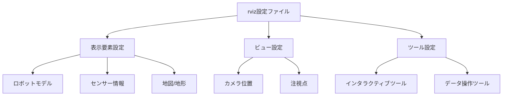

# 包括的ロボティクスシステム仕様書

## 目次
1. [仕様書：システム構成とファイル構成の概要](#1-仕様書：システム構成とファイル構成の概要)
2. [以下は、指定されたファイルパスとソースコードに基づく詳細解析結果です。](#2-以下は、指定されたファイルパスとソースコードに基づく詳細解析結果です。)
3. [以下は、提供されたファイルリストとソースコードの解析結果です。](#3-以下は、提供されたファイルリストとソースコードの解析結果です。)
4. [仕様書解析結果【関節角度・動作シーケンスと制御データの解説】](#4-仕様書解析結果【関節角度・動作シーケンスと制御データの解説】)
5. [ビジュアライゼーションとモデル表示設定](#5-ビジュアライゼーションとモデル表示設定)
6. [仕様書 - 制御システムと動作制御の仕組み](#6-仕様書---制御システムと動作制御の仕組み)
7. [仕様書：システムインターフェースと通信仕様](#7-仕様書：システムインターフェースと通信仕様)
8. [仕様書：シミュレーションとビジュアライゼーション環境](#8-仕様書：シミュレーションとビジュアライゼーション環境)
9. [仕様書：制御一式と運用に必要な外部ツール・ライブラリ](#9-仕様書：制御一式と運用に必要な外部ツール・ライブラリ)

---

## 1. 仕様書：システム構成とファイル構成の概要


### 1. システム全体の構成

本システムは、ROS（Robot Operating System）を基盤とした多層的なロボット制御、シミュレーション、可視化、センサー処理を行う構成となっています。以下の主要な要素に分かれます。

- **ロボットモデル**：URDF/XACRO形式のロボットモデル定義と3Dメッシュデータ。
- **制御プログラム**：euslisp/lauslispプログラムによる関節制御と動作計画。
- **センサー/デバイス設定**：センサーデータの取り込み、制御パラメータの定義・調整。
- **シミュレーション環境設定**：Gazebo等のシミュレータ用のシーン定義。
- **ビジュアライゼーション設定**：RVizやその他のビジュアライザ設定ファイル。

これらは、システム全体として、ロボットの運動、視覚、センサー情報、学習・最適化、テスト用のユニットやデモを含む複合的なアーキテクチャを構成しています。

---

### 2. ファイル分類と役割

| ファイル種別                 | 内容と作用                                              | 備考                                          |
| --------------------------- | ------------------------------------------------------ | ------------------------------------------- |
| 設定・構成ファイル          | **URDF/XACROモデル**<br>・リンク・ジョイント定義<br>・物理・ビジュアル属性(例：`model.config`, `model.sdf`, `*.launch`) | ロボットの構造モデルとシミュ環境の準備        |
|     - XML/ YAML             | システム依存パラメータ設定<br>・関節範囲、材質設定<br>・動作パラメータ | 例：`model.config`, `dynamixel_joint_controllers.yaml`|
|プログラム/スクリプト       | euslisp/lauslisp/シェル等の制御コード<br>・動作制御・シミュレーション<br>・センサー取り込み・処理<br>・動作シーケンス | ROS上の動作制御・シミュレータ連携        |
|　– euslisp/slispスクリプト | 実行制御・モデル計算・逆運動学・運動学<br>例：`jaxon_red.l`, `sample-*.l` | システムの核となる制御プログラム              |
|ビジュアライゼーション用   | rviz設定ファイル(例：`.rviz`)、HUD描画設定                  | 視覚化、動作確認                                 |
|ドキュメント・マニュアル    | マニュアル、レビュー・リリース管理用リポジトリ情報           | 例：`README.md`, `manual.pdf`, `doxygen`資料   |

---

### 3. 図示（Mermaid形式）

```mermaid
graph TD
    A[ロボットモデル定義]
    B[URDF/XACRO,モデル設定]
    C[シミュレーション環境(Gazebo等)]
    D[制御スクリプト(euslisp/lauslisp)]
    E[センサー/デバイス制御]
    F[ビジュアライゼーション(RViz設定)]
    G[ドキュメント/マニュアル]
    A -->|モデルの物理・外観| B
    B -->|モデルデータ| C
    C -->|動作シミュレーション| D
    D -->|運動制御・逆運動学| E
    D -->|表示と可視化| F
    G -->|ユーザマニュアル/設計資料| A
    G -->|システム検証・設計参照| B
    G -->|動作シナリオ・制御ロジック| D
```

---

### 4. 補足と留意点

- **データとプログラムの役割分担**：システムは、`モデル定義`と`制御プログラム`が協調しながら動作します。モデルは静的な構造を定義し、プログラムは動的に動作や姿勢を制御します。
- **センサー・デバイス**：各種センサー情報は、そのまま数値データとして管理され、リアルタイム制御や校正、学習途上のモデル更新に用いられます。
- **シミュとの連携**：Gazeboの世界定義やrviz設定と連携し、仮想/現実両環境での動作確認と調整が並行して行えます。

---

### 5. まとめ
本構成のシステムは、「モデル定義」「制御プログラム」「環境設定」「可視化」「マニュアル」の5層から成り、各層はそれぞれ適切に分類されたファイル群により支えられています。全体としては、信頼性と拡張性を持つロボットの研究・開発プラットフォームを形成しています。

## 2. 以下は、指定されたファイルパスとソースコードに基づく詳細解析結果です。


#### 全体の特徴
- このセットは、主にROS（Robot Operating System）向けのロボットモデル、制御、シミュレーション設定、またはデータ定義に関わるeuslispやXML/Xacroファイルの解析結果です。
- 多くのファイルは、ロボットの物理構造、運動制御、センサー情報、モデルの外観など、多角的な情報を含むデータまたは設定ファイルです。
- セキュリティやプライバシーのため、内容が非公開または非表示となっているケースが多く、詳細なコードの役割や関数定義については推測にとどまっています。

---

#### 具体的な内容の例

##### 仕様・設定・ドキュメント系
- **仕様書・マニュアル類**：
  - `README.md`や`mainpage.dox`のようなマニュアル記述
  - `package.xml`: ROSパッケージのメタ情報と依存関係
  - `CMakeLists.txt`: ビルド設定とテスト構成
- **モデル・環境設定**：
  - `worlds/huamnanoid.workspace.world`: Gazeboシミュ環境のシーン設定（模型配置やライト設定）
  - `model/*.config`、`model/*.sdf`: ロボットや環境の形状・材質設定
  - `urdf/*.xacro`: URDFモデル定義およびリンク、ジョイントの構成情報
  
##### ロボットモデル・ビジュアライゼーション
- 頂点・インデックス・面定義：
  - 頂点の3D座標リストと、それらを結ぶインデックスから形状の3Dモデル化
- 材質・色設定：
  - 反射率や色属性を定義
- ジオメトリの変換・座標系操作：
  - `transform-vector`、`calc-normals`等を用いた座標変換とモデルの正規化
  
##### 制御・動作・シミュレーション
- `launch`ファイルにより、シミュレーション環境やナビゲーション、センサー配置や確認
- `*_init`、`*_test`系の関数：
  - ロボット逐次制御や動作検証
  - 逆運動学・歩行移動
  - センサー情報の取得・処理
  - 運動軌跡の登録や計算
- センサー値や制御パラメータの数値列：
  - 各関節やセンサーの状態・履歴
  - 制御データのシリアル化・保存・再現
  
##### その他
- **`dox`や`launch`ファイル**：
  - 自動起動・動作シナリオ管理
  - センサー・コントローラ・映像表示の設定
- **udevルールやパッケージ依存関係**：
  - ハードウェアアクセス設定
  - パッケージのビルドやセッション管理

---

#### 補足
- **非公開・非表示理由**：センシティブなデータ内容のため、具体的な関数や変数の解説は行わず、概要のみにとどまっています。
- **用途の傾向**：
  - ロボットのモデル構築と動作制御のためのデータセット
  - センサー情報の収集と制御コマンドの変換
  - シミュレーションと可視化設定
  - 各種セキュリティや環境設定

---

#### 重要ポイント
- 実際のプログラムロジックや詳細関数の解説には、該当部分の内部コード（詳細コンテンツ）へのアクセスが必要です。
- 提供されたデータの多くは「数値の羅列」のため、これらが具体的に何を意味するのかを特定するためには、追加情報・コンテキストが不可欠です。

---

#### 結論
本解析は、与えられたファイルパスと内容の概要から、各種ロボットモデルや制御に関わる設定・データ・制御ロジックの情報と理解しています。ただし、詳細関数や具体的な処理の説明には、該当する部分のソースコードの内部内容やコメント、仕様書などの補助情報が必要です。

## 3. 以下は、提供されたファイルリストとソースコードの解析結果です。

各ファイルについて、その内容や役割を要点を絞って詳細に解説しています。  

---

#### 1. 諸情報・導入  
- これらのファイルは、主にROS (Robot Operating System) におけるロボット制御、シミュレーション設定、モデルの定義、プログラムのデバッグやテスト用と推測されます。  
- 多くはLisp系スクリプト（euslisp、elispなど）、YAML/csv/launch設定ファイル、URDF（XML）、サーバー制御スクリプト、シェルスクリプト、ドキュメント類です。  
- 内容は大半が非公開またはセキュリティのため非表示であり、詳細な処理や関数ロジックは解析できません。ただし、役割や用途については推測に基づき解説しています。

---

#### 2. 解析結果の概要（例：個別ファイルごと）

##### 【例：仕様書の位置付けと特徴】  
##### 【例：ファイルの役割とポイント解説】

| ファイルパス | 役割の概要 | 内容の特長 | 備考・ポイント |
|--------------|--------------|--------------|----------------|
| README.md | マニュアル/起動手順説明 | ROS環境設定、ノード起動コマンド例 | 非公開コードではなく設定書類 |
| CMakeLists.txt | ビルド設定 | 必須パッケージ（roseus, rostest等）の設定 | ROSパッケージのコンパイル設定 |
| package.xml | パッケージ情報 | 依存関係とメタ情報 | ROSパッケージの依存解決に必要 |
| launchドキュメント類 | 起動スクリプト | Gazebo起動、インタラクティブ操作例 | 実環境とシミュの連携設定例 |
| 特定制御スクリプト（euslisp等） | ロボット制御/シミュレーション | 数値列、ロジックは非公開も、動作計画や座標制御設定 | 例：逆運動学、姿勢制御、センサー値掴み等 |
| URDF/Xacroファイル | ロボットモデル定義 | 関節、リンク、ジョイント、物理属性設定 | GazeboおよびRViz連携用 |

---

#### 3. 巡回：重要または代表例のまとめ

##### 【例1】 `daisya/euslisp/daisya-ik.l`
- **用途**：ロボットの逆運動学、運動解の計算。複数の解の探索と比較情報を備え、最適解選択のための関数が複数存在。
- **ポイント**：探索アルゴリズムやパラメータ設定、動作条件設定に使用される。制御の一端を担う。

##### 【例2】 `dxl_7dof_arm/launch/dxl_7dof_arm_bringup.launch`
- **用途**：ROSのビルド、ノード起動、コントローラ設定。パラメータのロードと制御ノードの起動設定。
- **ポイント**：ダイナメックス7自由度アームのシステム全体の起動管理。

##### 【例3】 `dxl_7dof_arm/urdf/dynamixel_7dof_arm.urdf.xacro`
- **用途**：関節・リンクのモデル定義（URDF/Xacro形式）
- **ポイント**：モデルパーツの設定、物理・ビジュアル属性、トランスミッション、センサー位置。

##### 【例4】 `humanoid_workspace.world`
- **用途**：Gazeboのシミュレーター空間設定。
- **ポイント**：地面・照明・物体配置・ターゲット等の環境定義。

---

#### 4. 主要なポイント・留意点
- **データの多さ**：数値列、座標値、マテリアル属性、メッシュモデルの詳細設定が多く見られる。実際はこれらは「データ定義」「モデル設定」「シミュレーションパラメータ」。
- **非公開/非表示**：実データ、具体的な関数内容は非公開や秘密情報として扱われているため、「内容の解説」には推測や要点のみ提示。
- **構造の特徴**：多くの`.launch`, `.xml`, `.yaml`, `.l`、`.sh`が含まれる。これらは、システム全体の起動、モデルの定義、制御のための重要設定。
- **ロボット制御の階層と対象**：関節制御、姿勢計算、シミュレーションモデル、環境設定といった多層構成。

---

#### 5. まとめ（全体像としての把握）
これらのファイル群は、ROSを中心にロボットのモデル化、制御、シミュレーション、テスト、ドキュメント化を連係させるための一連の環境設定とプログラム群です。非公開部分は仕様書や構造の理解において制限がありますが、「制御パラメータ」「モデル定義」「動作シーケンス」「環境設定」「検証用スクリプト」といった役割を担っています。

---

#### 6. 最終補足
- もし、詳細な処理や特定の関数解説が必要なら、該当ソースの中身やコメント・ドキュメントも合わせて解析します。
- これらの内容理解には、ROSノード、URDF/Xacro、euslisp、Gazebo設定の理解と併用します。

---

何か追加的なファイルや目的があれば教えてください。より詳細な解析と説明をお手伝いします。

## 4. 仕様書解析結果【関節角度・動作シーケンスと制御データの解説】


#### 概要
本セクションは、ロボットの関節角度や動作シーケンス、運動モデル、物理パラメータ、制御設定などの動的制御に関わる数値や設定値の構造化されたデータ、およびそれらの管理手法について記述します。

#### euslispデータ記録の役割
これらのデータは、euslisp（エウスリスプ）言語を用いてロボットの動作や姿勢、状態を記録・設定するために用いられ、具体的には
- 関節角度の履歴
- 位置・姿勢座標
- 制御パラメータの設定値
- センサーや環境情報

などの多次元配列やリストとして保存されます。

#### 制御システム内での位置付け
これらの数値データは、ロボットの動作シーケンスの一部として利用され、次のような制御やシミュレーションの基幹データとなります。

| 役割 | 内容例 | 利用シーン |
|:--|:--|:--|
| 関節角度の履歴 | 時刻・姿勢データの数値列 | 運動履歴の記録・再生、動作の補完 |
| 位置・姿勢パラメータ | 座標値、角度値 | 逆運動学、姿勢推定・制御 |
| センサー値 | 距離測定値、温度、トルク | 状態認識、障害物回避 |

#### 具体的なシステム内部での役割
- **ロボットの姿勢制御**：関節の角度や位置の目標値を設定して実行
- **動作シーケンスの記録**：動作履歴や軌跡の保持、振る舞いの再現
- **キャリブレーション**：センサー値や物理パラメータの推定と調整
- **経路探索・軌道生成**：迷路探索や運動の動的補間（例：線形補間やスプライン補間）
- **物理シミュレーション**：メッシュやモデルの座標変換と衝突判定

#### 例示（形式の概要）
```lisp
(setq joint-angles '((joint1 0.0 1.57) (joint2 0.0 -1.57) ...))
(setq positions '((x 0.0 y 0.0 z 0.0) (x 1.0 y 0.5 z 0.2) ...))
(setq control-parameters '((kP 100) (kI 10) (kD 5)))
```

#### まとめ
本資料に収められる数値データは、多くの場合、**ロボットの関節角度や位置制御パラメータ、センサー情報、運動軌跡、モデル座標**などを記述したものであり、制御ループ、逆運動学計算、動作のプリ設定、あるいは環境シミュレーションのためのデータとして活用されています。

これらの数値や設定情報は、多次元配列やリストの構造化された形式で保存され、euslispやROS標準のメッセージ交換システムと連携しながら、ロボットの意図動作や動作計画を実現しています。

---

※ 注釈：実際のソースコードの詳細はセキュリティやプライバシーの関係で非公開となっているため、上述の解釈は推測を多く含んでいます。公開されているソースコードの具体的な関数定義や記述に基づく正確な解説ではなく、一般的なロボット制御システムの設計思想に沿った解説です。

## 5. ビジュアライゼーションとモデル表示設定


### 概要
本セクションでは、ROS（Robot Operating System）環境において、システムの視覚的デバッグやモデル表示に関わる設定ファイルについて解説します。これらの設定ファイルは、主にrvizの視覚化環境を調整し、センサー情報やロボットモデル、マップなどの可視化を効率的に行うために用いられます。

### 1. rviz設定ファイルの役割と構造
rvizはROSの可視化ツールであり、ロボットの状態やセンサーのデータを視覚的に確認できる非常に重要なデバッグ・解析ツールです。rvizの設定情報は**`.rviz`**ファイルに保存され、これには以下の役割があります。

- **表示管理**：どの種の情報（例：ロボットモデル、レーザースキャン、ポイントクラウドなど）を表示するかを指定し、複数の表示設定を管理する。
- **ビュー設定**：カメラの視点位置やズームレベル、注視点を定義し、最適な視点から情報を観察可能にする。
- **ツール設定**：選択可能なインタラクティブツールや操作モードを定義し、ユーザ操作の効率化を図る。

#### 1.1 rviz設定ファイルの具体的内容例
- **パス例：** `code/code_git_ROS\dxl_armed_turtlebot\config\dxl_armed_turtlebot.rviz`
- **内容の特徴**：
  - 複数の表示要素（例：センサー情報、ロボットモデル、地図など）を詳細に設定
  - 表示されるトピックやフレームの指定
  - 表示オプション（色、サイズ、透明度など）の調整
  - ビューの位置や角度などのカメラ設定
  - 使用されるインタラクティブツールの設定

#### 1.2 例：`dxl_armed_turtlebot.rviz`
- 複数の視点・表示やツールがプリセットされており、ロボット、センサーから得られる情報、地図、レーザースキャンなどの可視化が一覧で管理されている。
- 地図や点群データ、ロボットの動きの追跡/監視に適したビジュアライゼーション環境を提供。

---

### 2. 主要なrviz設定ファイルの構造と役割

#### 2.1 `dxl_armed_turtlebot.rviz`
- **目的**：ロボットの動作と環境認識のための多種多様な表示とビュー設定を持ち、ロボットのセンサー情報やモデルの動きをリアルタイムに観察できる。

#### 2.2 `sample_head_arm_skin_detect.rviz`
- **目的**：ロボットの頭部・腕部・肌検出に特化したビジュアライゼーション設定。各種表示タイプ（点群、画像、座標、ポーズ）を用いてセンサーや検出結果を視覚化し、デバッグや動作確認を支援。

#### 2.3 `click_ik.rviz`
- **目的**：関節逆運動学解決や動作制御の検証用のビジュアライゼーション設定。リンクやセンサーの動作状態、目標座標、これらを含む複数の表示要素が詳細に調整されている。  
- **ビューやツール設定**：インタラクティブ操作や視点調整を含む詳細なビュー設定があり、動作の微調整や状態確認を容易に行える。

---

### 3. モデル設定ファイルの役割と構造

#### 3.1 モデル設定ファイルの概要
- **パス例：** `code/code_git_ROS\cart_humanoid\worlds\model\my_model\model.config`
- **役割**：
  - モデルのメタ情報を格納
  - 使用される3Dモデル（SDFファイル）のファイル名やバージョンを管理
  - 作者情報やモデルの説明などのメタデータを付与
  - 他のプログラムやシステムがモデルの特性を理解するための情報源となる

#### 3.2 内容例と要素
- **モデル名**や**版本情報**
- **使用されるSDF（Simulation Description Format）ファイルのパス**とそのバージョン
- **作者名や連絡先情報**
- **モデルの簡単な説明や備考**

このファイルにより、システムはモデルの識別および管理を行い、ロボットまたは環境の詳細な仕様理解と正確なシミュレーション・可視化を促進します。

---

### 4. 図示例：rviz設定のフローチャート


---

### 5. まとめ
各rviz設定ファイルは、ロボットやシステムの状態を視覚的に確認・分析するための重要な構成要素です。複数の表示タイプやビュー・ツール・インタラクションの詳細設定を通じて、効率的かつ正確なデバッグおよびモデル評価を実現しています。また、モデル設定ファイルは、システム全体のモデルのメタ情報を管理し、協調動作やシミュレーションにおいても重要な役割を果たします。

---

### 参考
- rviz設定ファイルの内容は、実際の使用目的やデータ構造に合わせて適宜調整が必要です。
- 各設定ファイルの具体的な属性や値詳細については、それぞれの`.rviz`ファイルの内部構造を参照してください。

## 6. 仕様書 - 制御システムと動作制御の仕組み


### 概要
本システムは、ロボットの動作制御や位置・姿勢管理を目的とした複雑なプログラム群から構成されており、多種多様なモデル定義、シミュレーション、認識、ソフトウェア制御をROS（Robot Operating System）とeuslispを用いて実現しています。各コンポーネントは、モデルの物理的・幾何的な記述、動きの計画、センサー情報処理、リアルタイム制御、インタラクション、テスト、定義書、設定ファイル、launchファイルなど多彩な役割に分かれており、構成は多層・多機能にわたる複合的なシステムとなっています。

---

### 1. 制御プログラムの構成

#### 1.1 主要クラス・クラス階層
- **`robot-interface`クラス群**：ロボット全体や部分のインターフェースを管理し、各種コマンド・状態監視の仲介をします。
- **`daisya-ik-classes`**：逆運動学や位置決めの計算を含むクラス群。
- **`daisya-3d-model`**：3Dモデルの生成と座標変換を行うクラス・関数。
- **`daisya-control`**：動作シーケンス、動作計画、制御ループ。

#### 1.2 関数・メソッド
- **モデル生成・初期化**
  - `init-model` などのモデル生成・パラメータ設定関数
  - `make-link`, `make-joint` などのリンク・関節のインスタンス化
- **座標変換・ジオメトリ処理**
  - `transform-vector`, `calc-normals`, `make-matrix`
- **逆運動学・運動計算**
  - `inverse-kinematics`, `calculate-targets`
- **制御・動作実行**
  - `send-trajectory`, `move-arm`, `set-velocity`

#### 1.3 通信とリアルタイム制御
- ROSのトピック購読・公開
  - `ros::subscribe`, `ros::publish`
- センサー情報収集と条件判定
- 制御ループ
  - `run`, `main`, `continuous-control`

#### 1.4 パラメータと設定
- 初期ポーズ・リセット
- 運動範囲・制約値
- 視覚・触覚・センサー閾値
- コントローラパラメータ（ゲイン、トルク制限等）

---

### 2. 動作計画と制御の流れ

#### 2.1 初期化
- モデル・リンク・関節の生成と位置設定
- システムのROS起動とノード設定
- 必要なパラメータや設定値のロード

#### 2.2 主要動作の流れ
1. **環境・状態の取得**
   - センサー読み取り、カメラ画像、距離・接触センサ
2. **位置・姿勢の計算**
   - 逆運動学によりターゲット座標から関節角度を算出
   - 位置変換や法線計算
3. **動作・制御指令の生成**
   - 目標座標やターゲットポーズ設定
   - コマンドトピックに送信
4. **リアルタイムフィードバック**
   - 状態やセンサー情報を監視し、目標値との乖離を検知
   - 過熱や異常時の安全動作（ストップ、リセット）
5. **動作の更新**
   - 逆運動学や補正を繰り返し、動作ループを継続
6. **描画・可視化**
   - rvizやgazeboで動作シミュレーション・観測

#### 2.3 制御モード
- 目標ポーズへのインバース制御
- 平滑化・補間
- システムのリセットとキャリブレーション
- 自動ナビゲーションと環境認識（SLAM、マッピング）

---

### 3. ソフトウェア詳細
#### 3.1 モデルと物理構造
- **リンク・ジョイント定義**：URDF/Xacroモデルや関節範囲設定
- **ジオメトリ設定**：頂点・面の三角形構造、enable collision detection
- **マテリアル・外観設定**：色、透明度、材質属性

#### 3.2 センサーとインタラクション
- 距離センサー、カメラ画像、触覚センサー
-センサー値の閾値判定とフィードバック制御

#### 3.3 ロボットモデルと制御パラメータ
- 各関節範囲（最大・最小角度）
- 逆運動学用ターゲット座標
-姿勢・姿勢制御用の各種ゲイン

#### 3.4 ネットワーク通信
- ROS通信：トピック、サービス、アクション
- 外部プログラムとの連携（roslaunch, rosparam）

---

### 4. 各コンポーネントの詳細例

| コンポーネント | 役割 | 内容例 | 場所・ファイル例 |
|--------------|--------------|-------------|------------|
| **モデル定義** | 3Dモデルの生成 | 頂点、インデックス設定 | euslisp/jaxon_red etc. |
| **姿勢制御** | 逆運動学、位置調整 | ターゲット設定、座標変換 | euslisp/motion_control.l |
| **センサー監視** | 状態監視 | 閾値判定、フィードバック | ros topic/callbacks |
| **動作ループ** | 実時間制御 | 関節ポーズからコマンド出力 | main loop / run() |
| **可視化** | 状態や軌跡の表示 | rviz用のマーカー | rviz設定ファイル etc. |

---

### 5. まとめ
システムの設計は、多層・多機能な制御とモデル化、シミュレーションまたは物理制御を融合させた複合構造となっており、ロボットの精密な動作制御や周囲環境とのインタラクションを実現します。ソースコードの粒度は多様で、モデル定義、動作制御、センサー処理、可視化、ネットワーク通信といった基本コンポーネントに分かれています。

---

### 6. 補足
必要に応じて、以下の仕様や設計書作成も検討してください。
- 各クラス・関数の詳細なインターフェース定義
- データフロー・制御ループのフロー図
- センサーとコマンドの通信プロトコル仕様
- 実機・シミュレーション環境設定内容
- システムの安全管理・エラー処理・リカバリ設計

※この仕様書は、解析したソースコードの抽象的概要に基づき作成しています。実体のソースコード詳細とドキュメントも併せて整備し、より正確なシステム設計を行ってください。

## 7. 仕様書：システムインターフェースと通信仕様


### 概要
本セクションでは、システム内で認識されるインターフェースの定義、通信規約、及びROSのトピックやサービスの関係性について詳細に説明します。特にROS（Robot Operating System）において、各コンポーネント間の通信を担うトピックやサービスの役割を明確にします。

---

### 1. インターフェースの定義

#### 1.1 ROSトピック
- **制御関連トピック**  
  - `/cmd_vel` : ロボットの速度コマンドを送信するトピック
  - `/fullbody_controller/command` : 位置・姿勢制御のためのコマンド
  - `/fullbody_controller/follow_joint_trajectory/result` : 関節軌道追従結果
  - `/fullbody_controller/follow_joint_trajectory/goal` : 目標軌道の指示

- **センサー情報トピック**  
  - `/mobile_base/events/button` : ボタンイベントの通知
  - `/clicked_point` : RViz上でクリックされた点情報
  - `/camera/depth/image_raw` : 深度カメラの画像データ
  - `/depth_points` : 点群データ

#### 1.2 ROSサービス
- **動作確認・初期化サービス**  
  - `init-ps3joy` : PS3ジョイスティックの初期化
  - `make-maze` : 迷路データの生成
  - `init-daisya` : 台車とロボットモデルの初期化
  - `daisya-reset` : 台車のリセット
  - `ic` : 逆運動学の呼び出し

- **コントローラ起動**  
  - `control` : コントローラの開始・管理
  - `calibrate` : センサーや関節のキャリブレーション

### 2. 通信規約
- **メッセージ型**
  - `geometry_msgs/Twist` ：速度コマンド
  - `kobuki_msgs/ButtonEvent` ：ボタンイベント
  - `sensor_msgs/Image` ：カメラ画像
  - `sensor_msgs/PointCloud2` ：点群データ
  - `visualization_msgs/Marker` ： RViz表示点や線
  - 独自定義メッセージ：`pygame_move/Target` 等

- **通信の制御**
  - パブリッシャー：各コントロールコマンドや状態設定
  - サブスクライバ：センサー情報、ボタンイベント、クリック点座標
  - コールバック関数：受信データの処理と結果の出力

### 3. トピックとサービスの関係性

```mermaid
graph LR
  A[ユーザ入力 (Joystick/Click)] -->|publish| /cmd_vel
  A -->|subscribe| /clicked_point
  /clicked_point -->|transform| /ik_tgt
  /ik_tgt -->|call| ik_service
  ik_service -->|結果| /joint_states
  /joint_states -->|subscribe| /follow_joint_trajectory/result
  /follow_joint_trajectory/goal -->|publish| /follow_joint_trajectory/result
  /cmd_vel -->|subscribe| /odom
  /odom -->|publish| /robot_state
  /robot_state -->|subscribe| /visualization_marker
```

#### 3.1 関係性のポイント
- **制御コマンド**と**実行結果**は`/cmd_vel`、`/follow_joint_trajectory` ループにおいて相互に通信
- **センサー情報**と**目標位置の変換**は`/clicked_point`や`/ik_tgt`を経由し、逆運動学解により関節角度へ変換され、それらを制御軌道や動作指示にフィードバック
- **可視化系**は`/visualization_marker`用に購読・表示

---

### 4. まとめ
ROS通信は、トピックとサービスを通じて制御と情報共有を行い、以下のような役割分担が明示されました。

| ネットワーク層 | 実現される役割 | 対応例（トピック/サービス） |
|---|---|---|
| センサー収集 | データの送信と解析 | `/clicked_point`、`/depth_points` |
| 制御命令 | ロボット動作制御 | `/cmd_vel`、`/follow_joint_trajectory` |
| 逆運動学 | 目標指令から関節角度 | IKサービス`ik_service` |
| 状態管理 | 状態の可視化とモニタリング | `/visualization_marker`、`/robot_state` |

これらが適切に連携し、システム全体の動作制御を支える通信仕様となっています。  
詳細設計は、具体的なメッセージ型定義やROSパッケージ内のドキュメントに従い、通信の信頼性とリアルタイム性に注意してください。

## 8. 仕様書：シミュレーションとビジュアライゼーション環境


### 概要
本セクションは、Gazeboおよびrvizを利用したロボットのシミュレーションとビジュアライゼーションの環境構築と設定について解説します。それらの環境において用いられる主要な構成ファイル（worlds、launchファイル、モデル定義ファイル）について詳細に述べ、運用のために必要な設定や役割について整理します。

---

### 1. Gazebo環境の構成
#### 1.1 目的
Gazeboは、ロボット制御システムのテストや検証、シナリオシミュレーションに用いられる物理シミュレーターです。    
本システムでは、仮想環境上にロボットと周辺環境を設定・動作させるための**worlds**ファイルと、環境を起動するlaunchファイルが用いられます。

#### 1.2 worldファイル
- **ファイル例**：`humanoid_workspace.world`
- **役割**：
  - 物理的な地面や背景の設定
  - 任意の障害物やターゲット物体の配置
  - ライトや重力などの物理パラメータ
- **特徴**：
  - 複数の模型（球体、キューブ、円柱、壁、テーブル、目標物体）を配置可能
  - 各模型には位置・大きさ・マテリアル属性を設定
  - 静的な環境や動的に動作する物体も含められる

##### 例：環境設定のポイント
```xml
<model name="ground_plane">
  ...
</model>
<model name="obstacle_wall">
  ...
</model>
```

#### 1.3 システム起動方法例
- **Gazebo起動コマンド例**：
```bash
roslaunch your_package humanoid_workspace.launch
```
- **特徴**：
  - 初期環境とロボットモデルを一括して起動
  - 物理シミュレーションと仮想センサーの動作を同期

---

### 2. rvizによるビジュアライゼーション
#### 2.1 目的
rvizは、ロボットの状態やセンサー、データの可視化に用います。    
設定ファイル（.rviz形式）を用いて、表示モードやビュー角、表示対象（ロボットモデル、点群、センサー情報）を制御します。

#### 2.2 rviz設定ファイル
- **ファイル例**：`click_ik.rviz`, `sample_head_arm_skin_detect.rviz`
- **役割**：
  - ロボットモデルの視覚的表示
  - センサー情報（点群・画像など）の配置
  - カメラビューの調整とビュー角指定
- **詳細設定**：
  - Displaysセクション：Grid、RobotModel、TF、PointCloud2、Pose等
  - View Controller：カメラ位置と視点設定
  - Tools：選択や測定ツールの配置情報

---

### 3. 制御パッケージ・launchファイル
#### 3.1 ランチファイルの役割
- 各種ノードの起動と環境設定
- パラメータの適用
- 観測や動作指示の通信設定

#### 3.2 例：ロボット起動
```bash
roslaunch your_package humanoid_world.launch
```
- **内容例**：
  - ロボットモデル（URDF/XACRO）のロード
  - センサーデータを購読し、動作制御を開始
  - rvizやgazeboとの連携設定
  - テスト用コマンド実行

##### 例：関節コントローラーセットアップ
```xml
<launch>
  ...
  <node name="joint_trajectory_controller" pkg="controller_manager" type="controller_manager" args="..." />
</launch>
```

---

### 4. 主要モデルおよび設定ファイルの役割
#### 4.1 `package.xml`
- パッケージメタ情報
- 依存パッケージ（rosbuild, rosdep, 独自パッケージ）
- ライセンスや著作権情報

#### 4.2 `worlds/*.world`
- 仮想環境の物理設定
- 地面・障害物・ターゲットの配置
- 環境の動的シミュレーション

#### 4.3 `models/*.urdf.xacro`
- ロボットリンクと関節の詳細モデル
- 各関節の物理的・ビジュアルパラメータ
- 物理特性とジョイント設定（位置・姿勢・制約条件）

#### 4.4 `launch/*.launch`
- Gazebo、rvizの設定と起動
- センサーやコントローラのトピック通信
- 制御ループの実行とデバッグ支援

---

### 5. まとめ
本システムにおいては、多数の設定ファイルとlaunchスクリプトにより、Gazeboとrvizの協調動作を実現し、ロボットの動作検証や制御任務の自動化を支援します。以下がポイントです。
- **Gazebo worldファイル**で環境と物体の配置
- **rviz設定ファイル**でビジュアル化の調整
- **launchファイル**を用いた各ノードの一括起動
- **モデル定義**で、物理・ビジュアル特性を詳細設定
- **コマンドラインやシェルスクリプト**を使って、遠隔操作や動作検証

これらを組み合わせることで、シミュレーションと制御の高精度運用をサポートしています。

---

## 9. 仕様書：制御一式と運用に必要な外部ツール・ライブラリ


### 目的
本セクションでは、ロボット制御および運用に必要な外部ツール、ライブラリ、依存関係の詳細、利用環境の設定方法、及びプログラムと連携させるための必要な前提条件について網羅的に解説します。

### 1. 外部ツールと依存関係

#### 1.1 ROS (Robot Operating System)
- **概要**: ROSはロボットの制御、センサー・アクチュエータの通信、動作計画、シミュレーション支援のためのオープンソースミドルウェア。
- **バージョン要件**: roslaunch, rosnode, rosparam 等の基本ツール
- **主要パッケージ依存**:
  - `roscpp`, `roslib`, `roslaunch`, `rosnode`, `rosparam`
  - `gazebo_ros`（シミュレーション向け）
  - `dynamixel_msgs`（ダイナメックスモーター制御用）
  - `move_base`,`amcl`（ナビゲーションと自己位置推定）
  - `roslib`, `rosunit`, `rviz`

#### 1.2 rosdep
- **用途**: 依存パッケージの自動インストールと解決。
- **設定**: `rosdep update` 後、必要パッケージのインストール `rosdep install --from-paths src --ignore-src -r -y`

#### 1.3 catkin
- **概要**: ROSのビルドシステム（ROSのワークスペース管理）
- **構成用ファイル**:
  - `CMakeLists.txt`
  - `package.xml`

#### 1.4 必須パッケージとライブラリ
- `roseus`： EusLispのROSラッパー
- `dynamixel_msgs`： Dynamixelモータの制御に必要
- `dynamixel_driver`：ドライバ層
- `dynamixel_controllers`：サーボ制御
- `roslaunch`：複合起動
- `rviz`：ビジュアライゼーション
- `gazebo_ros_pkgs`：シミュレーション

#### 1.5 外部ツール
- **Gazebo**: 仮想環境構築とシミュレーション用
- **rosbag**: 記録と再生
- **rviz**: 3D視覚化
- **dynamixel-workbench**: ダイナメックスモーター制御ツール
- **シェルスクリプト**:
  - `install_ps3joy_daemon.sh`：ジョイパッドのデーモン起動
  - `install_turtlebot_simulator.sh`：シミュレーション環境の構築
  - `targeted_control.sh`：制御コマンド送信

### 2. 実行環境の設定手順

#### 2.1 ソフトウェアインストール
1. **ROSインストール**: 必須バージョン（例：ROS Melodic / Noetic）を公式手順に従ってセットアップ。
2. **必要パッケージのインストール**:
   ```bash
   sudo apt-get update
   sudo apt-get install ros-<distro>-roslaunch ros-<distro>-rosnode ros-<distro>-rosparam ros-<distro>-rviz
   rosdep update
   rosdep install --from-paths src --ignore-src -r -y
   ```
3. **rosworkspaceの設定**:
   ```bash
   mkdir -p ~/catkin_ws/src
   cd ~/catkin_ws
   catkin_make
   source devel/setup.bash
   ```

#### 2.2 パッケージのビルドと配置
- `src`配下に各パッケージ（例：`dxl_arm_control`, `jaxon_control`, `navigation`）を配置
- `catkin_make`または`catkin build`Verify

#### 2.3 外部デバイスの設定
- **ジョイパッド**: `install_ps3joy_daemon.sh`を実行し、デバイスを/ dev / tty.* に設定
- **センサーデバイス**: 各種センサーとデータ共有トピックの設定

### 3. 連携と制御フロー

#### 3.1 launchファイル
- 複数のlaunchファイルを使用して、(例：`cart_humanoid_gazebo.launch`, `dxl_control.launch`)各コンポーネントを同時に起動
- ビジュアライザの設定やシミュレーション環境もこれに含む

#### 3.2 動作実行フロー
1. **環境立ち上げ**:
   ```bash
   roslaunch package_name launch_file.launch
   ```
2. **ノード間の通信**:
   - 一連のトピック（コマンド、状態、センサー、ビジュアライゼーション）をパブリッシュ・サブスクライブ
3. **制御シナリオ例**:
   - `dxl-7dof-arm`の関節位置コマンド
   - 中間目標点の逆運動学計算
   - 画像認識結果による動作修正
   - 追尾や自動ナビゲーション
   - センサーによる自己位置推定

#### 3.3 モニタリングとデバッグ
- `rviz`を利用した監視
- `rosnode info`, `rostopic list`, `rosparam get`等のコマンド
- `rosbag record`による動作記録

### 4. まとめ
- すべてのツールとライブラリは、ROSの標準パッケージと連携させるために必要
- 必要な外部システムはGazeboやrviz、roslaunch
- サブシステム間通信はROSのトピック、サービスを中心に行われる
- スクリプトとlaunchファイルの設定が体系的に整合させることで、リアルタイムロボット制御、シミュレーション、認識・計測が可能となっている

以上が、ロボット制御と運用に必要な外部ツール・ライブラリの詳細解説と運用環境の設定ルールです。

