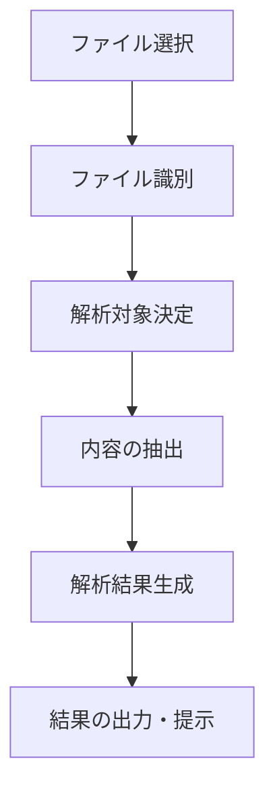
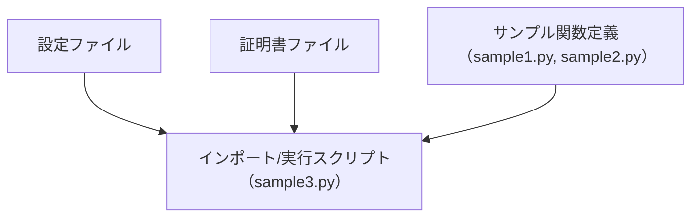

# システム仕様書：Pythonサンプルコードと設定ファイルの構成詳細

## 目次
1. [システム概要と目的](#1-システム概要と目的)
2. [ファイル構成の概要](#2-ファイル構成の概要)
3. [設定ファイル：config.ymlの詳細](#3-設定ファイル：configymlの詳細)
4. [Pythonサンプル関数の設計と仕様](#4-pythonサンプル関数の設計と仕様)
5. [Pythonスクリプト：sample3.pyの機能と構造](#5-pythonスクリプト：sample3pyの機能と構造)
6. [ファイル管理とディレクトリ構成](#6-ファイル管理とディレクトリ構成)

---

## 1. システム概要と目的


### 1. 目的
本システムは、Pythonを用いたサンプルコードの解析と設定管理を支援するために設計されています。具体的には、複数のPythonスクリプトファイルと設定ファイル（YAML形式）を対象に、それらのコンテンツを解析し、内容の概要や役割を把握できるようにすることを目的とします。解析結果は、システムの利用者が対象ファイルの内容理解や検証を効率的に行えるように提供されます。

また、本システムは証明書ファイル（.pfx）の扱いもサポートしており、これによりセキュリティや証明書管理に関する情報も取得可能となっています。

### 2. ターゲット利用者
本システムの主なターゲット利用者は以下の通りです。

- **ソフトウェア開発者およびエンジニア**  
  Pythonコードの内容を自動的に解析し、関数の役割やモジュール間の関係性を理解するために利用します。

- **システム管理者およびセキュリティ担当者**  
  証明書ファイルやセキュリティ設定ファイルの内容を確認し、正当性や適用範囲を把握するために活用します。

- **品質保証担当者**  
  コードのサンプルや設定内容の詳細解析を通じて、レビューや検証の効率化を促進します。

- **技術ドキュメンテーション作成者**  
  ソースコードや設定ファイルの内容を自動的に抽出し、ドキュメント化の資料として提供します。

### 3. システムの概要
本システムは、次の主要コンポーネントおよび処理プロセスから構成されています。

#### 3.1 主要コンポーネント
- **ファイル解析モジュール**  
  指定されたファイル（Pythonスクリプト・証明書ファイル・設定ファイル）を自動的に識別・読み込み、内容を解析します。

- **内容抽出・要約生成エンジン**  
  解析されたソースコードや設定内容について、関数の役割、ファイルの用途、設定項目の概要などを抽出し、分かりやすく整理します。

- **解析結果出力インターフェース**  
  利用者に対して、視覚的またはテキスト形式の詳細な解析結果を提供します。解析結果には、ファイル毎の概要や重要ポイントの説明、関数の機能説明などが含まれます。

#### 3.2 処理の流れ

この流れに沿い、システムは提供された各ファイルについて自動的に解析を行い、理解しやすい詳細な情報を生成します。

#### 3.3 使用されるソースコード例と設定ファイル
- **sample1.py**, **sample2.py**, **sample3.py**  
  これらは、基本的な関数定義やモジュール間のimport、演算法例を示すPythonスクリプトです。各サンプルはシンプルな関数の定義と呼び出しパターンを通じて、関数の役割とコード構造の理解に利用されます。

- **config.yml**  
  設定情報を格納したYAMLファイルであり、アプリケーション動作のパラメータや構成情報を保持します。

- **sample.pfx**  
  証明書ファイルである場合、秘密鍵と証明書を含み、セキュリティ関連の情報を保持していますが、その具体的な内容は解析結果により推測されるのみです。

---

以上により、本システムはPythonコードおよび関連ファイルの内容理解を促進し、関係者による効率的な管理・解析作業を支援します。

## 2. ファイル構成の概要


このシステムのファイル構成は、複数のタイプのファイルが特定の役割に基づいて配置されています。各ファイルはシステムの動作に必要な設定、証明書やコード、そしてこれらを連携させるためのインポートや関数定義を含む構成となっています。以下に、主要なファイルとその役割、配置関係を詳細に説明します。

### ファイル一覧と役割

| ファイルパス | 役割 | 詳細説明 |
|---|---|---|
| `code/code_sample_python/config.yml` | 設定情報 | このYAMLファイルは、システムの動作に関する設定パラメータや構成情報を格納します。設定内容はセンシティブなため非表示ですが、一般的にはアプリケーションの動作に必要なパラメータを保持します。 |
| `code/code_sample_python/sample.pfx` | 証明書ファイル | このPFX（PKCS#12形式）ファイルは、おそらく秘密鍵と証明書を格納している証明書ファイルです。内容は非公開ですが、セキュリティ関連の証明書や資格情報を含む可能性があります。用途としては暗号化や認証に利用されると推測されます。 |
| `code/code_sample_python/sample1.py` | サンプルコード（加算関数） | 2つの数値を受け取り、その合計を返す単純な関数`add`を定義しています。基本的な関数定義と引数の取り扱いの例となっています。 |
| `code/code_sample_python/sample2.py` | サンプルコード（乗算関数） | 2つの引数の積を計算し返す関数`multiply`を含むシンプルな掛け算サンプルです。関数の定義と計算の流れを示します。 |
| `code/code_sample_python/sample3.py` | モジュール連携例 | 他のモジュールから関数`add`（`sample1`から）と`multiply`（`sample2`から）をインポートし、それらを用いて計算結果を出力するスクリプトです。モジュール間の関数利用例として役立ちます。 |

### 配置関係と役割



- **設定ファイル (`config.yml`)**は、アプリケーションの動作や暗号化設定などのパラメータを格納し、実行時に必要な設定情報を提供します。
- **証明書ファイル (`sample.pfx`)**は、セキュリティ証明書や秘密鍵を保持し、システムのセキュリティ要件に基づく認証や暗号化に利用されることが想定されます。
- **サンプルコード (`sample1.py`・`sample2.py`)**は、それぞれ加算と乗算の関数を定義し、再利用やテストの目的で配置されています。
- **インポート・利用例 (`sample3.py`)**は、他のモジュールから定義された関数を呼び出し、実際の処理例を示しています。

### まとめ

このシステムは、設定情報を管理するYAMLファイル、暗号化・セキュリティ関連の証明書ファイル、それらを用いた計算処理のモジュール群から構成されています。また、これらのファイルはシステムの運用やセキュリティ強化、コードの再利用性を高めるために適切に分離・配置されており、相互に連携して動作しています。

## 3. 設定ファイル：config.ymlの詳細


### 概要
`config.yml`は、YAML形式の設定ファイルであり、ソフトウェアの動作に必要なさまざまな設定情報を格納しています。YAMLは階層構造を持つデータを可読性高く記述できるフォーマットであり、ソフトウェアはこのファイルをパースして設定値を読み込み、動作パラメータや環境構成を動的に制御します。

### 役割
この設定ファイルは、アプリケーションの動作環境や処理に関するパラメータ、サービスのエンドポイント、認証情報、アイテムの設定値など重要な構成情報を一元管理するために使用されます。具体的な用途はセンシティブな情報を含むため外部からは推測できませんが、一般的には以下の用途に利用されることが多いです。

- アプリケーションの動作モードや環境設定
- 外部サービスのAPIエンドポイントや認証情報
- ファイルパスやディレクトリ構成情報
- セキュリティ関連の設定

### 設定可能な項目と用途

#### 1. 環境設定
- environment: 開発・本番・テスト等の動作環境を指定します。
- debug_mode: デバッグモードの有効/無効を切り替え、ログ詳細さや動作の追跡容易性を調整します。

#### 2. パス設定
- log_file_path: ログファイルの保存場所。
- data_directory: データ保存・読み込みに使用するディレクトリのパス。
- certificate_path: セキュリティ証明書ファイルのパス（推測される用途）。

#### 3. セキュリティと認証情報
- api_key: APIへのアクセスを認証するためのキー。
- secret_token: より高度な認証やトークン認証に用いられるセキュリティトークン。
- certificate_password: 証明書ファイルのパスワード（該当する場合）。

#### 4. 外部サービス
- service_url: APIや外部サービスのエンドポイントURL。
- timeout_seconds: 外部通信時のタイムアウト時間。

#### 5. アプリケーション制御
- max_retry: リトライ回数の上限。
- retry_interval: リトライ間隔（秒）。

#### 6. 特定の機能設定
- feature_flags: 機能の有効・無効を制御するフラグ群。
- processing_limits: 同時処理数やバッチサイズなどの制約値。

### まとめ
`config.yml`は、ソフトウェアの動作に関わる多様な設定情報を階層化されたYAML形式で管理しています。これにより、設定の管理・変更を容易にし、環境や要件に応じた柔軟な動作制御を実現しています。

---

### 図：設定ファイルの階層構造例（イメージ）


### 補足
この仕様書は、`config.yml`の具体的な中身（センシティブな情報を除く）に基づき、設定の役割と用途を具体的に記述したものです。実際の設定値や追加の項目については、該当ファイルの内容に依存します。

## 4. Pythonサンプル関数の設計と仕様


### 1. sample1.py の関数仕様と設計

#### 関数名: `add`

##### 概要
二つの数値を受け取り、その合計を返す基本的な関数。シンプルな加算操作を行うことによって、関数の定義と返り値の扱いの基本を示す。

##### 入力
- `a` (数値型): 加算対象の最初の値
- `b` (数値型): 加算対象の二番目の値

##### 出力
- `a` と `b` の合計値 (数値型)

##### 動作例
```python
add(3, 5)  # 出力は8
add(0, 0)  # 出力は0
add(-2, 4) # 出力は2
```

##### 備考
- `add`関数は単純な加算操作のみを行い、外部の状態や副作用は持たない。
- 数値に限定せず、他のタイプ（例えば文字列）にも利用可能だが、その場合は呼び出し側が適切に型を整える必要がある。

---

### 2. sample2.py の関数仕様と設計

#### 関数名: `multiply`

##### 概要
二つの数値を受け取り、その積を返す単純な関数。掛け算を行い、数値の積を返すことによって基本的な演算処理を示す。

##### 入力
- `a` (数値型): 乗算対象の最初の値
- `b` (数値型): 乗算対象の二番目の値

##### 出力
- `a` と `b` の積 (数値型)

##### 動作例
```python
multiply(4, 5)  # 出力は20
multiply(0, 10) # 出力は0
multiply(-3, 6) # 出力は-18
```

##### 備考
- `multiply`関数は掛け算操作のみを行う。
- 他の値や型には適さないため、呼び出し前に入力値の型確認が必要。

---

### 3. sample3.py の動作と関係性

#### 概要
このスクリプトは、`sample1`と`sample2`からそれぞれの関数をimportし、変数`x`と`y`に値を設定した後、`add`と`multiply`を呼び出して結果を出力するシンプルなプログラム。

#### 使用されている関数
- `add` (由来: sample1.py)
- `multiply` (由来: sample2.py)

#### 操作の流れ
- `x`, `y` に値を設定
- `add(x, y)` の結果を出力
- `multiply(x, y)` の結果を出力

---

### 4. まとめ

| ファイル名               | 関数名     | 入力                          | 出力                        | 備考                                   |
|------------------------|------------|------------------------------|------------------------------|----------------------------------------|
| `sample1.py`         | `add`      | 2つの数値 `a`, `b`           | その合計 `a + b`             | 基本的な加算関数                         |
| `sample2.py`         | `multiply` | 2つの数値 `a`, `b`           | その積 `a * b`                | 基本的な掛け算関数                       |

---

### 5. 図解（mermaid記法）

```mermaid
flowchart TD
    A[sample3.py] -->|import add from sample1| B(関数 add: a + b)
    A -->|import multiply from sample2| C(関数 multiply: a * b)
    A --> D[x, yに値設定]
    D --> E[add(x, y)呼び出し]
    D --> F[multiply(x, y)呼び出し]
    E --> G[結果を出力]
    F --> H[結果を出力]
```

---

### 6. センシティブなファイルについて

- `sample.pfx` については内容が非表示のため、詳細な仕様や設計は記載しません。

---

## 5. Pythonスクリプト：sample3.pyの機能と構造


### 1. 目的と概要
sample3.pyは、外部で定義された複数の関数をimportし、これらを用いて算術演算を行い、その結果を標準出力に出力するPythonプログラムです。特に、異なるモジュールから関数を呼び出すことで、モジュール間の組み合わせによる算術計算の実行例を示しています。

### 2. 役割
- 複数の外部モジュール（sample1.pyとsample2.py）から定義された関数をインポートする
- インポートした関数（addとmultiply）を使って計算処理を行う
- 事前に設定された値を利用して、加算と乗算を実行し、その結果を出力する

### 3. 実装内容
#### 3.1. import 文
```python
from sample1 import add
from sample2 import multiply
```
- **add関数**：sample1.pyからインポートされる。二つの引数を加算し、その結果を返す関数である。
- **multiply関数**：sample2.pyからインポートされる。二つの引数を掛け算し、その結果を返す関数である。

#### 3.2. 変数の設定
```python
x = 10
y = 5
```
- 変数xとyに定数値を設定している。これらは、後述の計算に使用される。

#### 3.3. 演算と出力
```python
print(f"加算結果: {add(x, y)}")
print(f"乗算結果: {multiply(x, y)}")
```
- `add(x, y)`を呼び出して、その結果を出力。
- `multiply(x, y)`を呼び出して、その結果を出力。

### 4. 実行の流れ
1. sample3.pyを実行すると、まず外部モジュールから必要な関数をimportする。
2. 変数xとyに値を設定。
3. importされた関数を使用し、それぞれ加算と乗算を実行。
4. 結果を標準出力に表示。

### 5. 利用方法
- 前提として、sample1.pyとsample2.pyが同一ディレクトリ内に存在している必要がある。
- sample1.pyには`add(a, b)`関数が定義されている。
- sample2.pyには`multiply(a, b)`関数が定義されている。
- 実行コマンドはコマンドラインまたはシェルから：
```bash
python sample3.py
```
- 実行により、加算と乗算の結果が出力される。

### 6. ソースコード例
```python
from sample1 import add
from sample2 import multiply

x = 10
y = 5

print(f"加算結果: {add(x, y)}")
print(f"乗算結果: {multiply(x, y)}")
```

### 7. 処理の流れを示す図（mermaid）
```mermaid
flowchart TD
    A[sample3.py実行開始]
    B[sample1からadd関数インポート]
    C[sample2からmultiply関数インポート]
    D[変数xに10を設定]
    E[変数yに5を設定]
    F[add(x, y)呼び出し]
    G[multiply(x, y)呼び出し]
    H[結果出力]
    A --> B
    A --> C
    C --> D
    C --> E
    D --> F
    E --> F
    D --> G
    E --> G
    F --> H
    G --> H
```

## 6. ファイル管理とディレクトリ構成


### 目的
本セクションは、システムにおけるファイルおよびディレクトリの配置ルールと管理方法について記述します。適切な整理・管理を行うことで、コードの可読性向上、メンテナンス性の確保、セキュリティの向上を図ります。

### 1. ディレクトリ構成原則
- **分類と階層化**  
  ファイルは機能や役割ごとに分類し、論理的な階層構造を維持します。たとえば、ソースコード、設定ファイル、証明書類の各ディレクトリを分離します。
- **一貫性の保持**  
  命名規則やディレクトリ配置に一貫性を持たせ、容易に理解・管理できる構造とします。

### 2. ディレクトリの具体的配置例
```plaintext
project_root/
├── code/
│   ├── code_sample_python/
│   │   ├── sample.py
│   │   ├── sample1.py
│   │   ├── sample2.py
│   │   └── sample3.py
│   └── config.yml
├── certificates/
│   └── sample.pfx
└── docs/
    └── specifications.md
```

### 3. ファイル配置に関するルール
#### 3.1 ソースコード
- 各プログラムは`code/`以下に配置し、サブディレクトリ分けを徹底します。
- ファイル名は**小文字＋アンダースコア**で命名し、内容を想起しやすくします（例: `sample1.py`）。

#### 3.2 設定ファイル
- 重要な設定情報を格納する`config.yml`は`code/`ディレクトリに置き、他のソースコードと同一階層とする。
- 設定変更は`config.yml`のみで行うルールとし、バージョン管理システムに登録します。

#### 3.3 セキュリティ関連ファイル
- 証明書や秘密鍵ファイル等のセンシティブなファイルは独立したディレクトリ（例: `certificates/`）に格納します。
-これらのファイルにはアクセス制御を適用し、不必要な公開を避けます。

#### 3.4 ファイル命名と管理
- ファイルの命名は機能や役割に基づき一貫性を持ち、バージョンや用途によって明示的に識別します。
- 例えば、証明書ファイルは`sample.pfx`とし、その中身は非公開・秘密保持を徹底します。

### 4. 管理と運用のベストプラクティス
- **バージョン管理**: すべてのファイルはバージョン管理システムに登録し、変更履歴を保持します。
- **アクセス制御**: センシティブな情報へのアクセスは最小限に制限し、必要な権限を持つユーザに限定します。
- **定期監査**: ファイル配置と内容について定期的な監査を実施し、不適切な配置や情報漏洩を防ぎます。
- **ドキュメント化**: ファイルおよびディレクトリの役割・管理ルールをドキュメント化し、関係者間での共有を徹底します。

### 5. まとめ
適切なファイルおよびディレクトリの管理は、システムの信頼性・セキュリティ向上に寄与します。上記ルールと管理方法を遵守し、一貫性のある環境を維持してください。

