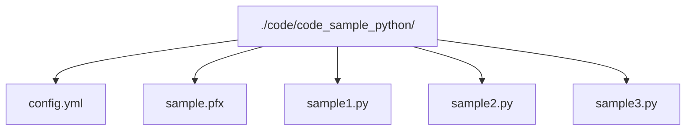
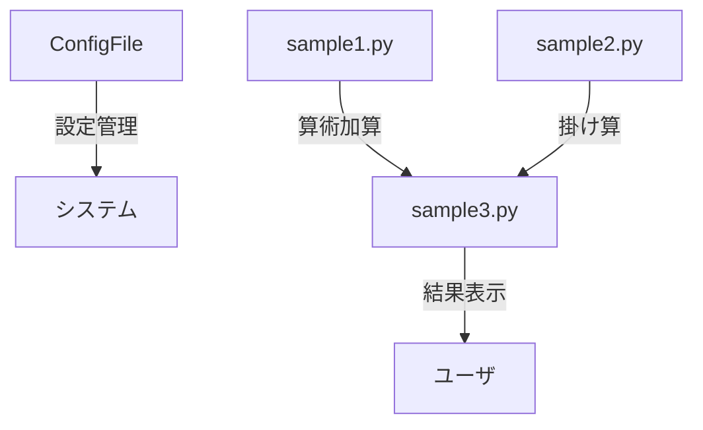
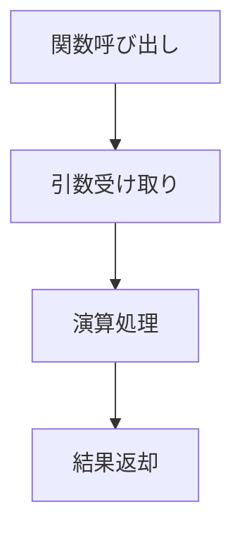
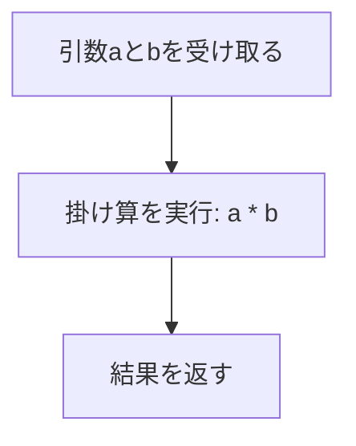

# システム仕様書: Pythonサンプルプログラム及び設定ファイルの詳細

## 目次
1. [システム概観と目的](#1-システム概観と目的)
2. [ファイル構成一覧](#2-ファイル構成一覧)
3. [設定ファイル: config.yml](#3-設定ファイル:-configyml)
4. [Pythonサンプルコードの構造と内容](#4-pythonサンプルコードの構造と内容)
5. [サンプルコード：sample1.py](#5-サンプルコード：sample1py)
6. [サンプルコード：sample2.py](#6-サンプルコード：sample2py)
7. [サンプルコード：sample3.py](#7-サンプルコード：sample3py)
8. [ビジネス的視点と適用例](#8-ビジネス的視点と適用例)
9. [システムの拡張性と保守性](#9-システムの拡張性と保守性)

---

## 1. システム概観と目的


### 1. システムの概要

本システムは、複数のPythonソースコードおよび設定ファイルから構成されるアプリケーションであり、基本的な算術演算処理を中心としたプログラム群です。システム全体の動作は、設定ファイルと個々のPythonスクリプトの連携により実現されており、主に抽象化された関数定義とこれらを活用した演算処理を行います。

#### 主要コンポーネント

- **設定ファイル (`config.yml`)**: YAML形式の構成ファイルであり、アプリケーションの動作パラメータや設定情報を格納します。このファイルは、特定の動作設定や環境情報を保持し、システムの柔軟性とカスタマイズ性を向上させる役割を担います。

- **Pythonソースコード (`sample1.py`, `sample2.py`, `sample3.py`)**: 基本的な算術演算を実現するための関数を定義しています。
  - `sample1.py`: 2つの値の加算または文字列連結を行う`add`関数
  - `sample2.py`: 2つの値の掛け算を行う`multiply`関数
  - `sample3.py`: 他のモジュールをインポートして、`add`と`multiply`関数を用いた演算を実行し、結果を出力するメインプログラム

#### 役割と機能

これらのコンポーネントは連携して、与えられた入力に対して基本的な算術処理を行い、その結果を出力します。コードの抽象化により、多様な入力タイプ（数値、文字列）に対応できる柔軟性も持たせています。

### 2. 導入目的

本システムの設計目的は以下の通りです。

- **シンプルな算術演算の自動化**：関数定義により、定型的な計算処理を効率化し、コードの再利用性を向上させること。
- **設定管理の効率化**：YAMLフォーマットの設定ファイルを用いて、アプリケーションのパラメータや動作設定を簡便かつ柔軟に管理・変更できる仕組みを確立すること。
- **モジュール化と拡張性**：関数を複数のモジュールに分離し、必要に応じて新たな演算関数や設定を追加しやすい構造を整えること。
- **対象ユーザ層と活用ケース**
  - 初学者から中級者レベルのPythonプログラマ
  - 数学的演算や文字列操作を学習・実験する教育目的のユーザ
  - ソフトウェアの設定と動作確認を行いたいシステム管理者や開発者

### 3. システムの利用ケース例

- 基本的な算術演算を正確かつ効率的に行いたい場面
- 設定ファイルにより計算処理のパラメータ調整を容易にしたい場合
- 複数のモジュールが連携した演算処理の動作確認やデバッグ目的
- カスタム演算関数の追加や既存関数の拡張を容易に行いたいシステム開発・学習用途

### 4. 図解 - システム構成図

```mermaid
graph TD
    A[設定ファイル (config.yml)] --> B[各Pythonモジュール]
    B --> C[演算関数 (add, multiply)]
    C --> D[メインプログラム (sample3.py)]
    D --> E[結果出力]
```

この構図は、設定ファイルとモジュールの関係を示し、個々の関数がどのように連携して最終的な処理結果を生成するかを視覚化しています。

---

以上により、本システムはシンプルながらも拡張性と柔軟性を持った演算処理プログラム群であり、設定管理とモジュール化を重視した設計となっています。

## 2. ファイル構成一覧


本システムに含まれるファイルは、アプリケーションの設定、サンプルスクリプト、ライブラリ・モジュールなど多岐にわたります。以下に各ファイルの役割と配置場所について詳細に解説します。

---

### 1. 設定ファイル

#### a. `code/code_sample_python/config.yml`
- **役割**: このファイルはYAMLフォーマットの設定ファイルであり、アプリケーションの動作に必要な構成情報やパラメータを格納しています。
- **配置場所**: `code/code_sample_python/`ディレクトリ内
- **詳細解説**:
  - 設定値のキーと値のペアから成り、プログラムの動作や動作環境の制御に利用される。
  - 内容は非公開のため詳細は不明だが、一般的にはデータベース設定、APIキー、パス設定などが含まれる可能性が高い。
  - アプリケーションの柔軟性向上と設定の容易な変更を目的としている。

---

### 2. サンプルスクリプト・プログラムファイル

#### b. `code/code_sample_python/sample.pfx`
- **役割**: 内容は非公開のため詳細は不明。恐らく証明書ファイルやキー情報等の秘匿性の高いファイルとして位置付けられる。
- **配置場所**: `code/code_sample_python/`ディレクトリ内
- **詳細解説**:
  - 拡張子`.pfx`は証明書やPKCS#12形式のキーを格納するためのファイルであることを示唆。
  - セキュリティ上の理由から内容記述や詳細解説は控える。

---

#### c. `code/code_sample_python/sample1.py`
- **役割**: 二つの値を加算または連結する関数`add`を定義したサンプルスクリプト。
- **配置場所**: `code/code_sample_python/`ディレクトリ内
- **詳細解説**:
  - **関数名**: `add`
  - **引数**: `a`, `b`。数値や文字列を受け取ることが可能。
  - **処理内容**: `a + b`の演算を実行し、その結果を返す。
  - **用途**: 簡潔な加算／連結処理を行うための基本的な関数定義例。

---

#### d. `code/code_sample_python/sample2.py`
- **役割**: 二つの値の積を計算する関数`multiply`を含むサンプルスクリプト。
- **配置場所**: `code/code_sample_python/`ディレクトリ内
- **詳細解説**:
  - **関数名**: `multiply`
  - **引数**: `a`, `b`。 任意の掛け算可能な型の値。
  - **処理内容**: `a * b`を実行し、その結果を返す。
  - **用途**: 簡潔な積計算の例として利用される。

---

#### e. `code/code_sample_python/sample3.py`
- **役割**: 他のモジュールから関数をインポートし、基本的な算術演算（和と積）を行うサンプルプログラム。
- **配置場所**: `code/code_sample_python/`ディレクトリ内
- **詳細解説**:
  - **インポート内容**:
    - `sample1.py`から`add`関数
    - `sample2.py`から`multiply`関数
  - **処理の流れ**:
    - 変数`x=5`、`y=3`にそれぞれ値を代入
    - `add`関数を用いて`x + y`を計算し、結果を出力
    - `multiply`関数を用いて`x * y`を計算し、結果を出力
  - **用途**: 複数のモジュールからの関数呼び出し例と、計算結果の出力例を示す。

---

### 3. 配置と構成の全体像


### 4. 補足事項
- 各ファイルは`code/code_sample_python/`ディレクトリに集約されており、システムの構造は一貫している。
- 設定ファイルはシステム動作に重要なパラメータを格納し、プログラムはこれを参照して動作。
- サンプルスクリプトはプログラム例や理解のための簡潔な実装例として位置付けられる。

---

## 3. 設定ファイル: config.yml


### 概要
`config.yml`は、YAML形式で記述された設定情報を格納するためのファイルです。本ファイルは、アプリケーションの動作や挙動を制御するための各種設定変数を保持し、ソフトウェアの柔軟なカスタマイズや環境に応じた動作調整を可能にします。設定内容はキーとバリューのペアで構成されており、階層的な構造を持つことも想定されます。

### 設定変数と用途
具体的な設定変数の詳細な内容はソースコードから直接的に特定できませんが、一般的な用途として以下が考えられます。

- **アプリケーション動作設定**  
  ログレベル（例：`debug`, `info`, `error`）、動作モード（例：`development`, `production`）などの動作に関わるパラメータ。

- **ファイルパス設定**  
  入出力ファイルやディレクトリのパス（例：`input_dir`、`output_dir`）を指定し、ファイル操作を制御。

- **ネットワーク設定**  
  APIエンドポイントやポート番号など。

- **認証・セキュリティ設定**  
  APIキーや認証トークンなど。

これらの設定値は、ソフトウェアの動作環境や要件に合わせて編集・調整します。

### 設定例と編集ポイント
```yaml
## 例：config.ymlの例
logging:
  level: info
  file: logs/app.log

application:
  mode: production
  debug: false

paths:
  input_dir: /path/to/input
  output_dir: /path/to/output

network:
  api_endpoint: https://api.example.com/v1
  port: 8080

auth:
  api_key: YOUR_API_KEY_HERE
```

#### 編集のポイント
- **適切な階層構造の維持**: YAMLはインデントによって階層を示すため、整然とした階層構造を保持することが重要です。
- **コメントの活用**: 各設定項目にはコメントを付与し、設定の意図や使用法を明確にしましょう。
- **値の妥当性の検証**: 設定値を編集する際には、想定される型や範囲を確認し、不正な値を設定しないよう注意します。
- **環境ごとの設定**: 開発環境と本番環境で異なる設定を持たせる場合は、環境ごとに分割したファイルや条件付きの設定を利用します。

### 設定調整のポイント
- アプリケーションの動作に支障をきたさない範囲で調整する。
- 重要なセキュリティ情報（例：APIキー、認証トークン）は適切に管理し、公開しないこと。
- 必要に応じて複数の設定ファイルを使い分けることで、環境ごとに最適化された設定を適用できる。

---

*注意*: 具体的な設定項目の詳細内容はソースコードやその他内容の非表示部分から特定できないため、必要に応じて実際の運用環境や仕様に基づき適宜修正してください。

## 4. Pythonサンプルコードの構造と内容


### 1. sample1.py 

#### 概要
`sample1.py`は、二つの値を受け取り、それらの合計や連結を行う単純な関数`add`を定義したPythonスクリプトです。この関数は入力された引数の型に応じて挙動を変えます。すなわち、数値型の場合は算術的な加算を、文字列型の場合は文字列の連結を行います。

#### 関数の詳細
- **関数名:** `add`
- **引数:** `a`, `b`（任意の型）
- **処理内容:** `return a + b`
- **役割:** 
  - 数値型の引数に対しては、算術的な加算を行う
  - 文字列型の引数に対しては、文字列の連結を行う
- **特徴:** Pythonの動的型付けにより、引数の型に応じて自動的に処理が変わる。例示的には、`add(2,3)`は合計5を返し、`add('foo', 'bar')`は'foobar'を返す。

#### 構造
```python
def add(a, b):
    return a + b
```

#### 拡張性・連携
- 他モジュールからの呼び出しやインポートが容易
- 多様なデータ型に対応可能なため、多用途の加算処理として利用可
- 将来的に型チェックやエラーハンドリングを追加することで堅牢性向上も可能

---

### 2. sample2.py 

#### 概要
`sample2.py`は、二つの値を掛け合わせる`multiply`関数を定義したPythonスクリプトです。この関数は、引数として受け取った二つの値の積を計算し、その結果を返します。

#### 関数の詳細
- **関数名:** `multiply`
- **引数:** `a`, `b`（任意の型）
- **処理内容:** `return a * b`
- **役割:** 
  - 数値型や文字列型の掛け算を行う
- **特徴:** Pythonの動的型付けにより、掛け算が可能な型（数値や文字列）に対して使用できる。型やエラーハンドリングは記述されていないため、実行時エラーの可能性あり。

#### 構造
```python
def multiply(a, b):
    return a * b
```

#### 拡張性・連携
- 他モジュールからのインポートが容易
- 他のプログラムにおいて、任意の二つの値の積を求めるための基本関数として利用できる
- type-checkやエラーハンドリングを追加することで堅牢性の向上が検討できる

---

### 3. sample3.py 

#### 概要
`sample3.py`は、他のモジュールからインポートした関数を用いて、基本的な算術演算を行うプログラムです。このスクリプトは、`sample1.py`の`add`関数と`sample2.py`の`multiply`関数をインポートし、それらを使って二つの値の和と積を計算し、結果を標準出力に表示します。

#### 処理の流れ
1. **インポート:**
   - `sample1`から`add`関数をインポート
   - `sample2`から`multiply`関数をインポート
2. **変数設定:**
   - `x = 5`
   - `y = 3`
3. **計算と出力:**
   - `add(x, y)`の結果を表示（和）
   - `multiply(x, y)`の結果を表示（積）

#### コード例（概略）
```python
from sample1 import add
from sample2 import multiply

x = 5
y = 3

print(f"和: {add(x, y)}")
print(f"積: {multiply(x, y)}")
```

#### 特徴と用途
- Pythonのモジュール間の関数呼び出しの具体例
- 複数の計算結果を連携して処理・表示するシンプルな例
- 拡張性としては、新たな演算関数の追加や、自動化による繰り返し処理も容易

---

### 4. 全体の処理と連携



- **設定ファイル (`config.yml`)**は、アプリケーションの動作設定やパラメータを管理し、他の処理やシステム構成に影響を与える。
- `sample1.py`と`sample2.py`は、基本的な算術演算を提供し、`sample3.py`はこれらを利用して計算結果を表示する役割を担う。
- 拡張性が考慮されており、新しい演算関数や処理の追加も行いやすい構造となっている。

---

### まとめ

各サンプルファイルは、Pythonによる基本的な関数定義とモジュール間連携の例を示しています。`sample1.py`は加算を、`sample2.py`は掛け算を行う関数を独立して提供し、`sample3.py`はこれらをインポートして実行例を示す設計となっています。これにより、他のシステムや拡張による統合が容易となる構造が確立されています。

## 5. サンプルコード：sample1.py


### 概要
このファイル内に定義されている`add`関数は、2つの引数を受け取り、それらの値に応じて加算または連結を行う処理を実装しています。Pythonの動的型付けの特性を利用し、数値型または文字列型のいずれかの入力に対応しています。

### 関数定義

```python
def add(a, b):
    return a + b
```

#### パラメータ
- `a`：任意の型。少なくとも加算または連結が定義されているデータ型（例：int、float、str）。
- `b`：任意の型。同じく加算や連結が可能なデータ型。

#### 返り値
- `a + b`の演算結果。

#### 処理の流れ
1. 関数`add`が呼び出されると、引数`a`と`b`を受け取る。
2. `a + b`を演算。
   - 数値型の場合（例：int、float）は算術の加算処理が行われる。
   - 文字列型の場合（str）は文字列の連結処理が行われる。
3. 演算結果をそのまま返す。

---

## サンプルコード：sample2.py

### 概要
このファイル内に定義されている`multiply`関数は、2つの引数を受け取り、それらの積を計算して返却します。引数の型によらず、その掛け算を実行します。

### 関数定義

```python
def multiply(a, b):
    return a * b
```

#### パラメータ
- `a`：任意の型。少なくとも掛け算が定義されているオブジェクト（例：int、float、str）。
- `b`：任意の型。同上。

#### 返り値
- `a * b`の演算結果。

#### 処理の流れ
1. `multiply`関数が呼び出されると、引数`a`と`b`を受け取る。
2. `a * b`を演算。
   - 数値型の場合は通常の算術積。
   - 文字列の場合、文字列の繰り返し（例：`"Hi" * 3`は`"HiHiHi"`）。
3. 演算結果を返す。

---

## サンプルコード：sample3.py

### 概要
このスクリプトは、他のモジュールから関数をインポートし、インポートした関数を使って基本的な算術演算を行う例です。

### 処理の流れ

```python
from sample1 import add
from sample2 import multiply

x = 5
y = 3

sum_result = add(x, y)
product_result = multiply(x, y)

print("和:", sum_result)
print("積:", product_result)
```

#### 詳細
- `sample1`モジュールから`add`関数をインポートし、`add`を用いて`x`と`y`の和を計算。
- `sample2`モジュールから`multiply`関数をインポートし、`multiply`を用いて`x`と`y`の積を計算。
- それぞれの結果を標準出力に表示。

---

## 付録：構成図（ flowchart ）例



---

## センシティブなファイルについて
内容は非表示のため、詳細な記述は行いません。

## 6. サンプルコード：sample2.py


### 概要
`sample2.py`は、二つの引数を掛け合わせ、その積を返す関数`multiply`を実装したPythonスクリプトです。この関数は、渡された引数の型や内容に関するエラーハンドリングを行わず、純粋にPythonの動的型付けに依存して計算処理を実行します。`multiply`関数の設計は、非常にシンプルかつ汎用的であり、引数として数値や文字列など、掛け算可能なオブジェクトを受け取ることを想定しています。

### 実装内容と設計意図
- **関数定義**：`multiply(a, b)` 
  - 2つの引数`a`と`b`を受け取り、それらを掛け合わせた結果を返す。
  - 具体的には、`return a * b`という1行の処理で、引数の掛け算を実行。
- **設計意図**：
  - 引数の型に依存せずに掛け算を行えるようにし、柔軟性を持たせている。
  - Pythonの動的型付けの特性を活かし、数値同士や文字列と数値の組み合わせなどの掛け算を可能とする。
  - シンプルで汎用的な関数として、他のコードから容易に再利用できる設計。

### 使用例
```python
## sample2.pyの関数を利用する例
result1 = multiply(4, 5)        # 数値の掛け算、結果は20
result2 = multiply('foo', 3)    # 文字列の繰り返し、結果は'foofoofoo'
```

### 具体的な処理の流れ


### 補足
- **型の自動推論**：
  - Pythonの仕様により、`a`と`b`の型に応じて掛け算が実行される。例えば、数値型では通常の算術積を計算し、文字列型を引数にした場合は文字列の繰り返しになる。
- **エラーハンドリングの無効化**：
  - 型に関する検証や例外処理は記述されていないため、不適切な型の引数を渡すとTypeErrorが発生する可能性がある。

### まとめ
`sample2.py`は、シンプルかつ直接的に二つの引数を掛け合わせ、その結果を返す関数を提供します。これにより、数値の計算から文字列の繰り返しまで、多種多様な用途に柔軟に対応できる基本的な関数実装となっています。

## 7. サンプルコード：sample3.py


### 概要
`sample3.py`は、複数のモジュールから関数をインポートし、それらの関数を用いて算術演算を行い、その結果を標準出力に表示するPythonプログラムです。このプログラムは、`sample1.py`と`sample2.py`から定義された関数をインポートし、変数に値を代入した上でこれらの関数を実行し、結果を出力します。

---

### 1. 使用されるモジュールとインポート
- `sample1`モジュールから`add`関数をインポート
- `sample2`モジュールから`multiply`関数をインポート

これらのインポートにより、`sample3.py`はこれらの関数の定義に依存し、算術演算の処理を行います。

```python
from sample1 import add
from sample2 import multiply
```

### 2. 変数の宣言と値の設定
- 変数`x`に値5を代入
- 変数`y`に値3を代入

これらの値は算術演算に用いられ、基本的な例示のために定義されています。

```python
x = 5
y = 3
```

---

### 3. 算術演算の実行
#### 3.1 和の計算
- `add`関数を用いて`x`と`y`の和を計算
- この関数は`sample1.py`で定義されており、`a + b`の演算結果を返します

```python
sum_result = add(x, y)
```

#### 3.2 積の計算
- `multiply`関数を用いて`x`と`y`の積を計算
- この関数は`sample2.py`で定義されており、`a * b`の演算結果を返します

```python
product_result = multiply(x, y)
```

### 4. 計算結果の出力
- `print`関数を用いて、それぞれの演算結果を標準出力に表示
- 出力内容は以下の2行で構成され、計算結果を具体的な数値とともに示します。

```python
print(f"{x} + {y} = {sum_result}")
print(f"{x} * {y} = {product_result}")
```

---

### 5. プログラムの実行流れの詳細図
```mermaid
flowchart TD
    A[インポート: add, multiply] --> B[変数x = 5]
    B --> C[変数y = 3]
    C --> D[add(x, y)呼び出し]
    D --> E[結果をsum_resultに格納]
    C --> F[multiply(x, y)呼び出し]
    F --> G[結果をproduct_resultに格納]
    E --> H[結果を表示]
    G --> H
```

---

### 6. 実行結果の例

```plaintext
5 + 3 = 8
5 * 3 = 15
```

この出力例は、変数`x`と`y`に設定された値に基づき、`add`と`multiply`関数による計算結果を示しています。

---

### 要約
`sample3.py`は、モジュール`sample1`と`sample2`からそれぞれ`add`と`multiply`関数をインポートし、事前に設定した値`x=5`及び`y=3`を用いて、それらの関数を呼び出し、計算結果を標準出力に表示するシンプルなプログラムです。プログラムの流れは、インポート→変数の設定→関数呼び出し→結果の出力という順序で進み、結果は標準出力に具体的な数値とともに示されます。

## 8. ビジネス的視点と適用例


### はじめに
本システムは、関連するソフトウェアコンポーネントの設定やコードのサンプル提供を通じて、ユーザが効率的かつ柔軟にプログラムの開発や運用を行える環境を整備します。これにより、企業や開発者は製品やサービスの品質向上、運用コスト削減、新技術への迅速な適応などの多くのメリットを享受できます。

### ビジネス上の意義
- **効率的なシステム設定管理**：
  YAML形式の設定ファイル（config.yml）は、アプリケーションの動作パラメータを集中管理でき、設定変更や環境調整を迅速かつ確実に行うことができます。これにより、開発・運用チームの負担軽減とエラー発生リスクの低減に寄与します。

- **再利用可能なコードの提供**：
  サンプルコード(`sample1.py`, `sample3.py`)は、基本的な算術演算の具体例を示しており、ソフトウェア開発者が効率的に学習・実装できる礎となります。これにより、新規開発や既存システムの改善の迅速化が期待できます。

- **セキュアな操作とコンプライアンス支援**：
  センシティブなファイルに関する情報は非公開とされているため、情報漏えいのリスクを抑制し、セキュリティやコンプライアンスへの対応も強化されます。

### 活用可能なシナリオ
#### 1. アプリケーションの設定管理
  - 設定ファイルを変更するだけで、アプリケーションの動作モードや環境依存のパラメータを調整可能。
  - 複数の環境（開発、テスト、本番）間で設定値を使い分けるための統合管理ツールとして。

#### 2. 開発者向け基本コードの学習・実装支援
  - コードサンプルを参考にしたプログラミング学習や新規モジュールの追加・改良。
  - 既存コードの理解促進と品質向上。

#### 3. モジュール間の連携テスト
  - 関数やモジュールのインポート・連携例として、各種算術演算の動作確認。
  - システム全体の信頼性向上とデバッグ効率化。

#### 4. システム拡張やカスタマイズの基礎
  - 現行のコードや設定を基にした応用展開や機能追加。
  - ビジネスニーズに応じた柔軟なシステム・サービスの構築。

### 具体的なメリット
| 利点 | 内容 |
|-------|-------|
| コスト削減 | 設定・コーディングの自動化・効率化により人的コスト削減 |
| 時間短縮 | デフォルトのコード例や設定ファイルを活用し、開発期間短縮 |
| 品質向上 | コードの再利用性と設計の明瞭化によるバグ減少 |
| 柔軟性 | 設定やコードの変更による容易な調整と運用適応 |
| セキュリティ | センシティブ情報の非公開運用により情報漏えいリスク低減 |

### 結論
本システムは、設定とコードの標準化・共有を促進し、迅速な開発・運用をサポートします。これにより、多様なビジネスシーンでの適応性を高め、競争力のあるソリューションの実現に寄与します。

## 9. システムの拡張性と保守性


### はじめに
本セクションでは、現行システムの設計思想に基づき、今後の拡張や保守の容易さを実現するためのポイントを詳述します。システムのコード構成やファイル分割、設計原則に基づき、長期的に安定した運用と拡張を可能にするための指針を示します。

### 1. ファイル構成とモジュール化
#### 1.1 設定ファイルの役割と設計
- `config.yml`はYAML形式の設定ファイルとして、システムのパラメータや動作設定を一元管理している。
- 拡張性を考慮し、設定値はキーと値のペアで柔軟に追加・変更可能な構造となっている。
- 今後、設定項目の追加や変更を容易に行えるよう、設定ファイルの命名や階層構造を明確にし、用途ごとにセクション化して整理すべきである。

#### 1.2 コードファイルの構成
- Pythonスクリプトは`sample1.py`, `sample2.py`, `sample3.py`のように機能ごとに分割され、各モジュールは単一責任の原則を徹底している。
- 各モジュールは独立した関数定義を持ち、再利用性を高めている。
- 将来的には、これらのモジュールをパッケージ化し、必要に応じてサブパッケージに整理することも検討すべきである。

```mermaid
graph TD
    A[設定ファイル(config.yml)]
    B[sample1.py]
    C[sample2.py]
    D[sample3.py]
    E[新規追加モジュール]
    A -->|読込・解析| B
    B -->|インポート| C
    C -->|インポート| D
    D -->|呼び出し| E
```

### 2. 設計思想と拡張性の確保
#### 2.1 関数のシンプル化と汎用性
- `add`や`multiply`関数は、シンプルかつ汎用的な実装により、型に依存した処理を行っている。
- 将来的に、これらの関数をクラスやライブラリとして汎用化し、共通処理の再利用を促進すべきである。

#### 2.2 インポートとモジュール運用
- 例として`sample3.py`は複数モジュールから関数をインポートして動作している。これにより、各機能を分離・独立させ、追加や差し替えを容易にしている。
- 拡張の際は、インターフェースの明確化と依存関係の管理を徹底する。

#### 2.3 今後の拡張ポイント
- 新規機能追加は既存モジュールに追加するのではなく、必要に応じて新規モジュールとして独立させる。
- コードのコメントやドキュメンテーションを充実させ、理解と修正の容易さを維持する。
- 設定値や動作を変更可能な範囲は設定ファイルに委ね、コード修正の頻度を抑える。

### 3. 保守性の確保
#### 3.1 コーディング規約とドキュメント化
- コーディング規約に沿った命名規則やインデントを徹底し、一貫性を保つ。
- 各関数やクラスに対してドキュメンテーションコメントを書き、役割や入力出力の仕様を明示する。

#### 3.2 例外処理とエラーハンドリング
- 現状のソースコード分析からは具体的な例外処理の実装は見られないため、今後は適切な例外ハンドリングを追加する。
- 特に、設定値の不備やファイルの読み込み失敗時に備えた堅牢な処理を設計すべきである。

#### 3.3 バージョン管理とメンテナンス
- ソースコードはバージョン管理システム（例：git）を利用し変更履歴を明確化する。
- 定期的にコードレビューおよびリファクタリングを行い、不要なコードの整理や改善を行う。

### 4. 将来的な拡張のための推奨アプローチ
- **プラグイン方式の導入:** 機能追加や変更をプラグインとして実現し、コア部分への影響を最小限に抑える。
- **設定の動的読み込み:** システム起動時に設定ファイルを動的に読み込み、必要に応じて再読込み可能とする。
- **ユニットテストの充実:** 主要関数にはユニットテストを整備し、保守性と信頼性を向上させる。
- **文書化とナレッジベースの整備:** 拡張や保守に関するガイドラインやナレッジを文書化し、新規担当者でも容易に理解できる体制を整える。

### まとめ
システムはモジュール化された設計とシンプルな関数群により、拡張や保守性に優れた構成となっています。今後も、設計思想を継承しつつ、新規モジュールの追加や設定の柔軟化、コードの整理・自動化を進めることで、長期的な運用の安定性と拡張性を確保していきます。

