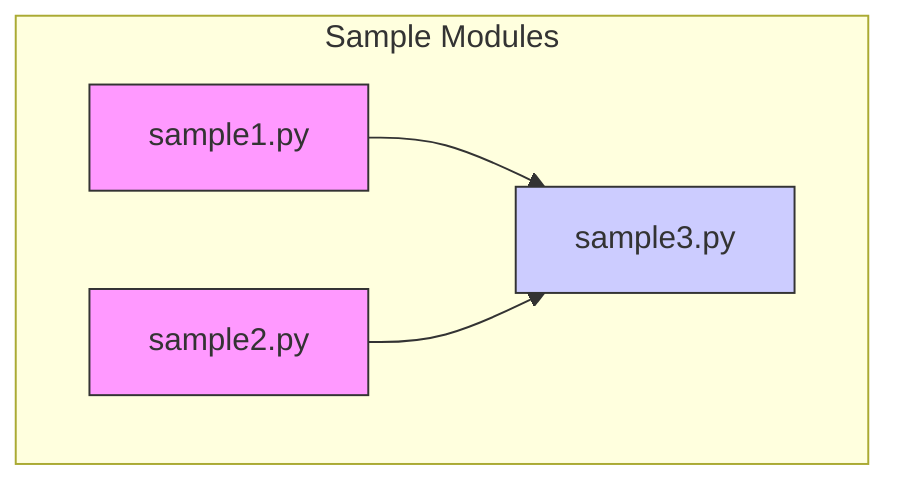
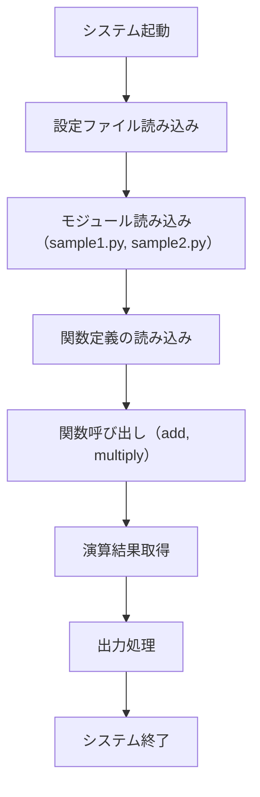
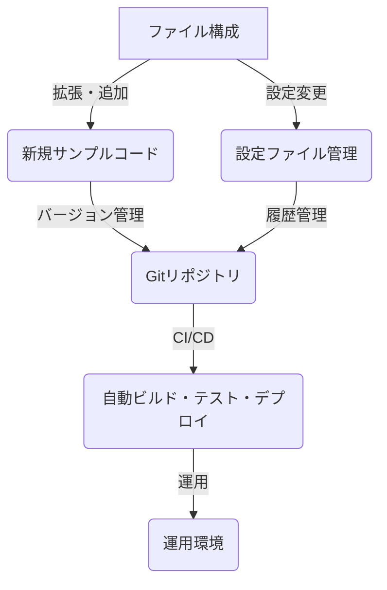

# Pythonサンプルコードシステム仕様書

## 目次
1. [システム概要と目的](#1-システム概要と目的)
2. [システム構成とファイル構成](#2-システム構成とファイル構成)
3. [ファイル詳細説明](#3-ファイル詳細説明)
4. [ファイルの使用例と実行フロー](#4-ファイルの使用例と実行フロー)
5. [今後の拡張とメンテナンス計画](#5-今後の拡張とメンテナンス計画)

---

## 1. システム概要と目的


### 1. システム全体像

本システムは、Pythonを用いたサンプルコード群および設定ファイルを管理・解析し、コードの内容と構造を把握しやすくすることを目的としています。主な構成要素は以下の通りです。

- **設定ファイル**: YAML形式で記述された設定情報を格納し、システムの動作に必要なパラメータや環境設定を提供します。
- **サンプルコード**: Pythonスクリプト（`.py`ファイル）やモジュール、関数定義を含むコード片が含まれ、基本的な数値演算処理やモジュール間のインポート例などが含まれます。
- **分析結果**: ソースコードの内容に関して自動解析を行い、それぞれのファイルの内容詳細と概要を提供します。

```mermaid
graph TD
    A[設定ファイル (YAML)]
    B[Pythonサンプルコード]
    C[解析結果]
    D[ビジネス目的]
    
    A --> |設定情報| システム全体
    B --> |コード例| システム全体
    C --> |詳細分析| システム全体
    D --> |用途と期待| システムの目的
```

### 2. ビジネス目的

本システムの主なビジネス目的は、以下の通りです。

- **コード管理の効率化**: 複数のサンプルコードと設定ファイルを体系的に整理し、理解しやすくすること。
- **コード内容の把握と解析**: ソースコードの内容を自動的に分析し、関数や処理の概要を迅速に抽出・提示することで、レビューや教育、開発支援に寄与する。
- **設定とコードの連携理解**: YAML設定ファイルと対応するコードの仕組みを明確化し、システムのカスタマイズや拡張を容易にする。
- **標準化されたドキュメント化**: 仕様書の作成と管理を促進し、保守・運用に関わる関係者間の情報共有を円滑にする。

### 3. 利用ケースと応用例

- **開発者教育・トレーニング**: 基本的な数値演算のサンプルを通じて、Pythonの関数定義やモジュールインポートの理解促進。
- **システムテストと解析**: 自動解析ツールによるコードの評価とドキュメント生成により、品質向上と迅速な問題特定を支援。
- **設定管理**: YAMLファイルの設定内容を解析し、システムの動作パラメータや環境情報の把握に利用。
- **コード例の再利用と拡張**: サンプルコードを基盤とした新たな機能開発や学習のためのリファレンスとして活用。

---

この仕様書は、システムの全体像とビジネス目的を明確に示し、関係者がシステムの役割と期待される利用方法を理解できるように設計されています。

## 2. システム構成とファイル構成


### 1. はじめに
本ドキュメントは、対象システムの全体構成とその内部に存在するファイルの詳細な役割及び関係性について記述します。特にファイル構成に焦点を当て、それぞれのファイルの役割と位置づけを明示することにより、システムの理解と管理を容易にします。

### 2. システム全体構成
対象システムは、複数のファイルから構成され、以下のような構成要素で成り立っています。

- **設定ファイル**：システムの動作に必要な設定情報を保持し、可変部分や環境依存の情報を管理します。
- **コードファイル**：プログラムの主要処理を担うPythonスクリプトで構成され、インポートや関数定義、処理の流れから構成されます。

これらの要素は、ディレクトリ構成において明確に階層化され、管理しやすく設計されています。

---

### 3. ファイル構成

```plaintext
code/
│
├── code_sample_python/
│   ├── config.yml
│   ├── sample.pfx
│   ├── sample1.py
│   ├── sample2.py
│   └── sample3.py
└── README.md (またはその他ドキュメントファイル)
```

#### 3.1. ディレクトリ構造の概要
- `code/`ディレクトリは、システムの全ソースコードと設定ファイルを格納しています。
- `code_sample_python/`は、Pythonに関連するサンプルコードと設定ファイルを格納するサブディレクトリです。

#### 3.2. ファイル詳細と役割

##### 3.2.1. `config.yml`
- **役割**：システムに必要な設定情報を記述したYAML形式の設定ファイル。
- **内容**：具体的な設定内容はソースに含まれていませんが、動作に必要なパラメータや環境設定が格納されていると推測される。
- **位置**：`code/code_sample_python/`下に存在し、他のスクリプトから読み込まれることを想定。

##### 3.2.2. `sample.pfx`
- **役割**：暗号関連または認証用の静的ファイルと考えられるが、内容は非公開のため不明。
- **内容**：ファイルの内容は非公開であり、種別や用途は推測できない。
- **位置**：`code/code_sample_python/`内に配置。

##### 3.2.3. `sample1.py`
- **役割**：基本的な計算関数を定義するスクリプト。
- **内容**：
  - `add`関数を定義。
  - `a`と`b`の引数を受け取り、その合計を返すシンプルな関数。
- **具体的処理**：`return a + b`
- **位置**：`code/code_sample_python/`内。

##### 3.2.4. `sample2.py`
- **役割**：乗算処理を行う関数を定義したスクリプト。
- **内容**：
  - `multiply`関数を定義。
  - 引数`a`と`b`の積を計算し返す。
- **具体的処理**：`a * b`
- **位置**：`code/code_sample_python/`内。

##### 3.2.5. `sample3.py`
- **役割**：上記の計算関数を利用したサンプル処理スクリプト。
- **内容**：
  - `sample1.py`の`add`関数と`sample2.py`の`multiply`関数をインポート。
  - 変数`x=5`、`y=3`を設定し、それぞれの関数を用いて演算。
  - 結果をコンソール出力。
- **具体的処理**：
  - `add(x, y)` で和を計算。
  - `multiply(x, y)` で積を計算。
- **位置**：`code/code_sample_python/`内。

#### 3.3. ファイル間の関係性
以下の図に示すように、それぞれのPythonスクリプトは互いにインポートや呼び出しを行い、総合的な動作を実現しています。



- `sample3.py`は、`sample1.py`の`add`関数と`sample2.py`の`multiply`関数をインポートし、利用しています。

---

### 4. まとめ
本システムは、設定ファイルと複数のPythonコードファイルから構成され、シンプルな関数定義とその利用例を示す構成となっています。各ファイルは明確な役割を持ち、適切に階層化されているため、メンテナンスや拡張性に優れる設計となっています。

## 3. ファイル詳細説明


### 概要
本セクションでは、プロジェクト内で使用される各ファイルの内容と役割について詳述します。これにより、各ファイルがどのような目的で作成されているのか、およびその基本的な機能について理解することができます。

---

### 設定ファイル: `config.yml`

#### 役割
- このファイルはYAML形式で記述された設定情報を保持しており、プログラムの動作に必要な情報を外部から供給します。
- アプリケーションの動作モード、パラメータ、認証情報、その他設定値等を格納するために使用されると推測される。

#### 内容
- 現在、内容はセンシティブなファイルとして非公開となっているため、具体的な設定項目や値については不明。
- ただし、一般的な用途としては、アプリケーションで使用される項目（例：APIキー、パス、タイムアウト設定、環境設定など）が記述されていることが想定される。

---

### センシティブファイル: `sample.pfx`

#### 役割
- `.pfx`拡張子は通常、PKCS#12形式の証明書ファイルを表し、SSL/TLS証明書や秘密鍵の格納に使用される。
- セキュアな通信や認証を目的として利用されると考えられる。

#### 内容
- センシティブなため内容は非公開。
- 重要な認証情報や秘密鍵を含むため、アクセス制御が厳格に管理されている。

---

### サンプルスクリプト: `sample1.py`

#### 役割
- 2つの引数を受け取り、和を計算して返す関数`add`を定義する。

#### 内容
```python
def add(a, b):
    return a + b
```
- シンプルな関数定義であり、`a`と`b`の値を加算し、その結果を返す。
- この関数は他のスクリプトからインポートして利用されることを想定している。

---

### サンプルスクリプト: `sample2.py`

#### 役割
- 具体的な内容は示されていないが、`sample3.py`にて`multiply`関数が使用されていることから、2つの数値の積を計算する関数を定義していると推測される。

#### 内容
- センシティブな内容や詳細は提供されていないため、概要のみ記述。

---

### サンプルスクリプト: `sample3.py`

#### 役割
- `sample1.py`から`add`関数をインポートし、`sample2.py`から`multiply`関数をインポートしている。
- 変数`x`に5、`y`に3を設定し、それぞれの関数を利用して演算結果を出力する。

#### 内容
```python
from sample1 import add
from sample2 import multiply

x = 5
y = 3

print("加算結果:", add(x, y))
print("乗算結果:", multiply(x, y))
```

#### 機能
- `add`関数を用いて`x`と`y`の和を計算し、その結果を出力。
- `multiply`関数を用いて`x`と`y`の積を計算し、その結果を出力。
- シンプルな演算処理を行うための例として設計されている。

---

### まとめ
各ファイルは、設定値の管理と基本的な演算処理を目的に構成されている。設定ファイルは外部パラメータを供給し、サンプルコードはモジュール化された関数の定義とその利用例を示すものである。センシティブなファイルについては内容非公開とし、セキュリティを確保している。

## 4. ファイルの使用例と実行フロー


このセクションでは、提供されるファイル群がシステム内でどのように連携し、具体的に実行されるのかを詳細に説明します。コマンドラインからの実行手順、関数呼び出し例、ならびにシステムとしての動作フローについて解説します。

---

### 1. システム構成とファイルの役割

システムは複数のソースコードと設定ファイルから構成されており、それぞれの役割は以下のとおりです。

- **設定ファイル (`config.yml`)**  
  YAML形式の設定ファイルであり、プログラムの動作に必要な各種設定情報を格納しています。具体的な内容は非公開ですが、通常は動作環境やパラメータ指定に用いられる推測です。

- **サンプルスクリプト (`sample1.py`, `sample2.py`, `sample3.py`)**  
  それぞれが異なる演算処理の例を示すPythonスクリプトです。

- **プライベートファイル (`sample.pfx`)**  
  センシティブな内容のため内容は非公開ですが、設定や証明書等の可能性も想定されます。

---

### 2. 実行の流れと手順

#### 2.1 初期設定と準備

システムを動作させるには、必要なPython環境と依存ライブラリがインストール済みである必要があります。

- **Python 3.x**のインストール
- 必要なライブラリのインストール（必要に応じて`requirements.txt`等があれば、その内容に従います）

#### 2.2 コマンドラインからの実行例

最も基本的なシナリオは`sample3.py`を実行することです。

```bash
python sample3.py
```

このコマンドにより、`sample1.py`と`sample2.py`から関数をインポートし、計算結果を出力します。

#### 2.3 詳細な実行手順

##### 1. 設定の読み込み

`sample3.py`は以下のように記述されています。

- `sample1.py`から`add`関数
- `sample2.py`から`multiply`関数

これらのスクリプトは、Python標準の`import`文によりモジュールを読み込み、関数を呼び出します。

##### 2. 関数の呼び出し・演算

```python
x = 5
y = 3

sum_result = add(x, y)
product_result = multiply(x, y)

print(f"和: {sum_result}")
print(f"積: {product_result}")
```

この処理により、以下の内容が出力されることが想定されます。

```
和: 8
積: 15
```

##### 3. 出力例

このスクリプトの実行結果は、次のような標準出力となります。

```plaintext
和: 8
積: 15
```

---

### 3. 関数呼び出しの例と動作

#### 3.1 `add`関数 (`sample1.py`)

```python
def add(a, b):
    return a + b
```

これは二つの数値`a`と`b`を加算し、その結果を返します。

#### 3.2 `multiply`関数 (`sample2.py`)

```python
def multiply(a, b):
    return a * b
```

二つの引数`a`と`b`を掛け合わせ、その結果を返します。

#### 3.3 統合例 (`sample3.py`)

```python
from sample1 import add
from sample2 import multiply

x = 5
y = 3

print(f"和: {add(x, y)}")
print(f"積: {multiply(x, y)}")
```

実行により、上述の出力となる。

---

### 4. 補足情報

- **エラー処理**：標準のPythonエラーが発生した場合は、例外処理を追加してハンドリング可能。
- **設定ファイルの使用**：実環境では`config.yml`から必要なパラメータを読み込み、その値をもとに演算や動作を制御する仕組みも考えられるが、詳細は仕様として非公開。

---

### 5. システムフロー図



---

### 6. まとめ

- 利用者は`sample3.py`をコマンドラインから実行することで、定義された関数による基本的な演算結果を得られる。
- `sample1.py`と`sample2.py`により、関数の独立した定義と呼び出しが可能。
- 設定ファイル`config.yml`は動作に必要な設定を提供するが、具体的な内容は公開されていない。

必要に応じて、より詳細な実行フローやエラー対応についても追加記述可能です。

## 5. 今後の拡張とメンテナンス計画


### 概要

本ドキュメントでは、現行のソースコード及び設定ファイルの構成をもとに、今後の拡張計画とメンテナンス戦略について詳細に記述します。システムの継続的な利用と進化を促進するために、ファイル構成の理解、バージョン管理の方法、設定変更の管理方針、新規サンプルコードの追加手順について具体的なガイドラインを示します。

### 1. 現状のファイル構成と内容

#### 1.1 ファイル概要

| ファイルパス | 内容概要 | 備考 |
|--------------|------------|------|
| `code/code_sample_python/config.yml` | 設定ファイル（YAML形式）、プログラム動作に必要な設定を保持 | 内容は非表示のため詳細不明 |
| `code/code_sample_python/sample.pfx` | センシティブなファイル（内容非表示） | Pythonサンプルコードの可能性 |
| `code/code_sample_python/sample1.py` | 数値の加算関数定義 | 2つの引数の和を返す単純な関数 |
| `code/code_sample_python/sample2.py` | 数値の乗算関数定義 | 2つの引数の積を返すシンプルな関数 |
| `code/code_sample_python/sample3.py` | 関数のインポートと利用例 | `sample1.py`と`sample2.py`の関数を呼び出し結果を出力 |

#### 1.2 現状のシステム特徴

- 設定とサンプルコードは分離されており、拡張性と管理性が考慮されている。
- センシティブファイルが存在することで、セキュリティ管理の必要性が高い。
- Pythonのサンプルモジュールを組み合わせた標準的な演算例を含む。

### 2. 今後の拡張計画

#### 2.1 新規サンプルコードの追加

- **追加対象**: 基本的な演算関数の他、データ処理やファイル入出力、API連携に関する例も検討。
- **管理方法**: 既存の`sample1.py`や`sample2.py`と同様に、`sample4.py`以降として階層化の上、適切な命名規約を従う。
- **命名規則**: `sampleX.py`または目的に応じた具体的なファイル名（例：`divide.py`、`concurrency_sample.py`など）を用いる。

#### 2.2 設定ファイルの拡張と管理

- **設定項目の追加**: YAMLファイルに新たなパラメータを導入し、システムの挙動やパラメータを動的に変更可能にする。
- **管理方法**: バージョン管理システム上で設定変更履歴を追跡し、変更理由とともにレビューを経る体制を整備。
- **動的読み込み**: アプリケーション側は設定の変更を反映できるよう、設定ファイルの再読込みや動的切り替えをサポート。

#### 2.3 コードの拡張

- **モジュール化**: 機能の追加や改善に応じて、関連関数やクラスをモジュール化し、コードの見通しを良くする。
- **ユニットテスト**: 既存および新規関数に対し、自動テストを導入し、継続的な品質管理を図る。
- **ドキュメンテーション**: 各モジュール・関数に対してdocstringやコメントを充実させ、メンテナンス性を向上させる。

### 3. メンテナンス戦略

#### 3.1 バージョン管理

- **リポジトリ**: Gitなどのバージョン管理システムを導入し、コードの変更履歴を明確に記録。
- **ブランチ運用**: 開発ブランチ（main/master）、作業ブランチ、リリースブランチの明確な分離。
- **コミットメッセージ規約**: 変更内容が理解しやすいよう、フォーマットに沿ったコミットメッセージを徹底。

#### 3.2 設定の管理

- **変更履歴**: 設定項目の追加や変更ごとにドキュメント化し、履歴として記録。
- **レビュー**: 設定変更のレビュー体制を構築し、誤設定や不具合の発生を未然に防止。

#### 3.3 セキュリティ対策

- **センシティブファイルの保護**: `.gitignore`やアクセス権管理により、センシティブな情報の漏洩を防止。
- **アクセス制御**: ファイルアクセス権の設定と秘密情報に関する適切な管理。

### 4. 将来的な改善点

- CI/CDパイプラインの導入による自動テストとデプロイの実現。
- ドキュメント自動生成ツールの採用による更新負荷軽減。
- 複数環境（開発、テスト、本番）における設定の環境毎最適化。

### 5. 図示



### 6. まとめ

現行のシステム構成を踏まえ、サンプルコードや設定の拡張に柔軟に対応できる体制を整えることにより、今後の要件追加やシステムの進化を支援します。継続的なメンテナンスと適切なバージョン管理を実施し、セキュアかつ効率的な運用を推進します。

