# 仕様書：Pythonコードサンプルシステムの構成とファイル管理

## 目次
1. [システム概要と目的](#1-システム概要と目的)
2. [ファイル構成と概要](#2-ファイル構成と概要)
3. [設定ファイルの詳細](#3-設定ファイルの詳細)
4. [Pythonソースコードの詳細](#4-pythonソースコードの詳細)
5. [セキュリティとプライバシーの考慮事項](#5-セキュリティとプライバシーの考慮事項)
6. [メンテナンスと拡張性](#6-メンテナンスと拡張性)
7. [システムの構成管理と運用方法](#7-システムの構成管理と運用方法)
8. [ビジネス要件とシステムの関連性](#8-ビジネス要件とシステムの関連性)

---

## 1. システム概要と目的


### 1. システム概要

本システムは、Pythonを用いた複数のソースコードファイルおよび設定ファイルを管理・解析するためのプラットフォームです。対象となるコードには、関数定義、外部モジュールのインポート、証明書ファイルなど多種多様なファイル形式が含まれており、それらの内容を解析および管理できることが特徴です。

また、システムはYAML形式の設定ファイルを扱い、プログラムの動作や挙動を制御するための構成情報を格納します。これにより、プログラムの動作設定や環境構築の自動化を可能とし、利用者が効率的にソースコードを管理・運用できるよう設計されています。

### 2. 目的

本システムの主な目的は以下の通りです。

- **ソースコードの内容解析:** Pythonのソースコードファイルや証明書ファイルなどを解析し、その内容や構造に関する情報を抽出・管理します。
- **設定情報の統合管理:** YAML形式の設定ファイルを用いて、システムの動作設定や構成データを一元管理します。
- **セキュリティ・センシティブファイルの管理:** 設定ファイルや証明書ファイルなど、センシティブな内容を含む可能性のあるファイルを適切に管理し、情報の漏洩リスクを抑止します。
- **コードのモジュール化と再利用支援:** 複数のPythonスクリプトやモジュールを管理し、既存コードの再利用や他システム連携を促進します。

### 3. 想定される利用者と運用範囲

#### 利用者

- **システムエンジニアおよび開発者:** プログラムの設定やソースコードの整理・解析を目的として利用。
- **セキュリティ管理者:** センシティブな証明書や設定ファイルの監査・管理。
- **運用担当者:** システム構成の保守・運用支援。

#### 運用範囲

- **ファイル管理:** ソースコード、設定ファイル、証明書ファイルの収集・格納・分類。
- **内容解析・レポート生成:** 解析結果の出力・可視化。
- **設定の適用:** YAML設定によるシステム挙動の制御・調整。
- **セキュリティ管理:** センシティブな情報の管理・アクセス制御。

---

### 4. システムの位置付け

本システムは、コードリポジトリや設定管理ツールと連携し、より高度なコード品質管理、設定自動化、セキュリティ対策を総合的に支援する役割を担います。


## 2. ファイル構成と概要


この章では、システムに含まれる各ファイルの一覧とそれぞれの役割について詳細に記述します。システムは複数のファイルによって構成されており、設定、ソースコード、証明書に関するファイルのそれぞれの役割と内容、そしてこれらのファイル間の関係性について整理します。

---

### 1. 設定ファイル

#### 1.1 `config.yml`

- **ファイルパス**: `code/code_sample_python\config.yml`
- **役割と内容**:
  - このファイルはYAML形式のテキストファイルであり、プログラムの動作や構成に関する設定情報を格納しています。
  - 内容についてはセンシティブなため詳細は不明ですが、一般的に以下のような設定項目が考えられます。
    - 環境設定（開発・本番環境の切り替え）
    - ロギングのレベル・出力先
    - 外部サービスとのインターフェース情報（APIエンドポイントや認証情報）
    - 機能の有効化・無効化設定
    - ファイルパスやディレクトリの指定
  - このファイルを読み込むことで、プログラムは動作時の挙動や動作環境を動的に制御します。

#### 1.2 特性と関係性
- 設定ファイルはアプリケーションの実行前に読み込まれ、グローバルな設定値としてプログラム内部の各コンポーネントに渡される。
- 他のPythonソースコードファイル（例：`sample1.py`, `sample2.py`）や証明書を扱うファイルは、この設定ファイルの情報を内部で参照して動作する可能性が高い。

---

### 2. ソースコードファイル

#### 2.1 `sample1.py`

- **ファイルパス**: `code/code_sample_python\sample1.py`
- **役割と内容**:
  - このファイルは、二つの値の和を計算する単純な関数`add`を定義しています。
  - 関数定義内容:
    ```python
    def add(a, b):
        return a + b
    ```
  - 特徴:
    - どのような数値・文字列が入力されても、それらの「合計」や「連結」を出力します。
    - 関数だけが定義されており、呼び出しや処理の実行は行っていません。
  - 利用例:
    - 他のプログラムからこの関数をインポートして利用可能。

#### 2.2 `sample2.py`

- **ファイルパス**: `code/code_sample_python\sample2.py`
- **役割と内容**:
  - このファイルは、二つの値の積を計算する関数`multiply`を定義しています。
  - 関数定義内容:
    ```python
    def multiply(a, b):
        return a * b
    ```
  - 機能:
    - 引数として受け取った二つの値`a`と`b`の積を計算し、その結果を返します。
  - 他のコードからインポートして利用されることが想定される。

#### 2.3 `sample3.py`

- **ファイルパス**: `code/code_sample_python\sample3.py`
- **役割と内容**:
  - このファイルは、外部モジュールから`add`関数と`multiply`関数をインポートし、それらを使って計算結果を出力します。
  - 実装例の概要:
    ```python
    from sample1 import add
    from sample2 import multiply

    x = 5
    y = 3
    print("和:", add(x, y))
    print("積:", multiply(x, y))
    ```
  - 内容は外部関数の呼び出しと結果の標準出力のみです。
  - これにより、上述の関数を連携させた基本的な計算処理を行います。

---

### 3. 証明書ファイル

#### 3.1 `sample.pfx`

- **ファイルパス**: `code/code_sample_python\sample.pfx`
- **役割と内容**:
  - このファイルは証明書や秘密鍵を格納している可能性のあるPKCS#12形式の証明書ファイルです。
  - センシティブな内容であるため具体的な情報は不明。
- **用途**:
  - セキュリティや認証に関わる処理や通信の安全性確保のために使用されると推測される。
- **特徴**:
  - バイナリ形式のファイルであり、通常は証明書のインポートやエクスポートに利用される。

---

### 4. ファイル間の関係性と動作の流れ


- `config.yml`はシステム全体の動作設定を供給。
- `sample1.py`と`sample2.py`は、`sample3.py`や他のモジュールからインポートされ、計算機能を提供。
- `sample3.py`はこれらの関数を利用して結果を出力。
- `sample.pfx`は証明書としてセキュリティ層を提供し、通信や認証処理で使用される。

---

### 5. まとめ

- **設定ファイル (`config.yml`)**: プログラムの動作環境や挙動を制御。
- **ソースコード (`sample1.py`, `sample2.py`, `sample3.py`)**: 機能の実装と組み合わせ。`sample1.py`と`sample2.py`は基本的な数学関数を定義し、`sample3.py`はこれらを用いて動作。
- **証明書ファイル (`sample.pfx`)**: セキュリティ関連の用途に利用される重要な暗号資産。

これらのファイルは連携してシステムの全体的な動作を構築しており、設定に応じた正確な処理実行と安全な通信を確保します。

## 3. 設定ファイルの詳細


### 概要
本節では、システムで採用されている設定ファイル`config.yml`の内容と構造について詳細に解説します。`config.yml`はYAML形式で記述された構成データを格納しており、多くの場合、システムの動作や挙動を制御するためのパラメータや設定情報を持ちます。本ファイルの具体的な内容はセンシティブなため詳細な項目は記載できませんが、一般的な構造と役割について解説します。

---

### `config.yml`の基本構造
`config.yml`は階層構造のYAML構文を採用しています。一般的には以下のようなレベルで構成されていると考えられます。

```yaml
## 例示的な構造（実ファイルの内容は不明）
system:
  name: "<システム名>"
  version: "<バージョン情報>"
  environment: "production" | "development" | "staging"
  logging:
    level: "DEBUG" | "INFO" | "WARNING" | "ERROR" | "CRITICAL"
    output: "<ログ出力先パスまたは設定>"

network:
  host: "<ホストアドレス>"
  port: <ポート番号>
  protocol: "<通信プロトコル>"

user:
  default_role: "<デフォルトのユーザ権限>"
  permissions:
    - "<権限1>"
    - "<権限2>"

features:
  enable_feature_x: true | false
  enable_feature_y: true | false

## その他の設定項目
<追加のカテゴリや詳細設定>
```

※実際のファイル内容はセンシティブなため、具体的な値や設定項目は明記しません。

---

### 主要なパラメータとその役割

#### 1. `system`
- **name**: システムの識別名や名称を定義します。
- **version**: システムのバージョン情報を保持し、バージョン管理や動作確認に役立ちます。
- **environment**: 開発・運用環境を示し、それに応じた動作モードの切り替えに用います。
- **logging**:
  - **level**: ログの出力詳細レベルを指定します。開発時は`DEBUG`、運用時は`ERROR`や`WARNING`が多い。
  - **output**: ログファイルやコンソール出力先のパス。

#### 2. `network`
- **host**: ネットワークの接続先ホストアドレス。
- **port**: 使用するポート番号。
- **protocol**: 通信に用いるプロトコル（例：HTTP、HTTPS、TCP等）。

#### 3. `user`
- **default_role**: 初期設定またはデフォルトのユーザ権限。
- **permissions**: 付与される権限リスト。複数の権限の有無によりアクセス範囲を制御。

#### 4. `features`
- **enable_feature_x**: 特定の機能（例：認証システム拡張やAPIフラグ）の有効化／無効化スイッチ。
- **enable_feature_y**: 他の機能の有効化／無効化。

---

### 重要なパラメータの動作への影響

- **環境設定** (`environment`): 
  - 開発環境では詳細なデバッグ情報が出力され、エラー追跡が容易になる。
  - 本番環境では最小限の情報に制限し、パフォーマンスやセキュリティを確保。

- **ロギングレベル** (`logging.level`):
  - `DEBUG`は詳細なデバッグ情報を記録しやすいが、システムの負荷やログ容量が増加。
  - `ERROR`や`WARNING`は重要な問題に絞って記録し、運用効率向上。

- **ネットワーク設定** (`network`):
  - 正確なホストとポート設定により、通信エラーの未然防止と通信の安定化。
  - プロトコルの選択により通信の暗号化やセキュリティレベルを調整。

- **機能有効化スイッチ** (`features`):
  - 特定のシステム機能の追加・除外を設定ファイルで制御でき、展開やデバッグ作業において柔軟に対応可能。

---

### 例：設定ファイルの利用フロー
1. サーバ起動時に`config.yml`を読み込み、各設定値を反映させる。
2. ロギングシステムは`logging.level`と`output`の設定に基づき、ログを出力。
3. ネットワーク通信では`host`・`port`・`protocol`に従った接続を確立。
4. 機能の有効化状態に応じて、コード中で条件分岐を行い動作を制御。

---

### 図：`config.yml`の階層構造例

```mermaid
graph TD
  A[config.yml]
  A --> B(system)
  A --> C(network)
  A --> D(user)
  A --> E(features)
  B --> B1[name]
  B --> B2[version]
  B --> B3[environment]
  B --> B4[logging]
  B4 --> B4a[level]
  B4 --> B4b[output]
  C --> C1[host]
  C --> C2[port]
  C --> C3[protocol]
  D --> D1[default_role]
  D --> D2[permissions]
  E --> E1[enable_feature_x]
  E --> E2[enable_feature_y]
```



---

### まとめ
`config.yml`はYAML形式の階層構造を持ち、システムの基本動作や環境設定を規定しています。各パラメータの設定内容はシステムの挙動に直結し、適正な値設定によりシステムの信頼性とセキュリティ向上が期待できます。設定内容の詳細はセンシティブなため非公開としていますが、一般的な構造と役割について理解を深めることが重要です。

---

**各章の要約**  
- このファイルはYAML形式の設定ファイルであり、プログラムの設定や構成情報を記述していると推測される。ただし内容がセンシティブなため確認できず、具体的な設定項目や役割については不明である。全体としてはプログラムの動作や挙動を制御するための設定データを格納しているファイルと考えられる。

## 4. Pythonソースコードの詳細


### `sample1.py`

#### 機能と役割
- このファイルは、二つの引数を受け取り、その合計を返す関数`add`を定義しています。
- 関数の導入により、与えられた2つの値（数値または文字列）の合算操作を可能にします。
- コード全体は関数定義の部分だけで構成されているため、呼び出しや実行部分は含まれていません。

#### 関数`add`の詳細
- 引数:
  - `a`: 任意のデータ型（主に数値や文字列）
  - `b`: 任意のデータ型（`a`と同じ型推奨）
- 処理:
  - `a`と`b`を`+`演算子で加算し、その結果を返す。
- 出力例:
  - 数値の場合: `add(2, 3)`は`5`を返す。
  - 文字列の場合: `add('Hello', 'World')`は`'HelloWorld'`を返す。

#### 実装例
```python
def add(a, b):
    return a + b
```

---

### `sample2.py`

#### 機能と役割
- このファイルは、2つの引数を掛け合わせ、その積を返す関数`multiply`を定義します。
- 比較的シンプルな乗算処理を担う関数で、他のプログラムから呼び出して使われることを想定しています。

#### 関数`multiply`の詳細
- 引数:
  - `a`: 任意の数値型
  - `b`: 任意の数値型
- 処理:
  - `a`と`b`を`*`演算子でかけ合わせ、その結果を返す。
- 出力例:
  - `multiply(4, 5)`は`20`を返す。

#### 実装例
```python
def multiply(a, b):
    return a * b
```

---

### `sample3.py`

#### 機能と役割
- このコードは、外部のモジュールから関数`add`と`multiply`をインポートし、これらの関数を利用した計算処理を行います。
- 具体的には、二つの変数`x`と`y`にそれぞれ値`5`と`3`を設定し、その和と積を計算して出力します。

#### 処理の流れ
1. **外部モジュールからの関数インポート**
   - `add`と`multiply`をそれぞれ`sample1`、`sample2`モジュールからインポート。
2. **変数の設定**
   - `x`に`5`、`y`に`3`を代入。
3. **計算と出力**
   - `add(x, y)`を呼び出し、その結果をコンソールに出力。
   - `multiply(x, y)`を呼び出し、その結果をコンソールに出力。

#### 具体的な動作
- `add(5, 3)`の結果は`8`。
- `multiply(5, 3)`の結果は`15`。
- それらを標準出力に表示。

#### 実装例
```python
from sample1 import add
from sample2 import multiply

x = 5
y = 3

print(add(x, y))
print(multiply(x, y))
```

---

### 補足
- `sample.pfx`ファイルについては内容非表示とされており、詳しい処理や役割については記述できません。

## 5. セキュリティとプライバシーの考慮事項


### はじめに
本章では、システム内で扱う機密情報や重要なデータの管理に関する注意点と、システムにおいて実施されているセキュリティ対策について詳細に記述します。また、サンプルファイルに関する注意事項についても説明します。

### 機密情報や重要データの管理に関する注意点

#### 1. 機密情報の取り扱い
- **秘匿性の保持**: パスワードやAPIキー、証明書ファイル（例：.pfxファイル）などの機密情報は、暗号化して安全に保管する必要があります。
- **アクセス制御**: 機密情報にアクセスできるユーザーやシステムを限定し、必要最小限の権限の原則に従います。
- **監査とログ記録**: 機密情報にアクセスした履歴を記録し、不正アクセスや情報漏洩の追跡を可能にします。

#### 2. ファイル管理の注意点
- **設定ファイル**（例：`config.yml`）については、不要な公開や共有を避け、アクセス可能な範囲を限定します。
- **証明書ファイル**（例：`sample.pfx`）は暗号化された状態、または安全な専用ストレージに保存し、無関係な者がアクセスできないようにします。

#### 3. バックアップと復元
- 機密情報のバックアップも暗号化し、安全な場所に保管します。
- 復元手順は厳格に管理し、不正な復元を防止します。

### システム内でのセキュリティ対策

#### 1. アクセス制御
- ロールベースアクセス制御（RBAC）により、ユーザーやシステムによる操作範囲を制限します。
- 認証と認可の仕組みを導入し、適切な認証方法（多要素認証など）を実施します。

#### 2. ネットワークの保護
- SSL/TLS通信の導入により、通信内容の暗号化を行います。
- ファイアウォールや侵入検知システム（IDS）の設置により、不正アクセスを防止します。

#### 3. ソフトウェアのセキュリティ
- 使用するライブラリやモジュールは最新のセキュリティパッチを適用します。
- 不要なサービスやポートは閉じ、安全性を向上させます。

#### 4. データの暗号化
- 機密情報は静止時も送信時も暗号化し、情報漏洩リスクの低減を図ります。
- 特に、証明書や秘密鍵は適切に管理されたセキュアストレージに格納します。

### サンプルファイルに関する注意事項

#### 1. `config.yml`
- YAML形式の設定ファイルであり、プログラムの動作や構成情報を記述していますが、内容がセンシティブな可能性があるため、非公開または安全な環境にのみ配置してください。
- このファイルには重要な設定値やパスワード等が含まれている可能性があるため、アクセス権限を厳格に管理します。

#### 2. `sample.pfx`
- 証明書ファイル（PKCS#12形式）の一例として示されることがあり、内容はセンシティブです。内容の取り扱いには注意が必要であり、不正な流出や不正利用を防止すべきです。
- 実運用環境では、このファイルは暗号化された状態で保管し、アクセス権限も制限します。

#### 3. 各サンプルコード（`sample1.py`, `sample2.py`, `sample3.py`）
- これらのファイルは、あくまでもコードサンプルであるため、本番環境のデータや資格情報を含まないことを確認してください。
- 本システムへの適用や展開前に、ハードコーディングされた情報やコメントに機密情報が含まれていないことを検証します。

---

### まとめ
このシステムでは、機密情報や重要データの管理に最大限の注意を払い、暗号化やアクセス制御などのセキュリティ対策を徹底します。サンプルファイルの取り扱いについても、内容の非公開と安全な管理を義務付け、情報漏洩や不正利用を未然に防止します。システムの安全性を確保しつつ、適切な運用管理を行うことが重要です。

---


## 6. メンテナンスと拡張性


### はじめに
本システムは長期的に安定した運用を目指して設計されており、そのためのメンテナンス方針と拡張性確保のための構造的な整備を重視しています。本章では、システムの保守性を高めるための基本方針、今後の拡張や改良を容易にするためのアーキテクチャのポイント、ならびにファイル構成やソースコード追加のルールについて詳述します。

### 1. 長期運用を見据えたメンテナンスの方針

#### 1.1 コードの可読性とドキュメント整備
システムの持続的なメンテナンス性を確保するために、全てのソースコードには適切なコメントとドキュメント化を徹底します。関数やクラスに対しては、役割や引数、返り値の説明を付与し、新規メンバーも理解しやすい構造を採用します。

#### 1.2 一貫したコーディング規約
コードの一貫性を保ち、他の開発者やメンテナが理解しやすくなるよう、コーディング規約（命名規則、インデントルール、ファイル命名規則等）を定め、規約遵守を徹底します。これにより、レビューや修正作業の効率化を図ります。

#### 1.3 バージョン管理と変更履歴
すべてのソースコードと設定ファイルは、Git等のバージョン管理システムにて管理します。変更履歴やブランチ戦略を定め、差分追跡を容易にし、障害時の原因追及や過去状態への復元を迅速に行える体制を整備します。

#### 1.4 定期的なレビューとテスト
システムの更新や修正は、定期的なコードレビューと自動化されたテストを併用して行います。特に、既存機能の動作保証と、新規拡張の影響範囲を最小化するために、ユニットテスト・統合テストの導入と継続を実施します。

### 2. 今後の拡張と改良の可能性

#### 2.1 モジュール化とプラグイン化
拡張性を見据え、機能をモジュールやプラグインとして分離します。これにより、新規機能の追加や既存機能の置き換えを容易にし、システム全体の影響範囲を抑えつつ改善や新規開発を進めることが可能となります。

#### 2.2 APIとインタフェースの標準化
外部システムとの連携や内部コンポーネントの疎結合化を実現するため、APIの設計やインタフェース仕様を標準化します。これにより、新技術や別システムとの統合もスムーズに行えるように考慮します。

#### 2.3 汎用性と柔軟性の確保
設定ファイルやパラメータの外部化を進め、システムの挙動を容易に変更できる仕組みを導入します。特に、YAMLやJSONなどの設定ファイルを用いた動的設定と、プログラム側のパラメータの抽象化を図ります。

### 3. ファイル構成の変更や追加ルール

#### 3.1 ファイル構成の基本ルール
- **設定ファイル**（例：`config.yml`）は、全体の設定情報を格納し、可能な限り階層化して管理します。
- **ソースコード**は、機能別にディレクトリを分離し、`src`または`lib`ディレクトリに格納します。
- **テストコード**は、`tests`ディレクトリに置き、ソースコードと明確に分離します。
- **ドキュメント**は、`docs`フォルダに格納し、仕様書や使用ガイドを整備します。

#### 3.2 新規ファイル追加のルール
- 新規ファイルの命名規則は、機能や役割に応じてわかりやすく命名します。
- 既存ファイルと整合性を保つため、拡張子やフォルダレベルの規約に従います。
- 追加前にレビューを行い、不必要な重複や混乱を防ぎます。
- 重要な設定や定義は、設定ファイルに外部化し、プログラムコードからの独立性を高めます。

#### 3.3 ファイル管理・変更時の注意点
- 変更内容は、メンテナンス履歴としてコメントやコミットメッセージに記録します。
- 変更に伴い依存関係やインタフェースの影響調査を行い、必要に応じて関連ドキュメントも更新します。
- 新規追加時は、既存の構造と整合性を保つことを最優先とし、不要な重複や混乱を避けます。

### 4. まとめ
システムの長期的な安定運用と柔軟な拡張を実現するためには、コードの質と管理の徹底だけでなく、設計思想の一貫性、ファイル構成のルール化、そして将来のニーズに対応したモジュール化・インタフェース設計が不可欠です。本仕様を基盤として、持続的な改善と進化を図っていきます。

---

### 図：システムファイル構成例


上記図は、標準的なファイルおよびディレクトリの構成例を示しています。

## 7. システムの構成管理と運用方法


### 1. ファイルの管理方針

#### 1.1 ファイル分類および管理体系

システムにおいて管理されるファイルは大きく以下のカテゴリに分類される。

- 設定・構成ファイル
- ソースコードファイル
-証明書・セキュリティ関連ファイル

これらは、それぞれの役割に応じて適切にディレクトリ管理を行うこと。

#### 1.2 ディレクトリ構成例


- `/config`：設定や構成情報のYAMLファイルを格納
- `/src`：ソースコードファイルを格納
- `/certificates`：証明書ファイルを格納

#### 1.3 ファイルの命名規則

- ファイル名は内容や役割を明示するものとし、小文字とアンダースコアを用いる
- バージョン管理を容易にするために、必要に応じてバージョン番号や日付を付与

### 2. バージョン管理

#### 2.1  バージョン管理システムの採用

- Gitを標準のバージョン管理システムとして採用
- リポジトリはセキュアなアクセス権限設定とともにオンラインリポジトリ（例えばGitHub、GitLab）にホスト

#### 2.2 管理ルールと運用

- メインブランチ（例：main/master）への直接コミットは禁止。作業ブランチからのプルリクエストを通じてマージ
- コミットメッセージには変更内容を明確に記述
- 重要な変更やリリース時にはタグ付けを実施し、バージョンを管理
- 定期的にリポジトリのバックアップを取得

#### 2.3 ファイルの差分管理

- 設定ファイルやコードの修正は差分を正確に把握できるように行う
- セキュリティ関連のファイル（例：証明書）は頻繁に変更しない前提で管理し、変更履歴を厳密に記録

### 3. デプロイおよび運用手順

#### 3.1 デプロイの流れ

1. **コード・設定のコミット**
   - 最新のソースコードと設定ファイルを中央リポジトリにプッシュ
2. **ビルド・検証**
   - CI/CDツールを用いて自動ビルドとテストを実施
   - 必要に応じて静的解析やセキュリティスキャンも実施
3. **ステージング環境へのデプロイ**
   - ステージング環境にて動作確認
   - 問題なければ次ステップへ
4. **本番環境へのデリバリー**
   - 本番環境に自動または手動で展開
   - 設定や証明書も同時に更新
5. **運用監視**
   - ログ収集と監視ツールによる監視とアラート設定
   - 異常発生時はロールバックまたは対応策を実施

#### 3.2 バージョンアップとロールバック

- 重要なアップデートの場合、リリース前に新バージョンのタグ付けを行う
- 必要に応じて過去の安定版にロールバックできる仕組みを整備
- 変更内容はリリースノートに記載し、関係者に通知

#### 3.3 セキュリティとアクセス管理

- 機密ファイル（例：証明書）は暗号化とアクセス制限を徹底
- 操作ログを記録し、不正アクセスや操作ミスを監査できる体制を構築
- 必要に応じてマルチファクタ認証を導入

---

これらの指針により、システムの構成管理と運用は標準化され、安定かつ安全な運用が可能となる。運用担当者はこのガイドラインに従い、ファイルの適切な管理、変更履歴の追跡、および安全なデプロイを実践すること。

## 8. ビジネス要件とシステムの関連性


### はじめに
本システムは、特定のビジネスプロセスをサポートし、その価値を最大化するために設計されています。システムの構成要素やファイル構造は、これらのビジネス要件に密接に関連しているため、それらの関係性を明確にすることは、システムの正確な理解と効果的な運用に不可欠です。

### システムのビジネスサポート範囲
本システムは、以下のビジネス領域を支援します。
- **設定・構成管理**: システムの動作や挙動を柔軟に制御するための設定データを管理し、ビジネスの変化に応じた迅速な調整を可能にします。
- **データ処理および計算**: Pythonコードによる基本的な計算処理を通じて、ビジネスロジックの核となる計算や結果出力を行います。
- **外部モジュール連携**: 複数の計算や処理を外部の関数に委任することで、柔軟な拡張性とメンテナンス性を確保しています。

### ファイル構成とビジネス要件の結びつき
#### 設定・構成ファイル（config.yml）
- **役割**: プログラムやシステムの動作を制御するための設定情報を格納。
- **ビジネス価値**: 設定ファイルの柔軟性により、ビジネスの要件変更や調整をプログラム変更なしで実施可能。これにより、運用コストの削減と迅速な対応が実現。

#### Pythonサンプルコード
- **sample1.py / sample2.py**
  - **役割**: 基本的な計算処理（加算と乗算）を担う関数の定義。
  - **ビジネス価値**: これらの関数は、ビジネスロジックの核となる計算処理を可能にし、複雑な処理の土台となる基本的な機能を提供。

- **sample3.py**
  - **役割**: 既存の外部関数（`add`, `multiply`）をインポートし、複合的に処理を行う。
  - **ビジネス価値**: モジュール化により、処理の再利用と効率化を促進。複数のビジネス計算や結果出力を統合し、運用の効率性を向上。

#### センシティブファイル
- **sample.pfx**
  - **役割**: セキュリティ証明書、またはセンシティブな証明書ファイル。
  - **ビジネス価値**: セキュアな通信や認証のために必要な要素であり、システムの安全性と信頼性を担保。

### 結論
本システムは、設定による柔軟性を持たせつつ、基本的な計算処理と外部モジュール連携を通じて、ビジネスの各領域における計算・処理ニーズを満たします。これにより、ビジネスの動的な要求に応じた素早いシステム調整と、安全な運用を実現しています。

---

### 図解: システムとビジネス要件の関係性


