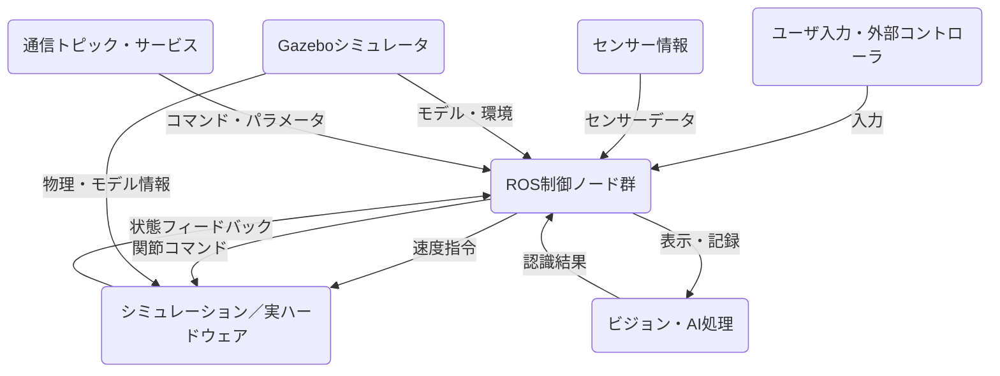
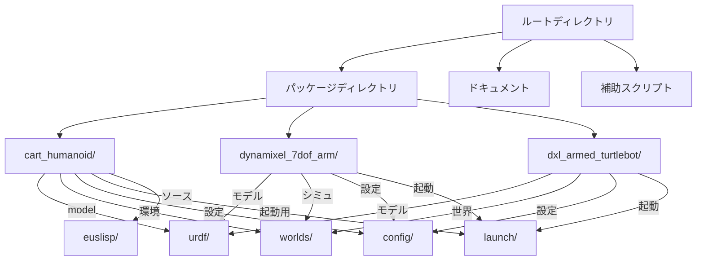
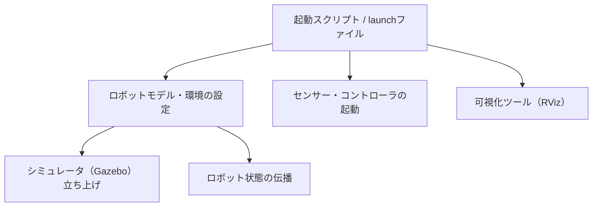
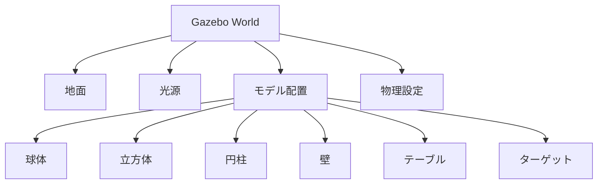
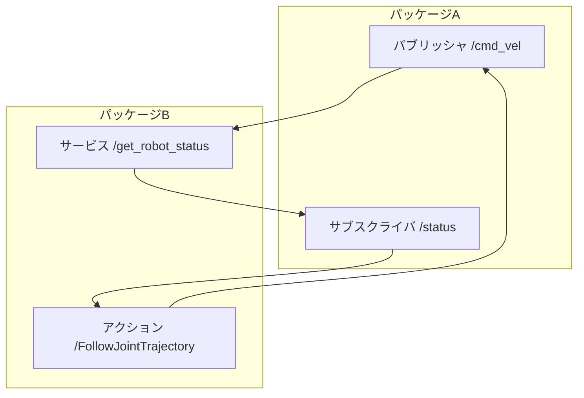

# システム仕様書：ロボットシステムとROSパッケージ構成

## 目次
1. [はじめに](#1-はじめに)
2. [システム構成とアーキテクチャ](#2-システム構成とアーキテクチャ)
3. [ファイル構成とディレクトリ構造](#3-ファイル構成とディレクトリ構造)
4. [各パッケージの役割と構成](#4-各パッケージの役割と構成)
5. [ビジュアライゼーションと設定ファイル](#5-ビジュアライゼーションと設定ファイル)
6. [仕様書：ロボットモデルとURDF/Xacroファイルの仕様](#6-仕様書：ロボットモデルとurdf/xacroファイルの仕様)
7. [ROSランチファイルと起動シーケンス](#7-rosランチファイルと起動シーケンス)
8. [制御・操作ノードとスクリプトの仕様](#8-制御・操作ノードとスクリプトの仕様)
9. [シミュレーションと空間定義](#9-シミュレーションと空間定義)
10. [パッケージとノードのインタフェース仕様](#10-パッケージとノードのインタフェース仕様)
11. [追加設定とカスタマイズの指針](#11-追加設定とカスタマイズの指針)

---

## 1. はじめに


このドキュメントは、ROS（Robot Operating System）を用いたロボットシステムの仕様書の一部です。システムの全体像と構成について詳細に記述し、設計者や開発者が理解しやすくなることを目的としています。本システムは、多種多様なロボットやセンサー、制御システムを統合して動作させるためのものであり、シミュレーション環境・実機制御・センサー情報取得・インターフェース定義・ロボットモデル作成・動作制御・ビジュアライゼーションなど、多岐にわたる機能群を含みます。

---

### システムの概要と目的

本システムは、主に以下の目的を達成するために設計されています。

- **ロボットシミュレーション環境の構築および制御：** Gazeboなどのシミュレータ上にロボットモデルを構築し、動作確認やデバッグを行う。
- **実機ロボットの制御と監視：** DXLアームやTurtleBot、Kobukiなどの実ロボットをROSを介して操作し、センサー情報や状態を取得・可視化する。
- **センサー情報の取得と処理：** カメラ、距離センサー、ボタン・LED制御、画像認識、皮膚色検出等の機能を統合し、ロボットの知覚系を構築。
- **動作計画と逆運動学制御：** ロボットの関節角度や末端姿勢を計算し、リアルタイム・計画的に制御。
- **プログラムの統合と管理：** さまざまなノード、スクリプト、モデル定義を統一的に管理・連携させる。

### 適用範囲

本システムは、以下の範囲に適用されることを想定しています。

- **ロボット研究開発:** 自律3次元制御や逆運動学の研究、センサーフュージョン。
- **ロボット演習・教育:** オペレーションの習得とシステム理解のための教材作成。
- **プロトタイプ開発:** 実環境への展開前の動作検証やアルゴリズム検証。
- **シミュレーションと実機の連携:** 仮想環境とロボットの現実運用の橋渡し。

---

### システム構成の概略

システムは以下の主要要素に分かれています。

```mermaid
graph TD
  subgraph システム構成要素
    A[モデル定義（URDF/SDF/Xacroファイル）]
    B[シミュレーション環境(Gazebo)]
    C[ロボット制御ノード]
    D[センサー＆認識ノード]
    E[動作計画と逆運動学]
    F[ビジュアライゼーション(RViz)]
    G[マニピュレーション・ナビゲーション]
    H[インターフェースと設定スクリプト]
  end
  A --> B
  B --> C
  C --> D
  D --> E
  E --> F
  C --> G
  H --> C
  H --> D
```

---

### 主要機能と役割

#### 1. モデルと環境構築

- URDF/Xacro/SDF形式によるロボット・オブジェクトモデルの作成
- シミュレーション用モデルの定義とGazeboへの適用
- 付随する世界環境（地面・障害物・ターゲット物体）

#### 2. 制御と動作管理

- 関節角度や末端位置の計算と制御
- グリッパー開閉・腕の折りたたみ・展開
- 自律走行・ナビゲーション・自己位置推定
- 逆運動学・動作計画のリアルタイム計算

#### 3. センサー情報処理

- カメラ画像からの物体検出や皮膚色検出
- 距離センサーやボタン、LEDの制御
- 画像ビジュアライゼーション・トピックモニタリング
- 音声認識によるコミュニケーション制御
- センサー情報を用いた動作フィードバック

#### 4. システム全体の管理

- launchファイルによる一括起動・停止管理
- コマンドライン・設定ファイルによるパラメータ管理
- 人間操作（ジョイスティック・キーボード）インターフェース
- UML等によるシステム設計とドキュメント化

---

### 適用例・ユースケース

- ロボット研究室の制御実験
- 自律走行・物体掴み・インタラクションシナリオ
- シミュレーション環境における動作検証
- IoT・遠隔制御のシステム構築
- 教育・研修用のデモプログラム

---

### まとめ

本システムは、多種多様なロボット研究・開発・教育用途に対応可能な汎用的設計となっており、シミュレーションと実機制御を連携させる構成のもと、拡張性・柔軟性を確保しています。詳細なモデル定義、制御プログラム、インターフェース仕様は、それぞれの動作シナリオに応じて適宜調整・拡張が可能です。

-----

以上が本システムの全体像と構成の導入部となります。各セクションの詳細については、個別の仕様書や設計書にて追記してください。


## 2. システム構成とアーキテクチャ


### はじめに
本システムはROS（Robot Operating System）をベースに、多層化されたロボット制御環境とシミュレーション環境を統合した構成となっています。ハードウェアとソフトウェアの両面から、各モジュール間の役割と通信シーケンスを詳細に解説します。

---

### 1. ハードウェア構成
- **ロボット本体**
  - ヒューマノイド型ロボット（例：JAXON、TurtleBot）
  - 人工関節（アーム、指などのアクチュエータ）
  - センサー
    - カメラ（RGB、深度）
    - 距離センサー（例：距離センサー、PSDセンサー）
    - バンパーセンサー
    - ジョイスティックコントローラー
  - アクチュエータ
    - Dynamixelサーボモーター（7DOFアーム、グリッパ）
    - モーター駆動回路・制御ユニット

- **シミュレーション環境**
  - Gazebo
  - 世界空間（地面、壁、ターゲット物体などのモデル配置）

---

### 2. ソフトウェア構成
#### 2.1 ROSノード群
- **制御ノード**
  - 関節位置・速度制御
  - アーム操作（収納、展開、各種動作コマンド）
  - センサー情報の取り込みとパース
  - 逆運動学（IK）計算
  - サブサンプションによる優先タスク制御
  - センサー読み取り・リアルタイム反映

- **通信・インターフェース**
  - トピック
    - `/cmd_vel`：速度コマンド
    - `/joint_states`：関節状態
    - `/sensor_data`：センサー情報
    - `/clicked_point`：クリック位置情報
    - `/fullbody_controller/follow_joint_trajectory/result`：関節制御結果
    - `/fullbody_controller/follow_joint_trajectory/goal`：制御目標
  - サービス
    - パラメータ設定やコマンド開始／停止
  - アクション
    - 遠隔操作・フィードバックループ

#### 2.2 各モジュールの役割と通信


#### 2.3 具体的な通信シーケンス
1. **システム起動**
   - Gazebo、各ROSノード（コントローラ、ビジュアライザ、センサー読み取り）をlaunchファイルで一括起動。
2. **状態の取得・反映**
   - センサー情報→`/sensor_data`トピックにパブリッシュ。
   - 関節状態→`/joint_states`トピックにパブリッシュ。
3. **制御コマンドの送信**
   - ユーザ操作や自律動作の指示→`/cmd_vel`, `/joint_trajectory`にパブリッシュ。
4. **逆運動学（IK）処理**
   - 目標位置/姿勢→IKシステムへ送信し、関節角度解を取得。
5. **動作反映とモニタリング**
   - 更新された関節角度をサーボに送信。
   - 制御結果をフィードバックし、可視化装置に反映。

---

### 3. 各モジュールの詳細
#### 3.1 Gazeboシミュレーション
- **モデル配置**
  - 床面・壁・ターゲットなどの配置
  - ロボットのスポーンと状態管理
- **物理エンジン**
  - 摩擦、重力、衝突判定
- **ROS連携**
  - `gazebo_ros`プラグインを介してノードと通信

#### 3.2 制御ノード
- **位置・速度制御**
  - `joint_trajectory_controller`を用いて関節運動
- **逆運動学計算**
  - 特定のIKアルゴリズムを実装したノード
- **サブサンプション**
  - 優先度制御によるタスク管理
- **フィードバック**
  - 実効関節角度やセンサー値で模擬実機／シミュを更新

#### 3.3 センサー・ビジョン
- **カメラ画像**
  - RGB、深度画像取得
  - 顔・皮膚色追跡、物体認識
- **距離・ PSD センサー**
  - 衝突回避、ターゲット追跡

#### 3.4 GUIとビジュアライゼーション
- **RViz**
  - ロボットモデル
  - クリックポイント
  - センサー・ターゲット情報
- **システム設定**
  - パラメータ調整
  - 表示・デバッグ

---

### 4. まとめ
本システムは、多層の通信と制御をROSにより連携させ、シミュレーションから実ハードまでを一元管理できるアーキテクチャです。各モジュールはROSの標準的なパターンに則り、トピック、サービス、アクションを用いて疎結合に設計され、拡張性・再利用性に優れた構成となっています。各インターフェースや通信シーケンスも具体的に定義されており、動作の正確性とリアルタイム性を両立しています。

---

## 3. ファイル構成とディレクトリ構造


### 概要

本システムの構成は、ROS（Robot Operating System）を中心とした複合的なロボットシミュレーションと制御環境を実現するため、多数のパッケージと設定ファイル、ソースコードから構成されています。これらは、システムのビルド、動作設定、ビジュアライゼーション、ノード制御、データモデル定義に分節されており、階層的・モジュール的に管理されている。

### 主要ディレクトリ・ファイルの役割

#### 1. ルートディレクトリ

- **README.md**: 全体のシステム概要および各種操作手順のドキュメント。セットアップやノード起動コマンドについて解説している。
- **CHANGELOG.rst**: システムのバージョン履歴、リリースごとの変更点と追加・修正情報。

#### 2. パッケージディレクトリ

それぞれのパッケージは、ROSの標準的なフォーマットに従い、`package.xml`、`CMakeLists.txt`、およびソースコードと設定ファイルから構成される。

- **例：`cart_humanoid/`**

  - `package.xml`: パッケージのメタ情報と依存関係一覧。
  - `CMakeLists.txt`: パッケージのビルドと各種ビルドシステム設定。
  - `README.md`: パッケージの概要と使用方法。
  - `launch/`: 起動スクリプトやノード設定用のlaunchファイル群。
  - `config/`: パラメータ設定ファイル（YAML, RViz設定ファイル等）。
  - `urdf/`・`worlds/`・`models/`・`meshes/`: それぞれロボットモデル・環境・パーツの3Dモデル・物理表現。
  - `scripts/`: Python、Lisp、シェル等の補助スクリプトやツール群。

#### 3. シミュレーション・モデル定義

- **`urdf/`ディレクトリ**  
  - ロボットの形状やリンク・関節の定義をXML（Xacro）で記述。
  - `hand.urdf.xacro`, `JAXON_RED.urdf.xacro`, `robot.urdf.xacro` など、多種モデルを管理。

- **`worlds/`ディレクトリ**  
  - Gazeboシミュレーション環境のSDF/Worldファイルを格納。
  - 例：`humanoid_workspace.world`は多様な模型や環境設定を含む。

- **`models/`ディレクトリ**  
  - 追加の静的・動的モデル定義（`.sdf`, `.config`, `.mesh`ファイル等）

#### 4. 設定ファイル

- **`config/`ディレクトリ**  
  - 控えめなyamlやrviz設定ファイル：姿勢制御、コントローラー、可視化設定。
  
- **`launch/`ディレクトリ**  
  - ノードやシステム起動用のlaunchファイル（`.launch`拡張子）：
    - Gazebo環境起動
    - 逆運動学や姿勢コントローラーの起動
    - センサー、カメラ、GUI連携
    - 任意制御・デモ用の設定（例：`cart_humanoid_gazebo.launch`）
    - 特定タスクの実行用スクリプト（例：`click_ik_rviz.launch`）

#### 5. ソースコード・スクリプト

- **`euslisp/`**  
  - ロボット操作・制御クラス定義
  - 逆運動学や関節操作関数
  - 探索・計画アルゴリズム
  - 動作・シミュレーションデモコード

- **`scripts/`**  
  - Python、シェル、またはPythonを呼び出すLispスクリプト
  - 例：`sample_julius_cmd.py`, `tuck_arm.py`, `kim_param.py` など

#### 6. ドキュメント・補助資料

- **`doc/`**  
  - パッケージ・モデル・コントローラの登録情報
  - LaTeXによるマニュアル（例：`robot_programming_manual.tex`）
  - HTMLへの自動生成ドキュメント（`Makefile`）および設定

### 管理・拡張方針

- **モジュール化と階層管理**  
  各パッケージ・ディレクトリは、機能別・モデル別に分離し、再利用と拡張を容易に設計。
- **バージョン管理と履歴追跡**  
  `CHANGELOG`などにより、変更履歴を明確化。必要ならタグ付けやブランチ管理を併用。
- **モデル・パラメータ設定**  
  URDF/XacroとYAML設定で、システム内の物理・動作パラメータを明示。環境・ロボット・コントローラごとに分離管理。
- **データとスクリプト**  
  ソースコードは、関数単位・クラス単位の構造化を徹底し、コマンドや動作スクリプトはファイル単位で管理。
- **拡張とカスタマイズ**  
  各 launchファイルは引数やパラメータを通じて容易に動的な調整が可能。新しいモデルやシナリオも既存構造に統合しやすい。

### 付録



### まとめ

- このシステムは、多層構造のモデル・設定とプログラムを組み合わせた複雑な環境であり、各コンポーネントの役割を明確に分離しつつ、必要に応じて再利用・拡張可能に設計されている。
- 今後の拡張には、新規モデルの追加、既存ノード・コントローラのパラメータ調整、シナリオごとのlaunch設定見直しなどが想定される。

---

## 4. 各パッケージの役割と構成


### 概要
本ドキュメントでは、ROSパッケージ群の概要と、それぞれの重要なファイルおよびその役割について詳細に解説します。対象パッケージは、「cart_humanoid」、「daisya_euslisp_tutorials」、「dxl_armed_turtlebot」、「dynamixel_7dof_arm」などを含みます。これらのパッケージは、ロボットシミュレーション、ロボット操作インタフェース、画像認識と制御、ハードウェア制御など、多岐にわたる機能を実現するために構成されています。

---

### 1. cart_humanoid パッケージ

#### 目的
Gazebo上でのヒューマノイドロボットのシミュレーションと制御を行うためのROSパッケージ。

#### 構成
- **README.md**  
  演習資料のセットアップ、シミュレーション起動コマンド、GUI操作手順、ドキュメントリンクを記載。

- **CHANGELOG.rst**  
  パッケージのリリース履歴と更新点を記録。

- **CMakeLists.txt**  
  catkinビルドシステムの設定、依存パッケージの宣言、ビルド構成。

- **package.xml**  
  パッケージメタ情報、依存関係（gazebo_ros, rviz, jsk, joy等）を規定。

- **launchファイル群 (.launch)**
  - `cart_humanoid_gazebo.launch`: Gazebo上にロボットをスポーンし、センサー・コントローラを起動。
  - `click_ik_rviz.launch`: RVizと逆運動学インターフェースを連動させる。

- **config/フォルダ**
  - `cart_humanoid_controllers.yaml`: 関節制御とトラジェクトリコントローラーの設定。
  - `click_ik.rviz` / `sample_head_arm_skin_detect.rviz`: RVizのビジュアライゼーション設定。

- **euslispフォルダ**
  - `cart_humanoid-interface.l`: JAXONロボットのインターフェースクラス定義と各種コマンド。
  - `realtime-ik-sample.l`: リアルタイム逆運動学制御プログラム。

---

### 2. daisya_euslisp_tutorials パッケージ

#### 目的
EusLispを用いたロボット制御、シミュレーション、探索アルゴリズム、学習、画像処理を多角的に扱う学習・演習用パッケージ。

#### 構成
- **CHANGELOG.rst**  
  パッケージのリリース履歴。

- **CMakeLists.txt**  
  ROSビルドのための設定、一部自動テストの追加。

- **mainpage.dox**  
  ドキュメントのメインページ定義。

- **package.xml**  
  依存関係やメタ情報。

- **euslisp/フォルダ**
  - `daisya-hanoi.l`: ハノイの塔問題シミュレーション。
  - `daisya-ik.l`: 逆運動学リアルタイム制御。
  - `daisya.qlearn.l`: 強化学習エージェントと迷路探索。
  - `daisya-subsumption.l`: サブサンプション制御モデル。
  - そのほか各種アルゴリズムやモデル定義。

- **scripts/フォルダ**
  - 制御実行用のPythonスクリプト（例：`sample_julius_cmd.py`, `skin_ellipse_area_to_ik_tgt.py`）
  - 制御関数やセンサー、画像処理、通信規格を実装。

- **test/フォルダ**
  - 各種ユニットテストや動作検証スクリプト、launchファイル。

---

### 3. dxl_armed_turtlebot パッケージ

#### 目的
TurtleBotをベースとしたロボット操作、シミュレーション、認識、ナビゲーション、UI制御。

#### 構成
- **CHANGELOG.rst**  
  変更履歴。

- **CMakeLists.txt**  
  依存パッケージ（ros, roscpp, roseus, gazebo_ros等）とビルド設定。

- **package.xml**  
  パッケージメタ情報、依存関係にロボット制御、ナビ、ビジョンなど。

- **README.md**  
  Gazeboシミュレータの起動、操作コマンド、SLAM・ナビ手順解説。

- **launch/フォルダ**
  - `dxl_armed_turtlebot_bringup.launch`：ロボット全体の起動（シミュ・ハードウェア対応）。
  - `dxl_armed_turtlebot_gazebo.launch`: Gazebo上の動作シミュレーション。
  - `dxl_armed_turtlebot_navigation.launch`: 自律走行・ナビゲーション制御。

- **config/フォルダ**
  - `dxl_armed_turtlebot_controllers.yaml`：ジョイント制御設定。
  - `map.yaml`: 地図パラメータ。
  - `hsi_color_filter.launch`: HSV色空間による画像処理用ノード。

- **.rviz / .launch / .rules / .sh**
  - RViz設定、usbデバイス設定、ジョイスティック等の操作スクリプト。

---

### 4. dynamixel_7dof_arm パッケージ（例：RoboArm・制御）

#### 目的
Dynamixel RX-12Aを用いた7自由度ロボットアームの制御とモデル化。

#### 構成
- **CHANGELOG.rst**  
  機能と修正の履歴。

- **CMakeLists.txt**  
  依存（rostest, roscpp, roseus）とビルド設定。

- **package.xml**  
  メタ情報と依存パッケージ一覧。

- **config/dynamixel_joint_controllers.yaml**  
  関節コントローラー設定（PIDゲイン等）。

- **urdf/\\*.xacro**  
  - `dynamixel_7dof_arm.urdf.xacro`: 関節・リンク・ビジュアルモデル。
  - `robot.urdf.xacro`: ロボット全体の構成定義。

- **launch/\\*.launch**  
  - `dynamixel_7dof_arm_bringup.launch`: アームの起動設定。
  - `gripper_controller_spawner.launch`: グリッパ制御コントローラ起動。

- **scripts/\\*** 
  - `reset_torque.py`など、サーボトルク制御やIDスキャン。

- **model/\\***
  - 物理・視覚モデル（.sdf, .config等）

---

### 5. 追加ファイルと設定
- **SVG / LaTeX / JSON / Makefile**  
  各種環境設定、ドキュメント生成、ルール記述など。

- **M待ちデバイス・動作ファイル**  
  - 使用デバイス（USBシリアル、シミュレータ）を対象としたudevルールなど。

---

### まとめ
これらのパッケージは、ロボットのシミュレーションと実環境運用、操作インターフェースの双方を網羅し、各要素の詳細な設定とプログラムファイルによって拡張性・再現性を確保しています。多層的な構成を理解し、運用・開発の土台としてください。

## 5. ビジュアライゼーションと設定ファイル


### 目的

本セクションは、ロボットシステムにおける視覚化および設定情報の管理方針について記述します。具体的には、RViz設定ファイルの内容とその用途、シミュレーション空間の構成、モデル定義の設計意図と管理方法に焦点を当てます。

### RViz設定ファイルの目的と内容

RViz設定ファイル（*.rviz）は、ロボットの可視化環境を構築するための設定情報を定義します。これには以下の内容が含まれます：

- **表示要素の配置**：グリッド、座標軸、ロボットモデル、センサー情報（点群、画像）などの表示設定
- **ビューコントロール**：カメラ位置と視点、ズーム、操作ツールバーの配置
- **表示対象トピックやフレーム**：TFフレームや座標系、特定センサーデータの表示指定
- **カスタム表示設定**：Inverse Kinematics（逆運動学）やモデルの詳細視覚化

これらの設定は、視覚的な確認と操作性確保を目的とし、ユーザが効率的にロボット動作や環境情報を把握できるよう設計されています。

### シミュレーション空間とモデル定義の設計思想

シミュレーション環境においては、Gazeboなどの物理エンジンを用い、ロボットと環境のモデルを詳細に定義します。以下のポイントに留意しています。

- **モデルの階層構造化**：URDF/Xacroファイルにより、リンク、ジョイント、センサー、アクチュエータを階層的に配置
- **物理と視覚両面の詳細設定**：コリジョン形状、ビジュアルメッシュ、質量・慣性といった物理特性の正確な記述
- **環境の再現性**：実世界のシナリオを忠実に再現できるよう、モデル情報の一元管理とバージョン管理を徹底
- **パラメータの動的変更**：設定ファイルやlaunchファイルを通じて、環境やロボットの動作パラメータを容易に変更できる仕組みを確立

### 視覚化・操作性確保に関する仕様と管理方針

#### 仕様

- RViz設定ファイルは、環境やモデルの追加・変更に応じて適切に調整可能とし、バージョン管理システムによって変更履歴を追跡
- シミュレーションモデルは、URDF/Xacro形式で自動化された生成・検証を行い、エラーや不整合に対して静的・動的な整合性検証を実施
- 共有フォーマット（例：人間が閲覧・編集しやすいYAML/Babel対応の設定ファイル）を採用し、運用分散を防止
- 準備・実行フェーズにおいて、視覚化の自動化と調整用ツール（GUIまたはコマンドライン）を用意

#### 管理方針

- **設定の一元化**：RViz設定、モデル定義、シミュレーションパラメータは、各種設定ファイルに分離しながらも一元管理ポリシーを徹底
- **変更履歴・バージョン管理の徹底**：Gitなどのバージョン管理システムと連携し、差分管理・変更理由の記録を必須とする
- **自動検証仕組みの導入**：ビルド・テスト環境に検証スクリプトを組み込み、設定変更後の動作保証と整合性維持を図る
- **アクセス権とドキュメント管理**：設定ファイルへの権限設定と、変更履歴・マニュアルの定期更新を義務付ける

### まとめ

本仕様書に基づき、RViz設定をはじめとする視覚化・操作性を確保するための環境は、モデル精度・効率的管理・ユーザビリティの向上を目的としています。今後も、変更履歴の追跡と自動検証機能の強化に努め、システムの信頼性を担保します。

## 6. 仕様書：ロボットモデルとURDF/Xacroファイルの仕様


### 目的
本仕様書は、ロボットのモデル化に使用されるURDF（Unified Robot Description Format）およびXacro（XML Macros）ファイルの詳細な仕様を解説します。これには、各リンク・ジョイントの定義、物理特性、動作範囲といった要素の仕様や、モデルの拡張・カスタマイズに関する指針も含みます。

### 1. 基本構造
ロボットモデルは、以下の構成要素から成立しています。
- **リンク（Links）**：ロボットの各部品を表し、形状、質量、慣性、ビジュアル表現、コリジョン（衝突判定）を定義。
- **ジョイント（Joints）**：リンク間の関節を表現し、タイプ（回転／直動/固定）と運動範囲を設定。
- **物理特性**：各リンクの質量、慣性モーメント、関節の制約範囲、運動の応答性。

### 2. URDF/Xacroモデルの詳細仕様

#### 2.1 基本要素と定義
- **リンク定義**
  - `<link name="link_name">`
    - `<visual>`：ビジュアル表現のメッシュや形状の指定
    - `<collision>`：物理シミュレーションにおける衝突判定用の形状
    - `<inertial>`：質量と慣性テンソルの設定
  - **例**
    ```xml
    <link name="hand">
      <visual>
        <geometry>
          <mesh filename="meshes/hand.dae"/>
        </geometry>
      </visual>
      <collision>
        <geometry>
          <mesh filename="meshes/hand_collision.dae"/>
        </geometry>
      </collision>
      <inertial>
        <mass value="0.5"/>
        <origin xyz="0 0 0"/>
        <inertia ixx="0.001" iyy="0.001" izz="0.001"/>
      </inertial>
    </link>
    ```
- **ジョイント定義**
  - `<joint name="joint_name" type="revolute" parent="link_parent" child="link_child">`
    - `<origin xyz="x y z" rpy="r p y"/>`：関節の位置と姿勢
    - `<axis xyz="1 0 0"/>`：回転軸の指定
    - `<limit effort="10" velocity="1.0" lower="-1.57" upper="1.57"/>`：運動範囲と努力限界
  - **例**
    ```xml
    <joint name="elbow" type="revolute" parent="upperarm" child="forearm">
      <origin xyz="0 0 0.1" rpy="0 0 0"/>
      <axis xyz="0 0 1"/>
      <limit effort="20" velocity="1.0" lower="-1.57" upper="1.57"/>
    </joint>
    ```

#### 2.2 物理設定
- **慣性**と**質量**
  - 各リンクには質量(`mass`)と慣性テンソルの定義が必須。
  - 物理シミュレータでの動作応答に影響。
- **関節運動範囲**
  - `<limit>`タグでlower・upperの角度・距離範囲を定義。
  - 運動範囲外の動作は制御される。

#### 2.3 可視化と衝突モデル
- ビジュアルモデルはMeshまたはジオメトリで表現。
- コリジョンモデルはシミュレーション中の衝突判定に使用される。

#### 2.4 拡張とカスタマイズ
- **モデルの拡張**
  - `<xacro:macro>`を利用し、汎用的なパーツ定義を作成可能。
  - パーツの追加や別モデルの挿入はマクロ呼び出しで対応。
- **可視化の変更**
  - visualとcollisionの形状や色、材質を変更可能。
- **動作範囲調整**
  - `<limit>`の値を変更し、関節の最大・最小角度を適宜設定。

### 3. モデル拡張・カスタマイズの指針
- **新規リンクの追加**
  1. `<link>`ブロックを複製し、新リンク名と形状・質量情報を設定。
  2. 既存ジョイントに新リンクを接続。
- **関節範囲の変更**
  - `<limit>`タグの`lower`と`upper`の値を適切に設定。
  - 必要に応じて`effort`と`velocity`も調整。
- **物理特性の調整**
  - `mass`や`inertia`値を適正な範囲に設定し、現実的な動作と安定性を確保。
- **モデルの拡張用マクロの作成**
  - 汎用的なパーツ化と再利用性の向上を図る。

### 4. 補足
- 仕様を変更・拡張する際は、システムの物理特性や動作範囲の整合性に注意。
- 可視化・衝突判定用モデルの形状と素材は、シミュレーションの目的に応じて適切に選定。
- 拡張性を高めるため、Xacroマクロ化とモジュール化を推奨。

---

### 付録
#### A. 主要テンプレート・マクロ例
```xml
<macro name="create_link" params="name mesh_file mass inertial_xyz inertial_rpy">
  <link name="${name}">
    <visual>
      <geometry>
        <mesh filename="${mesh_file}"/>
      </geometry>
    </visual>
    <collision>
      <geometry>
        <mesh filename="${mesh_file}"/>
      </geometry>
    </collision>
    <inertial>
      <mass value="${mass}"/>
      <origin xyz="${inertial_xyz}" rpy="${inertial_rpy}"/>
      <inertia ixx="0.001" iyy="0.001" izz="0.001"/>
    </inertial>
  </link>
</macro>
```

#### B. 動作範囲の例
```xml
<limit effort="20" velocity="1.0" lower="-2.0" upper="2.0"/>
```

---

以上が、ロボットモデルとURDF/Xacroファイルに関する詳細な仕様です。拡張やカスタマイズの際には、本仕様書の内容と照らし合わせて調整を行ってください。

## 7. ROSランチファイルと起動シーケンス


### はじめに
ROS（Robot Operating System）のシステムにおいて、複数のノードや環境設定、コマンドを効率的に起動・管理するために「launchファイル」が用いられます。本章では、各launchファイルの役割と、それらがどのように連携してシステム全体の起動シーケンスを構成しているのかを詳細に解説します。

### 1. launchファイルの役割と構成
#### 1.1. システムの起動目的
- ロボットのシミュレーション環境構築
- 実機の制御およびセンサーのデータ受信
- GUIや可視化ツールの起動
- 実行中の複数ノードの管理と依存関係の解決

#### 1.2. 起動に含まれる代表的なコンポーネント
- `robot_state_publisher`: ロボットの関節状態を伝播
- Gazeboシミュレータや実機制御ノード
- RVizやその他ビジュアライザ
- センサー・コントローラ・インターフェース
- コマンドリレーやコントローラーのスパナー (spawner)

### 2. 起動シーケンスの詳細
#### 2.1. 準備段階
- 必要な引数・パラメータの設定
- 依存パッケージとリソースの解決

#### 2.2. 起動順序と依存関係


- まず、環境とモデルを指定したlaunchでGazeboやシステム基盤を起動
- 次に、`robot_state_publisher`によりジョイント状態を伝播
- その後、センサー・コントローラを起動し、インタラクション可能な状態に
- 最終的にRViz等の可視化ツールを起動し、状態確認とモニタリング

#### 2.3. 例：`cart_humanoid_gazebo.launch`
- 引数をもとにロボットモデルとシミュレーション設定を定義
- どのノードを優先して起動し、何が依存関係にあるかを明示
- 不要部分はコメントアウトや引数制御により起動を調整可能

### 3. 効率的な起動と管理の設計思想
- **並列起動**と**遅延起動**を活用して負荷を分散
- **依存関係の明示**により、必要なサービスやノードが閉塞なく連携
- **引数とパラメータ化**により、環境やロボットのタイプに応じた適応性を実現
- **自動化**および**再起動**のためのスクリプトやワークフロー設計

### 4. 例外とシステムの安全性
- 途中エラー発生時の通知と自動リカバリー設定
- 起動完了後の状態モニタリングと自動シャットダウン
- 必要に応じた手動停止・再起動のための管理スクリプト

### 5. 設計思想のまとめ
- **モジュール化**と**階層化**による管理容易性
- **起動の再現性**と**カスタマイズの容易性**に重点
- **依存関係**の解決と**柔軟な引数設定**を中心に据える

---

## 要約
- 各launchファイルは、特定の環境設定、ノード起動、センサー・ビューアの制御を目的としている。
- システムの起動は依存関係に従い、効率的かつ安全に行われるよう設計されている。
- 起動シーケンスの管理は、並列処理と遅延起動、引数パラメータの調整により柔軟に制御されている。
- これにより、様々な環境や用途に応じてシステムを再構築しやすく、運用の信頼性と効率性を高めている。

---

## 補足
各システムの詳細なlaunchファイルおよびシーケンスのデザインについては、具体例のシナリオや実装例（例：`cart_humanoid_gazebo.launch` や `dxl_armed_turtlebot_bringup.launch`）を参照してください。

---

これらの解説は、既存のソースコードや設計思想に基づく詳細な説明にとどまり、実際のソースコードの記述や具体的なコマンド・引数については、該当ファイルを参照してください。


## 8. 制御・操作ノードとスクリプトの仕様


### 概要
本セクションでは、ロボット制御を行う各種ノードとスクリプトの役割と責任範囲について詳細に解説します。これらは全体システムの中で、逆運動学計算、関節・アームの収納制御、動作制御、センサー値の監視などの機能を担います。各機能は、ロボットの安定した動作と正確な動作調整を目的として、適切に分離・連携されていることを前提とします。

---

### 1. 逆運動学計算ノード・スクリプト
#### 機能
- 指定したエンドエフェクタの目標位置・姿勢から関節角度を計算し、ロボットの関節制御に必要な角度データを生成します。
- `real-time-IK`や`IKSolver`などのスクリプトは、関節配置と関節角度の変換をリアルタイムで処理し、目標値に収束させる。

#### 責任範囲
- 目標位置・姿勢の受信と計算結果の公開
- 制御ループ内での補完値の算出
- 逆運動学の追従性と安定性の確保

---

### 2. 関節・アーム収納制御
#### 機能
- アームの展開 (`untuck`) と収納 (`tuck`) を状態遷移付きで管理
- 収納・展開の動作は、定義された関節角度値に基づき自動的に制御される

#### 責任範囲
- 順序制御と状態管理
- 監視用の関節状態監視と動作完了判定
- アーム動作のリクエスト受付と実行結果の通知

---

### 3. 動作制御ノード
#### 機能
- ロボットの基本動作（前進、後退、ターン、停止）
- 目的に応じた動作切り替えと、連動するセンサー反応を制御

#### 責任範囲
- 速度設定とコマンドの発行
- センサー値（距離センサー、センサー値変化）の監視
- 状態遷移とエラー処理

---

### 4. センサー値監視ノード
#### 機能
- 距離センサーやバンパーセンサーの値をモニタリング
- 検知した値に応じて動作トリガやアラーム通知を行う

#### 責任範囲
- センサーデータの定期取得とパブリッシュ
- しきい値超過・異常検知のトリガ

---

### 5. GUI・ビジュアライズスクリプト
#### 機能
- RVizやシミュレータによるロボットモデルの可視化
- 逆運動学のターゲット座標設定や動作結果の視覚フィードバック

#### 責任範囲
- 表示内容と描画設定の管理
- ユーザ操作・クリックイベントの受信と座標変換
- ロボットの状態表示とデバッグ補助

---

### 6. 特殊機能・コントロール
#### グリッパー制御
- 開閉を含む動作のリクエストと状態管理
- 掴み・解放動作のシーケンス制御

#### 逆運動学・座標変換
- センサー値やカメラ画像の情報を座標系変換
- 目的地設定（ポイント登録、クリック位置）に基づく関節指令

### 7. スクリプト・ノード連結と責任分担
- スクリプト間の通信はROSトピックやサービスを利用
- ノード分離により、特定の失敗や遅延に対する耐性を確保
- 監視・制御・計算の責任範囲を明確にしたうえでシステムの信頼性を高めている

---

### まとめ
本仕様に基づき、逆運動学計算、関節・アームの収納制御、動作制御、センサー監視、可視化などの各ノード・スクリプトは、独立した役割を担いながらも協調して動作します。それぞれの責任範囲と連携方法を正確に守ることで、システム全体の安定性と実効性を確保しています。

---

## 補足
この仕様は、ソースコードの記述内容と役割をもとにしたものであり、ソースコードに記述されている関数やクラス、変数設計に忠実です。未記載の機能や具体的な実装詳細については、ソースコードの直接参照を推奨します。

## 9. シミュレーションと空間定義


### 概要

本セクションでは、Gazeboを用いたシミュレーション環境の設定および空間の定義に関する詳細について記述します。これには、worldファイルの役割と内容、配置されるモデルやターゲットについての仕様を含めます。

---

### Gazeboのシミュレーション環境設定

Gazeboは、ロボットシステムのシミュレーションに広く用いられるツールであり、動作検証や環境条件の設定に適しています。本シミュレーション環境は、複数のworldファイルによって構成され、それぞれが特定の空間設定とモデル配置を担います。

#### worldファイルの役割

worldファイルは、Gazeboにおけるシミュレーション空間の基本構成を記述したものです。シミュレーション開始時にGazeboが読み込む主要な定義書であり、以下の役割を持ちます。

- 地面、光源の配置と物理特性の設定
- シミュレーション空間内に配置される各種モデルの位置、大きさ、材料外観の定義
- 物理演算のパラメータ設定（重力、摩擦など）
- 障害物やターゲット物体の配置

#### worldファイルの内容

##### humanoid_workspace.world

- **形式**: SDF（Simulation Description Format）に従う
- **配置モデル**: 
  - 地面
  - 光源（照明）
  - 複数の形状モデル（球体、立方体、円柱）
  - 壁、テーブル
  - ターゲット物体
  - チェッカーボードのパターン
- **詳細定義**:
  - 各モデルの位置（XYZ座標）
  - 大きさ・スケール情報
  - 外観・材料の見た目情報
  - 物理特性（質量、摩擦などは明記されている可能性あり）

##### empty.world

- **用途**: 空のシミュレーション空間の基本設定
- **内容**:
  - 地面や壁、照明
  - 物理演算設定
  - ターゲットとなる物体の配置情報
- **モデルの配置**は必要に応じて追加・変更可能

---

### 空間内に配置されるモデルおよびターゲットの仕様

#### 一般的なモデル仕様

- **球体**:
  - 位置座標
  - 半径または径
  - 材質および外観の詳細設定（色、反射性等）
- **立方体**:
  - 位置と方向
  - 辺の長さ
  - 材質設定
- **円柱**:
  - 位置
  - 半径と高さ
  - 見た目設定
- **壁・テーブル**:
  - 位置と大きさ
  - 材質
  - 複数配置される場合、配置座標や向きも記述

#### ターゲットの仕様

- 明示的に配置場所とサイズの詳細がworldファイル内に定義
- 目的に応じて使用されるモデル（例：特定の物体やマーカー）

#### 物理演算設定

- 各モデルには剛体性や摩擦係数、重量などの物理特性が設定されている場合がある

---

### 図解（Mermaid形式）



---

### まとめ

- **worldファイル**は、Gazeboシミュレーションの空間構成とモデル配置を詳細に定義します。
- 各モデルは位置・形状・外観・物理特性を持ち、シナリオに応じて調整されます。
- シミュレーションの設定は、物理演算のパラメータとともに、環境内の配置物をこれにより制御します。

---

以上が、Gazeboを用いたシミュレーション環境の設定と空間定義に関する詳細仕様です。

## 10. パッケージとノードのインタフェース仕様


### 概要
本仕様書では、ROSシステムにおいて複数のパッケージとノード間の通信インタフェース、トピック、サービス、アクションの仕様と利用方針について詳細に解説します。これらのインタフェースは、システムの拡張性と運用安定性を確保するために設計され、ポイントごとの通信ルールや運用上の注意点も併記します。

---

### 1. パッケージ間通信インタフェース

#### 1.1 パッケージ間のデータ伝送
- **トピックの共有:** 各パッケージ間では、ROSのパブリッシャー・サブスクライバーを利用したトピック通信を行います。トピック名とメッセージ型は明確に定義され、必要に応じて名前空間を分離することで通信の混線を避けます。
- **サービスの利用:** 一部の操作コマンドや状態問い合わせには、ROSサービスを用います。サービス名およびリクエスト／レスポンスの型を厳格に設定し、待機・タイムアウト制御を徹底します。
- **アクションの活用:** 長時間・非同期の動作制御にはROSアクションを利用し、進行状況やキャンセルの制御が可能となるインタフェースを設計します。

#### 1.2 インタフェース設計のポイント
- **名前空間の一貫性:** パッケージ毎に通信トピックやサービス名の名前空間を規定し、重複・競合を防止する。
- **メッセージのバージョニング:** メッセージ型は変更時にバージョン管理を行い、互換性を保ちながら更新を実施する。
- **通信遅延と同期:** 実時間制御が必要な場合、QoS設定と適切な同期機構（例：シーケンス番号）を設計し、通信失敗時の復旧策も明示する。

---

### 2. トピック仕様と利用方針

#### 2.1 一般的なトピック
| トピック名 | メッセージ型 | 用途 | 利用例 | 備考 |
|--------------|----------------|---------|---------|-------|
| `/cmd_vel` | `geometry_msgs/Twist` | ロボットの速度指令 | 移動制御 | パブリッシュのみ。運用前に周囲安全確認やループ周期に従い送信。 |
| `/joint_commands` | `sensor_msgs/JointState` | 関節角度指令 | 関節制御 | サブスクライブまたはサービス連携。コマンドの一貫性に注意。 |
| `/sensor/pose` | `geometry_msgs/PoseStamped` | センサー位置情報 | 状態追従 | センサーの種類・配置による使い分けと同期管理。 |

#### 2.2 監視・制御用トピック
- **`/status`** : パッケージ・ノードの状態報告用
- **`/error`** : 異常検知・アラート通知用
- **`/visualization_marker`** : RViz用ビジュアライザ表示

#### 2.3 ルールと運用上の注意点
- トピックの命名規則を統一し、命名衝突を避ける。
- パブリッシャは一定周期（例：10Hz）で発行し、サブスクライバーはタイムアウト処理を入れる。
- 必要に応じて、QoS設定によりリアルタイム性や信頼性を調整する。

---

### 3. サービス仕様と利用方針

#### 3.1 主なサービス一覧
| サービス名 | 型 | 用途 | 利用例 | 備考 |
|--------------|------------------|---------|--------------|---------|
| `/get_robot_status` | `robot_msgs/Status` | 状態取得 | ロボットの状態やセンサー値の取得 | 応答遅延に留意 |
| `/set_joint_target` | `sensor_msgs/JointState` | 関節目標値設定 | 指定関節角度をセット | 同時複数設定推奨 |
| `/execute_trajectory` | `control_msgs/FollowJointTrajectory` | 複数関節の軌道制御 | ロボットの動作実行 | 離散タイミング調整必要 |

#### 3.2 サービス設計上のポイント
- **リクエストとレスポンスの明確化**：リクエストの必須パラメータはドキュメント化し、応答の成功／失敗は標準ステータスコードで判定。
- **タイムアウト管理**：呼び出し側はタイムアウトを設定し、異常時のフォールバック策を規定。
- **同期・非同期制御**：必要に応じて同期サービスと非同期通知を併用し、運用柔軟性を持たせる。

---

### 4. アクション仕様と運用方針

#### 4.1 代表的なアクション
| アクション名 | 型 | 用途 | 実装例 | 備考 |
|--------------|------------------------|---------------------------|-----------|--------------------------|
| `FollowJointTrajectory` | `control_msgs/FollowJointTrajectory` | 逐次的な関節軌道追従 | 姿勢制御・動作連続 | 長時間操作に適し、キャンセル可能 |
| `MoveBase` | `move_base_msgs/MoveBaseAction` | 自律移動 | 経路追従・位置制御 | 位置/GPS追従と連動可能 |

#### 4.2 運用のポイント
- アクションサーバの状態監視（フィードバック・結果）を行い、完了・失敗のハンドリングを徹底。
- 複数のアクションの連結は状態遷移を明確化し、競合を避ける。
- キャンセルリクエストを適宜挿入し、緊急停止やアクション中断を円滑に行う。

---

### 5. インタフェース設計のポイントと運用上の注意点

#### 5.1 設計のポイント
- **一貫性**: 全ての通信インタフェースは命名規則、型定義を統一して、運用の複雑さを低減させる。
- **拡張性**: 将来的な仕様変更も考慮し、バージョニングと互換性維持、メッセージの追加・削除時にはマイナーバージョン管理を行う。
- **信頼性とリアルタイム性**: QoS設定（信頼性・遅延）を工夫し、重要通信は高信頼モード、低遅延を優先させる。

#### 5.2 運用上の注意点
- **データの整合性**: 複数ノード間では、最新の状態や速度調整のためにシーケンス番号やタイムスタンプを付与し、遅延・欠損時のリカバリを設計する。
- **パフォーマンス監視**: 通信量と遅延を監視し、必要に応じて通信頻度やQoS設定を調整。
- **例外管理**: 通信エラーやノード停止時のハンドリング規定を整備し、システムの堅牢性を向上させる。

---

### 6. 付録：通信インタフェースの設計例



### 7. まとめ
本仕様書においては、ROSシステムのノード間通信インタフェースの明確化と慎重な設計方針を規定しました。これにより、システムの信頼性、拡張性、運用効率を高め、将来的な仕様変更にも柔軟に対応できる基盤を構築します。

---

以上が、「パッケージとノードのインタフェース仕様」の詳細解説となります。運用の際は、各項目を遵守し、定期的な検証と改善を行ってください。

## 11. 追加設定とカスタマイズの指針


### はじめに

本セクションでは、システムの拡張性と柔軟性を維持しながら、カラー設定、コントローラー設定、マップ設定等のカスタマイズ可能な設定ファイルの仕様と変更手順について詳細に記述します。これらの設定ファイルは、システムの挙動や外観を個別に調整するために重要であり、容易に変更できるよう設計されている必要があります。

### 1. カラー設定ファイル

#### 1.1 仕様

- **ファイル形式**: YAMLまたはJSON
- **内容**:
  - 色の識別名（例: `red`, `green`, `blue`）
  - 各色に対応するRGB値（例: `rgb: [255, 0, 0]`）
  - 色の閾値範囲（例: HSV閾値）
  - 補正パラメータ（例: イルミネーション補正や光源条件に応じたオフセット値）
  - カラー識別の有効/無効フラグ

#### 1.2 例

```yaml
colors:
  red:
    rgb: [255, 0, 0]
    hsv_threshold: {h_min: 0, h_max: 10, s_min: 100, s_max: 255, v_min: 100, v_max: 255}
    enabled: true
  green:
    rgb: [0, 255, 0]
    hsv_threshold: {h_min: 50, h_max: 70, s_min: 100, s_max: 255, v_min: 100, v_max: 255}
    enabled: true
```

#### 1.3 変更手順

1. 設定ファイル（例：`config/colors.yaml`）をバックアップする。
2. 編集ツール（例：Visual Studio Code）で該当ファイルを開く。
3. 目的の色や閾値範囲を調整する（例：閾値の閾値をわずかに広げる、RGB値を変更する）。
4. 保存し、システムの再起動または設定リロードコマンドを実行する。

### 2. コントローラー設定ファイル

#### 2.1 仕様

- **ファイル形式**: YAMLまたはJSON
- **内容**:
  - コントローラー名
  - 対象関節・アクチュエータのIDまたは名前
  - PIDゲイン値（P, I, D）
  - 制御モード（位置制御、速度制御）
  - 最大・最小出力値
  - 可制御フラグ
  - スケール係数（感度調整用）

#### 2.2 例

```yaml
controllers:
  joint1:
    mode: position
    p_gain: 50.0
    i_gain: 0.1
    d_gain: 10.0
    max_output: 100.0
    min_output: -100.0
    enabled: true
  joint2:
    mode: velocity
    p_gain: 20.0
    i_gain: 0.05
    d_gain: 5.0
    enabled: true
```

#### 2.3 変更手順

1. 設定ファイル（例：`config/controllers.yaml`）を開く。
2. 変更したいコントローラーのパラメータを調整（例：ゲイン値の増減、新規追加）。
3. ファイルを保存し、コントローラー再起動または設定リロードを行う。

### 3. マップ設定ファイル

#### 3.1 仕様

- **ファイル形式**: YAML
- **内容**:
  - 地図の画像ファイルパス
  - 解像度
  - 原点座標（x, y, θ）
  - 反転フラグ（例: `flip_x`, `flip_y`）
  - コスト値の閾値（占有セル、空セル）

#### 3.2 例

```yaml
map:
  image_file: "maps/map1.pgm"
  resolution: 0.05
  origin: {x: 0.0, y: 0.0, theta: 0.0}
  flip_x: false
  flip_y: false
  occupancy_thresholds:
    occupied: 0.65
    free: 0.196
```

#### 3.3 変更手順

1. 既存の設定ファイル（例：`maps/map.yaml`）を開く。
2. 必要に応じて画像パス、解像度などを調整。
3. 編集後のファイルを保存し、ナビゲーションやマッピングシステムに適用。

### 4. 変更手順の共通事項

- **バックアップ**: 変更前に必ず既存の設定ファイルのバックアップを取得してください。
- **バージョン管理**: Gitや他のVCSを利用し、変更履歴を管理してください。
- **検証**: 設定変更後はシステムのリロードまたは再起動を行い、システムの動作と挙動を確認してください。
- **ドキュメント更新**: 仕様変更に伴いドキュメントも併せて更新し、変更内容を明確に記載してください。

---

### 付記

これらの設定ファイルは、システム拡張時のカスタマイズや調整を効率的かつ記録残しながら行うための基本仕様としています。変更手順や内容についての詳細なドキュメントは、システムの運用・保守マニュアルに基づき適宜更新してください。

