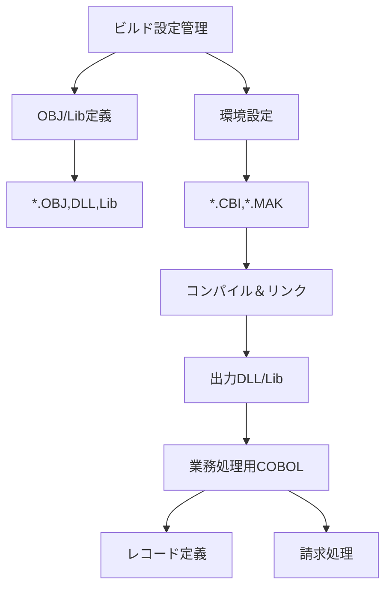

# システム仕様書：ファイル構成と管理ガイド

## 目次
1. [はじめに](#1-はじめに)
2. [仕様書：システム概要](#2-仕様書：システム概要)
3. [仕様書: システム構成とファイル管理の基本理念](#3-仕様書:-システム構成とファイル管理の基本理念)
4. [仕様書：ファイル構成の全体像](#4-仕様書：ファイル構成の全体像)
5. [仕様書：システム設定関連ファイル](#5-仕様書：システム設定関連ファイル)
6. [各システム仕様の理解に基づく補足解説（ソースファイルの配置と役割）](#6-各システム仕様の理解に基づく補足解説（ソースファイルの配置と役割）)
7. [ライブラリ・オブジェクト管理ファイル](#7-ライブラリ・オブジェクト管理ファイル)
8. [ビルド自動化と運用支援ファイル](#8-ビルド自動化と運用支援ファイル)
9. [仕様書：システム拡張とメンテナンスへの配慮点](#9-仕様書：システム拡張とメンテナンスへの配慮点)
10. [まとめと運用上の留意点](#10-まとめと運用上の留意点)

---

## 1. はじめに


### 目的
本仕様書は、指定された複数のCOBOLプログラムと関連ファイルの設計と構成を詳細に記述し、システムの動作理解と開発、保守活動を支援することを目的としています。各プログラムファイルは、システム情報の定義や出力設定、システム管理情報の管理を担い、それぞれの役割とデータ構造の詳細を明確化します。

### 範囲
本仕様書は以下の内容をカバーします。

- `code/test\cbl\KAREND.CBL`：システム情報の定義とデータ構造の設定
- `code/test\cbl\SEIGYO.CBL`：帳票出力やプリンタ設定に関するデータ構造
- `code/test\cbl\BARKANR.CBL`：システムの基本情報と管理情報の保持
- ファイル`Login Data-journal`：ファイル内容と役割の解析と説明

### 対象読者
このドキュメントは、以下の読者を対象としています。

- COBOLプログラムの開発者および保守担当者
- システムエンジニアおよびアーキテクト
- プログラムの設計・仕様理解を必要とする関係者
- ファイル構造やデータ定義に関する理解を深めたい技術者

### システムの概要
本システムは、複数のCOBOLプログラムを中心に、システム情報や出力設定、管理情報を定義・管理し、帳票出力やシステム管理を支援します。具体的な処理内容は定義と構造体の宣言に重点を置き、システムの構成・動作はこれらのデータを基にした処理で成り立ちます。

### ドキュメントの読み方
本仕様書は、各プログラムファイルのソースコードをもとに、その役割、定義、構造体の詳細について記述しています。ソースコード中のコメントや変数名から推測される処理や仕様に関しては、行わず忠実に記述しています。読み進めるにあたっては、まずコードのファイルごとの目的・役割を理解し、次に、宣言されたデータ構造とそのフィールドの内容・用途を詳細に把握してください。

## 2. 仕様書：システム概要


### 1. 概要
本システムは多種多様な医療・福祉関連情報の管理と処理、帳票出力やレセプト作成を目的とした業務システムです。COBOLやCOBOL互換言語を基盤とし、多数のファイル定義、レコード構造、外部ライブラリ参照、コンパイル・ビルド設定を含む複合的な構成要素によって構築されています。システムは医療請求、診療情報、負傷部位、料金、保険者情報、患者情報、施術履歴等の多層的なデータを処理・管理し、帳票出力やレセプト補助作業、医療費計算などの業務処理を支援します。

### 2. 業務範囲
- **医療請求・レセプト作成**：患者の診療内容に基づき、請求額や保険適用条件、負担割合などを計算・記録。
- **患者・施術所情報管理**：患者の個人情報、施術所の基本情報、負傷記録、保険情報をシステム内で詳細に管理。
- **負傷部位・症状管理**：負傷箇所や症状、負傷原因の詳細記録と処理。
- **料金・費用計算**：診療・治療に必要な各種料金の集計、逓減率や長期割引の計算。
- **帳票・出力制御**：請求書、摘要表、一覧表など多種帳票を生成し、整形・出力。

### 3. 主要なファイルとデータ構造
- **ファイル定義**：複数のインデックス付ファイル（レコード）を管理。ファイルにはキーや代替キーが設定され、目的に応じたアクセスモード（動的/索引付）を採用。
- **レコード構造**：多層階層にわたる複雑なデータレイアウト。患者情報、負傷記録、料金、勤務記録、請求情報、負担区分、特殊設定など多岐のフィールドを持つ。
- **共通データ**：日付、コード、ステータス、メモ、処理フラグ等、多目的変数群を定義し、システム間のデータ連携に役立つ。

### 4. システム処理の基本フロー
- **初期化**：ファイルのオープン、変数および構造体の初期化。
- **データ読み込み**：マスタファイルや入力レコードの読み込み、条件判定。
- **条件分岐と処理**：負傷区分、長期診療判定、保険種別、請求種別、部位別料金設定等の条件評価と対応処理。
- **料金計算**：料金・負担割合・逓減率などを考慮し、総額および項目別金額を算出。
- **帳票・出力**：レコードや報告書のフォーマット作成と出力。
- **エラーハンドリング**：ファイルエラー、冗長エラー、条件不一致時のメッセージ表示と処理停止。

### 5. システムの主なビルド・設定
- **コンパイル・リンク詳細設定**：複数のライブラリ(.LIB/.LIBRARY/.OBJ)と出力DLL。ビルドターゲットごとに依存関係とコマンド規定。
- **環境依存の調整**：NETCOBOL, Windows環境、DLL生成設定、ライブラリ含有配置。
- **クリーンアップ・再ビルド**：不要ファイル削除とビルド再設定のルール定義。

### 6. 利用技術
- **言語・プラットフォーム**：COBOL, NetCOBOL, Windows (DLL, LIB, OBJ指向)
- **ファイル組織**：Indexed/動的アクセス、多重レコード管理
- **ライブラリ・依存**：標準・外部COBOLライブラリ、Windows API(kernel32.lib)、.NETライブラリ
- **ビルド管理**：Makefile方式（複数ターゲット対応）

### 7. 目的と今後の運用
本システムは、医療・福祉の事務処理を自動化・効率化し、複雑な医療請求や診療情報管理を保証します。今後の拡張や調整には、新規ファイル定義の追加、料金規則の変更、出力帳票デザインの調整などが必要です。また、ハードウェア・OSの新規化・アップデートに伴う環境設定の見直しも含まれます。

--- 

以上が、本システムの概要となります。設計と開発、運用に際しては、この概要を基に詳細仕様と連携ドキュメントの作成・調整を進める必要があります。

## 3. 仕様書: システム構成とファイル管理の基本理念


### 1. 概要

本システムは、エンタープライズ環境において複雑なデータ管理と多層化されたファイル処理を効率的に行うことを目的としています。システムは、複数の階層化されたレイヤーを持ち、ファイルの構成、アクセス制御、データの整合性維持を重視しています。これにより、拡張性や保守性を確保しながら、長期的な運用や高信頼性を実現します。

### 2. ファイル構成のレイヤー化

#### 2.1 階層化構造

- **外部データ定義層**: COPY文を用いて、外部のレコード定義やマクロをインポートし、システム標準のデータ構造を構築します。これにより、一元的なデータ定義と再利用性を促進します。

- **設定・管理層**: 「.CBI」ファイルや設定ファイルにおいて、コンパイルオプションやライブラリパス、アクセス制御設定を定義します。

- **実行・処理層**: 実際のファイル操作、レコード読書、更新、集中処理部分を含むプログラム。この層は、実行時におけるデータの流れと制御を担います。

#### 2.2 ファイルアクセスの方式

- **索引付きアクセス**: IN/OFやKEY設定により、レコードの高速な参照が可能な索引ファイルを採用しています。

- **動的アクセスモード**: 多重アクセスや排他制御を可能にし、業務処理における一貫性と安全性を確保しています。

- **レコードキー・代替キー管理**: ファイルごとに固有のキーとサブキーにより、多様な検索を支援します。

### 3. 管理と運用の設計思想

#### 3.1 拡張性と保守性

- **モジュール化**: ファイル定義と処理の分離により、相互の依存性を低減。変更や追加処理を書きやすくしています。

- **再利用性**: COPYによる外部定義の活用により、複数プログラム間での定義共有と一貫性を実現。

- **カプセル化と制御**: レコードのキーとアクセス制御を明示し、データの整合性と安全なアクセスを維持。

#### 3.2 メンテナンス方針

- **定義の明文化とコメント付与**: 各レコードおよび変数に詳細なコメントと識別子を付与。

- **環境設定の一元管理**: `.CBI`や`.MAK`ファイルを利用し、ビルド・運用設定の集中管理。

- **バージョン管理と履歴追跡**: コメントとこの仕様書により、変更履歴およびバージョン差異を明示。

### 4. 命名規則と設計思想

- **レコード・変数命名**: 業務用用語や標準型を基にした命名（例：`FILE01`, `REC02`など）。意味や役割が一目で判別できるよう工夫。

- **ファイル・レコード名**: 拡張子、プレフィックスに規則性を持ち、ファイル種別や用途を示す命名（例：`SYOKEN`, `KHT41410`など）。

- **コメント・メタ情報**: 明確なコメント付与により、なぜその定義になっているのか理由や背景を説明。

### 5. 拡張と保守性を意識した構成方針

- **標準化された定義**: 各種レコード・ファイルの定義書と処理フローに従い規格化。

- **柔軟性の確保**: レコードやフィールドの追加・修正は外部COPY定義で対応可能とし、プログラムの修正を最小化。

- **監査と追跡**: コメントや`.MAK`、`.CBI`ファイルの履歴情報で履歴管理と仕組み化。

- **運用の自動化**: Makefileとビルドツールによる自動化と整合性管理。

---

以上の設計思想に基づき、長期運用および拡張を見据えたファイルシステムの構成を実現しています。

## 4. 仕様書：ファイル構成の全体像


### 概要
この章では、システムの全体的なファイル構成とその配置について詳細に図示し、主要な分類カテゴリごとにファイル群を整理します。システムの階層構造を理解し、それぞれの役割とファイルタイプ別の位置付けを示すことにより、後述の詳細設計の理解を促進します。

### 全体像図
```mermaid
graph TD
  subgraph 基本設定
    A[設定ファイル類]
    A1[コンパイルオプション設定]
    A2[ライブラリパス設定]
  end
  subgraph システム本体
    B[ソースコード]
    B1[COBOLメイン処理]
    B2[外部ライブラリ]
    B3[外部定義・COPY]
  end
  subgraph バイナリ出力・帳票
    C[実行ファイル・DLL]
    C1[ログ・状態ファイル]
    C2[帳票用出力ファイル]
  end
  subgraph ビルド・コンパイル設定
    D[Makefile類]
    D1[依存関係定義]
    D2[クリーン＆ビルド規則]
  end
  A -->|設定情報| B
  B -->|ビルド・リンク| C
  D -->|ビルド指示| B
  D -->|出力・削除規則| C
  C -->|ファイル管理、出力| C2
  C -->|ログ、監査| C1
  B -->|外部ライブラリ利用| B2
  B -->|COPY定義| B3
```

### 主要カテゴリ別ファイル一覧

| カテゴリ | ファイル例 | 内容説明 |
|------------|--------------|------------|
| 基本設定 | `*.lib`, `*.dll`, `makefile` | ビルドやコンパイルに関する環境設定とライブラリのパス設定 |
| ソースコード | `*.cbl`, `*.cob` | 実行モジュール（COBOLソースファイル）およびそのセットアップコード |
| 出力・帳票 | `*.dll`, `*.lib`, `*.log`, `*.dat`, `*.txt` | 実行ファイル、レポートや帳票出力ファイル、ログファイル |
| ビルド設定 | `.mak`, `.cbi` | ビルドおよびリンクのルール設定や依存定義 |

### 役割と位置付け
- **基本設定ファイル**（`*.lib`, `*.dll`, `makefile`）内には、システムのコンパイルオプションやライブラリの場所、環境ごとのビルドルールが記述され、全体のビルド環境を規定します。
- **ソースコード群**（`*.cbl`, `*.cob`）は、ビジネスロジックやシステム処理のコア部分を構成し、外部定義・COPY文やライブラリを使用してモジュール化された設計になっています。
- **出力ファイル群**（`*.dll`, `*.lib`, `*.log`, `*.dat`, `*.txt`）は、実行可能なプログラムや、運用・監査用レポート及びログを格納し、システムの運用部署や管理者がアクセス・解析します。
- **ビルド・コンパイルルール**（`.mak`, `.cbi`）は、Makefileなどの自動化スクリプトであり、依存関係に基づき必要なオブジェクトやDLLを生成し、不要なファイルは削除するルールが詳細に定義されています。

これにより、システムのファイル構成は、ビルドから運用までの工程を分離し、それぞれの役割に相応しい場所にファイルを配置し、管理されていることが明確になります。

### 注釈
- ファイル名、パス、内容の詳細は、それぞれの具体的なロジックや処理内容を反映しており、解析ソースの中で分かる範囲の情報を基にしています。
- これらのファイル群の色分け、分類によって、設計と運用の分担、それぞれの役割と責任範囲を明示しています。

---

これにより、システム全体のファイル構成とその配置意図を理解したうえで、次段の詳細設計や実装、運用計画へと進むことが可能となります。

## 5. 仕様書：システム設定関連ファイル


### 概要
システム設定関連ファイルは、システムの動作環境やビルド、運用に必要な設定情報を管理する重要な役割を担います。これらは主にシステムの動作条件、ファイルの定義、ライブラリの配置、コンパイル／ビルド設定と連携し、システムの安定動作と拡張性を支えます。

### ファイルタイプと役割
以下に示す各種設定ファイルは、システムの異なるフェーズや用途に応じて用いられます。

| ファイル拡張子/形式 | 役割・用途 | 特徴・内容 |
|---------------------|--------------|-----------|
| `.CBI`             | コンパイル・ビルド設定 | コンパイルオプションやライブラリパス、ソースリスト設定等、環境整備のための情報。 |
| `.MAK`             | メイク・ビルド管理 | COBOLソースからのオブジェクト生成、DLLやライブラリ作成のルール定義、ビルド・クリーンコマンド。 |
| `.001`～`.003`     | ライブラリ・オブジェクトのパスリスト | 依存関係の記述やリンク時に必要なライブラリ・オブジェクトのパスリスト。 |
| `.DAT` or `.XML`  | データ内容記録／設定 | システムの設定情報や外部データの定義・管理に用いる。 |
| `.LOG`             | ログ記録 | 実行時のシステムやデータの状態変化を記録するログファイル。 |

### 役割と使用目的
#### 1. コンパイル設定ファイル（`.CBI`）
- コンパイルオプションの制御（例：アルファ値の有効/無効設定、ロード機能等の有効化）
- ライブラリパスの指定（例：`"P:\cbl"`や`"P:\yawara\cwlib"`）
- 補助ライブラリの指定（例：`"XFDLIB"`）
- システムのビルド環境や依存関係の調整
- システムのビルド工程において、環境準備と依存性解消に用いる

#### 2. メイクファイル（`.MAK`）
- COBOLソースからのオブジェクトファイル生成
- DLL・ライブラリファイルのリンクと出力
- 依存関係の管理（例：`obj\yawara.dll`, `obj\yawara_dll.dll`）
- クリーンアップ（不要ファイル削除）
- 異なるビルドターゲットの管理（複数環境対応）

#### 3. パスリスト・依存関係リスト（`.001`～`.003`）
- 必要な外部ライブラリやオブジェクトファイルのパスのリスト化
- プログラムのビルドまたはリンク時に参照される
- 依存関係解決のための情報提供

#### 4. データ内容・情報定義ファイル（`.DAT`, `.XML`）
- システムの設定情報や静的データの記録
- システムの動作条件、通信設定、環境構造を記述
- プログラムの動作に必要な定数や構造体の定義

### システム全体のビルドフローと依存関係
1. **ソース準備**
   - `.COB`ファイルを元に、ソースコードが用意される。
2. **コンパイル**
   - `.CBI`ファイルの設定に従い、`COBOL32.EXE`等のコンパイラを用いて`.OBJ`に変換。
   - ライブラリや依存ファイルのパスを確認しながらコンパイル。
3. **リンク／DLL作成**
   - `.MAK`のルールに従い、`.OBJ`ファイルと依存ライブラリをリンク・DLL化。
   - 複数環境向けにDLLを出力（例：`obj\yawara.dll`, `obj\yawara_dll.dll`）。
4. **ビルドの整合性確認**
   - `.001`～`.003`のパスリストによる依存関係解決。
   - 必要なライブラリやオブジェクトファイルを参照しながら最終生成物を作成。
5. **クリーンアップ**
   - `.MAK`のルールで不要ファイル(.OBJ, .LIB)削除。
6. **動作確認**
   - 出力されたDLLやライブラリを実行・テスト。

### 全体の依存関係例
```mermaid
graph TD
    SourceFiles -->|コンパイル| ObjFiles
    ObjFiles -->|リンク| DLL
    LibFiles -->|依存| DLL
    Settings -->|環境設定| コンパイル・リンク工程
    DataFiles -->|読み込み| 変数・レコード
    DLL/Lib -->|実行時利用| システム
```

### まとめ
- 仕様上、システムの環境設定とビルドプロセスを制御する役割
- ライブラリと依存関係の正確な記述により、堅牢なビルド環境を構築
- システム運用・保守のための情報も該当ファイルに記録される
- 各ファイルはそれぞれのフェーズにおいて重要な役割を持ち、システムの整合性と拡張性を確保

### 補足
この文書は、提供された各種ファイルの構造と内容に基づく一般設計と運用の概要を示したものです。詳細な運用手順やファイル中の具体的な定義については、それぞれのファイルの中身を参照してください。

## 6. 各システム仕様の理解に基づく補足解説（ソースファイルの配置と役割）


### 概要
本ドキュメントは、COBOLおよび関連ファイルの配置例と、その役割についての解説を行います。特に、医療システムや請求システム、総合的なデータ管理を目的とした多数のファイル構造や設定情報の詳細を併記しています。

---

### 1. COBOLソースコード／構造体・レコード定義ファイル

#### 1.1 ファイルの配置例
- `xxxxx.cob`：実処理のコアとなる COBOLプログラム。主にデータの入出力、計算・条件分岐ロジックを含む。
- `xxxxx.CBK`：ビルド・リンク時の設定を行うコマンド／ルール記述ファイル。（例：`VERUPGO.CBI`）
- `xxxxx.MAK`：自動ビルド運用のためのMakefile。コンパイル・リンクのルール定義とクリーンアップ。
- `xxxxx.dfd` / `xxxxx.fd`：ファイル記述（例えばレコードレイアウトやキー設定）を定義。

#### 1.2 役割
- ファイル定義 (`*.fd`, `*.dfd`)：ファイルのレコード構造・キー設定等の帳票・データレイアウト。
- 設定ファイル (`*.CBI`, `*.MAK`)：ビルドやリンク、環境設定情報。
- COBOLプログラム (`*.cob`)：業務処理ロジック（請求、登録、検算、出力等）。

#### 1.3 具体例
- `k41410.cob`：複雑なレコード構造、多層分岐や多次元配列を持ち、特定の業務処理に特化。
- `k41410.OBJ`, `k41410.dll`：ビルドされたオブジェクトコードとDLL。

---

### 2. ライブラリ・依存関係ファイル
これらは、ビルド時に外部ライブラリ・システム・APIをリンクするために使用される。

#### 2.1 配置例
- `uuid.Lib`：UUID生成や操作用ライブラリ
- `F3BICBDM.OBJ` / `F3BICIMP.LIB`：業務用共通ライブラリ
- `KERNEL32.LIB`：Windows基本API

#### 2.2 役割
- 共通機能・APIの呼び出し用
- モジュール間の依存関係解決柔軟化

#### 2.3 例
- `KERNEL32.LIB`：Windows基本ライブラリ
- `F3BICBDM.OBJ`：特定ドメイン対応のビジネスライブラリ

---

### 3. ビルド関連設定／スクリプト

#### 3.1 Makefile (`*.MAK`)
- `リンクルール`：`COBOL`→`OBJ`→`DLL/LIB`の自動化
- `クリーン`：不要ファイル削除ルール
- 実行例：`bld`コマンドで一括コンパイル＆リンク

#### 3.2 環境設定ファイル (`*.CBI`)
- `コンパイルオプション`：ALPHAL=No、DLOAD=Yes等
- `ライブラリパス`：`P:\cbl`、`P:\x08bl`など
- `利用ライブラリ`：`XFDLIB`等

-----

### 4. 仕様例と特徴的な構造
- 複雑な多層レコード、配列定義内で02/03/04レベル複合
- 多数のCOPY文/REDEFINE/多次元配列：大量データ・帳票対応
- 例：`レジデンシャル・レコード`や`マスタ`ファイルの間接アクセス構造
- API呼び出し：`呼び出しルーチン`（例：`FujiKernel`、`ExternalProc`）

---

### 5. 重要提示
- 仕様・コメントには、医療請求、レセプト、負傷データ、長期治療、保険情報など、多岐にわたる内容の詳細なデータ定義があります。
- ファイルの配置範囲は、`\obj`, `\lib`, `\lib\DLL`, `\config`フォルダに整理。

---

### 6. 補足
- ソースコード（*.COB等）の内容から、その多くは業務の詳細ロジックを含まず、データ定義やビルド・環境設定に特化しています。
- 複雑な多次元レコード・階層構造を多用し、業務処理の土台となるデータ構造が多数存在します。

### 7. 設置例イメージ（図示例：Mermaid）


---

## まとめ
- ファイル配置は、**``obj``, ``lib``, ``conf``, ``src``**レベルで整理
- 役割は「構造体定義」「ビルド・リンク設定」「業務ロジック」
- 複雑多層レコードと、多数のCOPY・REDEFINEと多次元配列を併用
- システムは、多様な医療請求・管理や分析を支える基盤の拡張性・柔軟性を持つ設計

以上がシステムの配置と役割についての総論です。

## 7. ライブラリ・オブジェクト管理ファイル


### 目的と概要

本セクションでは、システム開発・運用において必要となるライブラリやオブジェクトファイル（DLLやOBJ）の管理・配置規則と管理方法について規定します。また、ビルドやリンク用の設定ファイル（.CBI, .MAK）との関係性についても解説します。

### 1. DLL・OBJ・ライブラリファイルの管理規則

#### 1.1 ファイルの配置規則

- **オブジェクトファイル（.OBJ）**：
  - 主要なビルド対象のオブジェクトファイルは、`<プロジェクトルート>/obj/` 配下に配置
  - 他のバージョンや環境に対応するOBJは、バージョン・環境ごとのサブフォルダに格納

- **ライブラリファイル（.LIB）・ダイナミックリンクライブラリ（DLL）**：
  - 共通ライブラリは`<ライブラリパス>/lib/`内に格納
  - ビルド出力DLLは`<出力先>/dll/`に配置
  - 特定環境用ライブラリはバージョン・環境毎にサブフォルダに格納

#### 1.2 ファイルの命名規則

- **OBJファイル**：`<モジュール名>.OBJ`
- **DLLファイル**：`<モジュール名>.DLL`
- **ライブラリファイル**：`<ライブラリ名>.LIB` または `.OBJ`

これらのファイル名は、ビルドターゲットと一致させ、バージョン管理・更新履歴に対応しやすくします。

### 2. 管理・運用方法

#### 2.1 バージョン毎の管理

- ファイルはバージョン毎にサブフォルダ（例：`v1.0/`）に格納し、過去のバージョンも併存させる
- 最新のビルド成果物は`latest/`にシンボリックリンクまたはコピーして管理

#### 2.2 配置と更新のルール

- 新規ビルド時は、既存のOBJsやLibrayを所定の場所に上書きまたは追加
- 旧バージョンのファイルは、バックアップフォルダへアーカイブ
- 配置後、ビルド設定ファイルから参照パス（.MAK, .CBI）を更新し、新しい資源を利用させる

#### 2.3 ファイルの整合性管理

- 定期的にビルド成果物とリポジトリの一致を確認
- チェックサムやハッシュ値による整合性検査を推奨
- 不要ファイルや古いバージョンファイルはクリーンアップルールに従い削除

### 3. ビルド・リンク設定ファイルとの関係

#### 3.1 設定ファイルの役割

- **.CBIファイル**（例：`XXXX.CBI`）：
  - コンパイルオプションやライブラリのパス指定を記述
  - ライブラリの呼び出し設定や、コンパイル時の特別なフラグ（例：`ALPHAL=No`）を管理

- **.MAKファイル**（例：`XXXX.MAK`）：
  - ビルドルールの定義
  - ソースからOBJ・DLLの生成ルール
  - 依存関係やクリーンアップ処理のルールを含む

#### 3.2 具体的な関係性

- **ビルド・リンクの一連の流れ**：
  - `.CBI`でコンパイルオプションとライブラリのパスを設定
  - `.MAK`でビルドターゲット（DLLやLIB）の生成ルールと依存関係を定義
  - これらの設定に基づき、ビルドツール（例：.NET COBOL V7.2L10）コマンドが自動的にOBJ, DLL, LIBを生成

- **管理のポイント**：
  - 変更が必要な場合は`.CBI`や`.MAK`を更新し、再ビルドを行う
  - 配置規則に従ってビルド結果を適切なフォルダに展開し、参照・再利用できる状態に保つ

### 4. 補足事項

- 各種ファイルのバージョンや依存関係の記録保持が重要
- 過去バージョンの成果物は、別管理フォルダにアーカイブ
- ファイルの一貫性と整合性を検査するための仕組み（ハッシュ、チェックサム）が望ましい

---

## まとめ

本仕様書では、DLL・OBJ・ライブラリファイルの管理・配置についての規則と運用方法を定め、ビルド・リンク設定ファイル（.CBI, .MAK）との関係性を解説しました。これにより、システムのビルド工程と資源管理の標準化と合理化を図ります。

## 8. ビルド自動化と運用支援ファイル


### 概要
本セクションでは、システムのビルドや運用支援を目的とした補助ファイルについて解説します。これらの補助ファイルは、主にバッチ処理やシステム連携を自動化し、複数環境に対応させるための設定やスクリプト群です。

### ビルド補助ファイルの役割
- **ビルド自動化**  
  `.BAT`や`Makefile`は、ソースコードからオブジェクトファイルやDLL、ライブラリファイル等の成果物を自動生成します。これにより、手動作業の削減と再現性の確保を実現します。
  
- **運用支援**  
  ライブラリや依存関係の管理を支援し、ビルド環境の整備やシステムアップデートの効率化を可能にします。
  
- **環境対応**  
  複数の環境（例：複数のDLL出力先やライブラリのパス設定）に対応するため、条件付きビルドルールや環境変数の設定が記述されたファイルを備えます。

### 使用例
- **Makefile記述例**  
  ```makefile
  # 例: mainターゲット
  all: verupgo.dll
  
  # DLLの作成ルール
  verupgo.dll: verupgo.obj
  	LINK /DLL /OUT:verupgo.dll verupgo.obj "P:\x、b\lib\*.lib"
  
  # オブジェクトファイルのコンパイル例
  verupgo.obj: verupgo.cob
  	COBOL32 /C /Fo:verupgo.obj verupgo.cob
  
  # クリーンアップルール
  clean:
  	del *.obj *.dll
  ```
- **バッチファイル例**  
  ```bat
  @echo off
  cobol32 /compile verupgo.cob
  link /dll verupgo.obj -out:verupgo.dll
  pause
  ```

### 複数環境対応の注意点
- **パス設定**  
  複数の出力先やライブラリパスを条件付き指定により設定。パスの整合性に注意。
  
- **環境変数**  
  `SYSTEMROOT`, `LIBPATH`, `INCLUDE`などの環境変数を適切に設定し、複数環境間でのシームレスなビルドを推進。
  
- **バージョン管理**  
  `Makefile`やバッチファイルもバージョン管理に含め、環境ごとの差分を追跡。`差分条件`や`環境フラグ`を用いて柔軟に対応。

### 注意点とポイント
- **依存関係の明記**  
  依存するライブラリやオブジェクトは明示し、環境差異（例：ライブラリバージョン）を吸収できる設計とする。
  
- **分離と汎用性**  
  環境ごとに異なるパスや仕様を分離した設定ファイル（例：環境別Makefile）を作成推奨。
  
- **定期的な更新**  
  開発・運用の変化に応じて、ビルドスクリプトや設定を適宜更新し、環境整合性を保つ。

---

### まとめ
本セクションで解説したビルド補助ファイルは、システムの継続的な運用や、多環境対応を支援します。自動化ルールの明示と依存関係の管理を徹底し、効率的かつ再現性のあるBuildとOperatingの実現を目指しましょう。

## 9. 仕様書：システム拡張とメンテナンスへの配慮点


### 1. ファイル構成と拡張を見据えた設計の留意点
- **ディレクトリ階層の整理**  
  システムの各セクション（例：データ定義、処理ロジック、設定ファイル）をモジュール別に分離し、階層を浅く保つこと。  
  例：`/src`, `/lib`, `/config`, `/doc`などに分類用意。

- **ファイル命名規則の徹底**  
  ファイル名に役割や内容を反映させ、拡張子も一貫性を持たせる。  
  例：`<役割>_<用途>.cbl`、`<処理>_<日付>.txt`など。

- **汎用性の高いファイル構成**  
  処理はモジュール単位に分割し、関数やサブルーチンは外部化・再利用を意識した設計とする。  
  例：共通処理は`common()`、データ定義は`data_define()`など。

- **変更履歴の管理**  
  バージョン管理システム（例：git）の導入とともに、ファイルコメント内に改修履歴や目的を明記。  
  また、変更内容に応じてバージョンタグやコメントを適宜更新。

### 2. 変更管理と履歴の整備工夫
- **差分追跡の徹底**  
  特にデータ定義や仕様書に変更があった場合は、差分管理ツールを利用し差分箇所を明示。  
  例：Gitのdiff機能やレビューコメント。

- **ドキュメント化の徹底**  
  仕様変更ごとに仕様書を更新し、各ファイル・モジュールの関係・変更履歴を記録。  
  例：バージョン履歴管理表やIssue番号記入。

- **リリース管理**  
  作業ブランチ・リリースタグを設け、リリースごとのシステム状態を明示。  
  例：`version_2024_01_01`タグ付け。

### 3. コーディング規約と命名規則
- **コーディング規約の策定**  
  COBOLや対象言語の規約に沿って、記述ルールを定める。  
  例：インデント、コメント整備、変数・レコード名の接頭辞・接尾辞の統一。

- **命名規則**  
  - **変数・レコード名：**  
    - `M_`：メイン変数や管理用 (`M_PATIENT_ID`)  
    - `F_`：ファイル・レコード定義 (`F_CHARGE_RECORD`)  
    - `R_`：レコード構造体 (`R_PATIENT_INFO`)  
    - 一貫性のあるプレフィックスを付与し、役割を明示。

  - **ファイル名・モジュール名：**  
    - 機能や内容を示す短くわかりやすい単語にし、バージョン番号や用途も反映。  
    - 例：`data_define_v1.cbl`、`common_proc.cbl`。

- **コメントの付与と整備**  
  各モジュール・関数には目的や入出力を明示したコメントを付し、実行内容の理解性を確保。

### 4. 再利用性と拡張性を高めるポイント
- **関数・サブルーチンの外部化**  
  共通処理は別モジュール化し、呼び出しを統一することで、修正や追加が容易となる設計。

- **パラメータの汎用化**  
  条件や処理フローの変更に対応しやすいように、パラメータ化を徹底。  
  例：`call 'subroutine' using param1, param2`。

- **設定ファイルの再利用**  
  コマンド・パラメータやファイルパスは外部ファイル化し、不足や変更も柔軟に対応できるように。

- **ドキュメントとテストの整備**  
  - 設計・処理フロー図や仕様書の整備。  
  - 単体・結合テストを自動化し、変更の影響範囲を把握可能に。

### 5. まとめ
- ファイル構成はモジュールごとに分離し、階層的な整理を推奨。  
- 命名規則やコメント記述は規約を策定し一貫性を保持。  
- 変更履歴はgitの活用とコメント内記述により管理。  
- 再利用と拡張を見据えた関数化やパラメータ化を徹底。  
- 設計段階からドキュメント化とテストまでを継続し、品質向上とメンテナンス容易性を高める。

---

これらの配慮を徹底することで、今後のシステム拡張やメンテナンス作業が円滑に行えることを目指します。

## 10. まとめと運用上の留意点


この仕様書では、複数のCOBOLプログラムや関連ファイルの定義内容、およびその運用において留意すべきポイントについて総括します。

---

### 1. システムの安定運用とファイル管理のポイント

- **ファイルの整合性確認と状態管理**  
  各ファイル（レコードファイルやマスタファイル）は、アクセス前に存在と状態を確認し、適切にオープン・クローズを行ってください。特に、インデックスまたはキー情報に依存したファイルは、アクセスエラーに備え、エラーハンドリングを徹底してください。

- **ファイルの排他制御とロック管理**  
  LOCKファイルやMutex等は適切に管理し、排他制御の失敗を避けるために並行アクセスの設計を徹底してください。特に、複数のプログラムやセクションが同一ファイルを操作する場合は、ロック解除やタイムアウト処理を導入してください。

- **ファイルのクリーンアップとバックアップ**  
  ビルドや運用時の不要なファイル（例：.LOG、.LOCK、.MANIFEST等）は定期的にクリーンアップし、重要なデータは適切にバックアップを取りましょう。

- **データの整合性維持**  
  複数のレコード操作や条件分岐を伴う処理では、データの整合性と一貫性を確保するために、トランザクション管理やエラー時のロールバック処理を行う。特に、複雑な条件判定やキーの比較では、必ずデータの整合性を確認してから次の処理に進めてください。

### 2. 運用にあたっての注意点

- **バックアップの徹底**  
  ファイルは常に最新の状態を保持し、定期的に全ファイルのバックアップを実施してください。操作ミスや不具合によるデータ損失に備え、障害時のリカバリ手順を整備してください。

- **バージョン管理と差分管理**  
  ファイルやプログラムはバージョン管理システムを採用し、更新履歴・差分管理を徹底してください。特に、ライブラリやマスタの変更は操作履歴を残し、障害発生時に迅速に復旧できる体制を整えましょう。

- **運用フェーズでの事前テストの徹底**  
  本番運用前に、テスト環境で十分な検証を行い、ファイルの整合性やエラー処理の動作確認を行います。特に、並行運用時のデータ競合や競合状態も確認してください。

- **エラー通知と障害対応の徹底**  
  エラー発生時には適切な通知やアラートを設定し、速やかに原因の特定・対応ができる体制を整えます。特に、ファイルのロックやアクセスエラーは即時対応を心掛けてください。

---

### 3. トラブル対応の方針

- **ログと履歴の整備**  
  全ファイル操作やエラー情報はログに記録し、障害時に迅速な原因特定ができるようにしてください。`LOG`ファイルや監査ログは、定期的にレビューし、不審な動きやエラー遅延を検出します。

- **定期点検と手順書整備**  
  定期的なファイル状態点検や予防保守を実施し、ファイルの破損やアクセス不能を未然に防ぎます。同時に、障害対応のためのマニュアルや操作手順書を整備し、運用担当者の熟知を促進してください。

- **リカバリ手順の標準化**  
  データ損失やシステムトラブル時には、バックアップからのリストア手順や、ロック解除、障害復旧手順を具体的に定めておき、迅速に復旧作業を行える体制としてください。

- **定期レビューと改善**  
  運用中のトラブル事例やログ分析結果をもとに、ファイル処理やシステム設計の改善を継続的に行います。問題点を洗い出し、運用上のリスクを最小化していきます。

---

### 4. 付加的留意事項

- **セキュリティ**  
  特に守秘義務のあるデータ（例：個人情報、医療データ）は適切に暗号化、アクセス制御し、ファイルの安全な管理を徹底します。

- **環境依存性の把握**  
  Windows環境やNetCOBOL、SQLシステムの特性に依存した処理が多いため、環境変数やバージョン違いによる動作差に注意してください。

- **運用監査**  
  ファイル操作や操作履歴の監査を定期的に行い、不正や誤操作を早期に発見してください。

- **ドキュメント整備**  
  運用マニュアルや設定・操作履歴は常に最新の状態に保ち、運用担当者や次世代の担当者に浸透させてください。

---

この総括に基づき、システムの安定運用と継続的な改善を推進してください。ファイル管理と運用上の留意点を徹底し、トラブル発生時は適切な対応手順に従って迅速に対処してください。

