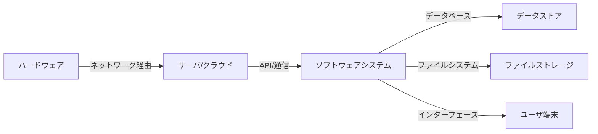
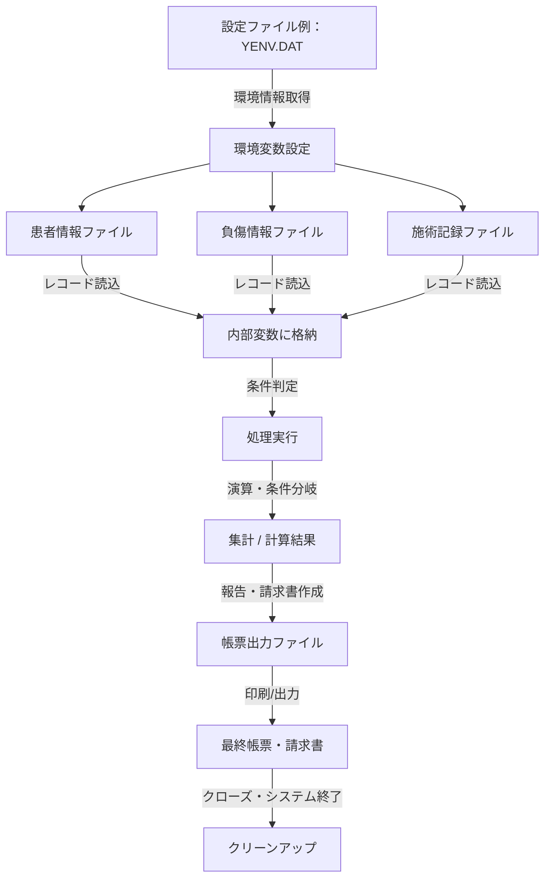
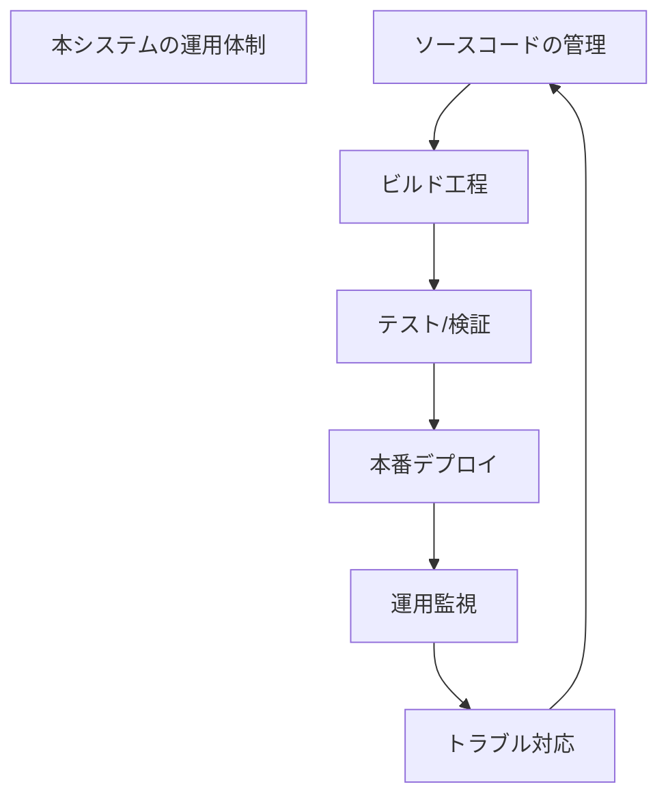

# システム仕様書 - COBOLファイル構成と連携の体系的設計

## 目次
1. [はじめに・目的と範囲](#1-はじめに・目的と範囲)
2. [システム全体アーキテクチャと構成要素](#2-システム全体アーキテクチャと構成要素)
3. [各種システムにおけるファイル群の体系と役割分類](#3-各種システムにおけるファイル群の体系と役割分類)
4. [代表的処理フローとファイル連携の全体像](#4-代表的処理フローとファイル連携の全体像)
5. [データ定義と構造の連携・整合性について](#5-データ定義と構造の連携・整合性について)
6. [セクション名: ビルドと運用の全体像](#6-セクション名:-ビルドと運用の全体像)
7. [セクション：システムの運用管理とセキュリティ](#7-セクション：システムの運用管理とセキュリティ)
8. [拡張・保守に向けた設計指針](#8-拡張・保守に向けた設計指針)

---

## 1. はじめに・目的と範囲


本書は、医療・福祉システムにおける仕様書の一部として、各種システムファイル、レコード構造、処理フロー、およびビルド環境の定義を詳細に記述したドキュメントです。これらの記述は、システムの理解、開発、保守、運用に必要な基本方針を提示し、システム全体像の把握と、関連各部門や担当者間の共通理解を促進する目的があります。

### 目的

- 医療・福祉システムの各種ファイル構造・レコード定義を明示し、システム処理内容を理解しやすくする。
- ファイル管理、データ入出力、条件処理、帳票出力のフローを規定し、実装・開発・テスト・運用の指針とする。
- システムのビルドや設定に関するルールを整理し、ビルド環境の標準化と運用効率化を図る。
- セキュリティやセンシティブな情報の取り扱いに注意しつつ、システムの全体的な設計思想と基本方針を伝える。

### 適用範囲

- 医療・福祉における情報管理システムの各種ファイル定義、レコード構造、処理・フロー設計に関する仕様。
- COBOL、NetCOBOL、Visual Studioの設定ファイル・Makefile等のビルド管理設定。
- ユーザインタフェース（画面操作や帳票出力）、内部データの管理、外部連携に関わる仕様。
- システムメンテナンスや拡張、移行、運用監査に向けたドキュメント基準。

### 基本方針

- 各種ファイルには明確なレイアウト・構造を持たせ、標準化された記述に基づき管理する。
- 条件判定とループによる処理フローを徹底し、正確なデータ操作を実現する。
- セキュリティの観点から、センシティブ情報は適切な非公開・暗号化・アクセス制御とする。
- 国や制度の変化に対応できる柔軟な資産管理と、保守コストの低減を意識した設計思想を持つ。

---

以上、システムの理解と共通認識を促す導入部として、仕様の概要と設計思想を提示いたしました。

## 2. システム全体アーキテクチャと構成要素


### 俯瞰図



###ハードウェア構成
- PC、サーバ、ネットワーク機器
- ストレージ装置
- 周辺機器（プリンター等）

###ネットワーク構成
- ローカルネットワーク
- インターネット経由のクラウド連携
- VPNや専用線によるセキュア接続

###ソフトウェア構成
- オペレーティングシステム（例：Windows、Linux）
- ミドルウェア（例：Webサーバ、APサーバ）
- アプリケーション層  
  - COBOLやC系言語によるシステムプログラム
  - 専用業務アプリケーション
  - ライブラリ・コンポーネント（DLL、ライブラリファイル等）
- データストア  
  - ファイルシステム上のレコードデータ（COBOL用ファイル）
  - RDBMSまたはシステム内のDBライクなデータ格納場所
- ユーザインタフェース  
  - 画面操作（パソコン、タッチパネル）
  - 出力帳票（プリンタ等）

###データフロー
- ユーザ端末やシステム間の通信
- 各種データファイルやレコードの読み書き
- データベースや内部データストアへのアクセス
- 現場端末と中央システム間の情報同期
- 出力帳票やレポートの生成・管理

###連携モデル
- ネットワーク通信による外部システム連携
- CobolやC系ライブラリ利用による内部処理
- ファイルシステムからの入出力を中心としたデータ管理
- API、DLL呼び出し、外部プログラムとのインターフェース

###動作概念
システムは、ネットワークを介して外部と連携しながら、各種ファイルとレコードを管理・処理し、ユーザの操作や外部からのリクエストに応じて適切な処理と帳票出力を行います。ハードウェア・ソフトウェア間の連携により、システム全体の動作とデータ流れを確保します。

## 3. 各種システムにおけるファイル群の体系と役割分類


本仕様書は、各種システムにおいて管理されるファイル群の分類と、それぞれの役割を明確に分類し整理したものである。以下に体系的なファイル分類と、その役割、相互の関連性を示す。

### 1. システム情報管理用ファイル群
システムの基本情報や設定情報を管理するファイル群。
- 例： `H_booku.COB`, `H_seijo.COB`, `H_*` 系のマスターファイル
- 役割： システム設定情報、マスタ管理情報、バージョン・環境データの格納
- 特徴： これらのファイルは、システム全体の基盤データとして利用される。

### 2. 医療データファイル群
患者情報、施術情報、負傷情報、料金情報など医療に関わる実績データ。
- 例： `H_hoken.COB`, `H_jouhou.COB`, `H_nousyu.COB`, `H_shinryo.COB`
- 役割： 医療・介護の実績データ保管・入出力
- 特徴： それぞれのレコードには複雑な構造体や多次元配列による多情報管理。

### 3. 帳票作成用ファイル群
請求書やレセプト、帳票用の出力データファイル群。
- 例： `H_sei.COB`, `H_youshi.COB`, `H_zaikei.COB`
- 役割： 統計・請求書帳票作成・出力
- 特徴： 出力用フォーマットや管理情報を含む。

### 4. 設定・ビルド・環境制御ファイル群
ビルド・コンパイル用設定や環境情報、ライブラリのパス管理。
- 例： `KHTJYOS.COB`, `KHTJYOS.MAK`, `YEN.V`
- 役割： システムコンパイル・リンク設定、環境管理
- 特徴： ビルドに必要なパス設定と環境パラメータを保持。

### 5. 共通ライブラリ・外部リンクライブラリ
システム共通の関数や外部ユーティリティ。
- 例： `uuid.Lib`, `F3BICBDM.OBJ`, `KERNEL32.LIB`
- 役割： コア関数呼び出し、ライブラリ依存
- 特徴： 他のファイルから参照される外部DLL・OBJファイル群。

### 6. 特定用途・補助ファイル
特殊な処理や補助的な役割を持つファイル。
- 例： `Yenpi1.COB`, `H_Soso.COB`, `YAMABOSI.COB`
- 役割： 補助処理、補完管理
- 特徴： 具体的には伝票補正やシステム内部補助の役割。

### 7. 外部リソース・テンプレート・設定ファイル
設定値やテンプレート、外部インタフェース定義。
- 例： `.RES`, `.XML`, `.DAT`, `.PRC`
- 役割： システム設定、UI定義、インターフェース定義
- 特徴： XMLや設定管理ファイル、マスタファイル。

### 8. 連携・通信・外部制御ファイル
他システム連携や通信制御を補助するファイル群。
- 例： `JINJACK.COB`, `GETKYORI.COB`, `H_HEADER.COB`
- 役割： システム連携、通信管理
- 特徴： 実行指示や通信設定を含む。

## 役割の相互関係と流れ
- システム構築には、「設定・ビルド系ファイル」を用いて、「共通ライブラリ」や「外部システム」依存のリンク・依存関係を整備。
- 「マスター・システム情報」ファイルは、医療・請求実績ファイルの前提データを供給。
- 実績ファイル群は、「帳票作成用」ファイルの出力基準となり、会計や請求情報に応じて利用。
- 「外部資源・インタフェース定義」ファイルは、他システムとの連携や通信を制御。

これらを体系化し、ファイルの役割と相互関係を文書化してシステムの実装と運用に役立てる。

---

## 4. 代表的処理フローとファイル連携の全体像


### 概要
本セクションでは、システムの主要処理フローとファイル間連携の全体像を体系的に整理します。処理の各ステップで用いるファイルや、それらの役割、入力・出力の関係性を明示します。処理の流れを理解するために、主な処理段階を段階的に示し、それに関連するファイルとその関係性を図示します。

### 全体処理の体系的整理

#### 1. 初期化・準備段階
- **対象ファイル**: システム設定ファイル、環境設定ファイル
- **役割**: システムの動作環境を整備。環境変数の設定、パスの定義、ライブラリの読み込み、処理モードの決定
- **入力**: 設定ファイル（例：`YENV.DAT`, `YENV.LAN`）
- **出力**: グローバル変数値、環境情報

#### 2. データ読込・検証段階
- **対象ファイル**: 患者情報ファイル、負傷情報ファイル、施術記録ファイル、マスターデータファイル
- **役割**: 必要なデータをファイルから読み込み、検証と整形を実施
- **入力例**: `患者情報`, `負傷情報`、`施術記録`
- **出力**: 内部データ変数、処理状態フラグ

#### 3. 条件判定・処理実行段階
- **対象**: 内部変数、外部関数（API呼出しやDLL）
- **役割**: 条件判定、演算、データの修正・整形
- **入力例**: 計算条件、ステータスフラグ
- **出力**: 更新済みの内部変数、次処理へのパラメータ

#### 4. 重要処理・計算段階
- **対象ファイル/データ**: 計算対象レコード、合計・平均等の集計結果
- **役割**: 計算、集計、条件別の設定対応
- **入力**: 準備された途中データ
- **出力**: 最終請求金額、帳票用データ

#### 5. ファイル書込み・帳票出力
- **対象ファイル**: 出力用帳票ファイル、請求書・レセプトファイル
- **役割**: 集計結果や請求内容の書き出し
- **入力**: 加工済みデータ、帳票フォーマット
- **出力**: レポートファイル、出力結果のプリント

#### 6. 終了処理・クリーンアップ
- **対象ファイル**: 一時・出力用ファイル
- **役割**: ファイルクローズ、メモリ解放、システム状態のリセット
- **入力**: 作業途中のデータ
- **出力**: システムの閉じ状態

### ファイル間関係と処理フローの図示



### 処理の流れ
1. **初期設定**  
   - 設定ファイル（例：`YENV.DAT`）を読み込み、システム環境やパスを設定
2. **データ読込・検証**  
   - 患者、負傷情報、施術記録などのファイルを開き、レコードを読込
   - 必要に応じて検証と整形（例：年月日変換）
3. **条件判定と処理実行**  
   - 内部変数による条件判定
   - 条件に応じた演算やフラグセット
4. **最終処理・帳票作成**  
   - 結果の集計・計算
   - 帳票や請求書に出力
5. **終了・クリーンアップ**  
   - ファイルクローズ
   - 内部変数の解放・状態リセット

### 補足
- 具体的なファイルタイプは、ファイル名や役割から判断して、診療記録ファイル、負傷情報ファイル、マスターデータファイル、帳票出力ファイル、プリンタ制御ファイルなどに分類されます。
- 各処理段階には複数のサブルーチンや条件式が付属し、業務ロジックに応じた処理がなされる。

---

この全体像を踏まえ、各処理段階とファイルの関係性を理解し、システム設計や運用計画に反映させてください。

## 5. データ定義と構造の連携・整合性について


### 概要

本セクションでは、システムにおいて用いられるデータ定義ファイル・レコード構造と、その業務運用における整合性維持の仕組みについて詳細に解説します。仕様書作成の観点から、各種データがどのように共有・変換され、どの処理・ファイル間で用いられるかを整理し、責任範囲や保守性を考慮した設計思想も併せて記述します。

---

### 1. データ定義の体系

#### 1.1 データ定義ファイルの構成
- **ファイル種類**：
  - システム設定用の構造体定義ファイル
  - 業務データ保持用のレコード定義ファイル
  - 管理・集計用のワークエリア定義ファイル
  - リソース設定ファイル（順序・出力設定）
- **主なファイルフォーマット**：
  - 固定長レコード
  - 可変長/読込可能レコード（階層的・多次元配列）
- **データ項目**：
  - 文字列（例：氏名、住所）
  - 数値（例：料金、回数）
  - 日付・時間（例：施術年月、西暦・和暦変換）
  - コード・フラグ（例：負傷種別、処置区分）

#### 1.2 レコード構造・詳細
- **構造の階層化**：
  - 個人情報レコード
  - 施術情報レコード
  - 負傷・診断レコード
  - 請求・支払い記録レコード
- **キー設定・索引付**：
  - 主キー（例：患者番号、施術年月）
  - 代替キー
  - 複合キーの設定
- **トリガー・制御用フラグ**：
  - 変更フラグ
  - 更新フラグ
  - 属性状態フラグ（例：長期、頻回）

---

### 2. 共有・変換の仕組み

#### 2.1 データの共有範囲
- **処理単位間のデータ共有**：
  - システム全体の内部データ
  - ファイル間 (読み込み／書き込み)
  - サブルーチン／モジュール間
- **共有データの同期**：
  - バッチ処理による時点の情報整合
  - 逐次処理による一貫性保持

#### 2.2 データ変換・変換処理
- **仕様化された変換ルール**：
  - 和暦と西暦の相互変換（例：YMD→年月）
  - コード・名称の変換（例：負傷種別→名称）
  - 金額・料率の加算・除算・端数処理
  - コードのバージョン管理
- **変換の責任範囲**：
  - 入力側（外部データ）
  - 処理側（内部計算・変換ルーチン）
  - 出力側（帳票、ファイルシステム）

#### 2.3 変換・整合性維持の仕組み
- **一対一変換ルールの徹底化**：
  - 各コード・フィールド毎にマッピング定義
- **データ整合性チェック**：
  - 入力値・出力値の範囲・長さ検査
  - 重複・矛盾の二重チェック
- **バッチ・リアルタイム同期**：
  - バッチ処理による定期整合
  - 即時更新による整合性維持

---

### 3. 責任範囲と保守性

#### 3.1 データ定義の責任
- **ドメイン所有者**：
  - 業務担当者
  - システム設計者
- **責任範囲**：
  - データ項目の追加・修正
  - コード・名称の更新
  - 固定長・可変長属性変更

#### 3.2 メンテナンスの原則
- **仕様書の明示化**：
  - 各レコードの役割・用途の明文化
  - 変換ルール・制御フラグのドキュメント化
- **バージョン管理**：
  - 変更履歴の管理
  - 旧データのバックアップ
- **冗長性の排除と権限制御**：
  - データの一意性担保
  - 更新権限の制御と追跡

#### 3.3 保守性を高める設計思想
- **モジュール化・分離設計**
  - データ定義と変換処理の分離
  - 共有・変換ルールと実処理の明確区分
- **標準化・規格化されたフォーマット**
  - 仕様書/コメントの徹底
  - コード・FD(定義ファイル)の整備
- **検証・試験の自動化**
  - データ整合性チェックツール
  - 旧仕様との比較テスト

---

### 4. まとめ

- 本仕様は、システムの基本設計において、データ定義とその運用の整合性維持に関する枠組みとルールを示したものです。
- 各ファイルの構造・内容を明文化し、責任範囲の限定・管理・変更履歴の追跡を徹底させることにより、長期的な保守性とシステムの信頼性向上を図ります。
- さらに、データの共有・変換における整合性を確保するためのルール設定と運用体制を整備し、安定したシステム運用とメンテナンスを実現します。

---

## 6. セクション名: ビルドと運用の全体像


### 概要
本システムのビルドと運用は、ソースコードのコンパイル、リンク、デプロイまでを自動化・標準化した工程により実現します。これらの工程は、Makefileやビルドスクリプトにより管理され、開発環境や運用環境に応じて適切なビルド処理と環境設定を行います。

### 1. ソースコードのビルドプロセス
- **コンパイル**：ソースコード（COBOL、C、アセンブリなど）から中間オブジェクトファイル（.OBJ、.COBなど）を生成。
- **リンク**：オブジェクトファイル群や外部ライブラリ（.LIB、.DLL、.OBJ）を結合し、最終実行可能ファイル（.EXE、.DLL、.LIB）を作成。
- **差分ビルド／インクリメンタルビルド**：変更されたソースのみを対象に再ビルドを行い、ビルド時間の最適化を実現。

#### 1.1 Makefileの役割
- **ビルドルールの定義**：ソースファイルごとにコンパイルやリンクのコマンドを定義。
- **依存関係管理**：ソースやライブラリ間の依存関係を記述し、正しいビルド順序を確保。
- **環境設定**：ライブラリパスやコンパイルオプションを指定し、システムの環境に合わせたビルド設定を経済的に行う。
- **クリーンアップ**：不要なファイル削除やビルドキャッシュのリセット。

#### 1.2 例
```makefile
## 例：DLL生成ルール
dll_target: mylib.obj otherlib.obj
   link /dll /out:mydll.dll mylib.obj otherlib.obj

## 依存ファイル
myLib.obj: mylib.c mylib.h
```

### 2. リソースとライブラリの管理
- **外部ライブラリのパス設定**：`LIB`, `XFDLIB`, `IN/OF Libraries` セクションで外部依存性を明示。
- **バージョン管理**：特定バージョンのライブラリを使用し、一貫性ある運用を支援。
- **ライブラリの配置**：標準システムライブラリやシステムAPIへのパスを規定。

### 3. デプロイと運用
- **自動デプロイ**：ビルド生成物（DLL、EXE、LIB）を運用環境へ自動的に配置。
- **バージョン管理**：ビルド生成物のバージョン付与、タグ付けを行い、差分や履歴の追跡を可能に。
- **運用環境の初期設定**：環境変数、パス設定、ランタイムの準備を自動化。
- **エラー監視・ログ管理**：ビルド・デプロイ後の監視とログの定期取得／分析。

### 4. 変更管理と履歴
- **バージョン管理システムとの連携**：ソースコードやMakefileの変更履歴をGitやSVNで管理。
- **ビルド履歴**：ビルド結果やエラー情報のログを履歴化し、システムの安定動作を保証。
- **差分・比較**：バージョン間の差分チェックツールにより、変更点の明確化と影響範囲の把握。

### 5. 運用手順の標準化


- **定期的なビルドとデプロイ**：変更定期反映と安定版の維持。
- **障害対応**：監視システムと連携し、異常時の対応とスナップショット取得。
- **手順書の整備**：運用頻度の高い処理やトラブル対応手順のドキュメント化。

---

以上により、システムのビルド・展開・運用の全体像を体系化し、安定運用とスムーズな変更・改修を支えます。

## 7. セクション：システムの運用管理とセキュリティ


### 概要
本セクションでは、システムのセキュリティ対策および運用上の注意点について整理します。具体的には、パスワード管理、アクセス制御、外部連携の管理と運用に関わる事項について述べます。

### パスワード管理
- パスワードの保存：システム内に平文や容易に推測可能な形式で保存しないこと。
- パスワードの複雑性：最低限の長さと文字種（数字、英字、大文字、小文字、記号）を設定し、セキュリティレベルを確保。
- パスワードの更新：定期的な変更の義務化と、使い回し防止のため別システムのパスワードと分離。
- パスワードの入力検証：入力時に妥当性をリアルタイムまたは定期的にチェック。

### アクセス制御
- ユーザー認証：強固な認証方式（多要素認証の導入検討）を推進。
- 権限管理：必要最小限の権限付与原則（principle of least privilege）を遵守。
- ログ管理：アクセス履歴や操作履歴を監査ログとして記録し、不正アクセス追跡を容易に。
- システム分離：重要システムと一般システムのアクセス層を分離。

### 外部連携の管理
- 外部APIやシステムとの接続：暗号化通信（SSL/TLS）を必須化し、認証情報は秘匿。
- ファイルの取り扱い：
  - センシティブデータに対してアクセス権限設定。
  - コーデックや公開鍵暗号を用いたデータの暗号化。
- 外部システムの認証確保：システム間認証（OAuth、証明書認証等）の適用と管理。
- コミュニケーションの保守：定期的なセキュリティ点検と暗号鍵更新。

### 運用上の注意点
- 定期監査：システムアクセス履歴および操作ログの確認。
- パッチ適用：セキュリティホール修正や運用改善のための定期パッチ適用。
- バックアップ：重要データの定期的なバックアップと、リカバリ手順の確立。
- 密封管理：センシティブ情報の取り扱いには、密封管理とアクセス制御委託手順の徹底。
- 緊急対応体制整備：不正アクセスや情報漏洩時の対応手順の策定と訓練。

### まとめ
セキュリティと運用管理は、システムの安定運用と情報漏洩防止に直結します。これらのポイントを遵守するとともに、継続的な点検と改善を実施することが求められます。

---

## 補足
- 仕様の詳細や具体的なコードの記述については、ソースコードから判断できる範囲に限定します。
- セキュリティ対策の適用にあたっては、規格やガイドライン（ISO/IEC 27001、NIST等）も考慮してください。

---

このドキュメントは、システムの安全性と信頼性を高めるための基本的な運用とセキュリティ管理の要点をまとめたものです。

## 8. 拡張・保守に向けた設計指針


### 目的と基本理念
拡張・保守を容易に行うためには、システムの設計思想を基礎としたモジュール化、ファイル・データ構造の明確化、修正手順の標準化、及び注意点の体系化が不可欠です。これらは、今後の仕様追加や既存機能の改修に伴うリスク低減と効率的な対応を可能にします。

---

### 1. 設計思想と基本アプローチ

#### 1.1 モジュール性と疎結合
- **責任分担の明確化:** 各ファイル、モジュール、サブルーチンは一つの責務に集中し、単一責任の原則を促進。
- **インターフェースの明示:** モジュール間の情報伝達は明示的なインターフェースにより制御。入力と出力のフォーマット定義をドキュメント化。

#### 1.2 ファイル・データ構造の明確化
- **ファイルレイアウトの一元管理:** 各ファイルのレイアウトは仕様書で定義し、コピーやパターン規則を共通化する。
- **データ結合と関係の明示:** JOINや参照キーの連携方法を仕様に基づき正確に記述し、原因と結果の追跡容易化。

#### 1.3 変更容易性と安全性
- **フロントエンド・バックエンドの分離:** UIとロジックは分離し、入力・出力・処理ロジックは独立させる。
- **パラメータ管理:** 重要なパラメータは設定ファイルに集約し、修正は限定範囲で行う。

#### 1.4 コーディング・命名規則
- **命名規則の標準化:** 変数名やレコード名称は意味が明示できるものとし、ドキュメント化。
- **コメントとドキュメント整備:** 変更履歴、修正理由、想定範囲を記載したコメント体系の確立。

---

### 2. ファイル・モジュール構成

```mermaid
graph LR
  subgraph core_system
    A[仕様定義書]
    B[データレイアウト定義ファイル]
    C[モジュール／サブルーチン]
    D[メイン処理プログラム]
  end

  subgraph 拡張モジュール
    E[追加処理モジュール]
    F[UI・入力処理]
  end

  subgraph 保守用設定
    G[パラメータ・設定ファイル]
    H[運用履歴・修正ログ]
  end

  A --仕様から→ B
  B -- 仕様と連携→ C
  C -- 呼び出し→ D
  D -- 結果／エラー→ H
  D -- UI連携→ F
  G -- パラメータ供給→ D
  E -- 拡張→ D
```

#### 2.1 ファイル管理のポイント
- **仕様書とレイアウト定義の整合性:** 常に仕様書に基づくレイアウト変更を反映。
- **モジュール管理:** 再利用性向上のため、汎用モジュールは共通フォルダに格納。
- **設定ファイル:** パラメータや環境設定は外部化し、バージョン管理との連携を密に。

---

### 3. 修正手順と標準作業

#### 3.1 変更前準備
- 目的と変更範囲の明確化
- 既存ソースと仕様書の整合性確認
- 事前にテストケース作成または確認済み

#### 3.2 修正作業流れ
1. **仕様理解・定義の再確認:** 仕様書・設計書の最新化
2. **対象箇所の識別:** 変更対象のシステム部分と影響範囲
3. **入力・出力の整合性検証:** データレイアウトやインタフェースの適合性
4. **コード編集:** 既存モジュール、定義、パラメータを修正
5. **内部テスト:** 該当モジュール単体、及び結合テスト
6. **総合テスト:** 全体仕様に応じて動作確認
7. **変更履歴登録 & ドキュメント更新:** 追跡と情報共有

---

### 4. 変更時の注意点・管理事項

#### 4.1 影響範囲の把握
- 既存の依存関係、コール関係のマッピングと管理
- 変更速報を関係部署へ共有

#### 4.2 バージョン管理
- ファイル単位でバージョン付与(タグ付け)
- 変更履歴と差分管理 ⇒ 差分比較ツールの利用

#### 4.3 テストと検証
- 修正箇所ごとの単体テスト計画
- 修正後の適合性確認と結果記録
- 回帰テストの徹底

#### 4.4 リスクと回避策
- 小規模単位の修正で段階的に行う
- 変更範囲の限定と影響分析の徹底
- バックアップの確実な取り扱い

#### 4.5 ドキュメントと連携
- 変更内容のドキュメント化
- 仕様変更・修正内容を最新版に反映
- 関係者間の情報共有

---

### 5. 留意点・補足事項
- **仕様変更は必ず仕様書側に記載し、関係者と共有。**
- **システムの一貫性を保つために、修正前・後の比較と差分管理を徹底。**
- **ビルド・修正ルールは自動化を意識し、スクリプトやMakefileの整備を継続。**
- **コードの命名・コメントの整備は、長期の理解とメンテナンスを支援。**
- **バージョン間の互換性を確認し、必要に応じてコードの移行計画を立てる。**

---

以上、システム拡張・保守に際して押さえるべき設計思想と手順、注意点を体系的に整理しました。これらを踏まえて適正な管理と適時の対応を行うことが、効率と安全確保に繋がります。

