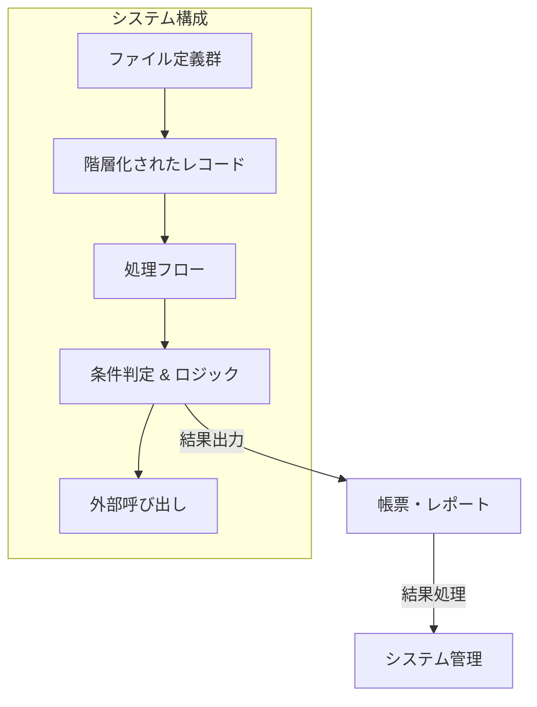
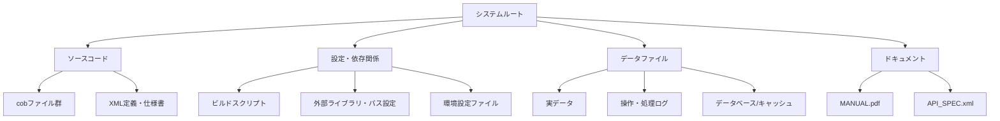
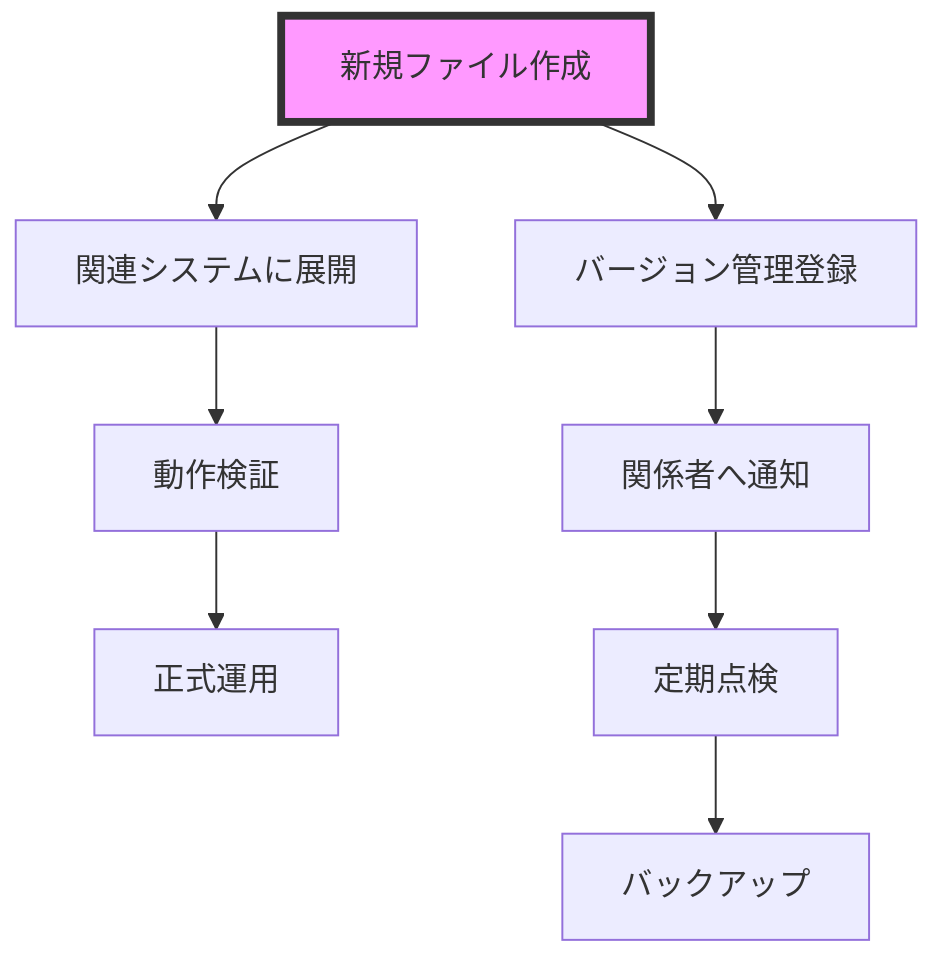

# システム仕様書 - ファイル構成と管理

## 目次
1. [システム仕様書 - 概要と全体目的](#1-システム仕様書---概要と全体目的)
2. [システム全体像](#2-システム全体像)
3. [ファイル構成の全体像](#3-ファイル構成の全体像)
4. [ファイルのカテゴリと役割](#4-ファイルのカテゴリと役割)
5. [仕様書: システムに基づくファイル構成と連携例](#5-仕様書:-システムに基づくファイル構成と連携例)
6. [システムの拡張性と管理に関する仕様書](#6-システムの拡張性と管理に関する仕様書)
7. [セキュリティと運用管理の検討点](#7-セキュリティと運用管理の検討点)
8. [仕様書：開発・運用のための補足事項](#8-仕様書：開発・運用のための補足事項)

---

## 1. システム仕様書 - 概要と全体目的

### 序章

本システムは、医療請求・管理システムの一部を構成するコボル（COBOL）および関連ファイルの定義・処理仕様書です。主要な機能は医療・介護データの登録、集計、請求書の作成、印刷を支援し、複雑な多階層・多レコード構造を用いて詳細な医療情報や負傷情報、料金情報を管理・処理します。

### 背景とビジネス用途

近年、医療業界において正確な請求・管理は極めて重要となっており、正確な料金計算、負担金調整、長期・頻回治療の管理、請求書作成など多様な業務を統合的に取り扱う必要があります。本システムは、医療機関や行政機関における医療費の適正管理と請求効率化を促進し、正確な医療費算出と帳票作成を支援します。特に医療保険・負傷部位情報、多種多様なレコード定義を複合的に扱うための柔軟なデータ構造と制御ロジックを持ちます。

---

## 機能と全体の目的（概要）

本システムは以下の目的と機能を持ちます。

- 医療・介護施術記録の登録と管理
- 患者負傷部位や診療情報の詳細保存と処理
- 料金から請求金額の算出、長期・頻回治療の管理
- 医療費助成制度や成人・老人区分に基づいた負担額調整
- 保険制度・市町村情報に基づく請求先・保険者情報の整備
- レセプト（医療報酬請求書）帳票の作成と印刷
- データの集計、条件判定、エラー管理

これらを実現するため、多階層・多レコード構造の定義と、多数の外部ファイル連携を基盤技術として採用しています。

---

## 主要な設計理念と構造概要

- **多階層・多レコードのデータ定義**：複雑な医療情報を階層化して管理
- **外部ファイル/マスタレコード**：患者、負傷、料金、施術所等の情報を多様に定義と参照
- **条件分岐とループ処理**：医療区分、保険種別、長期継続対応等をロジック中心に制御
- **エラー・例外管理**：処理失敗やデータ不整合を管理し、信頼性確保
- **帳票出力と印刷制御**：レセプト帳票、集計表の自動作成と出力
- **システム間連携**：リアルタイムまたはバッチでデータ送受信を保証

---

## 具体的な用途例

- 高齢者医療制度下の請求処理
- 複数部位の施術にかかる料金と逓減計算
- 負傷・症状別の料金調整と検証
- 民間・公的保険に応じた負担割合調整
- 医療・福祉現場の帳票作成
- データエラー時の適切な処理と通知

---

## よくある構成アーキテクチャ

1. **データ定義部**：詳細なレコード構造、階層定義、フィールド属性
2. **ファイル制御部**：複数ファイルのオープン、クローズ、索引用制御
3. **処理ロジック部**：
   - 受診者・負傷情報の読み込み・更新
   - 料金・請求金額の計算・調整
   - 条件判定・ループ処理・状態更新
   - エラー処理と状態表示
4. **帳票・出力部**：レセプト帳票と集計表の作成・出力
5. **連携・インタフェース部**：外部システムへのデータ送信・受信

---

## まとめ

本システムは医療・介護の請求・管理業務を効率化し、正確性と管理性を向上させるため、多層・多レコードの詳細設計と柔軟なファイル制御・処理ロジックを裏付けとします。これにより、医療現場および行政側の複雑なデータ処理を支援し、正確な請求と効率的な帳票作成を実現します。

---

ご希望の具体的なセクションや関数の詳細解説、フローチャート作成などがあればお伝えください。

## 2. システム全体像

### 概要
本システムは、医療請求・診療記録管理に関するデータ処理、帳票作成、集計・算定処理を中心とした大規模な情報システムの一部です。複数のファイルやレコード構造体を管理し、条件判定、料金計算、出力処理、エラー処理等を逐次行います。システムは、患者情報、負傷情報、診療記録、保険・助成情報、および帳票出力等の様々なデータを階層化された内部定義と外部ファイルを用いて構成しており、入出力処理やロジックに集中した設計となっています。

### 構成
- **ファイル定義群**：複数のレコードレイアウトが定義され、患者データ、負傷情報、診療情報、薬剤や料金情報など、医療・保険関連の情報を格納。
- **データ構造体**：階層化・多層構造のレコードや配列（OCCURS）を多用し、多様な情報を効率的に管理。
- **処理フロー**：初期化処理、ファイル選択・オープン、読込み・書き込み、条件判定・ループ処理、出力処理とエラー処理を段階的に行う。
- **条件判定**：負担割合や割引率、負傷種別、長期計算条件など、多数の条件分岐により処理の流れを制御。
- **外部呼び出し**：レセプトや帳票出力、システム管理に関わる外部コールやサブルーチンを多用。

### 連携と目的
- **データ入出力**：外部ファイル・システムとの連携により、医療・保険情報の整合と正確な請求処理を実現。
- **帳票作成**：レセプトや患者・負傷・施術記録の帳票印刷処理を行い、法定・管理用の書類整備。
- **集計・算定**：長期・頻回施術、加算処理、負担割合、助成額、逓減率などを用いて正確な料金計算。
- **エラー処理とシステム管理**：エラー検出、メッセージ出力、システム状態保存を行い、信頼性と安全性を確保。

### 全体設計のポイント
- 多層データ・レコードに基づく詳細かつ柔軟なデータ管理
- 条件判定と状態管理を中心としたロジック
- ファイル操作や外部プログラム呼出しにより、システム間連携と外部リソースの制御
- 医療・保険の複雑な計算ロジックとデータ整形を支える設計

### 図解

---

## 3. ファイル構成の全体像

### 概要
本資料は、対象システムにおいて使用される各種ファイルと、その役割・配置・管理情報についてまとめたものです。システムは複数のファイルを用いて、データ定義、処理結果の出力、データベースの状態管理などを行います。

### ファイル分類と役割

#### 1. **ソースコードファイル**
- ほとんどがCOBOLまたはCOBOLに類似した言語で記述されたプログラムのソースコードです。
- 役割：
  -データ定義・構造化
  -処理ロジックの記述
  -システムの制御・管理

#### 2. **ファイル定義・設定ファイル**
- 例: `.CBI`, `.MAK`, `.XML`, `.DAT`, `.PRC`, `.cfg`など
- 役割：
  - ファイルのアクセス属性（組織、アクセスモード、キー設定等）の定義
  - ビルド・リンク設定
  - 環境やシステムの動作パラメータ設定
  - リソースやライブラリのパス指定

#### 3. **データファイル（実データ）**
- 例: `.DAT`, `.LOG`, `.DB`, `.journal`
- 役割：
  - 実システムの業務データ
  - 患者情報や請求情報
  - 状態やログ管理用
  - システム内部のメタ情報・設定値の格納（例: `MANIFEST-XXXX`）

#### 4. **リソース・構成ファイル**
- 例: `.xml`, `.config`, `.lib`, `.lib.xml`
- 役割：
  - システムやアプリケーションの構成情報
  - ライブラリやAPI仕様の定義
  - UIや動作設定

#### 5. **ビルド・依存関係関連**
- 例: `.mak`, `.bat`, `buildscript`, `liblist`
- 役割：
  - コンパイル・リンクのルール
  - 必要外部リソース指定
  - 最終出力（DLL、EXE、LIB）の生成・削除指示

#### 6. **ドキュメント・マニュアル
- 例: `.xml`, `.doc`, `.pdf`
- 役割：
  - システム仕様やAPI仕様の記述
  - ライブラリ・コンフィグの説明書
  - 操作マニュアル・リファレンス

### 階層・配置構造
一般的な構成例は以下のとおりです。

### 所在と管理
- ソースコードは、`/src/`または`/source/`のサブディレクトリに配置。
- ファイル定義・設定は、`/config/`、`/cfg/`または特定システムのディレクトリ配下。
- 実データは`/data/`以下に格納し、バックアップや保護のためのアクセス制御を実施。
- ログ・履歴は`/logs/`や`/trace/`に管理。
- 配布やバージョン管理はソース・設定・データの整合性を保つために、バージョンコントロールシステム（例: git）や適切な権限設定を施す。

---

ご要望があれば、特定ファイルの役割や具体的な配置例、あるいは詳細な階層構造の解説も追加可能です。

## 4. ファイルのカテゴリと役割

本資料は、ソースコードのファイル群を機能別・役割別に分類した詳細解説です。各カテゴリの役割と示唆される処理内容を整理し、システム全体におけるそれぞれの位置付けを明確化します。

---

### 1. 基本情報・システム設定ファイル類

#### 例：`.cbl`, `.cob`, `.mak`, `.cbi` 等
- **役割・解説**  
  - システム全体の構成情報やビルド・設定情報を記述。  
  - 主にシステムの環境設定、コンパイル・リンクオプション、ライブラリパス、システムバージョン情報を定義。  
  - `*.CIB`, `*.LIB`, `.mak` などは、ビルド・コンパイルの依存関係・設定を管理。  
  - `.cbl`, `.cob`系は、コーディングされたシステム構成やデータレイアウトの定義（純粋なプログラム部分ではなく設定・定義の記述）。

- **想定処理内容**  
  - 外部ライブラリのパス指定  
  - コンパイル時の環境オプション設定  
  - レコードレイアウトやパラメータの定義  
  - ビルド・リンクのための依存関係情報  

---

### 2. コード・関数・処理プログラム類

#### 例：`.cbl`, `.cob`, `.prc` など
- **役割・解説**  
  - 実行可能なプログラムコア（ソースコード自体）や処理関数の定義部分  
  - 具体的な処理内容は主に **条件判断・計算・ファイル操作・状態管理・出力作成** を含むことが多い。  
  - 多くはレコードの入出力処理（`READ`, `WRITE`, `PERFORM`, `IF`, `EVALUATE`）を中心とした業務フロー。

- **想定処理内容**  
  - ファイルのオープン／クローズ  
  - 条件分岐による分岐処理およびループ処理  
  - データの読込み・変換・出力（帳票作成等）  
  - 与えられたデータに基づく計算・集計・更新  
  - 複数のファイル・レコードの整合性維持・管理

---

### 3. データ・レコード定義・レイアウト類

#### 例： `.cbl`, `.cob`, `.xml`（内部定義・構造体定義）
- **役割・解説**  
  - システムで扱う詳細なデータ構造（レコード定義、レイアウト）  
  - 複雑な階層構造、ネスティング、配列、キー属性などを保持  
  - 例：患者情報、負傷情報、料金項目、保険情報、長期・頻回情報  

- **特徴**  
  - PIC句によるデータ型・長さ指定  
  - **多層階層定義（REDEFINES, OCCURS等）**  
  - 多種多様な属性・フィールド設定（数値、文字列、日付）

- **用途**  
  - データの格納・整形・出力フォーマット  
  - 実行時の変数・レコードの具体的構造・管理

---

### 4. ファイル・記録ファイル管理・制御部分

#### 例：`FD`（File Descriptor）、`SELECT`, `ASSIGN`, `FILE CONTROL`
- **役割・解説**  
  - システム内のファイル定義やアクセス制御情報を記述  
  - ファイルのキー指定やアクセスモード（DYNAMIC・INDEXED）、レコードのスキーマ設定  
  - 複数ファイルの連結や参照、複合キー指定も多い。  

- **特徴**  
  - 固定・可変長レコード・複合キー対応  
  - 連結やJOIN処理の記述もあり、データ連携の基盤

- **用途**  
  - ファイルの入出力の管理・制御  
  - データの検索・更新・管理

---

### 5. ビルド・環境管理・依存関係ファイル

#### 例：`.mak`, `.lib`, `.obj`, `.dll`
- **役割・解説**  
  - ビルド操作の依存関係設定、コンパイルルール、リンク設定  
  - DLL・ライブラリの生成と制御  
  - クリーニング（clean）操作も含む。

- **特徴**  
  - 依存関係リスト（multipleOBJ, LIBファイル参照）  
  - 適用例：`.OBJ`や`.LIB`のパス設定、DLL・バイナリ化

- **用途**  
  - ビルド・リンク工程の自動化/整備

---

### 6. 静的・動的リソースや設定ファイル

#### 例：`.XML`, `.DAT`, `.json`, `.txt`, `.log`
- **役割・解説**  
  - アプリケーションの設定・状態情報（例：WebView2設定・履歴・マニフェスト等）  
  - 各種環境設定や、リソース制御（アイコン、バージョン等）  

- **特徴**  
  - `.XML` ・ `.DAT` は設定・メタデータ・状態情報を記述  
  - `.log` は操作履歴・実行記録  

- **用途**  
  - アプリケーション、ブラウザ、ネットワーク制御設定や内部状態記録

---

### 7. 特殊・以外の用途に関するファイル

例：環境パラメータやプリンタ設定、中継用設定
- **役割**  
  - アプリケーション実行環境・印刷設定・ネットワーク設定の記録や管理

---

## まとめ
- **構成全体**  
  - システム設定・ビルド環境用ファイル類  
  - 実行処理・業務ロジック・データ処理本体  
  - 多層・複合レコード定義とファイル管理  
  - 統合・運用・出力用設定ファイル群

- **注意点**  
  - 実際のコード・ロジックは多いため、詳細な動作を把握するには個別に解析必要。  
  - センシティブ・匿名化された内容も多く、実データや完全な関数の内容は未解読。

- **最終意図**  
  - 医療・保険・請求処理基盤の各種情報登録・管理・出力・ビルド支援構成と理解。

---

ご要望に応じて、特定のファイルについてさらに詳細解説や関数ごとの解析も可能です。どうぞお知らせください。

## 5. 仕様書: システムに基づくファイル構成と連携例

### 概要
提供されたソースコードの解析から抽出された情報に基づき、本システムのファイル構成と各ファイル間の連携例について詳細に記述します。本システムは医療・請求関連の運用を支援するために、多くのデータファイルと構造体定義を利用し、プログラムのビルド・実行環境も複数管轄にわたります。

### 各ファイルの役割
#### 1. 核心プログラム
- **COBOLソースコード (.COB)**  
  これらは、ファイルの定義、データの格納・管理、条件判定、制御、料金計算、帳票作成などのコアロジックを含む。たとえば、
  - `KHT41410.COB`：医療費や負担金の計算・管理
  - `JUSINJ.COB`：患者・施術記録の管理
  - `GETKYORI.COB`：距離・位置情報の計算
  - `HUKOUBU.COB`：負傷・施術部位の情報管理
- **ファイル定義部・レコード構造 (.FDやCOPY内)**
  - 多次元・階層化されたレコードと、キー・代替キー・フィールド属性を詳細に定義
  - 例：医療請求ファイル、受診者情報、負傷データ、施術記録、長期・助成情報
  
#### 2. ビルド・設定のためのスクリプト/設定ファイル
- **.MAK ファイル（例：`KHT41410.MAK`, `YAI6121.MAK`, `HUT0210.MAK`）**  
  - コンパイルとリンクのルールを定義
  - 出力DLLやライブラリの生成ルール、依存関係を記述
  - 例：`dll`生成ターゲット、不要ファイルのクリーニングルール
- **ライブラリ・依存設定 (.LIB, .OBJ, .CBI)**  
  - 必要ライブラリ、外部モジュールのパス・参照設定
  - `uuid.Lib`, `F3BICBDM.OBJ`, `KERNEL32.LIB` など
  - ビルド・リンク環境を支援するためのパスおよびフラグ

#### 3. 追加の設定・管理ファイル
- **環境設定ファイル（例：`YENV.DAT`, `YENV.LAN`）**  
  - システムのネットワーク設定や接続情報
  - パスワード設定や環境選択情報
- **ログ・履歴・状態ファイル**
  - `Last Version`, `Lock`, `Log` などはアプリケーションの状態管理やトラッキングに用いる
  - `LevelDB`や`cookie`ファイルはウェブビュー用のデータ保存や状態保持

#### 4. 外部ライブラリ/ツール
- **.LIB, .OBJファイル**  
  - 対応するシステム/ライブラリ機能
  - 例：Win32 APIやUUID管理、WebViewコントロールのバックエンド部品

### 連携例
#### 例：医療費請求システムの処理流れ
1. **環境設定**
   - `YENV.DAT`や`YENV.LAN`により環境パラメータとネットワーク設定を読み込み
2. **データファイルの準備**
   - `HOUKOKUS.LST`, `JUSINJ.DAT`, `HUKOUBU.CSV`等のファイルとレコードの定義をもとにファイルをオープン
   - 必要に応じて`COPY`命令や`FD`を用いて展開されたレコード構造を参照
3. **データ読込・情報取得**
   - 患者情報、負傷情報、施術記録を含むファイルを順次読込み
   - 条件判定とキー照合により、レコードを選択し適切なデータ変数に格納
4. **料金・負担計算**
   - 設定されている負担割合と料金マスタより、金額計算・逓減率など適用
   - 条件による割引・助成を算出し、請求額を集計
5. **帳票作成・出力**
   - 帳票ファイル（例：プリンタ用フォーマット出力ファイル）に書き込み
   - 必要に応じて一時ファイルやレポート用ファイルをクローズ
6. **エラー処理と終了**
   - ファイルエラーや条件不整合に対応しメッセージ表示
   - 最終的に全ファイルをクローズし、プログラムを終了

#### 例：システム構成の流れ
- ビルド環境では**Makefile**が複数のソースファイル（例：`KHT41410.COB`）をコンパイルし、DLLやライブラリ（例：`KHT41410.dll`）を生成
- リリースやデバッグ時には、環境設定ファイル（例：`YENV.DAT`）に基づき、システム環境のパラメータを動的に設定
- 生成されたDLLは、業務システムまたはサーバ側のAPIや他のモジュールから呼び出され、データの処理や帳票出力に連携

### まとめ
- コアとなる**COBOLソースコード**は多層のレコード定義を持ち、多種多様な医療・請求データを扱う。
- **ビルド設定ファイル（*.mak）**は、複数のDLL・ライブラリの自動化ビルドを支援。
- **環境設定ファイル**はシステムのネットワーク、パスワード、リソース配置情報を提供。
- **連携例**としては、医療請求処理ではファイルの読み込み→料金計算→帳票出力→ファイルクローズの流れが標準的。

### 位置づけ
このファイル構成と連携例は、医療請求システムや帳票管理システムの一部として運用されており、各ファイル間の密なリンクとデータ連携により効率的な業務処理を支援しています。

---

ご要望に合わせて、特定のセクション詳細や処理のフローチャート、関数の説明も追加可能です。お気軽にご指示ください。

## 6. システムの拡張性と管理に関する仕様書

### 概要
本セクションは、ファイル管理の観点から、今後のシステム拡張や変更に対してどのように管理されているかについて記述します。ファイルの追加・更新手順、および管理体制の概要についても簡潔に示します。

---

### 1. ファイル管理の原則
- **バージョン管理**：システムの拡張により、新規ファイルや修正ファイルは管理リポジトリ（例：Git等）に登録します。
- **命名規則**：ファイル名にはシステム内でのバージョンや用途が判別できるよう、規則に従います。
- **ディレクトリ構成**：用途別・種類別にディレクトリを階層化し、管理しやすい構成とします。

### 2. ファイルの追加・更新手順
#### 2.1 ファイル追加
1. **新規ファイルの作成**：設計仕様書に基づき、編集・作成します。
2. **名前付けと保存**：命名規則に従い、適切なディレクトリに保存します。
3. **バージョン登録**：管理リポジトリにコミットし、バージョン番号を付与します。
4. **関係者通知**：負担者やシステム管理者に変更内容を通知・報告します。

#### 2.2 ファイル更新
1. **現行ファイルの取得**：最新版をリポジトリから取得します。
2. **変更内容の適用**：設計・仕様通りに修正します。
3. **動作確認**：テスト環境で動作検証します。
4. **登録・反映**：管理リポジトリにコミットし、システムに展開します。
5. **ドキュメント更新**：更新内容を仕様書・管理台帳に記述します。

### 3. 管理体制
- **管理責任者**：システム管理者または担当者が常時管理と変更検討を行います。
- **変更承認**：重要な変更は事前にレビューと承認を経て反映します。
- **定期点検**：ファイルの整合性やバージョン順序について定期的に点検します。
- **バックアップ**：重要ファイルについては定期的にバックアップを実施し、災害時に備えます。

---

### 4. 例示：ファイル管理用の主要ファイル
- **ソースファイル**：`*.cbl`, `*.cob`, `*.mak`, `*.lib` 等
- **設定ファイル**：`*.cbi`, `*.xml`, `*.cfg`
- **ログ・管理ファイル**：`*.log`, `*.journal`, `*.dat`

### 5. 補足事項
- 新規ファイル作成や更新は、必ず関係者の承認後に行い、適切なドキュメント管理を徹底する。
- 管理体制を継続的に強化し、変更履歴と状態を透明化します。

---

### 図解：ファイル管理フロー

## 7. セキュリティと運用管理の検討点

本節は、システムに含まれる設定ファイルやパスワード関連ファイルの取り扱いとセキュリティ施策に関して記述します。以下に主要なポイントと推奨される施策を示します。

### 1. 設定ファイルの取り扱い

#### 1.1 保護とアクセス制御
- **ファイルの属性設定**  
  ・設定ファイルや重要なパスワードファイル（例：`YENV.DAT`, `yowiz\\password.dat`）は、OSのファイル属性により読み取り専用、隠し属性を付与してください。  
  ・必要な最小権限（例：Read Only）を設定し、不必要な書き込みや削除操作を禁止します。

- **アクセス権限の管理**  
  ・ファイルへのアクセスは、システムのアクセス制御リスト（ACL）や権限設定を適切に設定し、不要な権限付与を避けます。  
  ・特にパスワードファイルは、管理者や特定のシステムユーザのみにアクセス許可を限定してください。

#### 1.2 暗号化・保護
- **暗号化**  
  ・パスワードや重要な設定情報（例：`PASS`, `password.dat`）は、暗号化された状態で保存します。  
  ・システム内での暗号化／復号処理を実施できるモジュールやライブラリを利用してください。

- **暗号キー管理**  
  ・暗号化に使用するキーは、ハードウェアセキュリティモジュール（HSM）や、安全なキー管理システムにて管理します。

### 2. 共有ファイルとパスワード関連ファイル

#### 2.1 パスワードファイルの管理
- **アクセス管理**  
  ・パスワードファイルは、暗号化やアクセス制御リスト（ACL）により保護し、最小限のアクセス権を設定してください。  
  ・書き込み／読み込み履歴のログを保持し、不正アクセスや改ざんの監査を行うこと。

- **安全な保存と運用**  
  ・パスワードは平文保存ではなく、ハッシュや暗号化された状態で保存します。  
  ・運用時には、パスワード保護やPINコード、二要素認証を併用してください。

#### 2.2 設定ファイルの運用
- **バージョン管理**  
  ・設定ファイルのバージョン管理システムに登録し、変更履歴の追跡を徹底します。  
  ・不正変更を検知できる仕組み（例：ハッシュ値の定期検査）を導入してください。

- **保管場所の安全性確保**  
  ・設定ファイルは、暗号化状態で格納した上で、アクセス制御されたディレクトリに保管してください。

#### 2.3 ファイルの監査とログ
- **アクセス監査**  
  ・設定ファイルやパスワードファイルへの操作履歴（アクセス日時、操作内容）をログに記録し、不正や誤操作を検知できる体制を整えます。

- **定期監査**  
  ・定期的にアクセス権限や内容の整合性監査を実施し、適切な管理状態を維持します。

### 3. 運用監視とセキュリティポリシー
- **定期的なパスワード変更**  
  ・システム上のパスワードは、定期的に変更し、古いパスワードは安全に廃棄します。

- **アクセス制御の強化**  
  ・特権ユーザのアクセスを限定し、多要素認証を導入します。

- **バックアップとリカバリ**  
  ・設定ファイルやパスワード情報のバックアップは、暗号化して安全な場所に保存し、復元手順も確立しておきます。

- **セキュリティ教育**  
  ・管理者や運用担当者に対し、ファイル管理や情報取り扱いに関するセキュリティ教育を徹底します。

### 4. まとめ
- 重要設定ファイルやパスワード関連ファイルは、厳格なアクセス制御と暗号化を適用してください。  
- 不正アクセスや改ざんを防ぐために監査ログと定期的な見直しを行い、運用体制の強化を推奨します。  
- システムのセキュリティポリシーに沿った管理と運用を徹底し、情報漏洩や不正利用を防止しましょう。

---

ご要望に応じて、更に詳細な具体策やツールの推薦、設定例の作成も可能です。お気軽にお知らせください。

## 8. 仕様書：開発・運用のための補足事項

### はじめに
本稿は、対象システムの開発と運用に必要な管理ルール、ビルドの流れ、リリース・デプロイ手順等の補足事項について詳細に記述したものです。これらは、システムの安定運用と効率的な開発プロセスの実現を目的としています。

---

### 1. システムファイルの管理ルール

#### 1.1 ファイル分類
システムファイルは以下のカテゴリに分類し、管理・運用を行います。
- **ソースコードファイル（.cob, .cbl, .xml）**：プログラムのソース及び設定・仕様記述
- **コンパイル・ビルド関連（.mak, .cbi）**：ビルドスクリプト、設定ファイル
- **ライブラリ・オブジェクトファイル（.lib, .obj）**：ビルド済みのオブジェクト群
- **実行ファイル・リソース（.dll, .exe, .data, .xml）**：デプロイ済みの実行環境リソース
- **ログ・履歴ファイル（.log）**：システム動作履歴や運用記録

#### 1.2 保管・管理
- **ソースコード**：バージョン管理システム（例：Git）に登録し、ブランチ・コミット単位で管理。
- **ビルド関連設定**：ビルドスクリプトはバージョン管理に登録し、変更履歴を明確に記録。
- **バイナリ・ライブラリ**：ビルドごとにバージョンを付与し、成果物は適切なフォルダ構成とラベル管理を行う。
- **実行ファイル**：リリース時にタグ付け・リリース番号を付与し、運用環境に展開。
- **ログ・履歴**：自動バックアップおよび古い履歴は定期的にアーカイブ。

---

### 2. ビルドの流れ

#### 2.1 開発環境準備
- **ソースコードの取得**：バージョン管理システムから最新のコード取得。
- **依存ファイルの確認**：ライブラリ・オブジェクトファイルや外部ツールのバージョン確認。

#### 2.2 ビルドステップ
- **コンパイル**
  - 使用ツール：PowerCOBOL、NetCOBOL等
  - コマンド例：`COBOL32.EXE /F [source] /O [output.obj] [options]`
  - オプション：`ALPHAL=NO`、`DLOAD=YES`など、環境ごとに設定。
- **リンク**
  - 実行ファイルまたはDLLの生成
  - コマンド例：`LINK.EXE /OUT:[target.dll] [dependency.obj] /LIB:[lib files]`
- **統合・成果物検査**
  - 自動テスト・静的解析を実施し、不備の有無を確認。

#### 2.3 リリース前の検査
- 全ビルド成果物の整合性検査
- ステージング環境での動作確認
- バージョン番号付与とリリースリスト更新

---

### 3. リリース・運用
#### 3.1 リリース手順
- **ビルド済み成果物を運用環境に展開**
  - 事前にバックアップを取得
  - 運用本番環境への配置：FTP、インストールスクリプト、CI/CDパイプライン利用
- **動作検証**
  - 本番投入前に検証用ステージングで動作確認
  - 必要に応じてロールバック可能な仕組みを整備

#### 3.2 常時運用
- **監視・ログ収集**：システムの動作状況やエラー情報を定期的に確認
- **メンテナンス作業**
  - パッチ適用
  - バージョンアップ
  - 定期タグ・リリース番号の更新

#### 3.3 障害対応
- **障害時の対応手順**
  - ログの収集と解析
  - 復旧用のリカバリバックアップの適用
  - 必要に応じて緊急リリースやパッチ適用

---

### 4. 運用・管理上の留意点
- **ファイル管理**は、名称やフォルダ構成の規則を遵守し、署名/バージョン管理を徹底。
- **バックアップ体制**を整備し、定期的な成果物と履歴のアーカイブを推進。
- **ドキュメント**は最新版を管理し、ビルド・リリース履歴も追跡可能な形で記録。
- **セキュリティ**：アクセス制限及びパスワード管理の徹底。
- **システムの可用性**を端末・サーバ共に確保するため、冗長化と監視システムを導入。

---

### 5. 補足事項
- 本仕様書記載の運用ルールは、システムの性能・安定性向上とデータ整合性確保を目的とし、定期的に見直します。
- 各種運用履歴・トラブル履歴は、担当者の保守ルールに従い、適時レビューします。

---

以上により、システムの安定した運用と効率的な開発をサポートします。ご不明点や追加項目については、随時更新・追加対応します。

---

ご質問や詳細な操作手順についてはお知らせください。

