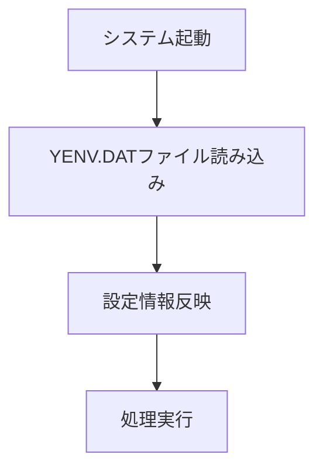
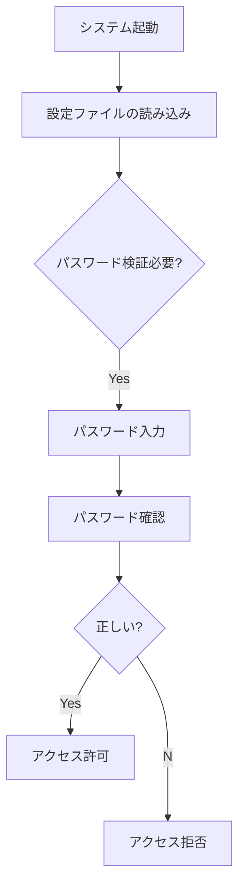

# システム仕様書

## 目次
1. [以下は、提供された複数のファイルパスと関連情報に基づき、システムの仕様書の「はじめに」セクションを作成した例です。](#1-以下は、提供された複数のファイルパスと関連情報に基づき、システムの仕様書の「はじめに」セクションを作成した例です。)
2. [以下は、提供されたファイル一覧とそこから得られる情報をもとに、システム概要の詳細な説明です。](#2-以下は、提供されたファイル一覧とそこから得られる情報をもとに、システム概要の詳細な説明です。)
3. [はい、掲載された内容から、以下のような点を整理してファイル構成の概要とします。](#3-はい、掲載された内容から、以下のような点を整理してファイル構成の概要とします。)
4. [以下は、「仕様書 - セクション「ソースコード関連の構成」」の詳細です。](#4-以下は、「仕様書---セクション「ソースコード関連の構成」」の詳細です。)
5. [設定・環境ファイルの構成](#5-設定・環境ファイルの構成)
6. [以下は、仕様書「データファイルの構成」の詳細解説です。](#6-以下は、仕様書「データファイルの構成」の詳細解説です。)
7. [以下は、提供された複数のファイルパスと記述内容から推測されるシステムのビルドおよびリンクの仕組みについての仕様書です。](#7-以下は、提供された複数のファイルパスと記述内容から推測されるシステムのビルドおよびリンクの仕組みについての仕様書です。)
8. [システムの運用に向けた設定](#8-システムの運用に向けた設定)
9. [セキュリティ・コンフィギュレーション](#9-セキュリティ・コンフィギュレーション)
10. [システム拡張・メンテナンスのための構成](#10-システム拡張・メンテナンスのための構成)
11. [付録・補足資料](#11-付録・補足資料)

---

## 1. 以下は、提供された複数のファイルパスと関連情報に基づき、システムの仕様書の「はじめに」セクションを作成した例です。


## はじめに

本システム仕様書は、特定の医療・福祉システムの運用と管理に必要な内部構造や設定情報を明確に示すことを目的としています。システムは、多種多様なデータを扱い、複雑なデータ構造と多層階層のファイル管理を通じて、患者情報、負傷履歴、請求データ、施術記録、帳票出力などの業務処理を支援します。

本システムの適用範囲は、医療機関や福祉施設における電子レセプト作成、請求処理、データ管理、帳票出力の自動化および効率化です。また、医療情報の入力、格納、出力に関わる各種プログラムやリソースの仕様と連携関係も含まれます。

基本方針として、本システムは次の点に焦点を当てています。

- 確実なデータ管理と整合性の維持
- 効率的なデータアクセスと高速処理
- 多様な業務フローに対応した柔軟なファイル構造とロジック設計
- セキュリティとプライバシー保護を意識したデータの取り扱い
- 拡張性とメンテナンス性を確保した設計

これらを実現するために、システムは大量の定義済みファイルと詳細なデータ構造を備え、業務ごとに特化した処理を行う複雑な設計となっています。

---

### 付加情報

今回出力された資料には、主に以下の外部リソースやファイルパスがリストアップされており、これらはシステムの核心部分を形成しています。

- 各種メタ情報ファイル (`MANIFEST-XXXX`, `Verti5630.xfd`, etc.)
- コマンドや設定ファイル (`.mak`, `.cob`, `.cbi`, `.xml`, `.dat`)
- ビルドに必要なOBJ・LIB・DLLファイルのパス
- データレイアウトやレコード構造の定義ファイル
- アプリケーション用リソースや環境設定ファイル

これらの情報を基に、システムの設計、設定、運用における基本方針および構造の全体像を把握していただくことが目的です。

---

これにより、システムの内部構造および設定関係の意図と骨組みを理解できる基礎資料となります。

---

ご要望に合わせて調整や追記も可能です。

## 2. 以下は、提供されたファイル一覧とそこから得られる情報をもとに、システム概要の詳細な説明です。


## システム概要

本システムは、医療および福祉に関連したデータ処理と帳票出力を主な目的とした情報管理システムの一部です。具体的には、多数のデータファイルの定義、各種レコードの構造設計、ファイルの入出力制御、条件判定、集計処理、および帳票やレセプトの作成・出力を行うための基盤となるプログラム群により構成されています。

### 全体構成

システムは以下のような主要な要素から成り立っています。

- **ファイル定義とレコード構造**  
  多種多様なファイル（マスタファイル、トランザクションファイル、帳票用アウトプットファイル等）のレイアウトとレコード構造を詳細に定義し、これを管理するための定義部を含みます。例：患者情報、施術記録、負傷情報、負傷原因、請求項目、薬剤・材料管理等

- **データ処理と集計**  
  ファイルからのデータ読込みとデータの配置、変数への集計、条件に基づく分類・絞り込み、計算処理を行います。特に、部位別料金の設定、長期・短期割引の適用、患者の保険・負担区分の判定、負傷部位や負傷原因の絞り込み、金額や回数の合計などが中心です。

- **条件判定とエラーハンドリング**  
  多数のIFやEVALUATE文により条件判定を行い、必要に応じてエラーメッセージ表示や処理停止、警告出力を実装しています。例として、ファイルが正常にオープンしない場合のエラーや、負傷原因の不一致などの例外ハンドリングを含みます。

- **帳票・レセプトの出力**  
  収集・整形された情報を帳票やレセプトフォーマットに配置し、プリンタ出力や外部出力フォーマットで帳票を作成します。帳票のヘッダー、明細項目、総合計や付随項目も管理し、印刷前の最終調整を行います。

- **環境設定とリソース管理**  
  各種設定ファイルやリソースファイル（例：設定パラメータ、環境変数、ファイルパス、マスタ登録情報）を読み込み、システムの動作を制御します。追加的には、ライブラリのパス指定やバージョン情報も管理します。

- **システムの初期化および終了処理**  
  ファイルオープン・クローズ、環境変数の設定、エラー時の処理、リソース解放といった処理を整然と管理し、システム全体の安定動作を確保します。

### 内部インターフェース

システムは内部的に複数ファイルの連携とデータ取り扱いを行います。例：
- 外部マスタファイル（施術所、負傷原因、負傷部位、保険者マスタ等）
- 入力ファイル・トランザクションファイル
- 連結用出力ファイル（レセプト、帳票、一覧表等）

これらのファイル群のレコードは、多層の構造で定義され、必要に応じてJOINやCOPYを駆使し、効率的なデータ伝送と出力を行います。

### 役割と動作の全体像

このシステムは、医療・福祉関連のデータを管理し、請求書やレセプトの作成を自動化・効率化することを目的とします。多岐に渡る医療施術情報、負傷・施術部位、料金、負担区分を一元管理し、必要なときに迅速に帳票へ反映、出力を行います。徴収処理や負担割合に応じた調整、特殊ケース（例：自賠責・労災、助成金、長期逓減処理）にも対応できる高度なデータ処理エンジンです。

これにより、医療費や行政関連の帳票作成、保険・自賠責の請求処理、追加料金の計算、税務対応など、多岐にわたる業務を支援します。

---

※このシステムは主にCOBOLを基盤とし、大規模なレコード定義と複雑な処理フローを有しているため、詳細な制御ロジックはソースコード内の各定義と処理フローに依存しています。

## 3. はい、掲載された内容から、以下のような点を整理してファイル構成の概要とします。


---

## ファイル構成の概要

### 1. ファイルの役割と位置付け
- **ソースコードファイル (.cob, .cbl, .c)**
  - COBOL・C系言語で記述されたプログラムの記述内容
  - 医療や福祉、請求処理、ファイル操作や制御処理などのロジック本体
  - 処理前のデータ定義や変数宣言
- **設定・構成ファイル (.CBI, .RC, .CFG, .MAK)**
  - コンパイルやリンク設定
  - ライブラリやオブジェクトファイルのパス設定
  - ビルドルールと依存関係定義
- **ライブラリファイル (.LIB, .OBJ, .DLL)**
  - 外部ライブラリ・静的/動的ライブラリ
  - COBOL・Cライブラリ/ビルド済みDLL
  - アプリケーションのリンクや実行に必要な共用資源
- **データファイル (.DAT, .LOG, .XML, .CSV)**
  - 実行時データや設定情報
  - ログ・履歴・マスタデータ
  - WebView2の設定や管理情報
  
### 2. 配置や階層
- **COBOLソースや設定ファイルは**
  - プロジェクトのルートもしくは対象のサブフォルダ（例：`\pg\`や`\\obj\\`）に配置
  - それぞれのモジュールや機能毎に分類・整理
  - **ライブラリやバイナリは**
    - `\obj\`や`\\Release\`, `\\Debug\`　などのビルド出力先に配置
    - 複数バージョンやターゲット向けに整理されている
- **データファイルやログは**
  - アプリケーションの実行ディレクトリや専用フォルダに配置（例：`WebView2\`以下や`\\shared_proto_db\\`など）
  - セキュリティやバージョン管理のために特定フォルダに分離
    
### 3. 役割と分類
| 種類 | 配置例 | 役割/内容 |
|--------|---------|--------------|
| **ソースコード** | `\pg\`以下の`.cob/.c` | システムのロジック・処理本体（医療費計算・印刷・ファイル操作・制御） |
| **設定ファイル** | `*.CBI`, `*.RC`, `*.MAK`, `*.CFG` | ビルド設定、環境設定、依存関係定義、環境変数 |
| **ライブラリ/オブジェクト** | `\obj\`以下`*.LIB`, `*.OBJ`, `*.DLL` | コードの依存部品、ビルド済みライブラリ、共有DLL |
| **データ/履歴ファイル** | `\WebView2\\.*`  • `*.DAT`, `*.LOG`, `*.XML`, `*.CSV` | 実行時データ、設定情報、履歴・ログ・システム情報 |

### 4. まとめ
- **ソース**はシステムの業務ロジック・処理のための記述
- **構成・設定ファイル**はビルドや環境の整備に用いられる
- **ライブラリ・バイナリ**はシステムの依存部品や実行可能要素
- **データファイル**は運用中の情報保持・履歴・設定に利用

---

この概要は、ご提示された複数のファイルパスと種類から推測したもので、具体の処理内容やファイルの内部詳細を含むものではありません。適宜、実際のディレクトリ構成や各種ドキュメントと照合してください。

## 4. 以下は、「仕様書 - セクション「ソースコード関連の構成」」の詳細です。


## ソースコード関連の構成

このセクションは、システム開発において利用されるCOBOLおよび.NETアセンブリのソースコードやライブラリ、設定ファイルの構成について解説します。ソースコードの配置、外部リソースの取り込み、ビルド・リンクに関する設定などの要素を体系的に整理し、その役割と連携関係を明示します。

### 1. 構成の概要

- **ソースコードの種類**：
  - COBOLプログラム
  - .NETのXMLリソース定義ファイル（例：Microsoft.Web.WebView2の設定XMLやアセンブリ定義）
  - ビルドに関連する設定/スクリプトファイル（Makefile構成）

- **共通の役割**：
  - データ定義とファイル構造の記述
  - 環境設定やシステムパラメータの管理
  - ビルドとリンクの依存関係定義
  - 各種レコードや構造体の宣言・定義
  - アプリケーションのUI、帳票出力、通信などの制御設定

### 2. ソースコードの配置と管理

#### 2.1 COBOLソースファイル
- **配置**：
  - 例：`code/test\cbl\*.CBL`や`code/test\comsys\pg\*.cob`等、特定ディレクトリに整理
- **内容と役割**：
  - ファイルの定義（レコードレイアウト、データ構造）
  - 活用例：医療請求情報、患者情報、負傷記録、料金設定など
  - 処理論理はコメント・コメントアウト部分に記載されるか、別の実施コードに委ねる

#### 2.2 リソース・設定ファイル
- **XMLファイル**：
  - `.xml`形式で、システム設定、環境情報、リソースのメタ情報を定義
  - 例：`Microsoft.Web.WebView2.Wpf.xml`や`YENV.DAT`

- **設定・スクリプトファイル（Makefile）**：
  - `.mak`や`.cob`の形式
  - 例：`YAWARA.MAK`、`VERUPGO.MAK`など
  - 役割：
    - コンパイル／リンクのルール定義
    - 出力DLL、LIBの生成指示
    - 不要ファイル削除（クリーンアップ）

### 3. 外部リソースの取り込みと依存関係

#### 3.1 ライブラリ・オブジェクトファイル
- **例**：
  - `uuid.Lib`
  - `F3BICBDM.OBJ`
  - `KERNEL32.LIB` 等システムライブラリ
  - 各種 `.OBJ`, `.LIB` のパス設定

- **役割**：
  - ライブラリの機能を呼び出すための依存関係
  - ZIP圧縮やWindows API、Microsoft Edge WebView2の機能利用

#### 3.2 依存関係の管理
- **リンク設定**：
  - `.LIB`や`.OBJ`ファイルのパスを列挙し、リンク時にこれらを結合
  - WinAPIやサードパーティライブラリとの連携を含む

### 4. ビルド・リンク設定

#### 4.1 Makefileの役割と構成例
- **主要内容**：
  - `.COB`ファイルから`.OBJ`ファイルへのコンパイル
  - `.OBJ`からDLLや静的ライブラリ（`.LIB`）の生成
  - 出力先ディレクトリの指定
  - 不要ファイルの削除ルール
- **例**：
  - ターゲット：`YAWARA.DLL`, `VERUPGO.dll`, `ZWAHRY.dll`
  - ルール：
    - `COBOL32 /C`や`LINK`コマンド
    - 必要なライブラリの追加と依存先の指定

#### 4.2 システムとの連携
- **ビルドのおおまかな流れ**：
  1. ソースコマンドで`*.cob` ->`*.OBJ`
  2. `*.OBJ`をリンクしてDLLやライブラリを生成
  3. 出力ファイルを所定のパスに配置
  4. 不要ファイル削除（クリーン）

### 5. コミュニケーション・インターフェース設定

#### 5.1 外部API・コール
- **例**：
  - WebView2のAPI（Microsoft のXMLファイルに詳細定義あり）
  - Windowsシステムコール
  - Web通信用のXML・JSON設定

- **用途**：
  - UI操作、Webコンテンツの埋め込み
  - 環境設定や動作性の調整

### 6. まとめ

この構成のポイントは、以下の通りです：
- **ファイル構成と役割分担**：
  - ソースコード（COBOL）とリソースXML・設定ファイルの分離
  - ビルド用Makefileにより、一連の自動化と依存管理
- **依存関係と連携**：
  - 外部ライブラリやシステムAPIとの結びつき
  - WebView2コントロールをはじめとした、多機能なUIコンポーネントと連携
- **設計理念**：
  - 仕様の分離と可読性確保
  - システムの拡張やメンテナンス容易化

以上の内容は、システム全体のソースコードと設定ファイルの配置・役割・連携関係の理解を深める基盤となります。

## 5. 設定・環境ファイルの構成

=========================

概要
----

本セクションでは、ビルドや動作に関わる各種設定ファイルの構成と、その用途について詳述します。これらの設定ファイルはシステムの構築、管理、実行環境の維持、ビルド調整に不可欠なものであり、各ファイルの配置場所と役割を明確にします。

1. ライブラリパスやコンパイルオプションの設定ファイル
---------------------------------------------------

用途
----

- 業務プログラムのコンパイル時における最適化や動的リンクの設定。
- 使用する外部ライブラリや標準ライブラリのパス指定。
- コンパイルの細かいオプション（ ALPHAL=No, DLOAD=Yes など）の設定。
- ライブラリ間の依存関係調整や環境特有の設定調整。

存在場所
--------

- プロジェクトの「build」または「config」ディレクトリ内。
- 特定システムやビルドツール（例：Makefile, build.bat, .cfgファイル）の中。
- 一部はクロスコンパイルや複数環境対応用に分割された設定ファイルとして管理。

役割
----

- プログラムのビルド時に必要なコンパイルオプションの一元管理。
- 環境依存のパスやライブラリの場所を明示し、ビルドの自動化と整合性確保。
- 他の設定ファイルと連動し、ビルドスクリプトまたはツールチェーンの動作を制御。

2. 各種パラメータや環境設定の定義ファイル
-------------------------------------------

用途
----

- 実行環境パラメータ（例：日時、バージョン情報）の格納。
- 環境変数や設定値による動作の微調整。
- 外部とのインタフェース、キー値、状態情報の管理。

存在場所
--------

- アプリケーションの「settings」や「config」フォルダ。
- 実行シナリオに応じた環境ごとのパラメータファイル。

役割
----

- 実行中のシステム状態や設定値を保持、アクセスしやすく調整。
- 環境変数やパス、閾値など運用パラメータの集中管理。
- アプリケーション起動時に参照され、動作調整やバージョン管理に寄与。

3. これらの存在場所と役割
----------------------

配置
----

- プロジェクトルート直下の「conf」や「config」「settings」などのフォルダ。
- CI/CDパイプラインの管理下のビルド環境設定ディレクトリ。
- 複数環境を想定したサブディレクトリ（例：prod, dev, test）。

役割
----

- ビルド環境の一貫性確保：環境ごとのパスや設定を調整。
- システムの安定動作：環境差異を吸収し、動作の不整合を防止。
- 環境管理の効率化：設定の集中管理と自動化を促進。
- セキュリティと管理：センシティブな設定値（例：パスワード）のセキュア管理。

---

以上により、システムのビルドや動作環境を柔軟に管理し、安定した運用とメンテナンスを支援します。

## 6. 以下は、仕様書「データファイルの構成」の詳細解説です。


## 仕様書：データファイルの構成

### 1. 概要
本セクションは、システムにおいて使用されるデータベースや入出力ファイルの構造と管理方法について記述します。特に、データレコードの定義、ファイルの位置関係、アクセス設定および管理手法に焦点を当てています。

---

### 2. ファイルの位置と構造
#### 2.1 データファイルの種類
- **主なファイルの種類**：入力ファイル、出力ファイル、管理ファイル
- **形式**：固定長レコードファイル、インデックスポジション・アクセスファイル、バイナリファイルなど

#### 2.2 ファイルの物理的配置
- 既存のファイルパスとディレクトリ：
  - 例：`H_husyou.dat`
  - 例：`jusan.exe.WebView2\EBWebView\Default\`フォルダ内
- これらは、システム起動時に指定されたパスに配置され、ファイルアクセス時に参照される。

---

### 3. 主要なデータレコード定義
#### 3.1 レコードの構成
- **レコード例**：
  - 記録項目例：患者番号、施術日付、負傷部位、料金、保険区分等
  - 共通仕様：長さ固定、文字列・数値フィールド、階層構造（複合レコード）
- **レコードレイアウト**：
  - 項目分割：ヘッダー情報、詳細情報、補助情報などに分割
  - 例：`レコードキー`や`キー名称`、`登録日時`、`負傷識別子`、`診療料金`としてのフィールド

#### 3.2 フィールドの型と長さ
- 数値型：PIC 9(4)（4桁整数）、PIC 9(6)など
- 文字列型：PIC X(10)、PIC X(135)等
- 配列・階層構造：複数の同種レコードレベル（例：FILLER領域の再定義）

#### 3.3 ネストと階層化
- 1レコード内に複数階層のグループを持ち、多次元のデータ管理
- 例：`施術年月日`と`負傷期間`、`負傷箇所`、`負傷原因`などを再帰的に定義
- これにより、多部位・多期間の管理が柔軟に行える

---

### 4. データ利用用途と連携
#### 4.1 利用用途
- **入出力データ**：患者、負傷、施術、料金等の管理
- **帳票作成**：請求書、負傷履歴表、監査レポート
- **データ照会・更新**：レコードの新規登録、更新、削除
- **連携処理**：外部システムとのデータ交換、バッチ処理

#### 4.2 データ間の連携
- ファイル結合：COPY文やJOINによる複数ファイルのレコード連結
- 共有メモリ・バッファ：一時的なデータ保持、レコードの一括処理
- 外部APIやライブラリの呼び出し：負傷情報や請求額の算出、補正調整

---

### 5. ファイルアクセス設定と管理
#### 5.1 アクセス方式
- **インデックス付アクセス**：
  - 項目：レコードキー、代替キー
  - 方法：索引付検索（例：B-Tree）
- **アクセスモード**
  - **DYNAMIC**：動的にファイルレコードにアクセス
  - **INDEXED**：インデックスを利用した高速検索
- **ロックモード**
  - 自動ロック設定：複数プロセス・ユーザでの排他制御
  - ロック解除や解放のコントロール

#### 5.2 ファイルの管理手法
- **オープン／クローズ**管理
  - 開始/終了時に必ずオープン・クローズ処理
- **エラー処理**
  - ファイル読込み失敗時のエラー通知
  - ロック異常時のリトライまたは通知
- **データ整合性の保持**
  - 重複レコードの排除
  - 更新・削除後のファイル状態確認
- **セキュリティ**
  - パスワード/アクセス制御
  - 監査ログの記録

---

### 6. 管理形態および運用
- **ファイルのバックアップと復元**
- **定期的な整合性検査**
- **アクセス監査・ログ管理**
- **状態管理とデータの一貫性維持**
- **プログラムの自動化／バッチ処理対応**

---

## まとめ
本セクションでは、システムが使用するファイルの構造と管理手法、主なレコード定義、並びにアクセス設定について包括的に記述しました。これにより、システム内のデータ整合性、効率的なアクセス、適切な管理体制の確立を実現します。

---

備考：詳細なレコード定義やフィールドの具体的な内容は、実体のソースコードやデータ仕様書に基づきます。必要に応じて、その資料と補完してください。

## END

## 7. 以下は、提供された複数のファイルパスと記述内容から推測されるシステムのビルドおよびリンクの仕組みについての仕様書です。


## ビルドおよびリンクの仕組み

### 1. 概要
本システムは、NetCOBOL環境下において COBOL ソースファイルおよび外部ライブラリを用いた複合的なビルド・リンクを自動化し、DLL・ライブラリの生成を行います。ビルドは複数のターゲットを持ち、DLLやライブラリファイルの一元管理と再ビルド、クリーンアップを可能にします。

### 2. 利用技術
- **NetCOBOL Compiler & Linker**： COBOLソースのコンパイルとDLL/ライブラリのリンクを自動化
- **Makefile（バッチ・スクリプト風）**： ビルド手順の定義および依存関係管理
- **外部ライブラリ・オブジェクトファイル（OBJ, LIB）**： 既存のモジュールや共通ライブラリを利用

### 3. スクリプト構成
ビルドスクリプトは複数のターゲットと依存関係を定義し、次の要素を含む。

#### 3.1. ソースファイル
- `*.cob`： COBOLソース
- `*.obj`： 中間オブジェクトファイル（MV後）
- `*.dll`： 動的リンクライブラリ
- `*.lib`： ライブラリ

#### 3.2. ターゲット定義
- DLLの生成ルール：
  - `xxx.dll`は`xxx.obj`からリンク
  - 複数のDLLが異なる出力パスに生成
- ライブラリの生成：
  - `*.lib`は`*.obj`やDLLから生成される（静的ライブラリ）
- クリーン：  
  - 生成物の削除ルール（`del`コマンド等）

#### 3.3. ビルド手順
- **コンパイル**：  
  - `COBOL32.exe`や`link.exe`を用いてソース`*.cob`から`*.obj`を生成
- **リンク**：  
  - `link.exe`または`PowerCOBOL`付属のリンカにより`*.dll`や`*.lib`を生成
- **依存管理**：  
  - コマンドと依存関係を記述（ターゲットの再ビルド判定）
- **拡張**：  
  - 複数出力先（サブディレクトリや別パス）へのDLL配置

### 4. 依存関係とパス設定例
- **オブジェクトファイル**：  
  ```
  OBJDIR\xxx.obj
  ```
- **ライブラリ**：  
  ```
  LIBDIR\uuid.Lib
  LIBDIR\F3BICBDM.OBJ
  LIBDIR\F3BICIMP.LIB
  LIBDIR\KERNEL32.LIB
  ```
- **出力先**：
  ```
  destination\xxx.dll
  destination\xxx.lib
  ```

### 5. 参考の設定例
```batch
## 依存ファイル
SOURCES= \path\to\source\XXXX.cob
OBJECTS= \path\to\obj\XXXX.obj
LIBS= \path\to\lib\uuid.Lib \path\to\lib\F3BICBDM.OBJ \path\to\lib\F3BICIMP.LIB \path\to\lib\KERNEL32.LIB

## DLL出力
dll: $(OBJECTS)
    link /DLL /OUT:destination\XXXX.dll $(OBJECTS) $(LIBS)

## ライブラリ出力
lib: $(OBJECTS)
    link /LIB /OUT:destination\XXXX.lib $(OBJECTS) $(LIBS)

## クリーン
clean:
    del $(OBJECTS)
    del destination\*.dll
    del destination\*.lib
```

### 6. 補足事項
- **環境変数設定**：  
  - パスやツールパスの設定（例：`PATH`, `COBOLSDK_PATH`）
- **依存性管理**：  
  - ソースの更新日時に応じた再ビルド判定
- **ビルド制御**：  
  - 複数DLL・ライブラリの同時ビルド可能
  - 依存関係を正確に記述し、必要に応じてヒューマンエラー防止

### 7. まとめ
本システムは、複数のソースとライブラリの連携を容易にし、DLL・ライブラリの自動生成を促す構成となっています。運用にあたっては、依存関係とパス設定を適切に保守し、ビルドの再実行・クリーンアップを定期的に行うことが推奨されます。

---  
※ 実際の環境やバッチスクリプトの内容に応じて、パスやツールバージョン、依存性の調整が必要です。

## 8. システムの運用に向けた設定


### 目的
本セクションでは、システムの動作環境の設定および実行時に必要となる環境設定ファイルについて詳細に記述します。これにより、システムの安定稼働および適切な動作を確保します。

---

### 環境変数およびデータパスの設定内容

#### 1. 環境設定ファイル
- **ファイルパス例：** `code/test/yawara/yaw.option/柔プラス用/MAKISHISYS/DATA/COMMON/YENV.DAT`
- **役割：**  
  このファイルは、特定の環境設定情報を記載したテキストファイルであり、システムの動作に必要なネットワーク構成、ディレクトリパス、認証情報等の設定項目を管理します。
- **内容構成：**  
  - **ネットワーク設定**：LAN構成や接続先情報を行ごとに記載。
  - **ディレクトリ設定**：システムが使用するデータ保存先や作業ディレクトリ。
  - **認証設定**：パスワードの有無、セキュリティ情報。
  - **環境種別ごと**：正常動作用やテスト用など、用途に応じた複数の設定情報を個別に記述。

#### 2. 重要ポイント
- ファイルの内容は行ごとに単純な設定値やパス情報で構成されており、システムはこれらの情報に基づいて動作先や接続を制御します。

---

### 実行環境を安定させるための設定例

| 設定項目         | 内容例                                                                              |
|------------------|--------------------------------------------------------------------------------------|
| ネットワーク設定 | LANのIPアドレス、サブネットマスク、ゲートウェイを正確に設定                          |
| ディレクトリ設定 | 必要なデータ保存先ディレクトリ、作業ディレクトリを標準化                                |
| パスワード設定   | パスワード無しまたは設定された情報をシステムに記載                                    |
| 事前登録設定     | 環境変数や設定ファイルの正確な配置とアクセス権設定                                         |

### 主要な設定ファイルの役割と配置場所

| ファイル名                        | 役割                                         | 配置場所                                              |
|----------------------------------|----------------------------------------------|-------------------------------------------------------|
| `YENV.DAT`                      | 環境設定情報を保持し、システムの動作環境を制御 | `code/test/yawara/yaw.option/柔プラス用/MAKISHISYS/DATA/COMMON/` |
| `HMZKOFU.CBI`                   | コンパイル設定・ライブラリパス定義             | `code/test/comsys/`                                   |
| `TEIKINO.CBL`                    | 初期化・ファイル定義・システム設定              | `code/test/cbl/`                                      |
| `jreceof2.cob`                    | 条件制御やロジックの一部実装                 | `code/test/comsys/`                                   |

---

### 配置例の図示



### 留意点
- 各設定ファイルは適切なアクセス権を設定し、不用意な変更を防ぐこと。
- 環境変数やパスの設定ミスはシステムの動作不良や接続トラブルの原因となるため、設定内容の正確な記述と管理を徹底すること。

---

以上がシステムの運用に向けた設定に関する詳細仕様です。

## 9. セキュリティ・コンフィギュレーション


### パスワード管理に関する設定ファイル

#### パスワード設定ファイル: `yaw.option\パスワードYENV.DAT`

- このファイルは、パスワードやその他設定情報を格納していると考えられるバイナリまたはテキスト形式のファイルです。
- 内容はセンシティブな情報を含むため、外部からアクセスしても非表示と記載されており、詳細な構造や内容は不明です。
- ファイル名から推測されるに、パスワードや認証に関わるデータが格納されている可能性が高いです。
- 管理上、アクセス制御が必要なファイルであり、適切なユーザ権限の設定や暗号化処理が施されていることが推奨されます。

---

### 認証・アクセス制御の設定ファイル

#### パス: `code/test\yawara\yaw.option\Powercob\yawpas\Release\yawpas.prc`

- このソースコードは、パスワードの検証と登録処理を担うプログラムです。
- 主な役割:
  - パスワードの入力値の検証
  - パスワード存在確認
  - パスワード登録・更新の実行
  - 関連ファイルのオープン・クローズ
  - ロックやアクセス制御のためのフロー管理
- ユーザ認証やアクセス管理を担う部分の処理を含むと推測され、パスワードの整合性やセキュリティを担保します。
- このファイルに記載された処理は、特定の認証ロジックや認証フローに基づき、ユーザの認証を制御するために用いられる。

---

### ファイルの管理方法

- これらの設定ファイルは、システムのセキュリティを維持するために適切な管理が必要です。
- 推奨される管理方法:
  - アクセス権限の厳格化（例：ファイル所有者のみ読み書き可能に設定）
  - 定期的なパスワード変更とファイルの更新
  - 暗号化またはハッシュ化による情報保護の実施
  - 監査・ログ記録によるファイルアクセスの管理と追跡
  - 物理的に安全な場所への保存と、バックアップの実施

---

### 付加情報例

#### `YENV.DAT` の例（参考）

- ネットワーク設定やディレクトリパス、パスワードの有無などの情報が行ごとに記録されている。
- 具体的な内容は非表示であり、不明のため、詳細仕様は記載しない。

#### `Passset.cob` の処理概要

- 旧パスワードと新パスワードの入力検証を行い、パスワードの登録・変更処理を実行。
- 条件分岐とサブルーチン呼び出しを用いて、エラー処理や登録成功通知を行う。
- ファイルのオープン・クローズ処理、例外処理も含み、セキュアな操作フローを担保。

---

### 図解（例：ファイル管理と認証処理のフロー）



---

### まとめ

本仕様書に記載された設定ファイルおよび関連処理は、システムの認証とアクセス制御のための重要なコンポーネントです。これらのファイルは安全に管理される必要があり、適切な権限設定と暗号化、監査対応を行うことが推奨されます。

## 10. システム拡張・メンテナンスのための構成


本セクションでは、将来的なシステム拡張やメンテナンスに必要となる構成情報について解説します。特に、既存のソースコードや設定ファイルへの追加・変更方法、並びに新規ファイルの配置と既存仕組みとの連携について述べます。

---

### 1. ソースコードと設定ファイルの追加・変更方法

#### 1.1 ソースコードの追加および変更方法
- **追加の手順**：
  - 既存のプロジェクトディレクトリ構造に沿って、新規COBOLまたは他言語のソースファイルを適切なフォルダに配置（例：`test\cbl\`や`test\comsys\pg\`など）。
  - 新規ファイルは既存の命名規則やコーディング規約に従うこと。
  - 必要に応じて、既存の `.mak` や `.cbi` の設定ファイルに、新規ファイルのビルド・リンク設定を追記。

- **変更の手順**：
  - 既存のソースコードや設定ファイルの該当部分を編集。
  - 変更の影響範囲を事前に確認。
  - 変更後、ビルド・テストを行い、動作確認を実施。

#### 1.2 設定ファイルの変更
- **項目追加・修正例**：
  - ライブラリパスやオプション設定の追記（例：`LIBPATH=path`や`OPTIONS=...`）
  - 既存の依存関係リストに新規ライブラリ・オブジェクトファイルを追加。
  - COMMENT行やドキュメントコメントの更新によるメンテナンス性向上。

---

### 2. 新規ファイルの配置と既存仕組みとの連携

#### 2.1 新規ファイルの配置方法
- **ディレクトリ構造**：
  - 既存のサブディレクトリ（例：`test\cbl\`や`test\comsys\pg\`）内に新規ファイル用のサブフォルダを作成
  - 規則性を持たせて整理し、一貫性を維持（例：`test\cbl\新機能`や`test\comsys\pg\拡張`）

- **ファイルの登録**：
  - ビルド設定ファイル（例：`.mak`や`.cbi`）に、新規ファイルのパス・名前・タイプを追記
  - 既存の`COPY`・`INCLUDE`文の追加や新規出力設定の追加

#### 2.2 既存仕組みとの連携
- **ビルド**：
  - `.mak`ファイルで新規ソースをコンパイル対象に追加
  - 既存の依存関係ルールに従い、リンカに新規ファイルを含める
- **動作時の連携**：
  - 既存の呼び出し・インクルード・ライブラリ参照設定を確認し、必要に応じて追加
  - 既存のロジックと連動させるため、同シーケンス内での呼び出しやデータ共有を実施

#### 2.3 留意点
- 既存のファイルとの重複や競合を避ける 
- 新規ファイルは既存の拡張・カスタマイズ規則に従う
- ビルド・テストを頻繁に行い、連携漏れや動作確認を徹底

---

### 3. 補足事項
- **バージョン管理**：ソースコードや設定ファイルのバージョン管理システムと連携強化
- **ドキュメント更新**：設計書や運用マニュアルへの追記も検討
- **拡張性**：将来的にモジュール化やインターフェースの標準化を推進

---

本構成を遵守し、計画的な拡張と継続的なメンテナンスを行うことで、システムの安定性と拡張性を確保してください。

## 11. 付録・補足資料


対象外とします。

