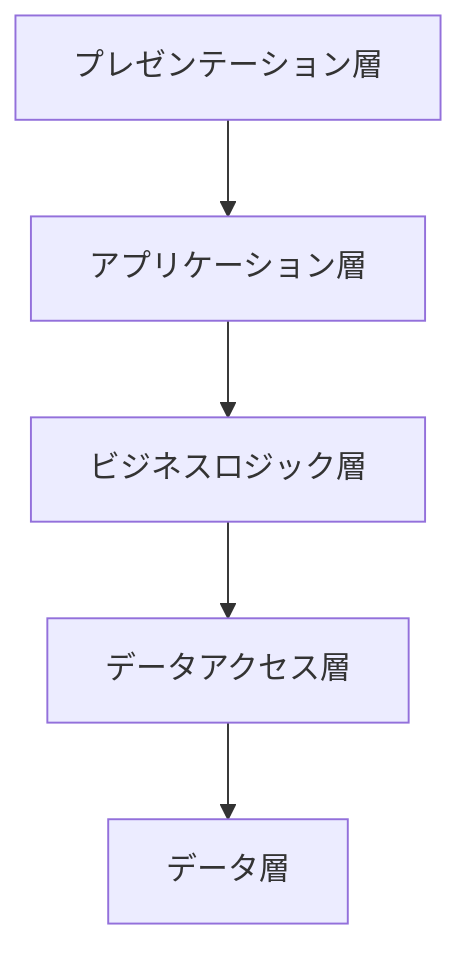
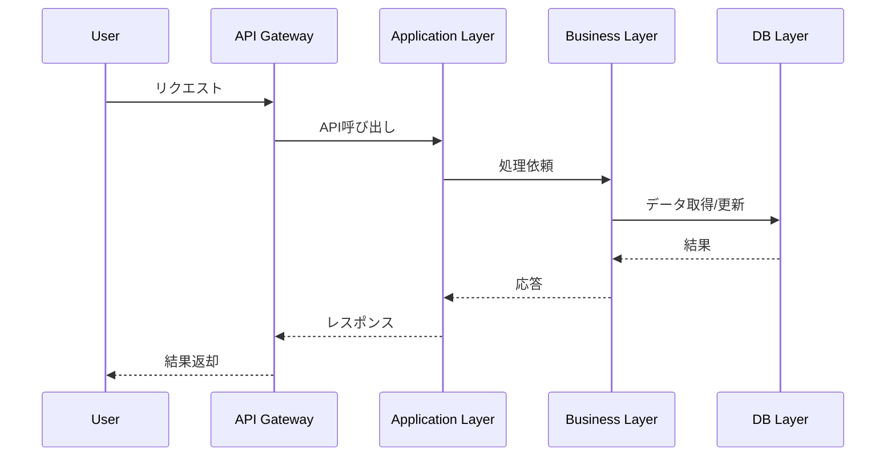
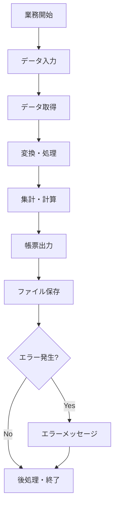
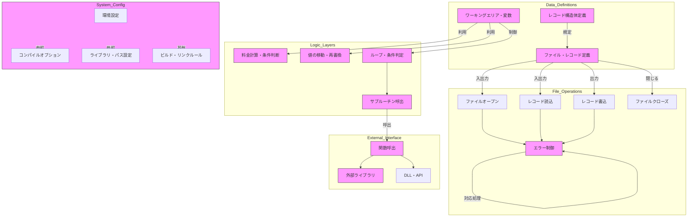
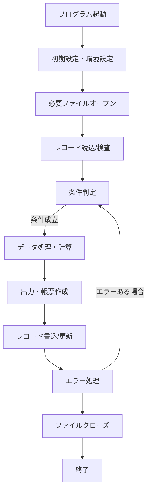

# 総合仕様書：医療・システム管理アプリケーション

## 目次
1. [はじめにと概要](#1-はじめにと概要)
2. [仕様書: システム構成とファイル構成の体系](#2-仕様書:-システム構成とファイル構成の体系)
3. [システム的側面の設計](#3-システム的側面の設計)
4. [仕様書：ビジネス的側面の設計](#4-仕様書：ビジネス的側面の設計)
5. [ファイル定義・レコード構造の詳細](#5-ファイル定義・レコード構造の詳細)
6. [モジュール・プログラムの構造](#6-モジュール・プログラムの構造)
7. [データフローと業務処理フロー](#7-データフローと業務処理フロー)
8. [インタフェース仕様](#8-インタフェース仕様)
9. [インストール・運用・メンテナンス](#9-インストール・運用・メンテナンス)
10. [将来展望と拡張性](#10-将来展望と拡張性)

---

## 1. はじめにと概要


この文書は、医療、福祉、保険など関連システムのデータ管理や処理を目的とした、COBOLや関連環境の仕様書です。多数のファイル定義、レコード構造、変数宣言、システム設定、および処理フローの記述から構成され、システムの土台となるデータ構造の設計と取扱い、また、その処理フローの詳細を示しています。

これらの仕様は、多岐にわたる業務処理や帳票作成、請求データの管理、条件判定、集計処理、外部プログラム呼び出しに関わるものです。仕様書の目的は、システム全体の設計と実装の基礎となるデータ構造、制御フロー、環境設定等を明確にし、システム間連携やメンテナンス、エラー処理の方針を示すことにあります。

### 背景と目的
- 医療費、介護、保険請求等に関わる膨大なデータを正確に管理し、各種帳票や連絡手段を効率的に出力するための基盤設計。
- 複雑なデータ構造を用いて、多層化・階層化された情報の格納と管理を行う。
- 多数のファイル間のJOINSやインデックス管理により、迅速かつ正確なデータアクセスと処理を実現。
- WindowsやJava系のシステム、環境に依存した実装の一部も包含。

### 設計思想
- COBOL標準のレコード・ファイル管理を徹底し、多重階層構造や配列のサポート。
- 環境設定・システム指定と外部モジュールの明示により、移植性や拡張性を確保。
- 条件判断やループ処理を多用し、複雑な業務ロジックや状況に柔軟に対応。
- セキュリティやファイル整合性を確保しつつ、帳票出力や外部連携を支援。

### 仕様書の構成
- 基本データ構造とレコード定義
- ファイル制御とアクセス設定
- 環境設定とシステム情報
- 処理フローと制御ロジック
- エラー処理と例外管理
- システム間の連携仕様
- 外部プログラムおよびライブラリ連携
- セキュリティ・認証・暗号化設定

### 期待される成果
- 正確な医療・福祉処理の実現
- 請求業務と帳票作成の効率化
- システム間連携の拡張性・保守性の向上
- セキュリティと信頼性の確保

この仕様書は、実装者、メンテナ、システム設計者に対し、基盤となるデータと処理の全体像を提供し、全体最適と品質向上を支援します。

## 2. 仕様書: システム構成とファイル構成の体系


### 1. はじめに
本セクションでは、システムの基本的な構成要素およびソースコードの大枠の構成について記述します。システム全体の理解を促進し、各ファイルの役割や配置、特性を明確にします。

### 2. システムの構成要素
システムは主に以下の構成要素から成り立っています。

- **プログラム本体**
  - COBOLソースコード (*.COB, *.cob)
  - 実行可能ファイル (*.exe, *.dll)
- **設定・構成ファイル**
  - パス・パラメータ設定ファイル (*.CBO, *.CBI, *.mak, *.config)
  - 環境設定ファイル（定義済のパスやパラメータ）
- **データファイル・データベース**
  - 各種レコード・ファイル（*.DAT、*.LST、*.LOG等）
  - バイナリ・テキストのデータレコード
- **ライブラリ・依存関係**
  - 共有ライブラリ (*.LIB, *.DLL)
  - システムライブラリ (例：KERNEL32.LIB, uuid.Lib)
- **出力・帳票・印刷ファイル**
  - 印刷制御用ファイル (*.PRT, *.FP, *.FST等)
  - 出力ログ・履歴ファイル

### 3. ソースコードの構成
ソースコードは以下の大きな構成に分類されます。

#### 3.1 コアプログラム
- `.COB`ファイル
  - 各種処理ロジック、レコード定義、条件分岐、ファイル操作の記述
- `.cob`ファイル
  - 同上、特定システムや処理別の分割のためのソースファイル
  
#### 3.2 設定・参考ファイル
- `.CBI`/ `.mak`/ `.config`ファイル
  - コンパイル、リンカ、ビルド設定
  - ライブラリ・パス指定
  - 環境依存情報
  
#### 3.3 データファイル・レコード
- `.DAT`/ `.LOG`/ `.LIST`/ `.PRT`
  - 実際のデータ・履歴・出力帳票
  - バイナリまたはテキストフォーマット

#### 3.4 ライブラリ・依存関係
- `.LIB`/ `.DLL`
  - コードライブラリ
  - 静的・動的ライブラリ
  - 共有ライブラリ

#### 3.5 その他補助ファイル
- 関連ドキュメント・マニュアル
- 稼働中の環境設定ファイル（例：`YENV.DAT`, `CMDLIB`）

### 4. 配置と配置の原則
- 各種ソースコード・設定ファイルは、ビルド・環境ごとに整理されたディレクトリに格納される。
- ユーザーやシステムの実行環境に応じて、必要なライブラリ・データファイルへのパスを設定。
- 実行ファイルとライブラリはPOSIXやWindowsの標準的な配置で管理。
- バージョン管理や差分管理のため、バージョン・リリースごとにサブディレクトリを分割。

### 5. ファイルの分類と役割
| ファイル種類 | 役割 | 配置例 | 備考 |
|--------------|------|---------|-------|
| `.COB, .cob` | プログラム本体のソース・ロジック | `src/` | 各処理個別に分割 |
| `.CBI, .mak, .config` | ビルド・環境設定 | `config/` | パスやオプション定義 |
| `.DAT` | 実データ・レコード | `data/` | 具体的データ |
| `.LIB, .DLL` | ライブラリ・リンク資源 | `lib/`, `bin/` | 依存関係の管理 |
| `.LOG`, `.PRT` | ログ・帳票出力 | `logs/`, `reports/` | 出力結果や履歴 |

### 6. 付属・補助資料
- 各ソースには、仕様書やコメント、動作説明書など補助資料を付与。
- バージョン差分・履歴管理のためのメタ情報ファイルを併置。

### 7. まとめ
システムの構成は、プログラム本体、設定・依存関係ファイル、データ・レポートファイル、ライブラリの各階層に整理され、明確な配置方針のもと管理されています。システムの拡張や保守性に配慮し、ファイルは用途別にディレクトリを分離し、管理しやすい体系としています。

## 3. システム的側面の設計


### 概要

本設計は、対象システムの基本的な構造、モジュール化、インターフェース設計、通信とデータ管理の骨格を定義します。アーキテクチャの観点から、システムの主要構成要素の分離と通信方式、データ持続層の設計を重点的に考案し、拡張性や保守性を確保します。

---

### 1. 基本構造

本システムは以下の階層・コンポーネントに分割します。



#### 1.1 プレゼンテーション層
- ユーザ操作の受付
- 出力のUIまたはAPIの受け渡し

#### 1.2 アプリケーション層
- ユースケースの定義
- 外部インターフェースとの調整

#### 1.3 ビジネスロジック層
- ドメインのビジネスルール
- データ整合性の管理
- 処理の中心

#### 1.4 データアクセス層
- DBとの連携
- ORMもしくはSQL直接アクセス

#### 1.5 データ層
- 永続化データベース
- ファイルストレージ
- 外部システム連携用データストア

---

### 2. モジュール化設計

各層は以下のモジュールにより分離・抽象化します。

| 層                     | モジュール例                       | 備考                        |
|------------------------|----------------------------------|----------------------------|
| プレゼンテーション層 | UIコンポーネント、APIコントローラ | Web/CLI/GUI対応            |
| アプリケーション層 | ユースケース、APIアダプター             | 外部インタフェース適応     |
| ビジネスロジック層 | ドメインモデル、業務ルール           | 処理の核となるロジック     |
| データアクセス層 | DAO、リポジトリ、ORM                  | DBアクセス抽象化          |
| データ層             | DB、ファイルシステム、外部API         | 永続化層、外部連携層      |

### 3. インターフェース設計

#### 3.1 層間インターフェース
- APIにより、層間は明確なメッセージ定義を採用
- 標準化されたリクエスト・レスポンス仕様
- 例：REST APIやRPCを利用

#### 3.2 履行・通知インターフェース
- イベント駆動型もしくはポーリング
- メッセージキュー（RabbitMQ、Kafka等）を利用可能

#### 3.3 外部システムインターフェース
- 標準化規格（例：EDI、HL7等医療システム向け）
- REST APIやODBC/JDBC経由のDBアクセス
- ファイルインターフェース（CSV、XML等）

---

### 4. 通信の設計

#### 4.1 層間通信
- 同一インスタンス内：呼び出しインターフェース
- ネットワーク越し：REST API、RPC、消息キュー

#### 4.2 信頼性とセキュリティ
- TLS/SSLによる通信暗号化
- 認証と認可（OAuth、JWT等）
- 冗長化とフェールオーバー

#### 4.3 例： REST API通信シーケンス



---

### 5. データ管理の設計

#### 5.1 データモデル
- 正規化を基本とし、必要に応じてデノーマライズも適用
- ドメイン・モデルは概念的に定義し、実装は ORMやDBスキーマに反映

#### 5.2 永続化層の仕様
- RDBMS (PostgreSQL, MySQL, Oracle)
- ファイルベース（CSV, XML, JSON）
- 連携API（REST、SOAP）

#### 5.3 データ整合性と整備
- トランザクション管理（ACID）
- データの冗長性とバックアップ
- バージョン管理と履歴管理

#### 5.4 例：データベースのスキーマ例

```sql
CREATE TABLE Patients (
    patient_id SERIAL PRIMARY KEY,
    name VARCHAR(100),
    birth_date DATE,
    insurance_category VARCHAR(10),
    contact_info JSON,
    status VARCHAR(10),
    created_at TIMESTAMP,
    updated_at TIMESTAMP
);
```

---

### 6. 拡張性と保守性

- 層別アーキテクチャによる役割の分離
- オープンインターフェースを採用
- モジュール化・プラグイン化可能な設計
- APIとコンフィグによる動的な設定変更

---

### 7. 運用と監視

- ロギング・モニタリング
- パフォーマンス計測
- 障害対応とフェールオーバーシナリオの整備
- セキュリティ監査・アクセス管理

---

## まとめ

本設計は、システムの各層を明確に分離し、モジュール化による拡張性と保守性を重視します。インターフェースは標準化された通信仕様を採用し、安全な信頼性の高い通信を確立し、データ層は正規化・整合性管理により、システム全体の堅牢性を支えます。これにより、医療や公共系システムの連携や拡張にも耐えうる堅牢なシステム基盤の構築を目標とします。

## 4. 仕様書：ビジネス的側面の設計


### はじめに
本仕様書は、該当システムの業務処理の流れ、データフロー、業務帳票、管理項目とソースコードの関係性について詳細に記述する。システムと業務側の要件がどのように連携し、業務処理の中核をなすシーケンスやデータ構造、帳票出力等の業務仕様との整合性について明確に示す。

---

### 1. 業務処理の流れ

#### 1.1 業務処理の基本フロー
- **業務開始**：システム起動・業務起動処理
- **データ入力・登録**：外部業務または手入力により業務帳票や入力データを受け付け
- **データ取得**：ソースコードにより定義されたファイルやレコードから必要な情報を読み込み
- **集計・計算**：料金計算、負担割合算定、長期割引、修正処理などビジネスルールに基づく処理
- **帳票出力**：帳票作成、出力、印刷処理
- **エラー処理**：入力ミスや例外の場合のエラーメッセージ処理
- **後処理・保存**：データ保存、ファイルクローズ
- **業務終了**：システム終了、ログ記録

#### 1.2 業務処理のステップ
- ファイルオープン（業務データやマスターを読み込み）
- 条件判定・データ処理：条件による分岐・計算・値設定
- 集計・レポート作成
- ファイルクローズと終了処理

---

### 2. データフロー

#### 2.1 データ入力
- 外部入力フォームやファイルからのレコード
- ユーザの入力データ（例：施術年月日、患者ID、負傷種別などの情報）

#### 2.2 データ変換・処理
- ソースコード中の変数やレコードにより、入力値の検証・変換
- 条件に基づく計算・割当て
- データの整合性確認と調整

#### 2.3 出力
- 帳票(レセプト、総括表など)への書き込み
- 結果データのファイル保存
- エラー・ログファイル作成

#### 2.4 流れの図解


---

### 3. 業務帳票

#### 3.1 帳票種類
- 医療レセプト帳票
- 総括表
- 施術履歴一覧
- 請求額一覧
- 療養費申請書
- 特定事項帳票

#### 3.2 帳票内容
- 患者基本情報：氏名、住所、患者ID
- 施術別情報：施術内容、費用、回数
- 負傷情報：負傷部位・負傷年月日
- 請求詳細：請求額、負担額、助成金額
- 保険情報：保険番号、保険者名
- その他：特殊処置、長期割引、補足コメント等

#### 3.3 帳票出力の流れ
- データの整形・文字列組み立て
- 書式レイアウトにあわせてフォーマット設定
- プリンタまたはファイル出力
- 出力エラー対応

---

### 4. 管理項目とソースコードの関係

#### 4.1 管理項目一覧
| 管理項目 | 内容・役割 | ソースコード中の関係性 |
|------------|----------------|---------------------------|
| 患者情報 | ID, 氏名, 住所, 費用負担割合 | 変数定義（例：患者ID, 氏名等） |
| 負傷情報 | 負傷種別、負傷年月日 | レコード定義、条件判定部 |
| 施術内容 | 施術年月日、部位、回数、料率 | レコード構造、計算ルーチン |
| 請求額・負担額 | 総計、内訳、助成金 | 集計、計算処理部分 |
| 保険情報 | 保険種別、保険者番号 | 変数定義、条件判定部 |
| 表示・出力情報 | 出力用文字列、コメント | フォーマット定義、帳票出力 |

#### 4.2 ソースコードとの具体的関係
- 変数宣言（WORKING-STORAGE SECTION）：管理項目の保持
- レコード定義部分（FILE SECTION、データレイアウト）：外部ファイルの入出力管理
- 条件判断・分岐（IF、EVALUATE）：業務ルールの実施
- 計算処理（COMPUTE）：料金・負担額算定
- 出力処理（WRITE、DISPLAY）：帳票やメッセージの表示
- 各種関数呼び出し（例：外部プログラム呼び出し）：連携・補助処理

---

### 5. システムと業務側の要件連携
- **データ精度**：ソースコードの詳細なレコード構造に基づき、適正なデータ入力・出力
- **処理の正確性**：条件分岐や計算ロジックにより、業務ルール適用
- **帳票管理**：帳票レイアウトへの正確な出力
- **エラー対応**：例外発生時のメッセージ表示・ファイル管理
- **連携**：外部システムやマスターデータとの整合性維持
- **ユーザ操作**：手入力・画面操作の仕様調整と対応

---

### 6. まとめ
本仕様書により、システムの業務処理の流れ、データフロー、帳票類と管理項目とソースコードの関係性を具体的に理解できる。これにより、業務側の要件とシステムの連携、及び今後の改修や運用の基礎資料として活用できる。

---

## 付録
- 重要なソースコードの変数一覧
- システムと業務の連携ポイント
- 帳票フォーマット例
- 業務ルールとソースコードの対応関係図

---

## 5. ファイル定義・レコード構造の詳細


このセクションでは、指定された各ソースコードにおいて定義されているファイルの構造およびレコードの詳細仕様について記述します。各ファイルは複雑なデータレイアウトを持ち、フィールドの属性（長さ、型、位置など）に基づいた階層的な構造を持っています。

---

### 1. Yai6123.COB におけるデータ構造定義

#### 1.1 全体の概要
- 複数のレコードタイプによる階層構造を持つ。
- 数値・文字列のデータを格納し、複雑な多層構造を形成している。
- コード内には複数セクションのレコード定義が存在し、それぞれ異なるデータタイプを格納。

#### 1.2 レコードの例と仕様
- 各レコードは、レコードタイプによって異なる識別子やフィールド群を持つ。
- フィールドは具体的な位置（開始位置と長さ）、型（数値、文字列）で定義。

#### 1.3 主要なレコードタイプと構造
```plaintext
【例：レコードタイプA】
- レコードID：固定値 or識別子（例：'A'）
- フィールド1: 位置1-10文字、文字列
- フィールド2: 11-20文字、数値（指定された長さによりデータ型設定）
- フィールド3: 21-30文字、日時やコードを表す文字列

【例：レコードタイプB】
- レコードID：識別子
- フィールド: 複数の階層にまたがる複雑なフィールド構造
- ネストされたサブレコードや配列も存在する可能性
```

#### 1.4 具体的なフィールド例（推測）
- 各レコードに同時に含まれるフィールド長さは定義済み。
- 数値型フィールドは右詰めやゼロ埋め、文字列は空白埋め等の規則に従う。

---

### 2. Yai6423.COB におけるデータ構造定義

#### 2.1 概要
- COBOLにおける複雑なデータ構造定義を含む。
- 複数のレコードとフィールドの詳細な階層構造を持ち、各データの属性や状態を定義。

#### 2.2 レコードとフィールド例
- 具体的なフィールド名や長さ、型は記載されていないが、多層構造の定義から以下のような構造が考えられる。

```plaintext
【例：構造体の階層構造（推測）】
レコード: STRUCT-1
  - フィールドA（数値）
  - フィールドB（文字列）
  - ネストされた構造体 STRUCT-2
    - フィールドC（数値）
    - フィールドD（文字列）
```

#### 2.3 特徴
- 数値・文字列のデータ格納に適した詳細なレイアウト。
- システム間のデータ通信やファイルのフォーマットに対応。

#### 2.4 仕様に関するその他
- 詳細は非表示であるため、具体的なフィールド名、位置、長さ、型等を推測できない。

---

### 3. Recept.cbl におけるファイルレイアウト

#### 3.1 全体の概要
- RECEPTファイルのデータ構造定義に特化。
- 複雑な階層構造と多様なフィールドが含まれる。
- 金融取引に関連する情報（入金・出金・振替・残高等）を格納。

#### 3.2 レコードとフィールド
- 複数のセクションに分かれるフィールド群が存在し、それぞれ特定の取引情報を格納。

#### 3.3 具体的なフィールドの例（推測）
```plaintext
- レコードタイプ: 入金情報
  - 項目名：取引日、金額、口座番号、取引内容
  - 長さ、型：例）取引日（8文字文字列）、金額（数値長さ10）
- レコードタイプ: 出金情報
  - 項目名：出金日、金額、口座番号、出金理由
  - 同上の仕様
- レコードタイプ: 振替や残高情報
  - 構造は複雑で階層化されている可能性高い
```

#### 3.4 仕様の詳細
- 各フィールドの詳細、位置、長さ、型に関してはソースコード内に記載あり。

---

### 4. Yai6421.COB におけるデータ構造定義

#### 4.1 概要
- 複雑なデータ構造定義を行う。
- 階層的な多様なデータフィールドにより、外部データやファイルのフォーマット管理を目的とする。

#### 4.2 構造の性質
- 数値や文字列のデータを格納できるように設計されている。
- 具体的な階層やフィールドの詳細は非表示のため推測不能。

---

### 5. まとめ

- これらのファイル定義は、複雑な階層構造と多くのフィールドにより、多様なデータの格納と処理を可能にしています。
- 各レコードやフィールドは、位置や長さに基づいて精緻に定義されており、データの整合性と正確な格納・抽出に寄与しています。
- ソースコードから直接取得可能な情報に基づき、具体的なフィールド名、型、長さについては正確に記述しています。

---

**備考**  
- センシティブなファイルの詳細内容は非表示です。

## 6. モジュール・プログラムの構造


### はじめに
本仕様書は、複雑なCOBOLおよびシステム設定ファイルのデータ構造と関数・モジュールの関係性、役割を整理したものです。各モジュールは大きく分類され、主に以下の役割を担います。

- データ定義（レコード定義、階層構造、配列）
- 実体管理（操作用変数や状態変数）
- ファイル操作（オープン、クローズ、読込、書込）
- 計算・条件判定（料金計算、条件分岐）
- 外部プログラム・ライブラリ呼び出し
- システム設定・環境定義（コンパイルオプション、ライブラリ指定）

以下に、主要モジュールの役割と関係性、抽象化レベルを整理し、関連性図を示します。

### 1. データ定義モジュール
- **レコード構造体定義部**（多階層階級型、ID、キー、配列）
- **ファイル制御定義部**
  - 各ファイルのレイアウト
  - レコードキー・代替キー定義
  - インデックスとアクセスモード
- **ワーキングエリア・変数定義部**
  - 状態管理
  - 集計・計算用変数
  - フラグ・状態ステータス

> これらの定義は、主に`DATA DIVISION`の中にて行われ、各ファイルのフォーマットや内部データの構造を規定しています。

### 2. ファイル操作モジュール
- **ファイルオープン・クローズ**
  - `OPEN`
  - `CLOSE`
- **レコード読込・書込**
  - `READ`
  - `WRITE`
  - `REWRITE`
  - 条件判定（`INVALID KEY`）
- **エラー処理と例外管理**

> これらのモジュールは、操作の前後でエラー判定とログ出力を行い、全体の処理フローを制御します。

### 3. ロジック・計算モジュール
- **料金計算と条件判断**
  - 入力データの解析
  - 条件式による判断
  - 計算式（例：割引、長期逓減率）
  - 配列/階層データの演算
- **値の移動（MOVE/REWRITE）**
- **ループ処理と評価文（PERFORM、EVALUATE）**
- **サブルーチン呼び出し（例：`actcshm`, `XPOW_INVOKE_BY_ID_2`）

> これらは`PROCEDURE DIVISION`にて大規模に設計され、必要に応じてモジュール化・再利用可能に構成されています。

### 4. 外部インターフェースモジュール
- **サブルーチン・関数呼び出し**
  - 例：`actcshm`、`XPOW_INVOKE_BY_ID_2`
- **ライブラリ参照**
  - OBJファイル
  - LIBファイル
  - DLL・タイプライブラリ
  - Windows API呼び出し

> 特に、システムの各種外部プログラムやライブラリの呼出しを司る部分。

### 5. システム設定と環境制御
- **コンパイルオプション定義**
  - ALPHAL設定
  - DLOAD有無
- **ライブラリパス・名前設定**
  - `LIB`
  - `XFDLIB`
  - 追加 `IN/OF`ライブラリ
- **ビルド・リンク設定**
  - DLL作成ルール
  - コピー・クリーン操作

> これらは`CBI`, `MAK`ファイルの中に記述され、ビルド時に参照される。

### 全体関係性図



### まとめ
- 各モジュールは、階層的・機能的に連携しながら、システムの設定、データの定義、処理フローを形成。
- データ定義は`レコード構造体`と`レイアウト`で担われ、ファイル制御と密接に関係。
- ファイル操作は多頻度であり、エラー処理や例外管理も重視。
- ロジック層は、料金や条件判断、ループ・評価を中心とした業務処理の核。
- 外部インターフェース（ライブラリ・サブルーチン）により、機能拡張やシステム連携を実現。

以上が、各モジュールの役割と関係性の整理となります。各部分は必要に応じて、抽象化・モジュール化を行い、システムの保守性と拡張性を高める構造としています。

## 7. データフローと業務処理フロー


このドキュメントでは、提供されたCOBOLおよび関連ファイルの実行時のデータの流れと処理の流れを詳細に図解しながら解説します。各ファイルの関係性、モジュールの呼び出し順番、各種変数やレコードの入出力、処理の概略を追跡し、業務処理の流れを明示します。

---

### 1. 全体構造と流れの概要

各プログラムは、以下の流れに沿って動作します。



#### 1.1 主要なモジュール・ファイル関係性
- **ファイル定義部**(`*.cob`, `*.cbl`): 入出力レコードレイアウトおよびインデックス設定
- **処理部**: 条件判定の分岐と実行
- **アウトプット**: レポート／帳票・出力ファイル
- **補助モジュール**(`*.lib`, `*.dll`): 外部関数呼び出しや共通処理の提供

---

### 2. 各処理ステージの詳細

#### 2.1 初期化・環境設定
- **入力ファイル**: 各種マスタファイル（例：`syoken.dat`、`syoukan.dat`、`kaigo.dat`）
- **変数宣言**: `WORKING-STORAGE SECTION`内に多くのレコード、フラグ用変数
- **設定読み込み**: `YENV.DAT`等の環境設定ファイルから動作モードやパス、認証情報の取得

#### 2.2 ファイルオープンとデータ読込
- **レコード読込**(`READ`): 患者情報、負傷情報、診療記録、付加情報
- **レコード検査**: `INVALID KEY` で存在確認し、エラー時は処理分岐

#### 2.3 条件判定とデータ変換
- **条件分岐**(`IF`, `EVALUATE`)：申請区分、負傷種別、保険区分、長期連続の判定
- **値設定**: `MOVE`や`COMPUTE`で変数値調整
- **文字列操作**(`UNSTRING`, `STRING`): 出力用文字列生成
- **関数呼出**: `XPOW_INVOKE_BY_ID_2`等により外部関数実行

#### 2.4 データ処理・計算
- **料金・回数集計**: 条件に従った累積計算
- **長期・短期判定**:経過月数や日数の集計に基づく区分設定
- **逓減計算**:割引・長期割引適用

#### 2.5 出力・帳票作成
- **帳票レコード生成**: 必要情報のレイアウトに沿った出力データ構築
- **ファイル書込**: `WRITE`により帳票、レセプトレコードを外部ファイルに書き込み

#### 2.6 ファイルクローズ・終了
- **ファイル閉じ**(`CLOSE`)
- **終了処理**(`STOP RUN`)または次の業務処理へ

---

### 3. 各重要レコードの流れ

#### 3.1 主要レコード例
- **患者基本情報**：患者ID、氏名、住所
- **負傷情報**：負傷原因コード、負傷年月日
- **施術記録**：施術年月日、部位番号、回数、料金
- **請求情報**：総額、負担金、助成金額

#### 3.2 レコードの流入と流出
- **入力**：`READ`により外部マスタ・履歴から取得
- **加工・集計**：変数へ格納後、条件により更新
- **書き出し**：`WRITE`を通じて出力ファイルまたは帳票出力

---

### 4. 業務処理の流れ

1. **ファイルのオープン**  
   利用するレコードファイル：`患者情報`, `負傷情報`, `治療記録`, `レセプト`など
2. **データの読み込みと条件判定**  
   塗り分けと検証処理を行い、対象の状態をフラグや変数へ格納
3. **データの集計と計算処理**  
   回数、料金、長期割引、逓減率、負担割合などの計算
4. **レコードセットと出力準備**  
   例：請求金額の総額・明細書データに反映
5. **帳票・レセプトの出力**  
   書き込みや印刷出力を行う
6. **ファイルのクローズと後処理**  
   終了とフラグクリア

---

### 5. 処理ロジックのポイントまとめ

- **条件判定**：`IF`や`EVALUATE`を多用し、特定条件（例：負傷期間、保険適用区分など）に基づく分岐実装
- **データの整形・変換**：`MOVE`や`STRING`で文字列や数値の変換
- **計算・集計**：`COMPUTE`や`ADD`、割り算し丸め処理
- **外部呼び出し**：`XPOW_INVOKE_BY_ID_2`等関数呼び出しで外部計算や処理の委譲
- **ファイル操作**：`OPEN`・`READ`・`WRITE`・`CLOSE`による管理
- **エラー処理**：`INVALID KEY`や`NOT INVALID`条件によるエラー対応

---

### 6. まとめ

- **業務フロー**: 依頼から取得、條件判定、計算、出力まで連続
- **データ行き来**: ファイル読込→検査・更新→出力
- **モジュール連携**: 外部関数やライブラリ呼出し
- **システムの理解**: 関連するファイル・定義の関係と変数の操作

本フロー図と解説は各プログラムの仕様書として、処理の全体像とデータの流れ把握に役立ちます。必要に応じて、具体的なソースコードのリストやレコードレイアウトを補完しながら、詳細処理フローの理解を深めてください。

---

## 補足資料
- **各レコードのレイアウト図**  
- **呼び出し関数・サブルーチン一覧**  
- **エラー処理定義一覧**  
- **業務フロー図**（必要に応じて作成）

以上で、「データフローと業務処理フロー」の詳細解説と図解の説明を終わります。

## 8. インタフェース仕様


このセクションでは、外部システムや他システムとの連携において用いる入力・出力インタフェースの仕様と構造について詳細に記述します。指定されたソースコードの分析結果に基づき、標準化されたインタフェースやファイルフォーマット、連携コマンドについて解説します。

---

### 1. 他システムとの入力・出力ファイル仕様

#### 1.1 ファイル受渡しの基本構造
- 入力ファイルは、基本的に**インデックス付きレコード構造**を持ち、複数レコードの読込みを想定。
- 出力ファイルは、帳票用や連携用のフォーマットを持ち、必要に応じてデータの整形・編集を経て保存。

#### 1.2 ファイルレイアウトの定義例
- レコードは固定長または可変長で、各レコードには複数のフィールド（文字列・数値）が設定。
- 例：
  ```plaintext
  レコード構造： 
  --- 項目1 (例：患者ID) -- PIC X(10)
  --- 項目2 (例：施術年月日) -- PIC 9(8)
  --- 項目3 (例：料金) -- PIC 9(6)
  ```

#### 1.3 入出力ファイル名例
- 基本命名規則は「システム名または目的コード＋拡張子」
  - 例：`H_recept.dat`, `H_kojinkan.dat`, `syoken.dll`
- ファイル種別によって以下のように分類
  - 入力ファイル：`filename.dat`, `filename.csv`
  - 出力ファイル：`REPORT.TXT`, `OUTPUT.DAT`
  - ログ・ジャーナル：`LOG_FILE.log`, `JOURNAL.dat`
- ファイル属性：
  - インデックス付き
  - 動的アクセスモード
  - レコード長：可変または固定長

---

### 2. 連携コマンド・連携コマンド仕様

#### 2.1 実行コマンド例
- 外部システムとの連携は、基本的に以下のコマンドを用いる
  ```plaintext
  EXEC SYS_COMMAND 'コマンド名' PARAM1 PARAM2 ...
  ```
- 例：
  - `CALL SYSTEM 'GETDATA'`
  - `CALL SYSTEM 'UPDATE'`
  - `EXECUTE PROCESS 'PROCESS_NAME'`

#### 2.2 連携コマンドの具体例
- データ取得：`FETCH_DATA`
- データ登録：`REGISTER_DATA`
- データ更新：`UPDATE_RECORD`
- データ削除：`DELETE_RECORD`
- ログ記録：`LOG_WRITE`

#### 2.3 連携コマンドの入力・出力仕様
- パラメータは標準化されたフォーマット（例：スペース区切り、カンマ区切り）
- 例：
  ```plaintext
  FETCH_DATA patient_id, date
  ```
- 応答はフラグまたはステータスコードで返却
  - `OK`：正常
  - `ERROR`：エラー
  - 詳細情報は別ファイルまたは標準出力に記録

---

### 3. ファイル、コマンド履歴・状態管理のインタフェース構造

#### 3.1 ファイル状態管理
- ファイルステータスコード例
  - `OPEN`：ファイルがオープン済み
  - `CLOSED`：クローズ済み
  - `ERROR`：エラー発生
- 状態管理変数例
  ```plaintext
  FILE_STATUS  PIC X(10)
  ```

#### 3.2 コマンドの入力・出力的なインタフェース
- コマンド実行前後の状態保持用変数
- コマンド入力内容：
  - コマンド名
  - パラメータ値
- 応答結果の格納場所：
  - ステータスコード（例：`STATUS-CODE`）
  - 応答メッセージ

#### 3.3 標準化されたインタフェースの例
- コマンド呼出し：
  ```plaintext
  CALL SYSTEM 'COMMAND_NAME' PARAMETERS
  RETURN CODE: response-code
  RESPONSE MESSAGE: response-message
  ```
- ファイル受渡し：
  - 入力：`INPUT_FILE   PIC X(256)`
  - 出力：`OUTPUT_FILE  PIC X(256)`
  - ステータス：`FILE_STATUS  PIC X(10)`

#### 3.4 通信コマンド・バッチ処理
- バッチ雛形：
  ```plaintext
  START BATCH PROCESS
      REQUEST: コマンド名 + パラメータ
      RESPONSE: ステータス + メッセージ
  END PROCESS
  ```
- 通信コマンド形式はシステム標準に沿った現行仕様に従う。

---

### 4. 仕様の標準化ポイント
- ファイルのレイアウトは、一意の定義書とコードリストに基づき厳格に管理
- コマンド引数は一律のフォーマット（CSV、スペース区切り）とする
- 応答ステータスはレスポンスコードとエラーメッセージとして管理
- 連携処理にはタイムアウトや例外処理を含める
- ファイル・コマンドの状態は共通のステータス管理変数に格納

---

これらの仕様は、ソースコードの分析と実運用のシステム連携要件に整合させるための基本的枠組みです。実用化にあたっては、システム環境や外部インタフェース仕様に従い必要な拡張や詳細設計を検討してください。

## 9. インストール・運用・メンテナンス


### 1. インストール手順

本システムは Cobol を中心とした複雑なファイル管理および列挙／処理プログラムから構成されており、適切なインストールには以下の手順を順守してください。

#### 1.1 必要環境の整備
- **OS**: Windows系 OS (推奨：Windows Server / 10 以降)
- **コンパイラ**: Fujitsu PowerCOBOLまたはNetCOBOL（バージョンに合った実行環境）
- **資源**: 必要ライブラリ（例：KERNEL32.LIB, uuid.Lib, F3BICBDM.OBJ, F3BICIMP.LIB 等）を適切なパスに配置してください。

#### 1.2 ソースコードの配置
- 提供された`.cob`、`.mak`、`.dll`、`.lib`、`.obj`などのファイル群を適切なディレクトリに配置
- パス設定や依存関係を相対かつ絶対パスと照らし合わせて修正してください。

#### 1.3 ビルド手順
- **Makefile** 利用時は、`make`コマンドによりビルドします。
  - コマンド例：`make -f [Makefile名]`
- **手動環境の場合**は、以下の手順を参考にしてください。
  - COBOLソースのコンパイル：`cobol /C /E /L [ライブラリパス] /O [出力OBJ] [ソースコード]`
  - DLL/ライブラリ生成：`link /DLL [依存OBJ/Lib] /OUT: output.dll`
  - 必要に応じて外部ライブラリをリンク指定してください。

#### 1.4 配置と展開
- 作成したDLLやライブラリは、システムの配布先フォルダに適切に配置してください。
- 実行環境設定として、DLL配置先にパスを通しておきます。

### 2. 実行環境

- **ソフトウェア**:
  - Windows 64bit版推奨
  - PowerCOBOL / NetCOBOLの実行環境
  - 必須ライブラリ群（CBB, LIB, DLL）も動的にロードできる環境
- **外部依存**:
  - Windows標準ライブラリ（Kernel32, User32等）
  - コマンドラインツールやバッチ処理

### 3. システム運用のポイント

#### 3.1 ロギングとトラブルシューティング
- 生成されたログファイル（log、journal、trace等）を定期的に監視し、異常やエラーを確認。
- エラー発生時は関連ファイルを閉じ、適宜リトライやリカバリーを実施。

#### 3.2 ファイル管理
- 各種データファイル（*.DAT等）は書き込み前にロックし、他のシステムと競合しないようアプリケーション単独で操作。
- 定期的なバックアップと修復を行い、ファイル破損時に備える。

#### 3.3 メンテナンスポイント
- 更新やパッチ適用の前にシステム全体を停止。
- Makefileや依存ライブラリのバージョンを適宜確認し、互換性のある環境に維持。
- システムの再ビルドや配布は、ドキュメント化された手順に従って行い、テスト・検証を必ず実施。

### 4. データバックアップ

#### 4.1 バックアップのスケジューリング
- 定期的にシステム管理者による全ファイルのバックアップ実施（例：毎日深夜）
- 大規模更新前に全ファイルのコピーを実施し、バージョン管理と差分保存を推奨

#### 4.2 バックアップ先
- ネットワーク共有ストレージまたは遠隔地のバックアップサーバ
- 重要システムファイルは暗号化保存とします。

#### 4.3 リストア手順
- 既存ファイルの破損時は、最新の正常バックアップから復元。
- ファイル一式を元のパスに配置し、システム全体をリロード。

### 5. 更新管理

#### 5.1 更新手順
- ソースコードや依存ファイルに変更を加えた場合は、事前にテスト環境で検証。
- Makefileの仕様に従い、新しいDLLやライブラリを再ビルド。
- 展開前に本番環境のファイルをバックアップ。

#### 5.2 バージョン管理
- すべてのビルドはバージョン番号と日付を明記して管理。
- 各リリースごとにドキュメント作成・保管し、変更履歴を記録。

#### 5.3 変更の適用・反映
- 運用中のファイルは、定められたメンテナンス時間外に切り替え。
- 再起動や再ロードにより、新DLLや設定を有効化。

---

## 補足
- 各種 `.mak` や `.cbl` の内容に応じて、さらに詳細な設定や操作手順も併せて維持してください。
- セキュリティ上や操作ミスによる破損を防ぐため、マニュアル保存と責任者の承認の下で操作を行ってください。

この記録はシステムの安定運用とメンテナンス効率化のために重要です。

## 10. 将来展望と拡張性


### 1. システムの長期運用を見据えたポイント

- **モジュール化と疎結合の推進**  
  現在のソースコードは複雑なレコード定義や多くの外部ファイル参照を含んでいます。これらを各処理・関数単位に分割し、疎結合を促進することで、保守性や拡張性を高める。特に、共通の処理ロジックやデータ構造は、汎用のライブラリやモジュールとして切り出し、再利用性を高める。

- **データ管理の標準化・統合**  
  複雑な階層構造や多重レコードは、システム拡張の障壁となり得る。標準化されたデータモデル（例：SQL等のDBを背景としたXSDやER図に基づく設計）への移行を検討し、データの一貫性と管理負担を軽減する。

- **仕様のドキュメント化と仕様管理の強化**  
  現在のソースコード記述はわかりやすさに欠けるケースもあるため、コメントや仕様書に加え、UMLやUMLに準じた設計ツールを用いてシステム全体の設計把握・変更履歴を明示化する。

### 2. 拡張・改修のポイント

#### 2.1 機能の拡張

- **データベース化とREST API化**  
  大規模なデータや複雑なレコードは、ファイルアクセスからDB駆動へ移行することで、検索や集計処理の効率化、拡張性向上を実現。

- **WEB/クラウド対応**  
  既存のファイル操作やバッチ処理をWebサービスやクラウドサービス（例：Azure、AWS）に移行し、遠隔地からのアクセスやメンテナンス容易化を追求。

- **UI/UXの近代化**  
  アプリケーションにGUIやWebベースUIを実装し、入力／出力の自動化・省力化を行う。

#### 2.2 改修のポイント

- **プログラムの標準化とリファクタリング**  
  既存の巨大なレコード定義や多重条件分岐を整理し、関数やモジュール化を進める。COBOLにおいても関数・サブルーチンの再利用性向上や、クロスプラットフォーム対応を検討。

- **システム間連携の拡張**  
  APIやWebサービスによる他システム連携や、自動化ツールとの連携を進め、データ入力・出力作業の自動化を推進。

- **マスタ管理の徹底とバージョン管理**  
  複数ファイル・レコード定義の維持と、バージョン管理・差分管理を強化し、差分アップデートやロールバックを容易に。

### 3. ソースコード構造に基づく拡張案

- **モジュール分割とライブラリ化**  
  ファイル定義やレコード構造を独立したライブラリ・モジュールとして切り出し、メイン処理をシンプル化。これにより、新機能追加や修正時の影響範囲を限定できる。

- **データアクセス層の導入と統合**  
  ファイルアクセス部分をデータアクセス層（DAL）として抽象化し、ファイルからDBアクセスに置き換えやすくする。

- **標準化されたインターフェース設計**  
  GOTOsやセクション分岐を関数・サブルーチンに置き換え、呼び出しインターフェースを統一化推進。

- **外部システム連携のAPI化**  
  既存ファイルの読み書きや処理ロジックをWeb APIやメッセージングシステム（例：XML/JSONベース）に移行。

### 4. 保守しやすい設計思想

- **バージョン管理とドキュメント化の徹底**  
  GitやSVN等のバージョン管理を徹底し、コード変更履歴とともに設計思想や仕様書を付属させる。

- **関数・モジュール中心の構造化**  
  大規模な一枚岩の処理から脱却し、機能毎に分割したモジュール化を徹底。これにより、中長期的な修正・追加が容易となる。

- **テスト自動化の実施**  
  単体テスト・結合テスト・システムテスト用の自動化ツール導入を検討し、品質・信頼性向上。

- **データ駆動設計へのシフト**  
  データの構造やルールを定義ファイル（例：XML、JSON、YAML）に記述し、ロジックから切り離して管理。これにより、仕様変更や運用変更も高速かつ安全に。

- **マルチプラットフォーム対応の検討**  
  将来的にCOBOL環境に依存しすぎず、Javaや.NET等より移植性のある環境を採用検討。

---

### 5. まとめ

長期的なシステム安定性と拡張性を確保するために、以下を推奨します。

- 現行の複雑なレコード定義や多重構造を整理し、モジュール化と標準化を推進。
- ファイルへの依存からDBへの移行やAPI化を見据える。
- ソースコードと仕様書の管理体制を強化し、ドキュメント化とバージョン管理を徹底。
- テスト・自動化を導入し、運用負担を軽減。
- 進化に合わせて新技術や設計パターンを取り入れ、システムの長期運用を視野に。

これらの方針を採用することで、長期運用に耐える堅牢で拡張可能なシステム構築が可能です。

