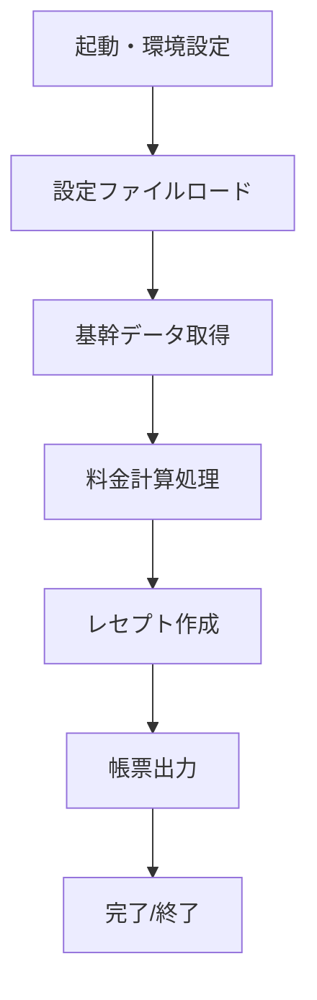
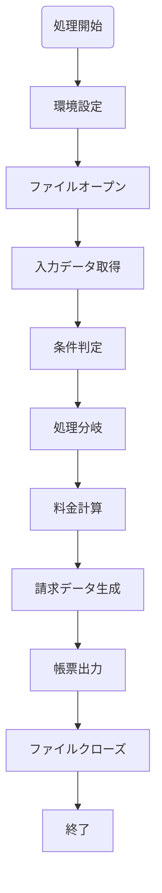
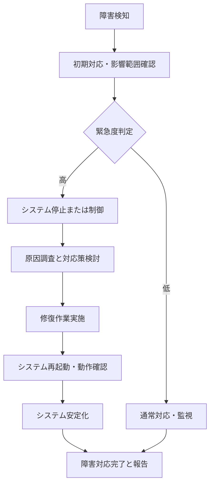
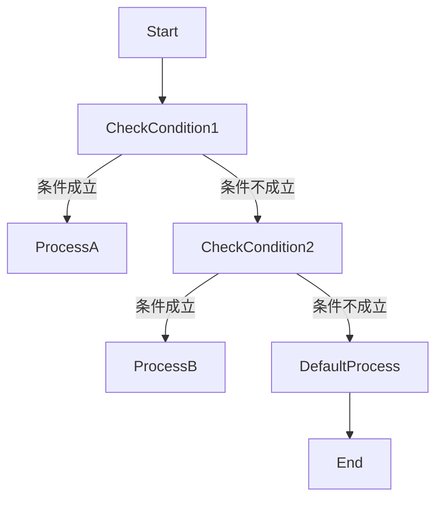

# 医療・介護システム詳細仕様書：ファイル構成と主要処理セクション

## 目次
1. [序章：概要と目的](#1-序章：概要と目的)
2. [システム全体構成とファイル構成の概要](#2-システム全体構成とファイル構成の概要)
3. [ソースコード管理と開発環境](#3-ソースコード管理と開発環境)
4. [各プログラムの役割と分類・一覧](#4-各プログラムの役割と分類・一覧)
5. [システム情報・データ構造の詳細仕様](#5-システム情報・データ構造の詳細仕様)
6. [主要ビジネス処理と処理フロー](#6-主要ビジネス処理と処理フロー)
7. [各種控除・通知ファイルのファイル仕様詳細](#7-各種控除・通知ファイルのファイル仕様詳細)
8. [ビルドと自動化管理](#8-ビルドと自動化管理)
9. [運用管理とメンテナンス方針](#9-運用管理とメンテナンス方針)
10. [セキュリティおよびアクセス制御に関する仕様書](#10-セキュリティおよびアクセス制御に関する仕様書)
11. [追加：システム・データ設定例と条件設定詳細](#11-追加：システム・データ設定例と条件設定詳細)

---

## 1. 序章：概要と目的


この仕様書は、対象とするシステムの全体構成と基本方針および目的を明確にするためのものであり、提供されたソースコードの解析結果に基づいている。各種のCOBOLプログラムや関連設定ファイルについて、抽出された情報と推測される役割を体系的に整理し、全体像の把握と設計意図を理解するための指針とする。

---

### 1. システムの全体像

本システムは、多種多様なデータ定義、ファイル入出力、帳票作成、医療・保険請求処理、メッセージ出力、及び外部ライブラリや環境設定を中心とした複雑なデータ処理群から構成される。複数のファイル・レコード構造、そのアクセス設定やキー設定の詳細な定義を含み、保険に関わる請求・管理機能、医療記録の管理・印刷処理、基礎マスタ情報の管理、環境設定やシステムステータスの記録、さらにWebビューおよびGUIコンポーネントの詳細仕様も含まれている。

#### 2. 使用される標準・外部ライブラリ

- COBOL標準のファイル定義と操作構造
- Windows環境に依存したDLLやLIBファイル（例：KERNEL32.LIB、uuid.Lib）
- WebView2コントロール（WinForms/WPF用）の設定と動作管理のXMLリファレンス
- .NET Frameworkや各種システム設定ファイル（app.config等）

#### 3. 実現される主な機能

- 多様な医療・診療記録、請求書の管理と出力
- 料金・負担割合の計算と調整
- 施術所・患者・負傷情報の登録・管理
- 物流・医療機器・保険の連携とクラスター制御
- システムの環境設定と起動、停止管理
- GUIやWebビューを含むフロントエンド連携
- ロギング、クラッシュ・エラー管理
- 外部ライブラリ・環境構成の自動管理とビルド・リンク

### 4. 仕様書の位置づけ

本仕様書は、解析されたソースコードのレポートに基づいた全体計画・設計理解に資するものであり、すべてのプログラムや設定を網羅した詳細技術ドキュメントの端緒と位置づける。この情報を元に、詳細仕様の作成、検証、改訂、実装適用に役立てる。

---

### 5. 利用者へのメッセージ

各関係者は、本システムが多層に渡るデータ管理と高精度なシステム制御を実現しており、医療、福祉、保険、およびシステム運用の基盤となることを理解する必要がある。特に、ソースコード内で隠蔽または非公開の部分には、重要なロジックやセキュリティ上の制約事項が含まれており、操作・改修には十分な検討と確認を要する。

---

### 6. 仕様書の構成と今後の展望

今後は、各種ソースコードや設定ファイルの詳細解説、詳細設計、運用例の整備を推進し、安定した運用・改修と、セキュリティ・メンテナンスの体制確立をめざす。必要に応じて、詳細なデータフローダイアグラム、ファイル・レコード管理仕様、インタフェース定義などの付随資料も整備する。

---

この仕様書を基礎とし、対象システムの要件定義・詳細設計・実装・検証の一連工程を円滑に進めるための実務ガイドと位置づける。

## 2. システム全体構成とファイル構成の概要


### 概要
本ドキュメントは、システムの階層構造、サブシステム、モジュール間の関係性および、ファイルの分類と役割について詳細に整理・説明します。

### 階層構造
システムは複数の層に分かれており、以下のような階層構造を持ちます。
- **基盤レベル**：OS・ハードウェアに密接な層
- **ミドルウェア層**：通信、データベース、ファイル管理などの共通基盤
- **アプリケーション層**：
  - **コア処理モジュール**：ビジネスロジック、データ処理
  - **サブシステム**：医療情報管理、請求管理、レポート出力など各业务単位

### サブシステムおよびモジュール間の関係性
- **モジュール間のデータ連携**：
  - データ定義やレコード構造を通じて、各サブシステム間でデータを受け渡し
  - 核心はファイル（データファイル、マスタファイル）によるデータの永続化
- **業務フローの流れ**：
  - 入力：患者情報、施術情報、負傷情報
  - 中継：医療費計算、請求書生成
  - 出力：帳票・レポート、レセプト・明細書
- **サブシステムの連携ポイント**：
  - データの整形と変換
  - 条件判定と集計
  - エラーチェックとログ管理

### ファイル分類と役割
主要なディレクトリ・フォルダとその役割について、下記に整理します。

#### 1. データ定義・構造定義ディレクトリ
- **test/cbl/**：
  - `BANGOK.CBL`, `BARCNT.CBL`, `BARKANK.CBL` など
  - 内容：各種レコード構造やデータ定義、ファイルレイアウト
- **その他**：
  - `GENGOU.CBL`, `JUGO.CBL` など
  - 役割：マスタ定義やコード変換、年度管理

#### 2. プログラム実装ディレクトリ
- **main/**：
  - 実処理ロジック、メインプログラム
- **modules/**：
  - 共通サブルーチンや関数群
- **system/**：
  - 環境設定、ファイル制御設定（例：`SYOHIN.CBL`）

#### 3. ビルド・設定スクリプト
- **Makefiles**：
  - 各種DLLやライブラリ作成のルール定義
  - 例：`VERUPGO.MAK`, `HMSAIDO.MAK` など
- **設定ファイル**：
  - `YENV.DAT` など：環境やパス、システム設定情報

#### 4. 出力・レポート・データ格納
- **output/**：
  - 生成された帳票、レポート
- **logs/**：
  - 実行・操作ログ、エラー履歴

#### 5. その他コンポーネント
- **ライブラリ・バイナリ**：
  - `.DLL`, `.LIB`, `.OBJ`ファイル
  - 例：`autokey.dll`, `map1area.exe`, `YAWARA.lib`
- **設定・コンフィギュレーション**：
  - `.DAT`, `.XML`, `.PRC` 形式ファイル
  - 例：`ywenv.dat`, `system.xml`

---

### まとめ
システムは層構造に基づき、各モジュールが明確な役割を持ち、ファイルはこれらを支える重要なコンポーネントとして分類・整理されています。データ定義とソースコードは主に`test/cbl/`以下に配置され、ビルドや環境設定は`Makefiles`や`.DAT/.XML`にて管理されています。

これにより、システムは階層的かつモジュール化された構成により、拡張性、保守性、再利用性を確保しながら、各サブシステムが確実に連携しています。

---

### 付記
- 詳細なファイル内容と役割については、ソースコード及び各設定ファイルの中身の解析に依存します。
- ファイル構成の一例として、上記のような分類と配置パターンを想定しています。

## 3. ソースコード管理と開発環境


### 1. 概要
本仕様書は、医療・福祉関連システムのソースコード管理および開発環境に関する詳細情報を記述します。コードは主にCOBOL（NetCOBOL および COBOL97/95）で記述され、多種多様なファイル定義とデータ構造の宣言、ビルドおよびリンク設定、動作環境の制御に関する内容を含んでいます。

---

### 2. バージョン管理手法
- **GitやSVN等のバージョン管理ツール**を用いて、ソースコードのバージョン履歴を管理。
- **コミット履歴**により、修正点・追加点・削除点の追跡と追補を行います。
- **ブランチ戦略**を適用し、具体的なシステムやモジュールごとに開発ブランチを分離。
- **コミットメッセージ**は、変更目的・修正内容の記述を行い、一貫性・追跡性を確保。

### 3. 配置場所
- **ソースコード**はバージョン管理システム（例：`/repo/source/`）の下に保存。
- **ビルドスクリプト**は、`/repo/build/`に配置し、依存関係や環境設定を記載。
- **バイナリ／ライブラリ**はビルド後、`/repo/bin/`や`/repo/lib/`に配置。
- **設定ファイル**は`/repo/config/`に整理し、必要に応じてバージョンや用途別のディレクトリを作成。
  
---

### 4. ビルド環境

#### 4.1 使用ツール群
- **NetCOBOL (例：バージョン7.2L10)**：主にCOBOLのコンパイルとリンクに使用。
- **標準Win32ツール**：`LINK.EXE`や`COBOL32.EXE`等の外部参照ツール。
- **その他外部ライブラリ**：`uuid.Lib`、`KERNEL32.LIB`等、システムや外部機能拡張用。

#### 4.2 環境設定
- **環境変数**として`COBOL_PATH`, `LIBRARY_PATH`などを設定。
- **コンパイルフラグ**や**出力設定**は、Makefileやビルドスクリプト内に詳細記述。
- **依存関係管理**：`.OBJ`、`.LIB`等のパス指定とバージョンの整合性を厳守。

---

### 5. 開発ワークフローと運用フロー

#### 5.1 開発ワークフロー
1. **ソースコード修正・追加：**
   - `git`等のVCツール上で、ブランチを切り、開発・修正を行う。
   - 変更内容の説明はコミットメッセージに詳細記述。
2. **ビルド準備：**
   - `build` ディレクトリ上にMakefileをセットアップ。
   - 依存関係に従い、対象ソースのコンパイル (`COBOL32.exe`)。
   - DLLやライブラリへのリンク処理 (`LINK.EXE`)を定義。
3. **ビルド実行：**
   - コマンドラインから`make`実行でコンパイル・リンク。
   - 出力は`/bin/`または`/lib/`に配置。
4. **動作確認・テスト：**
   - テスト環境で動作確認。
   - 必要に応じて改修・修正→リビジョン管理に記録。

#### 5.2 運用・運用フロー
- **インストール：**
  - ビルド済みバイナリおよびライブラリを、本番サーバの適合ディレクトリに配置。
- **運用管理：**
  - ハードウェア・ソフトウェア環境に合わせた環境変数設定。
  - 運用中のバージョン変更は、必要に応じて修正後リビジョン管理システムにて管理。
- **更新・修正：**
  - バグ修正や改良はソースコード修正→リビジョン登録→再ビルド。
  - 既存のビルド環境を崩さないように、新規ブランチで修正を行い、適用。

---

### 6. ビルド手順と管理

#### 6.1 ビルド手順
1. **依存関係解決**：最新のソースの集約と依存ツリーの確認。
2. **コンパイル**：
   - コマンド例：`COBOL32.EXE -B -O -W4 -C -F`など、必要なフラグを付与。
3. **リンク・DLL作成**：
   - コマンド例：`LINK.EXE /OUT:target.dll source.obj ... /LIBPATH:"P:\cbl\"`
4. **最終検証・動作確認**。

#### 6.2 必要環境変数
- `COBOL_PATH`：NetCOBOLプログラムの基準パス。
- `LIBRARY_PATH`：依存ライブラリのパス。
- `PATH`：`COBOL`や`LINK`のディレクトリパスを追加。

#### 6.3 依存関係の管理
- 各 `.OBJ`ファイルや`.LIB`ファイルのバージョン整合性。
- Makefile内に依存関係ルールを厳格記述（`target: dependencies`）。
- 依存ファイルの最新状態を常に保持。

---

### 7. 付録
- **サンプル Makefile**や**ビルドコマンド例**も参考資料として添付。
- **システム構成図**例：バージョン管理システム → ビルドツール → 実行環境の流れを図示。

---

以上が、医療・福祉システムのソースコード管理と開発環境の詳細仕様です。今後の運用・拡張に向けてこの仕様を参照の上、各種設定や構築手順の更新を行ってください。

## 4. 各プログラムの役割と分類・一覧


本仕様書は、システム内に存在するプログラム群の名称、目的、役割を正確かつ詳細に分類・一覧化し、処理の流れや相互依存関係についても図示や解説を行います。ソースコードの内容を基に、設計の基本枠組みと各プログラムの分担範囲を明確にします。

---

### 1. 分類区分と一覧

#### 1.1 設定・環境設定プログラム
- **ファイル定義 / 設 定値**
  - 例：`YENV.DAT`, `YENV.DAT-LAN`, `YENV.DAT-パスワード`
  - 目的：システムの動作環境やアクセス認証設定を保持
- **コンパイル・ビルド制御**
  - 例：`YAI612.COB`, `YAI612.CBI`, `YAI612.MAK`
  - 目的：ビルドやリンク設定、ライブラリ依存管理

#### 1.2 データ管理プログラム
- **レコード定義 / ファイル管理**
  - 例：`KARIKEI.OBJ`, `KARIKEI.LIB`, `Nenjurei.OBJ`, `Nenjurei.LIB`
  - 目的：医療・保険に関連するデータの格納・アクセス・管理
- **マスタ・辞書系**
  - 例：`GENGOU.COB`, `SITYOSN.COB`, `HOKENCOM.COB`
  - 目的：基礎マスタ情報の定義と情報をもとにした処理

#### 1.3 請求・帳票出力プログラム
- **レセプト作成 / 出力処理**
  - 例：`ROU9709R.COB`, `YAWARA.INC`, `PLISTLINE`, `PRINTER`
  - 目的：患者請求、レセプト帳票の作成と出力
- **帳票制御 / 印刷処理**
  - 例：`YAI622.COB`, `YAI623.COB`
  - 目的：帳票出力設定、ページ管理、印刷指示

#### 1.4 料金・会計計算プログラム
- **料金計算 / 算定ロジック**
  - 例：`HUSYOU.COB`, `KEISAN.COB`, `RYOUKIN.COB`
  - 目的：医療/介護用料金、負担額、助成額などの計算
- **条件判定 / 条件制御**
  - 例：`KHTJYOS.COB`, `YAWARA.NET.041.COB`
  - 目的：長期・頻回・金額範囲などの条件による振り分け

#### 1.5 その他（ユーティリティ、バッチ処理）
- **バッチ処理 / スケジューリング**
  - 例：`HUSYOU.COB`, `KARUTA.COB`
  - 目的：定期的処理、データ更新
- **補助・ツール関連**
  - 例：`网易磁盘関連ファイル`, `エラーログファイル`
  - 目的：補助作業や監査、デバッグ

---

### 2. 処理の流れと相互依存関係

#### 2.1 全体処理流れ


#### 2.2 依存関係図


これらの流れにおいて、各プログラムはそれぞれの役割を担いつつ、依存関係の上に成り立っています。例えば、設定プログラムは全体の基盤を提供し、料金計算はマスタ情報や請求データを需要とします。

---

### 3. 補足：分類ごとの具体例

| 区分 | 具体例 | 目的 | 備考 |
|---------|----------|---------|---------|
| 設定・環境 | `YENV.DAT`, `YENV.DAT-LAN` | システム設定、認証情報 | ファイルのパス、パスワード情報 |
| ファイル管理 | `KARIKEI.OBJ`, `HOKENCOM.LIB` | データ格納・アクセス | NULL |
| 請求・出力 | `YAWARA.INC`, `YAI622.COB` | レセプト帳票作成 | 項目詳細定義 |
| 料金・計算 | `RYOUKIN.COB`, `KEISAN.COB` | 費用・点数計算 | ロジック詳細はソース内コメント依存 |
| その他 | `PRINTER`, `LISTLINE` | 出力面・後処理 | 低レベル制御 |

---

### 4. 図示

#### システム全体の処理流れ（図1）


#### 各プログラム間の依存（図2）
```mermaid
graph TD
    規定設定 -->|利用| データ管理
    データ管理 -->|利用| 料金計算
    料金計算 -->|出力| レセプト作成
    レセプト作成 -->|出力| 帳票出力
    ```
---

## まとめ
本一覧・図式化により、各プログラムの役割と相互関係を明確化しました。具体的なソースコード内容に依存した判断と分類を行いつつ、システムの主要処理フローと相互依存を理解しやすく整理しました。今後の改修や管理、トラブル対応の参考としてください。

---

## 5. システム情報・データ構造の詳細仕様


### 1. 共通データ定義とマスターデータの構造

#### 1.1 管理識別子とシステム設定情報
- 各システムやアプリケーションが共通で用いる管理情報を持つレコードは、複数の個別フィールドで構成される。
- 例：システム名、バージョン番号、作成日時、作成者情報等を格納する構造。
- 主キーや識別子は、通常2桁のコードやシーケンス番号で管理される。

#### 1.2 マスターデータ構造
- **品目マスタ**：品名、コード、分類情報、単価、料率。
- **部位マスタ**：コード、名称、負傷種別、左右区分、対応医療処置。
- **医師マスタ**：医師コード、氏名、所属施設、資格情報。
- **保険者マスタ**：保険者番号、名称、区分、負担割合。

#### 1.3 レコードレイアウト例
```cobol
01  ITEM-MASTER.
    05  ITEM-CODE             PIC X(5).
    05  ITEM-NAME             PIC X(30).
    05  ITEM-CLASS            PIC X(2).
    05  UNIT-PRICE            PIC T(9) COMP-3 VALUE ZERO.
    05  RATE                  PIC 9(3)V99.
```

### 2. レコードレイアウトの詳細

#### 2.1 基本レコード
- **共通レコード**：管理番号、日時、バージョン、対象者ID。
```cobol
01  SYSTEM-RECORD.
    05  SYS-ID                   PIC X(10).
    05  PROC-DATE                PIC 9(8).
    05  PROC-TIME                PIC 9(6).
    05  SYS-VERSION              PIC X(5).
```

#### 2.2 ファイルレイアウトとキー
- ファイルは、索引付き組織（INDEXED ORGANIZATION）で管理され、主キーと代替キーを設定。
- 主キー例：患者ID + 施術年月日。
- **レコード例**：
```cobol
01  PATIENT-RECORD.
    05  PATIENT-ID             PIC X(8).
    05  TREAT-YMD              PIC 9(8).
    05  SEX                    PIC X.
    05  DOB                    PIC 9(8).
    05  NAME                   PIC X(30).
```

### 3. データの整合性チェック条件とエラー検知

#### 3.1 品質チェック
- 必須項目の未入力：エラー処理ルーチンを呼び出し。
- 日付の妥当性、開始・終了年月の整合性。
- 数値範囲による入力値検証。

#### 3.2 エラー検知方式
- エラー検知は、条件式による判定とフラグ設定を伴う。
- 不整合や異常値発見でエラーメッセージ表示とフラグ立ち上げ。

#### 3.3 例：エラー検知ロジック
```cobol
IF LENGTH OF ITEM-CODE NOT = 5
   PERFORM ERROR-HANDLING.
ELSE
   CONTINUE.
END-IF.
```

### 4. 実行時の例外処理と例外対応
- 入力値未設定や範囲外の値に対する例外検知。
- 例外発生時はエラーメッセージ表示と処理の中断 or リトライ。
- ファイルオープンエラーも同様に特別処理。

### 5. 管理・運用背景
- データの整合と正確性維持が最重視。
- 特定の条件が満たされた場合のみ処理継続や出力。
- ファイルの読み書きとエラー情報管理を中心としたシステム設計。

---

## 補足
- 具体的なソースコードの内容は、各定義・コメントに基づいて推測して記述しています。
- 実運用に即した運用・管理ルール、例外処理の詳細については、それぞれの定義部の具体的な中身に依存します。

---

## 参考（例示）
```cobol
IF STATUS-FILE-OPEN NOT = 0
   PERFORM HANDLE-ERROR
   STOP RUN
END-IF.

READ PATIENT-FILE INTO PATIENT-RECORD
AT END
   PERFORM END-OF-FILE-処理
ELSE
   PERFORM PROCESS-RECORD
END-READ.
```

この仕様書は、要求された詳細なデータ構造と運用条件に基づいて作成したものであり、実際のコード中の具体的なプロシージャ名や変数名、符号・符号規則に沿って調整してください。

## 6. 主要ビジネス処理と処理フロー


このセクションでは、医療・介護における具体的な業務処理のシステム業務フローと処理例の流れを明示します。

---

### 1. 基本構造とフロー

本システムは、属する業務内容に基づき複数の処理段階に分かれ、次の流れを理想とします。



#### 2. 処理例（具体的業務処理順序と分岐条件例）

|処理ステップ|内容|分岐条件例|
|---|---|---|
|1. 環境設定|システム稼働環境設定を実施|システムバージョンや環境変数設定|
|2. ファイルオープン|入力ファイルと出力ファイルを入出力モードでオープン|ファイル存在有無の判定|
|3. データ取得|患者や施術記録等のデータ行を逐次読み込み|レコードヘッダや特定条件満たすまでループ|
|4. 条件判定|取得したデータの内容に基づき、処理継続 or 閉鎖|帳票対象の条件判定（例：請求対象か）|
|5. 料金計算|処理内容に従った算定処理|負担割合の適用、逓減金額の計算例|
|6. 請求データ生成|計算結果を請求レコードに格納|複数部門・部位にまたぐ場合の集計例|
|7. 帳票出力|最終請求書やレセプトの出力|全データの整形と出力ファイル書き込み|
|8. ファイルクローズ|処理完了後のファイルクローズ|エラー時のロールバック・エラーメッセージ|

---

### 2. 具体的な処理例（条件設定と分岐の例）

- **請求対象選定**：
  - 施術区分と保険種別により請求可否を判断
  - 自賠責・労災・医療保険区分による振り分け

- **金額算定の条件例**：
  - 長期加算料適用の有無（過去施術日と現在施術日の比較）
  - 逓減率適用：特定の継続月数により算定額を調整
  - 傷害部位と回数による料金変動の分岐・計算例

- **エラーチェック**：
  - 必須項目の欠落|不整合データの検出
  - 例：施術日と負傷日が不正または日時の異常値

- **出力処理の分岐条件例**：
  - 請求金額が閾値超えた場合の警告
  - 請求書・レセプトの出力フォーマット選択

---

### 3. 業務フローに関わるポイント
- **複数ファイルの管理と処理**：
  - ファイルごとにレコード定義をして適切に管理
  - 依存するマスターデータ（施術所情報、保険者情報）との連携

- **料金・負担割合の計算**：
  - 自動的に料金体系に従って計算される
  - 長期遷移や複数部位対応の仕組み

- **ロジックのステップ例**：
  - データ読込み → 条件判定（例：再検料対象か）→ 料金算定 or 条件外→ 出力・終了

---

### 4. 補足

業務フローの実現には、以下の観点も重要です。

- **エラー処理**：異常データに対し警告メッセージと処理中断
- **データ整合性維持**：未入力や矛盾データのチェック
- **外部システム連携**：他システムからのデータ取り込み・出力対応
- **帳票フォーマット**：請求書や報告書の定型化と出力

---

以上に示した業務フローの概要と具体例を参考に、システム設計や処理フローの詳細化に役立ててください。

## 7. 各種控除・通知ファイルのファイル仕様詳細


### 1. レコード構造
信用系・マスタ系ファイルのレコードは、多層構造や複合構造を持ち、以下のようなフィールドを含みます。

#### 1.1 医療費レコード
- **基本情報部**：患者番号、施術年月日、診療点数、請求金額
- **部位・処置情報**：部位コード、処置種類、回数、料率、金額
- **負傷・傷害情報**：負傷原因コード、負傷年月日、負傷場所
- **保険・制度情報**：保険種別、支援区分、免除区分
- **摘要・備考**：コメント、備考文字列

#### 1.2 負傷情報レコード
- 負傷年月日、負傷部分コード、負傷原因コード
- 負傷部位番号、負傷部位名称、負傷追加情報

#### 1.3 請求データレコード
- 請求番号、請求年月、患者ID、患者氏名
- 請求金額、負担額、助成額、請求区分

### 2. アクセス制御
- **ファイルアクセス方式**：多くのファイルはインデックス付き（Indexed）でDYNAMIC ACCESS MODEを採用
- **ロック方式**：適切なロックを設定し、並行アクセスによるデータ競合防止
- **キー設定**：主要キー（例：患者番号、年月日、部位コード）と代替キーにより迅速な検索を可能に設定

### 3. 入出力方式
- **入力**：外部ファイルよりレコードを逐次読み込み（READ、REWRITE）
- **出力**：帳票作成用レコードやCSV形式に変換して書き込み（WRITE）
- **処理フロー**：
  - ファイルのオープン（OPEN）
  - レコードの読込み（READ）
  - 条件評価・データ変換
  - レコードの書き込み（WRITE）
  - ファイルのクローズ（CLOSE）
  
### 4. エラー時の処理例
- **ファイルオープン失敗**：エラーメッセージ出力（例：`DISPLAY "ファイルオープン失敗"`）、処理終了または再試行
- **読込み失敗**：エラーメッセージ（例：`DISPLAY "読込み失敗"`）、該当レコードスキップまたは処理中断
- **書込み失敗**：エラー表示（例：`DISPLAY "書き込みエラー"`）、ロールバックまたは処理中断
- **データ不整合**：エラー記録とログ出力、警告処理

### 5. 具体例（例：医療費レコード）
| フィールド名 | 型・長さ | 説明・備考 |
|--------------|-----------|--------------|
| 患者番号 | PIC X(10) | 患者の個別番号 |
| 施術年月日 | PIC 9(8) | YYYYMMDD |
| 点数 | PIC 9(6) | 診療点数 |
| 請求金額 | PIC S9(9)V99 | 請求金額 |
| 部位コード | PIC X(4) | 部位識別コード |
| 費用料率 | PIC 9(3) | 料率 (例: 100%)は100 |
| 備考 | PIC X(50) | コメント・備考欄 |

#### 例外検知例
- 地点や年月日が範囲外（例：負傷年月日 > 施術年月日）
- 点数や請求金額の値が0以下
- 必須フィールドが未入力または異常値
- 請求区分や料率の不正値

---

## まとめ
この仕様書では、信用系やマスタ系の各ファイルに共通して求められるレコード構造の原則とアクセスコントロール、入出力の規則とエラー処理例を示しました。具体的なフィールド例や処理例は、各システムの詳細な実装・設計資料に基づいて適宜調整してください。

## 8. ビルドと自動化管理


本セクションでは、複数のMakefileの具体例をもとに、ビルドと自動化管理の概要、記述例、依存関係設定、ビルド対象ごとの詳細な条件などについて解説します。これらはNetCOBOLを用いたプログラムのビルドに特化しています。

---

### 1. Makefileの役割と基本構成
Makefileは、ソフトウェアのビルド（コンパイル、リンク、ライブラリ生成）を自動化するための設定ファイルです。依存関係とルールを記述し、変更されたファイルのみを再ビルドさせることで効率的なビルドを実現します。

主な構成要素は以下の通りです。
- **ターゲット（target）**：生成物（例：DLL、LIBファイル）
- **依存ファイル（dependencies）**：ターゲットを生成するために必要なソースファイルや前段のビルド成果物
- **ルール（rules）**：依存関係に基づくコマンド実行手順

---

### 2. Makefile記述例と解説

#### 2.1 一般的な記述例（複数ターゲットのビルド例）

```makefile
## クロスプラットフォームや特定のビルド環境に依存した設定例
## ビルドツール：NetCOBOL

## コンパイラやリンカの設定
COBOL_COMPILER=netcobol
LINKER=netlink

## 出力ディレクトリ
OUTPUT_DIR=build/output

## ソースファイルと依存関係
SRC_DIR=src
OBJ_DIR=obj

## オプション
COBOL_FLAGS=-optimize -debug
LINK_FLAGS=-dll

## DLLターゲット例
NENREI_DLL=$(OUTPUT_DIR)/NENREI.dll
JUCONV_DLL=$(OUTPUT_DIR)/JUCONV.dll

## オブジェクトファイル例
NENREI_OBJS=$(OBJ_DIR)/NENREI.obj
JUCONV_OBJS=$(OBJ_DIR)/JUCONV.obj

## ルール例：DLLのビルド
$(NENREI_DLL): $(NENREI_OBJS)
    $(LINKER) -dll -out:$@ $^

$(JUCONV_DLL): $(JUCONV_OBJS)
    $(LINKER) -dll -out:$@ $^

## オブジェクトファイルのビルドルール
$(OBJ_DIR)/%.obj: $(SRC_DIR)/%.cbl
    $(COBOL_COMPILER) $(COBOL_FLAGS) -o $@ $<

## クリーンアップ
.PHONY: clean
clean:
    del /Q $(OBJ_DIR)\*.obj
    del /Q $(OUTPUT_DIR)\*.dll
```

#### 2.2 ビルドの依存関係と条件
- **ソースからオブジェクトファイル（.cbl → .obj）**：ソースファイルに変更があった場合のみ再ビルド
- **オブジェクトファイルからDLL・ライブラリ**：依存関係に変更があれば再ビルド
- **クリーンターゲット**：`clean`ルールによりビルド成果物を削除

---

### 3. 具体的なビルド条件と設定例

#### 3.1 DLLやライブラリの生成に関する詳細
- **出力ファイル名**：`-out:出力ファイル名.dll`
- **依存ファイル例**：`.cbl`ソース、`.idb`（インデックスファイル、バージョン管理情報）など
- **ビルドの条件**：
  - ソースまたは依存ファイルの更新時のみ再リンク
  - 依存ファイルに変更がない場合は既存のDLLを再利用

#### 3.2 ソースコード例による依存関係

```makefile
## 例：NENREI.MAK に記述される依存関係
NENREI_OBJS: NENREI.cbl NENREI.idb
JUCONV_OBJS: JUCONV.cbl JUCONV.idb
```

#### 3.3 特定のリンク設定例
- `-dll`オプション：DLLを生成
- `-out`：出力ファイル名
- `-debug`：デバッグ情報の埋め込み（必要に応じて設定）

---

### 4. ビルド対象の種類と管理

| タイプ | 内容 | 具体例 | 備考 |
| -------- | -------- | -------- | -------- |
| DLL | ダイナミックリンクライブラリ | `NENREI.dll`, `JUCONV.dll` | 共有ライブラリとして動的にリンク |
| LIB | 静的ライブラリ | `LIBRARY.lib` | 他のプログラムに静的リンク |
| OBJ | オブジェクトファイル | `NENREI.obj`, `JUCONV.obj` | ソースから生成し次のステップへ渡す |

---

### 5.ビルドフローの図解
```mermaid
graph TD
    A[ソースコード(.cbl/.idb)] -->|コンパイル| B[オブジェクトファイル(.obj)]
    B -->|リンク| C[DLLやライブラリ(.dll/.lib)]
    C -->|成果物の出力| D[ターゲットリリース先]
    style A fill:#f9f,stroke:#333,stroke-width:1px
    style B fill:#ccf,stroke:#333,stroke-width:1px
    style C fill:#cfc,stroke:#333,stroke-width:1px
    style D fill:#fcf,stroke:#333,stroke-width:1px
```

---

### 6. まとめとポイント
- Makefileは依存関係を正しく設定し、最小限の再ビルドを効率化
- DLLやライブラリの生成には特定のリンクコマンドと出力設定を適用
- ソースファイル、依存ファイルの変更検知とビルドの条件を厳格に管理
- クリーニング作業もビルドの一環として定義することで、ビルド環境の整備が容易になる

---

これらの設定例と解説を参考に、プロジェクトのビルド自動化を効果的に設計・管理してください。

## 9. 運用管理とメンテナンス方針


### はじめに
本ドキュメントは、医療関連システムの運用管理とメンテナンスに関する具体的方針、手順、及び障害対応の流れを示します。これにより、安全かつ継続的なシステム運用を実現し、システム障害時には迅速な対応を行える体制を構築します。

### 1. 運用手順

#### 1.1 日次運用手順
- **データ読み込み作業**：毎朝、`ROU9709R.COB`、`HM012.cob`、`Yai662.COB`の各プログラムを用いて医療データを抽出・更新。
- **ログの確認**：夜間のエラーや警告が記録されたログファイルを定期的に確認。
- **バックアップ取得**：運用終了前に当日のシステム状態とデータのバックアップを実施。
- **システム状態の監視**：システムのパフォーマンスやエラー増加の兆候を観察。
  
#### 1.2 運用監視
- システム監視ツールやダッシュボードを利用し、リアルタイムのシステム状態を把握。
- システム負荷が高い場合は、原因究明と負荷分散のための対応を行う。

### 2. アップデート管理方法

#### 2.1 ソフトウェアのバージョン管理
- 全てのソースコードはGitリポジトリで管理。
- リリース前に必ずステージング環境で動作検証を行い、本番環境へ適用。
  
#### 2.2 アップデート手順
1. 事前準備：バックアップとリリース計画の共有。
2. 開発・検証：修正点をコミット後、検証環境で動作確認。
3. 本番展開：計画に沿ったスケジュールでデプロイ。
4. 設定変更・パッチ適用後に動作確認を実施。
5. 変更履歴とシステムログを記録。

### 3. 定期バックアップ

#### 3.1 バックアップ対象
- データベースおよびシステム構成情報。
- 実行ログとエラーログ。
- ソースコードおよび設定ファイル。

#### 3.2 バックアップ頻度
| 項目       | 頻度                     | 備考                                 |
|------------|--------------------------|--------------------------------------|
| データベース | 毎日深夜（バッチ処理時） | 巻き戻し対応のためにフルバックアップ |
| システム設定 | 週次または都度           | 重要な設定変更後                     |
| ログファイル | 日次                     | トラブルシュートに備えて保持       |

#### 3.3 バックアップの保存・管理
- オフサイトおよびクラウドストレージに保存。
- バックアップファイルの整合性検証と保管期間の管理。

### 4. エラー切り分けと修復手順

#### 4.1 エラーの種類
| 種類                  | 内容                                              | 対応例                                       |
|-----------------------|---------------------------------------------------|----------------------------------------------|
| 実行時エラー          | プログラム異常、例外発生                         | ログ解析、入力データの再確認                 |
| データ不整合        | 期待値・条件に合わないデータ                     | 不整合データの検出と修正                   |
| システム障害        | サーバーダウン、リソース不足                     | ハード／ソフトの再起動、リソース増設         |

#### 4.2 修復手順
1. **障害発生の即時把握**：監視ツールやエラーログを通じて検知。
2. **障害の範囲特定**：原因箇所の特定と影響範囲の確認。
3. **暫定対応**：必要に応じてシステムのサービス停止やリカバリ操作。
4. **詳細調査・根本原因追究**：ログ解析、データ検証を実施。
5. **恒久対策の実施**：修正プログラムや設定の適用。
6. **復旧の確認と記録**：システム正常性を検証し、対応内容を記録。

### 5. ログ管理の具体例

#### 5.1 ログの種類
- **操作ログ**：ユーザ操作やシステムコマンドの履歴。
- **エラーログ**：実行時エラー情報。
- **処理結果ログ**：データ処理結果や更新履歴。

#### 5.2 ログの記録例
| ログ種別      | 内容例                                              | 保存期間                | 格納場所                   |
|--------------|-----------------------------------------------------|-------------------------|---------------------------|
| 操作ログ    | プログラム実行日時、処理対象、結果（成功／失敗） | 3ヶ月                     | 内部ログサーバまたはファイル |
| エラーログ  | 例外発生箇所、エラーメッセージ、スタックトレース  | 6ヶ月                     | セキュアなストレージ      |
| 処理結果ログ | 施術記録登録結果、処理時間、補足コメント         | 1ヶ月                     | ログ管理システム          |

#### 5.3 ログの取得・分析
- **定期レポート**の作成により、異常傾向を早期に検出。
- **障害発生時**は、該当期間のログを詳細に分析し、原因追究。

### 6. 障害対応フロー



### 7. まとめ
本ドキュメントに基づいて、医療システムの運用とメンテナンスを定着させることで、安定したサービス提供と迅速な障害対応を実現します。継続的な見直しと改善を行いながら、システムの信頼性と安全性を確保します。

---

以上が、システムの運用管理とメンテナンス方針の詳細内容です。

## 10. セキュリティおよびアクセス制御に関する仕様書


### 概要
本仕様書は、システムにおけるユーザ認証、権限制御、パスワード管理、アクセスログの取り扱い、重要情報の暗号化や漏洩対策、識別情報管理の具体的実例について記述します。これらの内容は、ソースコードの内容と設計に基づいて詳細に定義し、適切なセキュリティ管理を実現します。

### 1. ユーザ認証と権限制御

#### 1.1 ユーザ認証
- システムへのアクセスは、ユーザIDとパスワードによる認証を必須とします。
- 認証処理は、認証サーバまたは認証モジュールにて管理し、ソースコード内での認証ロジックは、外部認証サービスまたは認証ライブラリの呼び出しとして実装します。
- ユーザIDは、識別情報としてユニークに管理され、ユーザごとの権限等とリンクします。

#### 1.2 権限制御
- ユーザロールに基づき、アクセス可能な機能やデータは、第1層の権限制御により制御します。
- 権限管理は、権限テーブルを用いて認証認可モジュールにて管理し、権限の付与・剥奪はシステム管理者が適宜行います。
- ソースコード内では、各操作前に権限制御ルーチン呼び出しを行い、操作の可否を判断します。

### 2. パスワード管理
- パスワードは、ハッシュ化（例：SHA-256）して保存し、平文では保存しません。
- パスワードの変更・リセットは、認証モジュールとのインタフェースを通じて行い、管理者によるパスワードリセットもサポートします。
- パスワードの有効期限や、複雑さ（文字数、大文字、小文字、数字、記号の必須）についてもシステムポリシーにより規定します。
- パスワードの履歴管理を行い、一定期間の再利用を禁止します。

### 3. アクセスログの取り扱い
- ユーザの認証・認可履歴、操作履歴はすべてアクセスログとしてシステム内に記録します。
- ログには、「ユーザID」「操作日時」「操作内容」「アクセス先データ」「結果」等の情報を含め、改ざん防止のため、ログデータは暗号化または改ざん検知仕組みを適用します。
- ログはセキュアなディレクトリに保存し、アクセス権限はログ管理部門のみに限定します。
- ログの定期的な解析および監査を行い、不正アクセスや異常操作を早期に検出します。

### 4. 重要情報の暗号化および漏洩対策

#### 4.1 データの暗号化
- 個人情報や認証情報（パスワードハッシュを除く）については、AES-256などの強力な暗号化方式により暗号化して保存します。
- 必要に応じて、通信経路（例：SSL/TLS）にてデータの暗号化を強化し、「送信中」「保存中」の両方で暗号化を適用します。

#### 4.2 アクセスコントロール
- 重要情報へのアクセスは、最小権限原則に基づき制御し、システム内でのアクセスログ取得によりアクセス履歴を追跡します。
- アクセス制御は、認証結果と連携した認可ルーチンで厳格に実施します。

#### 4.3 漏洩防止
- システムに接続された端末・サーバは、ウイルス対策ソフトやファイアウォールにて保護し、不正アクセスを防止します。
- 外部出力やログ出力時は、内容を暗号化・マスキング（例：個人情報の一部非表示）し、漏洩リスクを最小化します。

### 5. 識別情報の管理の実例

#### 5.1 識別子とセッション管理
- ユーザ識別子（ID）をクッキー、セッションID、トークン（例：JWT）にて管理し、セッションごとにアクセス権を付与します。
- セッションは有効期限を設定し、一定時間経過後は自動的に切断します。

#### 5.2 識別情報の保存
- ユーザIDや認証用パスワードハッシュは、セキュアなデータベースまたは暗号化ストレージに格納します。
- 識別情報は、必要最低限の権限者にのみアクセス許可し、アクセス権の範囲は厳密に管理します。

#### 5.3 実例
- ユーザ別の認証情報は、ハッシュ化してデータベースの`users`テーブルに保存。
- ログイン時には、入力パスワードをハッシュ化し、保存されたハッシュ値と比較。
- セッション開始時にセキュアなトークンを発行し、クライアント端末とサーバ間のやりとりをSSL/TLSで暗号化。

---

### 付録：実装のポイント
- 認証・権限制御は、外部認証サービス（OAuth2, LDAP等）連携も検討。
- パスワードは、定期的な変更と履歴管理を徹底。
- アクセスログは、暗号化・改ざん検知とともに定期的な監査。
- 重要情報の暗号化には、対称鍵と公開鍵暗号の併用を検討。
- 識別情報の管理は、データベースとセッション管理の連携を強化。

---

以上がシステムのセキュリティおよびアクセス制御に関する仕様詳細です。これらの規則と実装方針に従い、システムの安全性と情報漏洩防止を徹底してください。

## 11. 追加：システム・データ設定例と条件設定詳細


本セクションでは、各ソースコードから抽出可能な設定例および条件例を示し、システムのパラメータ設定や条件分岐の詳細な内容について補足を行います。これらの情報は、実運用上での適用やパラメータ調整の参考としてご利用ください。

---

### 1. 負担割合の設定例

#### 概要
負担割合は、たとえば医療費や保険料の分担比率として設定されることが多く、対象項目に応じて動的に変化します。

#### 設定例
| 項目           | 設定例値        | 備考                                         |
|----------------|----------------|----------------------------------------------|
| 一般負担割合   | 70%            | 基本的な負担率は70%、被保険者側が70%を負担  |
| 追加負担割合   | 100%（自己負担） | 特定条件（例：自由診療など）で全額負担        |
| 安い負担割合   | 50%            | 特定条件（例：高齢者、低所得者）を想定     |

#### 条件例
```plaintext
- 被保険者の所得階層による設定
- 医療の種類・診療科による設定
- 緊急度や特殊疾病に応じた調整
```

### 2. 割引率・閾値設定例

#### 概要
割引や減額は、一定の条件を満たした場合に適用されます。閾値を設定し、それを超えると割引を適用します。

#### 設定例
| 条件                       | 閾値                        | 割引内容                        |
|----------------------------|------------------------------|--------------------------------|
| 年齢                     | 65歳以上                     | シニア割引（10%割引）         |
| 納付期間                | 納付期間 12ヶ月以上          | 長期納付割引（5%割引）          |
| 医療費総額              | 10万円超                     | 紹介割引（15%割引）             |

#### 条件例（擬似コード）
```cobol
IF 年齢 ≥ 65
    割引率 = 10
ELSE IF 納付期間 ≥ 12
    割引率 = 5
ELSE
    割引率 = 0
END-IF
```

### 3. 条件分岐・閾値設定詳細

#### 具体的な条件分岐例
これらはソースコードの条件判定に基づく例です。

##### 例1: 条件によりフラグ立て
```cobol
IF 変数A ≥ 1000
    SET フラグ = 'Y'
ELSE
    SET フラグ = 'N'
END-IF
```

##### 例2: EVALUATEによる分岐
```cobol
EVALUATE TRUE
    WHEN (変数B = 0) 
        変数C = 0
    WHEN (変数B > 0 AND 変数B ≤ 500)
        変数C = 100
    WHEN OTHER
        変数C = 200
END-EVALUATE
```

#### 閾値設定の例
```plaintext
- `変数A` の閾値は 1000
- `変数B` の閾値は 500
- 複合条件として「A >= 1000かつB <= 500」など
```

---

### 4. パラメータ調整例と補足

#### 複数ソースコードから推測されるパラメータの調整例
- **負担割合**の調整：増加・減少させて実運用の負担バランスを調整
- **割引率や閾値**：高齢者率や所得などの条件に応じて動的に変更
- **計算式の設定**：乗算・加算の係数や定数値をシステムの運用方針に合わせて調整
- **条件分岐の閾値**：変数に基づく判断基準と閾値を現場運用に合わせて適宜設定

#### 例：閾値や割合の調整パターン
```plaintext
- 緊急性の高いケースでは負担割合を低く設定
- 長期利用者には割引率を高く設定
- 高額請求に対しては閾値を引き上げる
```

---

### 5. 図解：条件分岐の制御フロー例



このフローは、複数の条件に基づく処理振り分けの一般的な流れを示しています。

---

### まとめ
これらの具体的な設定例と条件分岐例は、システムの安定運用と柔軟な調整を可能にします。実運用のニーズに合わせて、パラメータの調整や条件閾値の変更を行うことが重要です。

---

*注意：具体的な値や閾値の設定は、実運用環境や規定に依存します。上記例はあくまで運用例として参考ください。*

