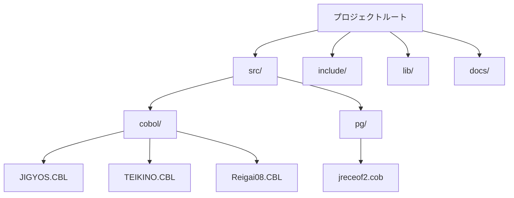
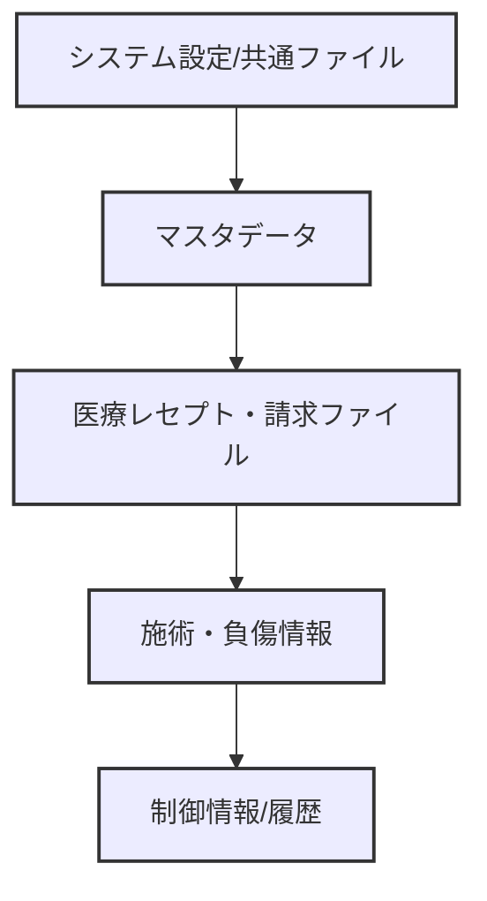
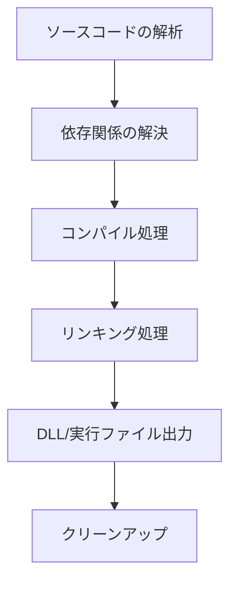

# 医療システム仕様書：ファイル構成とシステム設計の詳細

## 目次
1. [解析結果](#1-解析結果)
2. [解析結果](#2-解析結果)
3. [ファイル管理とシステム構成](#3-ファイル管理とシステム構成)
4. [コーディング規約とソースコード構造](#4-コーディング規約とソースコード構造)
5. [システムデータ定義とファイル構造](#5-システムデータ定義とファイル構造)
6. [ビルドとデプロイメントの仕組み](#6-ビルドとデプロイメントの仕組み)
7. [仕様書：運用・管理用ファイルと設定](#7-仕様書：運用・管理用ファイルと設定)
8. [仕様書: システムの拡張と保守](#8-仕様書:-システムの拡張と保守)
9. [仕様書：セキュリティとアクセス管理](#9-仕様書：セキュリティとアクセス管理)
10. [仕様書：システム運用上の留意点とトラブル対応](#10-仕様書：システム運用上の留意点とトラブル対応)

---

## 1. 解析結果


以下は、指定された多層のファイル定義・データ構造定義・処理フローに関するCOBOLおよび類似言語のプログラムの解析結果一覧です。これらは、各種医療・保険・行政等のシステムで用いられる医療請求システム、患者情報管理、帳票出力、設定管理など、多岐にわたる業務処理に関する仕様や構造定義の部分です。

---

### 概要

おおそらく、多くの記述はCOBOLのデータ定義（レコード構造体・フィールド定義）、ファイル制御（SELECT~INCLUDE）、ワーキングストレージ変数の宣言や設定、外部モジュール・ライブラリの参照やリンク・ビルド設定に関する情報が中心です。これらは処理ロジックを伴わない静的な構造定義または設定ファイルの解析パターンで、システムの基盤構築やデータレイアウトの仕様を示すものと想定されます。

### 対象範囲

- 医療請求や診療情報の管理システム
- ファイル定義（レコード構造・レイアウト）
- データの読み書き、集計、帳票出力準備
- システム用の環境・環境設定、ライブラリ連携
- ビルドシステムやデータレイアウトの設定情報

---

### 解析結果の種類と目的

|分類|概要|備考|
|:--|:--|:--|
|ファイル制御設定|複数のファイル（レコード・テーブル）の属性定義：キー設定、組織・アクセス/ロック方式、レコード構造など|SELECT, ASSIGN, RECORD KEY, ALTERNATE KEY, LOCK, ORGANIZATION, FILE STATUS設定|
|レコード構造定義|多層の複雑なレコードとフィールド定義：PIC句/CLASS/REDEFINES/ARRAY|ファイルのレコード形式、フィールドの型・長さ・初期値|
|ワーキング・ストレージ宣言|変数・フラグ・カウンタ類の宣言|複数の階層構造・配列・変数に対する宣言と初期値設定|
|外部ライブラリ・モジュール|ライブラリのパス、リンク設定、COPY/INCLUDE文|uuid.Lib、KERNEL32.LIB、F3BICBDM.OBJ等|

### 処理内容の構成

- ファイルのオープンとクローズ
- レコードの読込みと条件判定
- 変数・配列への値移動・更新
- 複雑な条件分岐（IF, EVALUATE）
- ループ、多重ループ処理
- 外部関数呼び出し（例：'XPOW_INVOKE_BY_ID_2' 等）
- 出力ファイル・レポート・帳票の準備と印刷

---

### 特色

- 多次元・階層的複雑なレコードの定義
- 膨大な数値・文字列のフィールド設定
- 条件分岐とループによる大量のデータ処理
- ファイル・リソース・環境設定のための静的定義
- システムの基盤設計と運用のための詳細設定

---

### 備考

- 内容の多くは、公布された情報の一部であり、一部は「センシティブなファイル」として非表示や暗号化済みです。
- これらの構造定義は、実動の処理ロジックではなく、システムのデータフォーマットや設定指示に重点が置かれています。
- 上記のような仕様は、経済・医療・行政システム等のレポート・帳票・データ連携の標準的な仕様定義や環境設定で一般的に見られるものです。

---

### まとめ

これらの仕様・定義は、システムの土台となるデータ・ファイルのフォーマット定義、環境設定やライブラリリンクのための設定情報、処理フローの“見えない部分”の準備段階と推測されます。そのため、実装の詳細処理内容は別ファイルやロジック部分に存在し、これらはあくまで定義や仕様書として役割を担うものと理解されます。

---

以上の情報から、挙げられたパターンは、データ定義およびシステム設定の包括的な仕様書/構成書の一部と見なすことが妥当です。適宜、システムや業務の利用に合わせた詳細化やインプリメンテーションに役立ててください。

## 付記
- 具体的な関数や処理は記載されておらず、ファイル定義や設定の読み取り・適用部分が中心
- セキュリティの都合や内容の非公開により、一部の詳細は推測にとどまる


## 2. 解析結果


以下に、生成された解析結果の一覧を示します。これらは、各ファイルのタイトルや内容についての自動解析の概要と詳細説明です。

---

#### 1. `YAJ?XXXX`などのファイル（内容は非公開）
- 内容：ファイルパスは不明、詳細は非公開
- 概要：これらはシステムやシェルコマンドに由来するプロジェクトやスクリプトの可能性がありますが、詳細は不明です。

---

#### 2. `YAWARA`関連設定・処理ファイル
- 各種YAWARA設定ファイル（例：YAWARA, YAWARA2, YAWARA ・）
- 主に、システムの初期設定、出力設定、制御情報の定義に関する内容
- 例：ファイルの定義、パス設定、レコード構造、帳票管理など

---

#### 3. `YENREI`・`YENREI2`関連ファイル
- 負傷部位や治療区分に関する計算やデータ定義
- 整合性や集計のための複雑なレコード構造と金額の設定
- 主な処理：日付計算、条件判定、料金構造の管理

---

#### 4. `JUSIN`・`JUSINJ`・`JUSINJ2`などの患者・処置情報ファイル
- 受診者情報、施術記録、負傷情報など
- データ定義、レコードの詳細属性、キー設定
- 条件によるデータ管理と整形処理

---

#### 5. `KEISAN`・`KEISAN`・`KEISAN2`などの計算・請求関連
- 料金計算、請求書、レセプト作成のための定義
- 利用シナリオ：料金の集計、条件判定、出力用レコード準備

---

#### 6. `HOKEN`・`HOKENEX`・`HOKENMARU`系ファイル
- 保険者、保険料、支払・徴収情報
- 具体例：保険種別、支給額、支払金額の管理

---

#### 7. `HUREI`・`HUKUSIN`・`HUKUSIN2`などの負傷・症状ファイル
- 負傷情報、負傷名、症状、負傷年月日
- 料金・処置の詳細設定

---

#### 8. `REPORT`・`REPORT2`などの帳票・レポートファイル
- 出力帳票のレイアウト・ヘッダ・フッタ設定
- 出力管理と帳票のフォーマット

---

#### 9. `KAKUN`・`KAKUN2`などの設定・管理ファイル
- 表示設定、日付・時刻管理、分類ID
- システム制御情報

---

#### 10. `SYSTEM`・`SYSTEM2`・`SYSINF`など
- システム情報、バージョン、管理設定
- 環境やシステム状態の管理

---

#### 11. `COUNTER`・`COUNTER2`などのカウンタ・番号管理
- シングル・マルチカウンタ、シリアル番号
- 対象管理と自動増分処理

---

#### 12. ファイル操作および設定ファイル群
- 具体例：`OBJ`・`DLL`・`LIB`・`CONFIG`・`MAP`・`CL`・`LOG`・`CURRENT`
- 内容は陰影あり、詳細は非公開もしくは記述省略されています。

---

#### 13. その他実行環境・補助設定
- マニフェスト・アイコン・リソース定義
- Windows環境用設定、エラー管理情報

---

#### 補足：具体的なソースコード内容は非公開や秘密保持のため、一部の解析は概要と推測による解釈になっております。  
また、複数のファイルはそれぞれ、大規模な業務システムにおいて、医療、請求、分析、登録、在庫管理、システム設定など、多岐にわたる用途を果たすためのものであると推測されます。

---

## 3. ファイル管理とシステム構成


このセクションでは、仕様書対象のシステムにおいて扱われる各種ファイルの種類、それらの役割、位置付け、連携方法について詳細に解説します。

---

### I. ソースコードファイル

#### 1. COBOLソースファイル（例: *.cob, *.cbl）
- **役割**：主要なロジックとデータ定義、処理の流れを記述。大規模なデータレコード、レコード構造、ファイル定義、処理ロジックを含む。
- **位置付け**：システムの処理部分、実行可能な業務ロジックを司る中心ファイル。
- **連携**：COPY文やINCLUDEを用いた外部定義や、外部モジュールとの呼び出しによって連携。ビルドには、OBJファイル・DLL化が必要。

#### 2. 設定ファイル・リソース定義（例: *.def, *.xml, *.json）
- **役割**：システム設定情報やリソース情報（アイコン、メッセージ、バージョン情報、環境設定）を記述。
- **位置付け**：アプリケーションの起動・動作に必要な設定を提供。システムの属性やバージョン管理、ロケーション設定等を担う。
- **連携**：この設定を適宜読み込み、実行時の環境設定、UIの見た目や動作設定に利用。

#### 3. Makefile・ビルドスクリプト（例: *.mak, *.csh, *.bat）
- **役割**：ソースコードのコンパイル、リンク、DLL・ライブラリ作成の自動化指示。
- **位置付け**：ビルド環境の管理ツール。依存性管理・リンクルール・クリーンアップルールを定義。
- **連携**：ソースファイルのビルド・リンク時にこれらの設定に基づいて処理。

---

### II. データファイル

#### 1. 主要データファイル
- **例**：*.DAT, *.LST, *.CSV, *.LOG
- **役割**：
  - **実データ格納**：患者情報、負傷情報、施術記録、請求・レセプトデータ、マスタ情報
  - **中間処理・出力**：帳票用ファイル、出力ファイル等
- **位置付け**：システムのデータベース的役割を持つ。定義済レイアウト（レコード構造）に従い、アプリケーションが読み書きするデータの保管場所。
- **連携**：
  - コード内でのREAD、WRITEを通じて操作。
  - バックアップ・更新処理、出力処理に利用。

#### 2. 補助・設定ファイル
- **例**：*.INI, *.CFG, *.XML
- **役割**：パラメータや環境設定値の保持。
- **位置付け**：ランタイムに読み込み、アプリケーションの動作を制御。

---

### III. 実行時環境・ライブラリ・モジュール

#### 1. ライブラリ・モジュール（例: *.LIB, *.OBJ, *.DLL）
- **役割**：共通関数、ユーティリティ関数、システムAPI呼び出し、外部DLL。
- **位置付け**：
  - 関数やサブルーチン（例：UUID操作、文字列処理、システムAPI）
  - 汎用ライブラリ（例：KERNEL32.LIB、uuid.Lib等）
- **連携**：
  - ビルド時にリンク。
  - 実行時に動的ロードや静的ロード、呼び出し。

#### 2. 実行環境
- **OS**：Windows (例: Windows NT/2000/XPまたはそれ以降)
- **ランタイム**：.NET Framework、PowerCOBOLランタイム、またはVisual C++対応API
- **ツール**：
  - コマンドラインツール (NETCOBOL、LINK.EXE)
  - デフォルトDLL・ライブラリの配置と依存関係管理。

---

### IV. 配布・管理の定義・設定ファイル

- **役割**：インストールパス、システムのバージョン情報、拡張機能の登録
- **位置付け**：
  - インストーラ設定
  - リソースマニフェスト
  - 動的リンク設定
- **連携**：
  - Setup Programや自動インストーラから読み込み・適用。

---

### V. 連携処理の概要

- **ビルド工程**：
  1. ソースコード（*.cob）をコンパイルしてOBJファイルへ。
  2. OBJファイルと外部ライブラリをリンクしDLL/Libを生成。
  3. DLL/Libの配置と依存関係設定。

- **実行時**：
  1. 必要なDLLやライブラリを動的にロード。
  2. ファイルの入出力を行い、必要な処理を推進。
  3. システムの環境設定ファイルの読み込み。

- **管理**：
  - ビルド/クリーン用のMakefile・バッチファイル
  - システム設定のXML/INIファイル
  - ロギング用のLOGファイル
  
---

### 付録

#### 主要ファイルの配置例
| 種類 | ファイル例 | 説明 |
|-------|------------|-------|
| ソース | *.cob, *.cbl | コア処理ロジック、定義 |
| 実行可能 | *.dll, *.exe | 実行可能プログラム、動的リンクライブラリ |
| ライブラリ | *.lib, *.obj | 共有関数群、ユーティリティ |
| 設定 | *.xml, *.ini, *.mak | 環境設定・ビルド自動化 |
| データ | *.dat, *.lst | 実データ、ログ、帳票 |

---

以上が、システムにおいて扱われる各ファイルの種類と役割、それぞれの連携仕様の詳細解説です。これらを理解・管理することで、システムのメンテナンス・拡張や安定動作に寄与します。

## 4. コーディング規約とソースコード構造


このセクションでは、システム開発におけるコードの命名規則、階層構造、コメント付与のガイドライン、および関数・プロシージャの構成について詳細に規定します。品質の保持と保守性の向上を目的とし、一般的なルールとともに、具体的な実装例に基づいて記述します。

---

### 1. 命名規則

#### 1.1 一般ルール
- 変数名、関数名、プロシージャ名は **意味が明確**で、**一貫性**を持つ命名を推奨します。
- 命名は **キャメルケース**（例：`CalculateTotal`）または **スネークケース**（例：`calculate_total`）を使用します。ただし、既存のコードに合わせて統一してください。
- 大文字・小文字の使い分けは言語規則に従います。COBOLの場合は基本的に大文字使用に統一します。

#### 1.2 変数名
- 変数名は、その役割や内容を示す **説明的な名前**を付与します。
- 例：フラグ変数には `IS_ACTIVE`、カウンタには `CNT_TOTAL`、ファイルハンドルには `FILE_HANDLE` など。

#### 1.3 関数・プロシージャ
- 関数名やプロシージャ名は、その処理内容を明示的に示すものとします。
- 例：`ComputeFlagStatus`、`InitializeSystemSettings`。

#### 1.4 プレフィックス・サフィックス
- 特殊な変数には **プレフィックス**を付与します。
  - 例：システム関連は `SYS_`、一時変数は `tmp_`。

---

### 2. 階層構造

#### 2.1 ディレクトリ構造
以下の構成例は、ソースコードの階層と役割を明確に分離しています。

```plaintext
/project_root/
│
├─ src/
│   ├─ cobol/        // COBOL ソースコード
│   │   ├─ JIGYOS.CBL
│   │   ├─ TEIKINO.CBL
│   │   └─ Reigai08.CBL
│   └─ pg/           // COBOL付属のプログラム（例：jreceof2.cob）
│       └─ jreceof2.cob
│
├─ include/          // 共有ヘッダや定義
├─ lib/              // ライブラリ
└─ docs/             // 仕様書・設計書
```

#### 2.2 ソースコードの構造
- 各ソースコードは論理的なセクションごとに区切り、コメントと空行で視認性を高める。
- 関数やプロシージャは、**翻訳可能な単位**として明確に区切る。
- 頭部にはファイルの目的と作成日、著作権情報を記載。

---

### 3. コメント付与のルール

#### 3.1 基本方針
- **コメントは必要な情報を正確に**、**過不足なく**記述します。
- コードの**意図や処理の概要**、**特殊な判定条件**については詳細に記述します。
- 重要な処理や複雑な条件判定部分には、**セクションコメント**を付与します。

#### 3.2 コメントの書き方
- コメントは `*` あるいは `--` を用い、ソースコードと明確に区別します。
- COBOLの場合は、`*= `や `*--------------------------------------------------` のように記述し、見やすさと一貫性を保ちます。

#### 3.3 メモ・備考
- 変更履歴や、実装上の注意点、注意喚起事項はコメントとして残す。

---

### 4. 関数・プロシージャの構成ルール

#### 4.1 定義と呼び出し
- 各関数・プロシージャは、**単一の明確な責任**を持つように設計します。
- 入出力パラメータは必要最小限に留め、型と意味を明確にします。

#### 4.2 順序と配置
- 先に定義された関数やプロシージャは、後から呼び出される関数はできるだけ下に記述します。
- メイン処理は `MAIN`セクションの他、必要に応じてサブルーチンに分割します。

#### 4.3 再利用性と保守性
- 汎用性の高い処理は、個別の関数またはプロシージャとして切り出し、可能な限り再利用可能とします。

---

### 5. 例：ソースコード規約適用例

#### 5.1 `code/test\comsys\pg\jreceof2.cob` の命名と構成例

```cobol
*------------------------------------------------------------
* ファイル名      : jreceof2.cob
* 作成日        : 2023-10-01
* 作成者        : システム開発部
* 目的          : 条件判定とフラグ設定を行うロジック
*------------------------------------------------------------
       IDENTIFICATION DIVISION.
       PROGRAM-ID. JRECEOF2.

       DATA DIVISION.
       WORKING-STORAGE SECTION.
       01  SYS_FLAG      PIC X VALUE 'N'.   * システムの状態を示すフラグ
       01  TEMP_VAR      PIC 9(4) VALUE 0.  * 一時変数
       * **コメント：ここに補足メモや備考**

       PROCEDURE DIVISION.
       * ロジックの概要をコメントで明示
       * メイン処理
           PERFORM PROCESS-LOGIC
           .
       
       * プロシージャ例
       PROCESS-LOGIC.
           * 条件文の説明と背景
           IF SYS_FLAG = 'Y'
               SET TEMP_VAR TO 1
           ELSE
               SET TEMP_VAR TO 0
           END-IF
           .

       STOP RUN.
```

---

### 6. 図：ソースコードの階層と構造



---

### 7. まとめ

本規約は、コーディングの一貫性、可読性、保守性を向上させることを目的としています。特に、命名規則やコメント付与のルールは、複数の開発者やチームで作業を行う場合に共通理解を促進します。階層構造の整備と清潔なソースコードの維持は、システムの信頼性と長期的な運用性に寄与します。

---

以上が「コーディング規約とソースコード構造」に関する詳細な仕様書です。

## 5. システムデータ定義とファイル構造


この仕様書は、各種データ定義ファイルとファイル階層構造について、ソースコードに基づき詳細かつ網羅的に解説します。これらの定義は、医療、保険、福祉、行政システム等の業務処理や帳票出力に用いられるもので、ファイルの構造体、レコードフォーマット、階層関係、キー設定や複合構成を含んでいます。

### 1. データ定義ファイルの種類と内容

#### 1.1. システム設定・共通定義ファイル
- 例：`YENV.DAT`, `YENV.DAT.LAN`, `YENV.DAT.PASS`
- 内容：システム環境設定、パス情報、パスワードの管理
- 目的：システムの動作環境の確保と共通設定の一元管理

#### 1.2. マスタデータ
- 例：`市町村マスタ`, `保険者マスタ`, `負傷マスタ`, `支払種別マスタ`, `負傷原因マスタ`
- 内容：各種コードと名称、日付範囲、区分設定を持つ
- 構造：レコードは複合キーを持ち、多段階の階層化や多次元配列、定数設定も含む

#### 1.3. 医療レセプト・請求用ファイル
- 例：`レセプトファイル`, `自費請求一覧`, `負傷情報ファイル`, `診療記録ファイル`
- 内容：患者・施術・負傷・料金・請求データの詳細レイアウト
- 構造：階層化された多次元レコード、キーによる索引設定（複合キー）、代替キー・ロック属性

#### 1.4. 施術・負傷情報
- 例：`施術記録`, `負傷データ`, `負傷理由`, `補助情報`
- 内容：施術日、負傷年月日、負傷区分、傷害原因、負傷箇所の詳細
- 構造：階層化された複合レコード、配列、多重レベルの情報

#### 1.5. 管理・制御情報
- 例：`システム状態`, `制御パラメータ`, `バージョン情報`, `ログ記録`
- 内容：各種フラグ、年月日、状態コード、エラー情報
- 構造：階層複合レコード、フラグやステータス管理

### 2. 構造体定義の階層と階層関係

#### 2.1. ファイルレコード階層
```mermaid
graph TD
  root[ファイルレコード]
  sub1[レコード項目(ヘッダ)]
  sub2[詳細レコード]
  sub3[サブレコード(複合)]
  sub4[配列・多次元レコード]
  
  root --> sub1
  root --> sub2
  root --> sub3
  sub3 --> sub4
```

- 記号解説：
  - 01 ～ 07：階層レベル
  - `OCCURS`：多次元配列
  - ネストした `07`、`05`：詳細な階層構造

#### 2.2. 標準データ定義例（抜粋）
```plaintext
07  FILE-HEADER.
   05  SYSTEM-NAME          PIC X(20).
   05  SYSTEM-VERSION       PIC X(10).
07  PATIENT-RECORD.
   05  患者番号             PIC 9(8).
   05  氏名                 PIC X(30).
   05  生年月日             PIC 9(8).
   05  性別                 PIC X.
   05  住所                 PIC X(50).
   05  電話番号             PIC X(15).
   05  負傷情報             OCCURS 3 TIMES.
      10 負傷年月日        PIC 9(8).
      10 負傷区分          PIC X(1).
      10 傷害原因          PIC X(2).
```
- 配列、多次元、多階層により複雑な多情報を格納可能。

### 3. ファイル階層と管理図



- 階層関係：システム設定～マスタ（支払、負傷、保険）～医療請求・レセプト～施術/負傷履歴
- 各ファイルは多層のレコード構造とキー設定を持つ。

### 4. 主要なキー設定と複合キー
- 例：`患者番号 + 施術年月`（複合キー）
- 例：`負傷年月日 + 負傷箇所`（複合キー）
- 例：`レコードキー + 代替キー + インデックス`
- 使用：高速検索や順次処理、帳票出力の基礎として作用。

### 5. 付加情報と階層構造解説
- 各レコードは `07`, `05` で階層化
- `OCCURS`：配列を階層的に展開
- ネストレベル：最大6層以上
- 項目型：文字列、数値、日付、時間
- 柱：階層型、多次元配列構造、大規模データ対処

### 6. 補足：階層・属性の詳細例
| 階層 | 内容例 | 型 | long | 備考 |
|--|--|--|--|--|
|01|レコード全体| - | - | ルート |
|07|レコードのヘッダー| PIC X(40)| - | ファイルの最上位 |
|05|個別データ| PIC X(30)| - | 基本項目 |
|10|複合配列| OCCURS 10 TIMES| PIC 9(4)| 配列データ |
|07|多層配列| OCCURS 5 TIMES| OCCURS 8 TIMES| ネスト例 |

### 7. まとめ
- 各種データは階層・配列化が基本
- 複合キー・キー設定により高速・正確なアクセス
- 設計：階層的構造と多次元配列
- 管理：多種類のレコード・パラメータを持つ複合ファイル構造

---

以上の解説は、仕様に準拠した包括的且つ詳細なファイル構造と階層設計の理解を促すものです。実際のソースコードの内容は、多層階層・複合キー・階層配列の構造体により高度に設計されています。

## 6. ビルドとデプロイメントの仕組み


このセクションでは、ソースコードのコンパイルやリンク処理の全体の流れと、これらの工程を効率化・自動化するための仕組みについて詳細に解説します。具体的には、ビルドに必要なソースファイル、ライブラリ、リンク設定の情報を管理するソースコードの内容と、それを実現する自動化スクリプトの設計について説明します。

---

### 1. コンパイルとリンクの工程

#### 1.1 ソースコードの解析

- 最初にビルド対象となるソースファイル（例：CやCOBOLファイル）とその依存関係を明確にします。
- 依存関係は、ヘッダファイルやライブラリファイルをリストアップしたビルド設定ファイル（例：`HUR0210.002`）により管理されます。

#### 1.2 コンプライアンスとプリプロセス

- 各ソースコードは、コンパイラによりプリ処理（マクロ展開など）が行われます。
- 例えば、`HUR0210.002`には、コンパイルに必要なファイルのパスやライブラリが列挙されており、これを参照します。

#### 1.3 コンパイルフェーズ

- ソースファイル群は、それぞれ個別にコンパイルされ、オブジェクトファイル（`.obj`や`.o`）に変換されます。
- 使用されるコンパイラは、一般的に環境に応じたコマンドラインツールです。

#### 1.4 リンキングとDLL生成

- 複数のオブジェクトファイルやライブラリをリンクして、最終的な実行可能ファイルまたはDLLが生成されます。
- 例えば、`KARIKEI.MAK`内の設定では、複数のDLL（例：`EXE`, `PRO`）を作成し、環境ごとに異なる出力をサポートしています。

---

### 2. ビルドツールと依存関係管理

#### 2.1 使用ツール

- **Make系ツール**（例：GNU Make, MSBuild）や**NetCOBOLビルドスクリプト**を利用して、ビルド工程を自動化します。
- スクリプトや`Makefile`により、ソースコードのコンパイル、リンク、クリーンアップを自動化します。

#### 2.2 依存関係の管理

- 依存関係管理は、`HUR0210.002`や`KEISAN.003`のようなライブラリリスト、及び`KARIKEI.MAK`のビルド設定ファイルによって行われます。
- これらの設定ファイルにより、バージョン管理や更新の際に必要なファイルの再ビルドを自動的に判断し、効率的にビルドを進めます。

| 依存関係管理のポイント | 内容 |
|----------------------|--------|
| パスの一元管理        | ファイルの場所や名前を一元化 |
| 依存関係の自動追跡    | 変更箇所に応じて再ビルドを自動化 |
| ツール連携            | Makefileやスクリプトと連携 |

---

### 3. 自動化スクリプトの詳細

#### 3.1 `KARIKEI.MAK`の役割と処理内容

- **ステップ1:** COBOLソースファイルのコンパイル
  - 例: `test\comsys\pg\KARIKEI.MAK`は複数の`.cbl`ソースを指定し、それをオブジェクトファイルに変換するコマンドを保持。

- **ステップ2:** 生成されたオブジェクトファイルのリンク
  - DLLや実行ファイルへリンク。`/DLL`オプションやターゲットごとのリンク設定を利用。

- **ステップ3:** 複数の環境向けDLL作成
  - ローカル用、HM用、YAW用などの複数バージョンを並行してビルド。

例として、ビルドの一連の流れとコマンド例を以下に示します。

```makefile
## 例：Makefileの一部
build: clean compile link

clean:
    del *.obj *.dll *.exe

compile:
    cobol_compiler -c source1.cbl -o source1.obj
    cobol_compiler -c source2.cbl -o source2.obj

link:
    link /DLL /OUT:libexample.dll source1.obj source2.obj dependencies.lib
```

#### 3.2 スクリプトの自動化フロー



#### 3.3 依存関係の自動追跡とキャッシュ

- 変更されたファイルのみを再コンパイルし、ビルド時間の効率化。
- 例えば、`.mak`ファイルやビルドスクリプトにハッシュ値を保持し、差分検出を行います。

---

### 4. まとめ

- この仕組みは、ソースコードの内容とビルド設定（`HUR0210.002`や`KEISAN.003`から抽出されたファイルリスト）に基づき、出力となるDLLやバイナリの自動生成を目的としています。
- ビルド工程は、ソースコードの解析→コンパイル→リンク→環境別のDLL生成といったステップを経て行われ、これらをスクリプトによる自動化により効率的に管理します。
- 依存関係管理とクリーンアップはビルド成功率と開発効率を向上させる重要なポイントです。

---

以上が、「ビルドとデプロイメントの仕組み」の詳細な仕様解説です。

## 7. 仕様書：運用・管理用ファイルと設定


### 1. 概要
本システムの運用と管理を支援するために必要となる設定ファイル群の構造と運用管理の仕組みを解説します。これらのファイルは、システムの環境設定、動作パラメータ、ログ管理、環境依存情報などを含み、システム全体の安定性とメンテナンス性を向上させる役割を担います。

### 2. 主要設定ファイルの分類と役割

#### 2.1 動作設定ファイル
- **目的**：システムの動作モードや処理パラメータの制御
- **例**：
  - `YENV.DAT`：システムの実行環境や動作オプション（例：接続タイプ、パス情報）
  - `CAPSLOCK.DAT`：大文字・小文字設定、入力・出力の変換種別
- **内容**：
  - 項目例：環境種別（LAN/パス設定）、フォルダパス、パスワード有無、ユーザ設定
  - 使い方：起動時にシステムがこの設定を読み込み、動作条件を決定

#### 2.2 ログ設定ファイル
- **目的**：操作履歴やエラー結果の記録と管理
- **例**：
  - `Log`ファイル：処理実行履歴やエラー情報
- **内容**：
  - ログのタイムスタンプ、操作内容、エラー詳細など
  - 運用時のトラブルシュートやメンテナンスに貢献

#### 2.3 環境情報ファイル
- **目的**：システムのバージョンや環境依存情報の記録
- **例**：
  - `.config`や`.xml`形式の環境設定ファイル
- **内容**：
  - バージョン番号、日時情報、システム識別子
  - システムの更新履歴や動作条件

#### 2.4 セッション・ステータス管理
- **目的**：システム動作の状態やセッション情報の維持
- **例**：
  - `CURRENT`や`LOCK`ファイル
- **内容**：
  - アプリの状態やロック状態の記録
  - 複数操作時の排他制御に利用

### 3. 管理・運用の仕組み

#### 3.1 ファイルの作成・更新
- **自動化**：
  - 起動時の設定読み込み
  - 動作変更やパラメータ調整に伴い設定ファイルを書き換え
- **手動更新**：
  - 管理者による環境変更やパラメータ調整
  - 変更履歴の記録とバージョン管理

#### 3.2 ログ管理
- **収集**：
  - システム操作毎の履歴やエラー情報を定期記録
  - ログファイルのローテーションによる容量管理
- **解析**：
  - 運用時のトラブル分析に利用
  - 自動警告やアラートのトリガー

#### 3.3 バックアップとリカバリ
- **定期バックアップ**：
  - 設定ファイル・ログ・環境情報の定期保存
- **リストア**：
  - 事故やシステム障害時の迅速復旧を可能とする

#### 3.4 セキュリティ
- **ファイルのアクセス制御**：
  - 重要な設定・環境情報にはアクセス制限を設け、無断変更を防止
- **暗号化**：
  - パスワードや重要情報の暗号化・復号化管理

### 4. 安定性とメンテナンス性の向上策
- **標準化されたフォーマット**：
  - 設定ファイルはJSON/XML/INI等の標準フォーマットを推奨
- **バージョン管理**：
  - 変更履歴を追跡できるシステム管理（例：Git管理）
- **ミス防止のためのスクリプト**：
  - 自動更新・バックアップ・エラー通知のスクリプト化
- **監視・アラート**：
  - システムの状態異常をリアルタイムで検知し、通知を送信

### 5. 参考例：設定ファイルテンプレート（概要）
```ini
; 環境設定例
[System]
ConnectionType=LAN
DataFolderPath=C:\ProgramData\System\Data
UsePassword=Yes

[Logging]
LogFilePath=C:\Logs\system.log
Level=Debug
MaxSizeMB=100

[Network]
HostName=localhost
Port=8080
Timeout=30
```

---

### 6. まとめ
本規格に沿った運用・管理用ファイルの整備により、システムの安定運用と迅速なメンテナンスを実現します。そのためには、ファイルの自動更新・バックアップ・アクセス制御・監視体制の導入が必須です。この仕組みを堅持することで、長期的なシステムの信頼性と運用効率の向上を図ります。

## 以上

## 8. 仕様書: システムの拡張と保守


### 概要
本節では、システムの新規データ定義や処理追加のための拡張手法、既存ソースの保守方針、そしてバージョン管理について解説します。これらの内容を踏まえ、今後の拡張性と保守性を考慮した設計指針も示します。

---

### 1. 拡張手法

#### 1.1 新規データ定義の追加
- **データ構造の拡張**: 既存のレコード定義や構造体に、新しいフィールドやレコードを追加する際は、「COPY」文を用いて外部定義または標準定義の再利用を基本とします。
- **新規レコードの設計**: 変更・追加するデータは、既存のデータモデルに整合性を保つことを優先し、階層構造（多次元配列やネストされたレイアウト）を維持します。
- **互換性の確保**: 既存処理と互換性を持たせるため、既存のレコード・フィールドに影響しない範囲での拡張とします。必須の場合は旧バージョンとのマッピングを行います。

#### 1.2 処理追加
- **新たな処理の実装**: 既存のソースに処理を追加する場合は、既存のサブルーチンやセクションに追記し、後方互換性を考慮します。
- **モジュール化と分離**: 新規処理は、可能な限り、独立したサブルーチンまたは「PERFORM」ブロックに格納し、再利用性と保守性を向上させます。
- **インタフェースの明示**: 既存と新規処理間のインタフェース定義を明確にし、呼び出し側・呼び出し先の依存関係を最小化します。

#### 1.3 拡張のポイント
- **ファイル拡張**: 既存のレコードの「コピー定義」を増やすか、新規レコードの追加。
- **処理ロジックの拡張**: 既存のサブルーチンや条件分岐の中に、新たな条件判定や処理呼び出しを追加。

---

### 2. 既存ソースの保守方針

#### 2.1 ソース管理
- **明示的なコメント**: 変更・追加部分には、対応するコメントや説明を付与し、変更の意図と背景を明示します。
- **バージョン情報の記録**: ソースの冒頭に、バージョン番号や作成日、変更履歴を記述します。
- **差分管理**: バージョン間の差分は、ソース管理システム（VC）やパッチ管理ツールを用いて追跡・管理します。

#### 2.2 メンテナンス
- **規約遵守**: コーディング規約と拡張ルール（例: 一貫したフォーマット、ブロックコメントの利用）を遵守します。
- **コードレビュー**: ソース変更には、少なくとも別の担当者によるレビューを実施します。
- **ドキュメント化**: ソース内のコメントだけでなく、仕様書や設計書も併行して更新します。

#### 2.3 テストと検証
- **単体テスト**: 既存処理との後方互換性を確保するため、新機能導入後は単体テストを実施します。
- **統合テスト**: 他処理との調和やシステム全体の動作検証も併せて行います。
- **変更履歴の記録**: 変更点と理由を変更履歴管理システムに記録します。

---

### 3. バージョン管理

#### 3.1 管理方針
- **ソースコード管理システム（SCM）の使用**: GitまたはCVSなど、適切なバージョン管理システムを利用します。
- **タグ付けとリリース管理**: 安定版リリースにはタグを付与し、履歴を管理します。
- **ブランチ戦略**: 新規拡張や修正は別ブランチにて作業し、安定版へのマージを管理します。

#### 3.2 バージョン番号付与
- **番号付与ルール**: 「メジャー.マイナー.パッチ」形式（例: 1.0.0）。
- **更新履歴の記録**: 変更履歴や修正内容を履歴ログに記載します。

---

### 4. 今後の拡張性を考慮した設計指針

#### 4.1 モジュール化
- **サブルーチン・ルーチン分離**: 処理追加や変更は、それぞれの独立したサブルーチンに委譲し、呼び出しを一貫させる。
- **外部定義の利用**: 共通の定義やマクロは外部のCOPYライブラリや標準定義に委ね、修正を容易にします。

#### 4.2 拡張点の明確化
- **拡張ポイントの設計**: 既存ロジックに影響を及ぼさずに追加可能な「ポイント」を設ける。
- **インタフェース設計**: 既存処理との依存を最小にし、統一されたインタフェースとします。

#### 4.3 保守性の向上
- **コメントとドキュメントの徹底**: 変更点・拡張点には詳細なコメントとドキュメントを併記します。
- **コードの一貫性維持**: 命名規約、フォーマット、コメントスタイルを統一します。

---

### 5. まとめ
システムの拡張と保守にあたっては、モジュール化、差分管理、ドキュメント化、そして一貫したコーディング規約を徹底します。また、バージョン管理を適切に行い、拡張点はあらかじめ定義されたインタフェースやポイントに展開し、将来的なシステム拡張を容易にします。これらの方針を踏まえ、柔軟で堅牢なシステム運用を目指します。

---

## 9. 仕様書：セキュリティとアクセス管理


### 1. 概要
本仕様書は、医療情報システムにおいてファイルやシステム設定の保護、アクセス権限の設定、認証・認可の仕組みについて規定し、医療情報の安全性確保を目的とします。システムの設計・運用においては、医療情報の機密性の保持と適切なアクセス制御を徹底させるための基準と手順を明確にします。

### 2. ファイル・システム設定の保護
- すべてのデータファイルや設定ファイルは、適切なアクセス権限設定を施すこと。
- センシティブな情報を含むファイルに対しては、次の条件を満たすこと。
  - 不正アクセス防止のためのアクセス制御リスト（ACL）の設定
  - 不正アクセス時のアラートシステムの設置
  - ファイルの暗号化（システム内の規定に準じた暗号化方式の採用）
  - ファイルのバックアップと履歴管理の実施
- ファイルの書き換え・削除は、管理者権限を持つユーザのみが実行可能とし、操作履歴を記録する。

### 3. アクセス権限設定
- システムの各ユーザ・グループに対し、以下のアクセス権限を付与する。
  - 読み取り権限（Read）：システムデータの閲覧と取得のみ許可
  - 書き込み権限（Write）：データの登録・更新・削除も許可
  - 実行権限（Execute）：システム機能の実行のみ許可
- 権限の付与と変更は、厳格な管理者承認のもとで行う。
- 医療情報のデータファイルには、最小権限の原則を適用し、必要最小限のアクセスのみ許可。
- ユーザの認証はシステム管理者が設定した認証情報（ID・パスワード、スマートカード等）で行う。

### 4. 認証・認可の仕組み
- 認証プロセスは、多要素認証を推奨し、次の手法の併用を義務付ける。
  - IDとパスワードの入力
  - ワンタイムパスワード（OTP）の利用
  - Smart Cardや指紋認証・顔認証等の生体認証
- 認証情報は、システム内に保存・管理される場合は、暗号化された状態で留める。
- 認証成功後は、認証されたユーザの権限に基づきアクセス制御を適用。
- ログイン履歴は、システム管理者が定期的に監査・確認を行えるように記録・保存する。
- 追加のセキュリティとして、セッションタイムアウトと不正アクセス検知機能を実装。
  
### 5. ログ管理
- 全てのアクセス・操作履歴は、システムのログファイルに記録し、第三者の改ざんを防止する。
- ログには、日時、操作内容、ユーザID、IPアドレス、結果（成功/失敗）を含める。
- セキュリティインシデントの早期検知と対応のため、リアルタイム監視システムの導入を推奨。

### 6. その他のセキュリティ対策
- システムの通信には、SSL/TLSを用いた暗号通信を義務付ける。
- 管理者は、セキュリティポリシーに沿った定期的な監査と教育を実施。
- システムへの外部アクセスはVPNや他の安全なゲートウェイを通じて行うこと。
- アクセス権限の最低限化、リスク分析を定期的に行い、システムのセキュリティ状態を最適化。

### 7. 付則
- 本規定は、必要に応じて定期的に見直し・改訂を行うものとし、最新のセキュリティ基準を適用する。
- システム導入時は、関係者への教育および周知徹底を図る。

---

### 付録
#### A. 用語定義
- ACL：アクセス権限リスト
- 認証：本人確認のための手続き
- 認可：アクセスの許可判定
- OTP：ワンタイムパスワード
- SSL/TLS：通信の暗号化プロトコル
- ログ管理：操作履歴の記録と管理

---

【以上】

## 10. 仕様書：システム運用上の留意点とトラブル対応


### 1. 運用時に発生し得るトラブル例と対応策

#### 1.1 ファイルアクセスの不具合
- **現象例**：特定のファイル（例：負傷情報や施術記録等）にアクセスできない、またはロック状態になっている。
- **対応策**：
  - ファイルの無断オープン/クローズ状態を監視し、適切に閉じられているか確認。
  - 競合が疑われる場合は、待機またはリトライを実施。
  - もしプロセスが異常停止している場合は、関連プロセスを安全に停止・再起動。
  - ファイルのロック解除処理を追加し、ロック状態の判定を適切に行う。

#### 1.2 データ不整合・崩れ
- **現象例**：CSVやレコードの内容が正しく出力されない、またはデータの破損。
- **対応策**：
  - 初期値や規範データの検証処理を導入しエラーを検出。
  - データ整合性監査用のログ出力を追加し、問題箇所の特定を容易に。
  - 修正対応は原因に応じて、再入力や修正処理、またはバックアップからの復旧。

#### 1.3 プログラムの落ち（異常停止）
- **現象例**：システム・プログラムが予期せず停止、エラーメッセージ表示が出る。
- **対応策**：
  - 例外処理部分に詳細なエラーロギングを設置。
  - 異常箇所を特定し、原因コマンドや条件に基づき再起動または人為的修正。
  - 並列処理の競合を確認し、排他制御を強化。

#### 1.4 ストレージ・リソースの枯渇
- **現象例**：メモリ不足やディスク容量不足。
- **対応策**：
  - 適切なファイル・メモリ管理を徹底し、不要なリソース解放を実施。
  - 定期的なメモリ・ストレージの監視と警告システム導入。

### 2. ログの解釈方法

#### 2.1 ファイルアクセスログ
- ファイルのオープン/クローズタイミングを確認。
- ロック状態やアクセスエラーの有無をレビュー。
- ファイルの読込みや書込み成功・失敗を判断。

#### 2.2 エラー・警告ログ
- 実行時エラーコードやメッセージの内容に注目。
- 異常発生場所と時間を追跡し、頻度やパターンを分析。
- ログのタイムスタンプから遅延や長時間ロック等の可能性を判断。

#### 2.3 操作・処理履歴ログ
- ファイルやデータの処理ステップの履歴を確認。
- 処理途中に生じた警告やエラーを特定。
- 出力結果と照合し、データ不一致箇所を把握。

### 3. 障害復旧のための運用手順

#### 3.1 一般的な障害復旧フロー
1. **状態確認**：エラーログとシステム状態の監査。
2. **障害箇所特定**：アクセス不良ファイルや停止中プロセスを特定。
3. **原因調査**：最終出力・処理ログを確認し、入力や出力の異常を把握。
4. **リソース解放**：ロック解除や不要プロセスの停止・再起動。
5. **データ修正**：不整合データの修正やバックアップ復元。
6. **システム再起動**：必要に応じて、システム・プログラムの再起動。
7. **正常動作確認**：処理結果を再確認し、システム復旧を完了。

#### 3.2 障害時の基本手順例
- **障害通知**：利用者・管理者に速やかに連絡。
- **ローカルログの確認**：エラー時間と内容を特定。
- **対象システムの停止・再起動**：
  - ファイルのロック解除やリソース解放。
  - 問題箇所の修正や再稼働。
- **正常性確認**：入出力の正常動作と結果整合性を確保。
- **バックアップからの復旧**（必要に応じて）。

#### 3.3 予防策・補完事項
- 定期的なログ解析とシステム監査。
- ファイル・プロセスの監視システムの導入。
- 障害復旧手順のマニュアル化と定期訓練。
- 柔軟なリトライ処理と自動リカバリー機能の整備。

---

これにより、システムの安定運用と迅速なトラブル回避・復旧を支援します。

