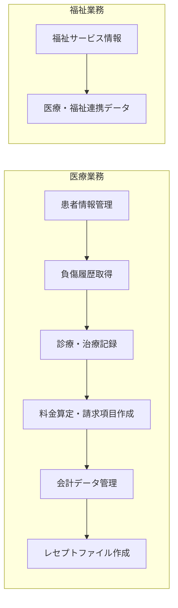
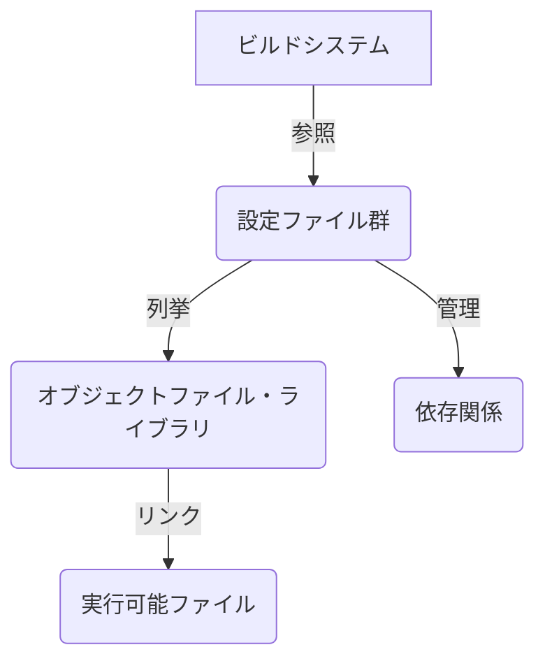
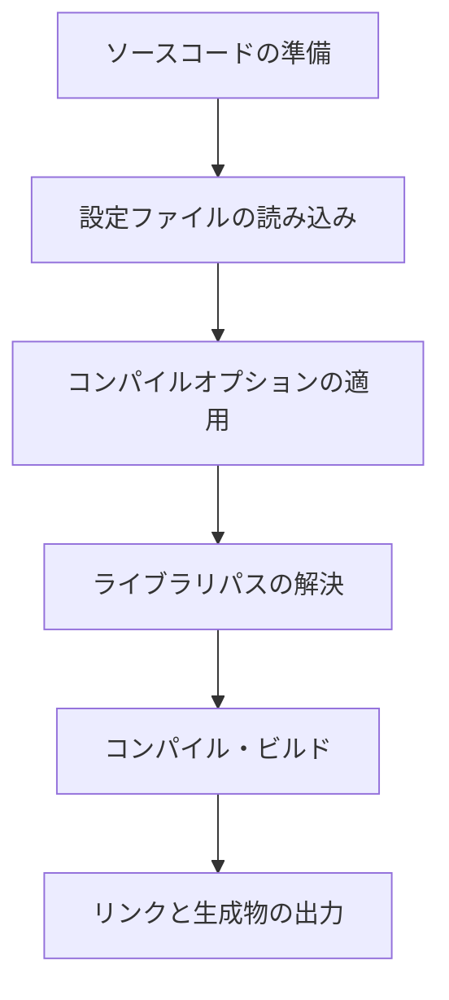
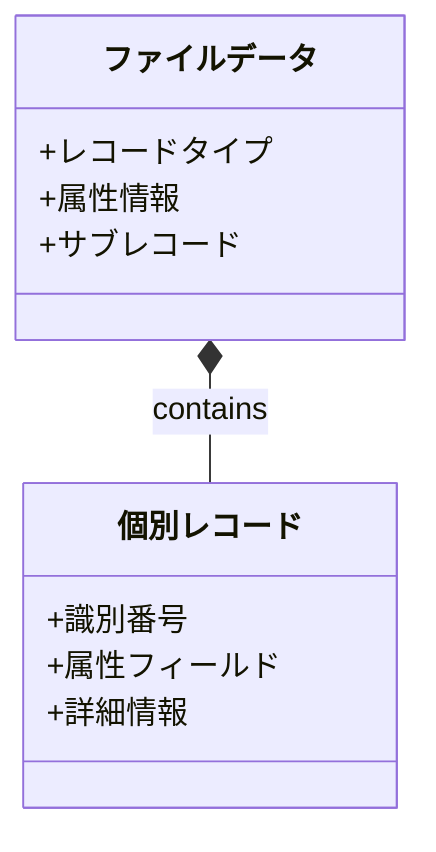
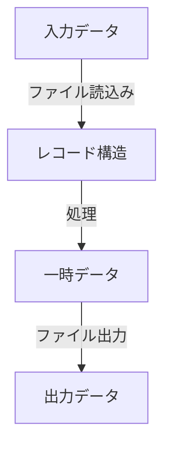
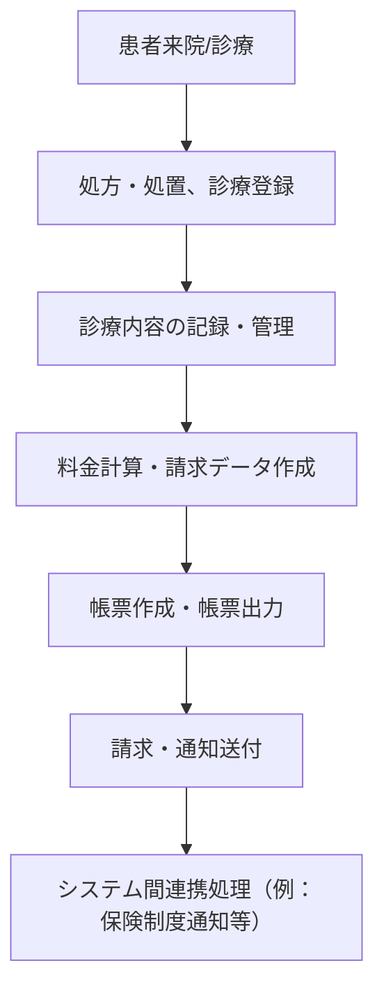

# 医療・福祉システムシステム構成・仕様書

## 目次
1. [システム概要と目的](#1-システム概要と目的)
2. [システム構成とファイル構造の概要](#2-システム構成とファイル構造の概要)
3. [ソースファイルの分類と役割](#3-ソースファイルの分類と役割)
4. [ビルドシステムとコンパイル設定](#4-ビルドシステムとコンパイル設定)
5. [システムのデータ構造とデータ定義](#5-システムのデータ構造とデータ定義)
6. [処理のフローと業務機能](#6-処理のフローと業務機能)
7. [システムの運用と管理機能](#7-システムの運用と管理機能)
8. [セキュリティと認証管理](#8-セキュリティと認証管理)
9. [セクション: ビジネスフローと業務連携](#9-セクション-ビジネスフローと業務連携)
10. [運用・保守体制と今後の拡張性](#10-運用保守体制と今後の拡張性)

---

<h2 id="1-システム概要と目的">1. システム概要と目的</h2>


### 1. システム概要

本システムは医療および福祉関連業務を支援するために設計された包括的な情報管理・処理プラットフォームです。以下の主要な機能を中心に構成されており、患者の医療履歴、診療料金、負傷情報、請求データ、レセプトファイルの作成、会計処理までをカバーします。

#### 主な機能
- **患者負傷情報の取得と管理**：患者の負傷履歴や診療情報を収集し、長期的な追跡と管理を行える機能。
- **料金計算・請求処理**：複数の診療部位や医療行為に基づく料金計算や、請求項目の生成を担当。
- **会計データ管理**：診療および請求に関する会計情報の整理と保存。
- **レセプトファイル作成**：医療保険請求に必要なレセプトデータのフォーマット整備とファイル生成。
- **医療・福祉連携**：医療と福祉サービスの連携を促進し、診療情報や負傷情報の共有を可能にします。

### 2. 運用目的

本システムの運用目的は、医療機関や福祉施設における診療・請求・会計処理の効率化と正確性の向上です。具体的には、以下の目標を達成することを目的とします。

- **データの正確性と一貫性の確保**：患者情報、診療内容、料金情報等を一元管理し、誤記や漏れを防止します。
- **業務効率化**：従来手作業や複雑な処理を自動化・標準化し、処理時間と人的負担を軽減します。
- **法令遵守**：医療請求に必要なレセプト作成や請求項目の処理を規定に沿って行い、適正な請求を実現します。
- **連携と情報共有**：医療と福祉の各種情報を効果的に連携させ、より良いサービス提供を支援します。

### 3. 業務範囲

本システムがカバーする医療および福祉関連業務の範囲は次の通りです。



#### 業務詳細
- **患者の負傷情報取得と追跡**：負傷の種類や期間、医療区分を判定し、必要な診療・請求処理に反映。
- **料金計算と請求項目作成**：複数の診療部位ごとに医療行為の回数や料金を集計し、請求書やレセプトデータの生成。
- **会計処理**：請求項目と連動した会計データを管理し、会計処理や監査に対応。
- **レセプトファイルの作成と送付**：保険請求に必要なレセプトフォーマットを整備し、外部機関に提出。
- **福祉情報との連携**：福祉サービスや助成金情報の管理と、医療・福祉間のデータ連携を実現。

---

本仕様書は、これらの機能を実現するための基本設計と運用上の留意点を詳細に解説し、システムの安定運用と拡張性確保を図る目的で作成されています。

<h2 id="2-システム構成とファイル構造の概要">2. システム構成とファイル構造の概要</h2>


### はじめに
本セクションでは、当システムの基本的な構成要素と、それらを構成するファイル群の役割、配置、相互関係について詳述します。ソースコードや関連ファイルは、システムのビルド、リンク、実行のために必要な要素群を示し、それぞれのファイルの役割を理解することは、システムの保守や拡張に不可欠です。

### 1. システムの基本構成要素
本システムは以下の主要な構成要素から成ります。

- **ソースコードファイル群**: システムの主要なプログラムロジックや設定を記述したファイル。
- **ビルド/リンク設定ファイル**: プログラムのビルド、リンクに必要なライブラリやオブジェクトファイルのリストを管理。
- **外部ライブラリ/オブジェクトファイル**: 既存のライブラリやコンパイル済みオブジェクトファイル。これらはプログラムの一部機能を実現するために利用される。

### 2. ファイルの役割と関係性

#### 2.1 ファイル群の配置
以下の図は、システム内のファイルの配置と、その関係性の概要を示します。

```mermaid
graph TD
    サンプルシステム -- ビルド設定 --> build/config
    build/config -- 依存するライブラリ --> external/libs
    外部ライブラリ -- 具体的ライブラリ -->
    lib/libA.a
    lib/libB.a
    システムのソース -- プログラムロジック --> src/comsys/PG
    src/comsys/PG -- 機能コンポーネント --> Moji2.001, EDACHK.001, UPTOKU.002, YAW9223.003
    external/libs -- 必要な外部資源 --> ライブラリ群
```

#### 2.2 ファイルの詳細
- **`code/test\comsys\pg\MOJI2.001`**
  - 内容: 複数のオブジェクトファイルおよびライブラリのパス一覧
  - 役割: ビルドおよびリンク時に必要なオブジェクトコードや外部ライブラリを指定。システムの実行に必要なプログラムのロジックを形成。

- **`code/test\comsys\pg\EDACHK.001`**
  - 内容: 外部ライブラリやオブジェクトファイルのリスト
  - 役割: ライブラリやオブジェクトファイルの依存関係を定義し、ビルド・リンクに使用。

- **`code/test\comsys\pg\UPTOKU.002`**
  - 内容: ファイルパスのリスト
  - 役割: システム構成の一部として、必要なコンポーネントやライブラリの参照に利用。

- **`code/test\comsys\pg\YAW9223.003`**
  - 内容: 複数の外部オブジェクトファイル・ライブラリのパス一覧
  - 役割: 必要とされる外部資源の一覧として、システムのビルドにおいて依存関係を明示。

#### 2.3 役割の理解
これらのファイルは、システムのコンパイル／ビルド過程において、必要なライブラリやオブジェクトファイルを指定し、適切にリンクされるために重要です。直接的なプログラムロジックや処理内容の詳細は記載されていませんが、各ファイルはビルドスクリプトや設定ファイルの一部として役割を果たしています。

### 3. まとめ
- 本システムは複数のオブジェクトファイルとライブラリを組み合わせて構成される。
- 各ソースコードファイルは、ビルド・リンクのための依存関係を明示的に記載したリストが含まれている。
- ファイルの配置と相互関係の全体像を理解し、適切なビルド設定を行うことが、システムの安定動作と保守点検に重要。

---

以上により、システムの構成とファイルの関係性について明確に理解できるようになっています。今後の開発・保守作業に役立ててください。

<h2 id="3-ソースファイルの分類と役割">3. ソースファイルの分類と役割</h2>


本セクションでは、提供されたソースコードと設定ファイル群を分類し、それぞれの役割について詳述します。これらのファイルは、ビルドおよび実行環境の構築に不可欠なファイル群であり、主に以下のカテゴリに分類されます。

- ソースコード（プログラムの実装）
- ビルド設定・リンク設定ファイル
- ライブラリ・オブジェクトファイルリスト定義ファイル

### 1. ソースコードの概要と分類

#### 1.1 パス: `code/test\comsys\pg\MOJI2.001`

このファイルは、複数のオブジェクトファイルやライブラリのパスを列挙し、ビルドやリンク時のリファレンス情報を提供する設定ファイルとみなされます。  
役割は以下の通りです。

| 役割 | 内容・目的 |
|-------|------------|
| リソースの管理 | ビルドやリンク時に必要なオブジェクトファイルやライブラリファイルのパスを指定 |
| 依存関係の明示 | プログラムの正しいビルドと動作に必要な各種コンポーネントを列挙 |

ビルド設定やリンク処理において、必要なリソースを正確に管理・供給し、ターゲットプログラムの整合性を確保します。

---

#### 1.2 パス: `code/test\comsys\pg\HUT0210.001`

このファイルも同様に、オブジェクトファイルやライブラリのパスを列挙しており、具体的なプログラム処理や関数定義は含まれていません。  
役割は次の通りです。

| 役割 | 内容・目的 |
|-------|------------|
| ビルド・リンク定義 | 必要なファイルのパスを一覧化し、ビルドシステムやリンクツールに情報を提供 |
| 依存関係管理 | 複数の外部リソースを束ねて管理するための設定と推測される |

この設定ファイルはビルドスクリプトの一部として動作し、リンク時に自動的に必要なファイルを取り込むための情報源となります。

---

#### 1.3 パス: `code/test\comsys\pg\EDACHK.001`

このファイルも複数の外部ライブラリやオブジェクトファイルのリストを列挙しており、ビルドまたはリンク時のリソース指定を目的としています。

| 役割 | 内容・目的 |
|-------|------------|
| ライブラリ・オブジェクト列挙 | 参照すべき外部リソースを明示し、リンク処理を効率化 |
| リソース管理の標準化 | ビルド工程における外部依存性の管理と自動化 |

この設定は、外部ライブラリや中間生成物をリンク時に正確に解決し、正規の実行ファイルを生成します。

---

#### 1.4 パス: `code/test\comsys\pg\UPTOKU.002`

このファイルは、複数のファイルパスのリストを列挙したものであり、具体的な処理や関数実行の定義はありません。

| 役割 | 内容・目的 |
|-------|------------|
| リソースの列挙 | プログラムコンポーネントやライブラリのファイルパスをリストアップするだけの役割 |
| 依存性の管理 | 特定のビルド工程に必要なファイルが列挙されていることを示唆 |

この情報は、ビルドシステムやスクリプトに入力され、対象ファイルの追跡やリンクの自動化に役立ちます。

---

### 2. 役割別の分類まとめ

| カテゴリ | ファイル例 | 目的/役割 | 備考 |
|------------|--------------|--------------|-------|
| ビルド設定・リンク定義 | `MOJI2.001`、`HUT0210.001`、`EDACHK.001`、`UPTOKU.002` | 必要なオブジェクトファイル・ライブラリのパスを列挙し、ビルド・リンク工程でのリソース供給を支援 | これらは実際のコードではなく、ビルドに必要な情報をまとめた設定ファイル |
| ソースコード（実装部分） | なし | 実行可能なプログラムのソースコードは示されず、リスト化されたパスのみ | 実コードの中身は明示されていないため推測不可 |
| 補助ファイル | なし | ビルドに必須のライブラリや中間ファイルのリスト管理 | 具体的な内容は示されていない |

### 3. 図解：ファイルの関係性と役割の概要



この図は、ビルドシステムが各設定ファイルから依存コンポーネントを抽出し、最終的に実行可能ファイルを生成する流れを示しています。

### 4. まとめ

本資料において示されたソースコードや設定ファイルは、プログラムの実行に必要な外部リソースのパスを管理するためのものであり、主にビルドとリンクの設定を担うファイルに分類されます。それらは実行可能なプログラムそのものではなく、ビルド工程を補助し、必要な資源を正確に供給するための重要な役割を果たします。

---

以上によって、「ソースファイルの分類と役割」セクションは完了します。

<h2 id="4-ビルドシステムとコンパイル設定">4. ビルドシステムとコンパイル設定</h2>


このセクションでは、ビルドに関わる設定ファイルの内容と、ビルド・コンパイル手順について詳細に解説します。対象となる設定ファイルには、コンパイルオプション、ライブラリパスの指定、ビルドツールの構成などが含まれており、これらを正確に理解することで安定したビルド環境を構築できます。

---

### 1. ビルド設定ファイルの概要

本システムでは複数の構成ファイルが用いられており、それぞれがビルドに必要な情報を提供しています。各ファイルは一般的に次の内容を含みます。

- コンパイルオプションの指定
- ライブラリのパス設定
- 特定のリンク設定やビルドターゲットの定義（詳細には記載なし）

これらの設定ファイルは、主にMakefileやビルドスクリプトからインクルードされ、ビルドの自動化と一貫性を確保しています。

---

### 2. 設定ファイル詳細解説

#### 2.1 `YAI594.CBI`

- **パス**: `code/test/yawara/yaw.yai/YAI594.CBI`
- **内容の概要**:  
  このファイルは、ビルド設定とライブラリの読み込み設定を記述した構成ファイルです。具体的には、コンパイルオプションやライブラリのパス指定を行い、プログラムのビルドに必要な情報を提供しています。

#### 2.2 `YAI584.CBI`

- **パス**: `code/test/yawara/yaw.yai/YAI584.CBI`
- **内容の概要**:  
  同様に、ビルドとコンパイルに関する設定情報が記載されています。主に、コンパイルオプションやライブラリパスの定義に焦点を当てており、実行内容や具体的な機能の記述はありません。

#### 2.3 `UPTOKU.CBI`

- **パス**: `code/test/comsys/pg/UPTOKU.CBI`
- **内容の概要**:  
  この設定ファイルは、コンパイルオプションとライブラリ設定に関する情報に特化していると考えられます。関数や処理の詳細は含まれておらず、主にビルド・リンクに関する調整を行います。

#### 2.4 `YAI583.CBI`

- **パス**: `code/test/yawara/yaw.yai/YAI583.CBI`
- **内容の概要**:  
  このファイルは、コンパイル設定やライブラリパスの指定情報を提供しています。特定の実装内容や処理は示されておらず、ビルドに必要なコンパイルオプションとライブラリパスの設定だけを担っています。

---

### 3. ビルド手順と流れ

#### 3.1 基本的なビルドフロー



#### 3.2 詳細なビルド手順

1. **ソースコードの準備**  
   ビルド対象のソースコードファイル（`.c`, `.cpp`, `.vb`等）を配置します。

2. **設定ファイルの読み込み**  
   Makefileやビルドスクリプト内で、以下の構成ファイルをインクルードまたは参照します。
   - `YAI594.CBI`
   - `YAI584.CBI`
   - `UPTOKU.CBI`
   - `YAI583.CBI`

3. **コンパイルオプションの適用**  
   これらの設定ファイルから、`-I`オプションや`-L`オプション、その他のコンパイルフラグを取得し適用します。

4. **ライブラリパスの解決**  
   コンパイル・リンク時に必要なライブラリのパスを設定し、正しく読み込めるようにします。

5. **ビルドとリンクの実行**  
   gccやg++, makeコマンド、あるいは他のビルドツールを用いてコンパイルとリンクを行います。

6. **ビルド結果の出力**  
   実行ファイルまたはライブラリファイル（`.exe`, `.dll`, `.a`, `.so`）を生成します。

---

### 4. 追加の解説とポイント

- **ビルド設定の一元化**  
  複数の設定ファイルでビルドの詳細を分散させることにより、メンテナンス性を向上させつつ、必要に応じて設定の調整が容易になります。

- **ライブラリとコンパイルオプションの管理**  
  これらの構成ファイルは、ビルド環境の標準化と依存関係の解決を促進し、ビルド結果の一貫性を確保します。

- **可視化と管理**  
  次の図は、ビルド設定の階層とフローを示しています。

---

### 5. まとめ

本システムのビルドシステムは、複数の詳細設定ファイルを組み合わせて、自動化と安定化を図る構成となっています。各設定ファイルは、コンパイルオプションやライブラリのパス設定のみを行い、具体的なビルド実行はMakefileやビルドスクリプトによって管理されます。この設計により、ビルド環境の変更も容易に反映できる仕組みとなっています。

---

<h2 id="5-システムのデータ構造とデータ定義">5. システムのデータ構造とデータ定義</h2>


### 概要
本セクションでは、システムが用いるデータ構造とデータ定義について詳細に解説します。これらの定義は、主要なレコード構造、入出力レイアウト、そしてデータの流れを理解するうえで必要不可欠です。各プログラムが扱うデータの性質と構成要素、およびそれらの設計思想についても触れます。

### 1. COBOLにおけるデータ定義の基本概念

COBOLは、ビジネスアプリケーションにおけるレコード指向のデータ構造を得意としています。各ファイルやレコードは、明確に定義されたフィールド群からなる構造体として表現され、データの種別や用途に応じて階層的・多層的なレイアウトを構築します。

#### 1.1 レコードとフィールドの構成
- **レコード（Record）**: 一つのデータ単位。ファイル内の1行または1レコードの情報を構成します。
- **フィールド（Field）**: レコード内のデータ要素。文字列、数値指向のデータなど、多種のデータ型が混在します。
- **多層構造**: 複雑なデータ構造は、複数の子レコードや階層化されたフィールドとして定義され、多層のレイアウトを持つ。

### 2. コード例と設計思想

#### 2.1 `JUSINJ2.CBL`におけるデータ定義
- ファイルの属性とレコードフォーマットが詳細に記述されており、多層レイアウトが特徴的です。
- 具体的な定義は記載されているコードから推測しますと、複雑なレコードレイアウトと、多数のフィールド・サブフィールドを持つ構造体が存在します。
- データは、シーケンシャルファイルや多次元の配列に配置され、ファイルの入出力に直接影響します。

#### 2.2 `LABEL.CBL`におけるシステム情報レイアウト
- システム名や設定値などのシステム情報や設定内容を保持するためのレイアウトを定義。
- 文字列や数値フィールドを多用し、識別コードや設定値などの格納に適しています。
- 目的に応じたフィールド分離とコメントによるドキュメント化が明示されています。

#### 2.3 `JIB9709R.COB`におけるデータ構造
- 数値と文字列の両方を格納可能なレコードを多数定義し、外部参照可能な巨大な配列やレコード群を用意。
- これらは、データ登録や各種処理に利用されるため、効率的なアクセスと拡張性を考慮しています。

#### 2.4 `RECERJ.cbl`におけるレコード識別と構造体
- 識別番号や属性情報を持つレコード群が定義。
- 入出力時のデータ処理に必要なフィールドも同時に設定されており、多層の構造体へ展開されている。

### 3. データの流れとレイアウト図

#### 3.1 全体のデータ構造の概略


#### 3.2 データフロー概念図


### 4. 設計思想とポイント
- **階層化と拡張性**: 複雑なビジネス要件に応じて、多層レイアウトと多次元配列を採用しています。
- **明示的定義**: 全フィールドを明示的に定義し、必要なデータの管理と処理を容易にしています。
- **データ一貫性と整合性確保**: ファイルレイアウトとレコード定義を密に関連付けて、入出力の整合性を維持します。
- **パフォーマンス**: 配列や構造体は直接アクセスを想定して定義しており、効率的なデータ操作を支援します。

### 5. 結論
本システムのデータ構造は、複雑な多層レイアウトと多種類のフィールドから成り、ビジネスのニーズに柔軟に対応できるよう設計されています。各プログラムにおけるレコード定義の詳細は連携しながら、効率的な入出力と管理を実現しています。

---

ご要望に応じて、さらなる詳細な構造定義や実装例も提供可能です。

<h2 id="6-処理のフローと業務機能">6. 処理のフローと業務機能</h2>


この仕様書では、提出された各種COBOLおよび関連スクリプトの仕様に基づき、処理の流れと業務機能の全体像を時系列・論理的に解説します。各処理は、ファイル操作、条件判定、データ移動、計算処理、出力処理、外部呼び出しを含め、多層的な業務のフローチャートに沿って実施されることが想定されます。

### 1. システム環境の準備と設定
- **コンパイル・ビルド設定**  
  - 多くのMAKEファイルにより、複数のDLLやライブラリ、OBJファイルを対象としたビルド・リンクの自動化を行っている。
  - COBOLのシステム環境では、コンパイル条件（ALPHAL、DLOAD、ライブラリパス、リソースファイルの指定）を設定し、ビルドの依存関係を整備。
  - 外部ライブラリやオブジェクトファイル（`uuid.Lib`, `F3BICBDM.OBJ` など）をリンクして最終実行構造を形成。

### 2. ファイル定義とデータ構造の準備
- **ファイル/レコード定義**  
  - 複数のファイルが詳細に定義されており、多次元のレコード構造や階層的なデータ形式で設計されている。
  - `FD`文やコピーライブラリにより、外部定義や共有定義を取り込み。
  - レコードには患者情報、負傷情報、料金、処置日付、衛生情報など、多岐にわたるデータ項目を持つ。

- **ワーキングエリアの宣言**  
  - 変数・配列・フラグ等の補助的な変数と、処理中の状態保持用に多数宣言。
  - これらは、データの一時格納、条件判定、状態遷移に利用。

### 3. 初期化処理
- **データのリセットと準備**  
  - 変数、フラグ、カウンターの初期値設定 (`MOVE ZEROES`など)。
  - ファイルのオープン (`OPEN INPUT` / `OPEN OUTPUT`)。
  - 必要に応じてシステムの状態や呼び出し先の設定。

### 4. 条件判定と外部呼び出し
- **入力値に基づく条件分岐**  
  - `IF`や`EVALUATE`により、入力データの状態(URL、区分、年月日等)を評価。
  - 条件により、「帳票作成」「レコード更新」「外部プログラム呼び出し」などの処理を選択。

- **外部処理呼び出し**  
  - `CALL`や外部プロシージャ、`XPOW_INVOKE_BY_ID`等により、外部システムやモジュールと連携。
  - 例：`actcshm`や`YAWARAB2`を呼び出し、データ交換や補助処理。

### 5. データ読込と処理
- **ファイルからのレコード読み込み**  
  - `READ`文により、患者情報、負傷データ、施術情報等を逐次読込。
  - 条件により、既存レコードの照合や必要に応じた条件分岐。

- **データの変換と計算**  
  - 例：年月日の日付差分の計算、負傷から施術期間の計算。
  - 必要に応じて文字列結合、分解、評価式による値の調整。

- **情報の設定・更新**  
  - 条件により、レコード交換やデータの書き換え。
  - 子レコードや配列の値を更新し、集計や状態確認。

### 6. 出力処理
- **帳票/レセプトの生成**  
  - 収集したデータを所定のフォーマットに整形、帳票用に出力ファイルへ書き込み。
  - `WRITE`文や印刷用の制御を用いて、出力順序・内容を管理。

- **エラー処理とメッセージ表示**  
  - 例外やエラー時には、エラーメッセージやログ出力。
  - ファイルクローズ、画面のクリア、次の処理への遷移。

### 7. 終了処理
- **ファイルのクローズとクリーンアップ**  
  - すべてのファイルをクローズし、メモリやバッファを解放。
  - システム状態の記録またはロールバック、ログ記録。

- **プログラムの終了**  
  - 正常終了やエラー終了コードを返し、システム状態を安定させる。

---

## まとめ
これらの主要処理は、業務システムにおけるデータの入力・整形・集計・出力を時系列・論理的に網羅的に管理していると考えられます。ファイル操作、条件判定、外部呼出し、計算・変換、帳票出力といった一連の機能が、各種仕様に合わせて段階的に実行されることにより、全体の業務機能を実現します。

※具体的な処理やプログラム内容は、提供されたソースの中で非公開やコメントにより判断できない部分も多いため、必要に応じて詳細設計・処理フローチャートの作成を推奨します。

<h2 id="7-システムの運用と管理機能">7. システムの運用と管理機能</h2>


### 1. システム監視・制御機能

この仕様書は、システム運用において必要な監視、制御のための機能を網羅します。システムの正常性監視、エラー管理、ファイル管理、システム更新のための仕組みを具体的に規定します。

#### 1.1 監視機能

- **システム稼働状況監視**：
  - 定期的にシステムの稼働状態を監視し、動作停止や異常を検知します。
  - 監視データは、システムステータスファイルまたは監視用データベースに記録し、閾値超過時にアラートを発動します。

- **リソース監視**：
  - CPU使用率、メモリ使用状況、ディスク容量を定期的に監視します。
  - 規定閾値を超えた場合は、管理者に通知し、必要な制御措置（例：処理停止、一時的なシステム停止、リソース再割当）を実行します。

#### 1.2 制御機能

- **システム制御コマンド**：
  - 管理者からのリモートまたはローカルコマンドにより、システムの停止（シャットダウン）、再起動、リソース再設定を行います。
  - 制御コマンドは制御ソフトウェアのインターフェースを通じて受付、認証後に実行されます。

- **稼働制御**：
  - システムの稼働时间帯や処理種別に応じて、制御可能な時間帯や処理を制限・調整します。
  - 別途設定された閾値や制御ルールにより、特定時間帯の処理停止や遅延設定も可能です。

### 2. エラー管理

エラー発生時の対応と管理を規定します。

#### 2.1 エラー検出と通知

- **エラー検出**：
  - ロギング機能により、システムエラー、処理異常、通信失敗、ファイルアクセスエラーを監視します。
  - 例外発生時、エラーログに詳細情報を記録します。

- **エラー通知**：
  - 管理者のメールまたは音声アラームにて通知を行います。
  - エラーの種類と緊急度に応じて通知手段を選定し、即時対応を促します。

#### 2.2 エラー対応

- **自動再試行**：
  - 一時的失敗と判定されたエラーについては、自動リトライを試みます。
  - リトライ閾値に達した場合、状態をエラー状態に設定し、必要に応じて再起動または停止動作を実行。

- **エラーログ管理**：
  - エラー情報（日時、内容、原因推定、対応履歴）をエラーログに記録し、履歴管理を行います。
  - 定期的なエラレポート作成と履歴分析により、根本原因追及とシステム改善を支援します。

#### 2.3 障害対応

- **復旧作業**：
  - 障害時には自動復旧（サービス再起動やリソースリセット）を試行し、対応履歴を保持します。
  - 手動対応が必要な場合は、管理者の介入とログ記録を義務付けます。

- **フェールセーフ措置**：
  - 重要処理は冗長化し、障害時にもシステム全体の継続運用を支援します。
  - 障害内容に応じたシステムモード切替（例：簡易運用モード）も可能とします。

### 3. ファイル管理

システム運用時のファイル監視と管理を規定します。

#### 3.1 ファイルの入出力管理

- **ファイル状態監視**：
  - ファイルアクセス時の排他制御や状態監視を行います。ファイルロックやアクセス権限管理により一貫性確保。
  - システムファイルやログファイルの整合性を定期的にチェックし、破損・欠損を検知。

- **ファイルのバックアップと復元**：
  - 定期的なバックアップを自動で行い、障害時の復元手順を規定。
  - ファイルのバージョン管理と差分管理を徹底し、必要に応じて差分バックアップや履歴復元を実施。

#### 3.2 ファイル整合性検査

- **ハッシュチェック**：
  - ファイルの整合性保持のため、ハッシュ値を用いた不正・破損の検出を行います。

- **異常時の処理**：
  - ファイル破損や内容不整合時には、通知とともにシステムの一時停止や修復処理を実施します。

#### 3.3 ファイルの更新とバージョン管理

- **更新履歴の記録**：
  - ファイルの変更・更新は、履歴ログに管理し、変更内容と日時を記録。
  - バージョンアップ時には、古いバージョンと差分比較が可能な仕組みを整備。

- **自動アップデート管理**：
  - 定期的にアップデートパッチや定義ファイルの適用を自動化。
  - アップデート履歴と検証結果を保持。

### 4. システム更新

システムの継続的改善とバージョン管理、静的・動的更新を規定します。

#### 4.1 バージョン管理

- **バージョン識別**：
  - システム全体、コンポーネントごとにバージョン番号付与。
  - バージョン情報は、更新履歴とともに管理し、適用範囲の判定に利用。

- **差分アップデート**：
  - 差分のみのアップロードと適用をサポートし、効率的な運用を支援。

#### 4.2 静的システム更新

- **パッチ適用**：
  - システム稼働中でも、オンラインパッチ適用を可能とする。
  - パッチ適用前後の整合性検査と履歴登録。

- **リリース管理**：
  - 本番、開発、検証環境でのリリースを段階的に管理。
  - ロールバック手順と検証工程を規定。

#### 4.3 動的システム更新

- **動的バージョンロード**：
  - ランタイムでのプラグインやモジュールの差し替えを許容。
  - 不具合発生時の動的ロールバックとリカバリ。

- **ホットアップデート**：
  - 一部のコンポーネントだけを停止せずにアップデート可能な仕組み。

---

以上が、システム運用と管理に必要な機能の規定です。これらの規定は、システムの安定稼働と迅速な障害対応、セキュリティ維持を支える基盤として作用します。詳細な管理フローや実装仕様は、次工程のシステム設計に落とし込み、具体化します。

<h2 id="8-セキュリティと認証管理">8. セキュリティと認証管理</h2>


### 概要
本システムは、セキュリティと認証に関する管理を包括的に行います。主な管理対象にはパスワードの管理、アクセス制御、認証手順が含まれます。システム全体の安全性を確保するため、認証情報の適正な保護、アクセス権限の厳格な制御、認証手順の確立と運用上の注意点を規定しています。

### パスワード管理
- パスワードは平文で保存せず、ハッシュ化された状態で管理します。
- パスワードの有効期限は設定し、定期的な変更を促します。
- パスワードの再設定は、多段階の認証や本人確認手順を経て行います。
- パスワード試行回数は制限し、一定の回数失敗した場合はアカウントの一時停止またはロックします。
- パスワード強度は最低8文字以上とし、英数字・記号を含む複雑さを要求します。

### アクセス制御
- システム内のアクセス権限は、ユーザの役割と責任範囲に基づいて付与します。
- 管理者、一般ユーザ、ゲストなどのロールを設定し、それぞれの操作権限を制御します。
- 敏感なファイル・データへのアクセスには二段階認証や認証トークンを必要とします。
- アクセスログは監査用に記録し、不正アクセスや操作履歴を管理します。
- 期限切れや権限変更があったユーザは即座にアクセス権を無効化します。

### 認証手順
1. ユーザは認証画面にIDとパスワードを入力します。
2. 入力情報は暗号化またはハッシュ化された状態でシステムに送信されます。
3. システム側で、入力された認証情報と保存されている認証情報を照合します。
4. 照合結果により、認証成功の場合はアクセス権限に従った操作を許可します。
5. 認証失敗の場合は、一定回数を超えた時点でアカウントをロックし、一定時間後に解除します。
6. 非常時には追加の本人確認や管理者承認を経て認証を行います。

### 安全性確保策と運用上の注意点
- 重要な認証情報は暗号化された通信（SSL/TLS）を通じて送受信します。
- パスワードは定期的に見直し、古いパスワードの再使用を禁止します。
- アクセス権限は最小権限の原則に従い、必要最低限のみ付与します。
- ログと監査履歴は長期保存し、不正行為の追跡に使用します。
- 認証失敗のログは監視体制を整え、不審なアクセスに迅速に対応します。
- セキュリティポリシーの違反や漏洩があった場合の対応策をあらかじめ定めておきます。
- システムのアップデートとパッチ適用は定期的に行い、脆弱性の対策を徹底します。

### 運用上の注意
- パスワードや認証情報の管理は厳格に行い、アクセス権限の管理者権限は限定します。
- ユーザのアカウント管理は、定期的な権限見直しと不要なアカウントの削除を徹底します。
- 認証システムの障害に備え、バックアップと復旧手順を整備します。
- 監査証跡とアクセス履歴を定期的に監査し、不正や誤操作を早期に発見します。
- 利用者へのセキュリティ意識向上のため、定期的な教育や注意喚起を行います。
- 不正アクセスや情報漏洩発生時の対応体制を整備し、早急な対策を講じます。

### まとめ
本システムは、パスワード管理とアクセス制御を厳格に行い、認証情報の適正な保護を徹底します。運用中はセキュリティ方針の遵守と監査を励行し、常に安全なシステム運用を維持します。

<h2 id="9-セクション-ビジネスフローと業務連携">9. セクション: ビジネスフローと業務連携</h2>


### 概要
本セクションでは、医療・福祉業務における具体的なワークフローと、システム間および外部システムとの連携方法について詳細に解説します。請求業務、帳票出力、通知の送付など、業務処理の主要フローと、それらを支えるシステム間の連携手段を包含します。

---

### 1.医療業務の基本フロー
医療・福祉業は、患者の診療から請求および通知まで一連の流れに沿って運用されます。以下に典型的なフローを示します。



#### 1.1.患者受付・登録
- 患者来院時の受付
- 疾患登録と診療内容入力
- 負傷情報や過去診療履歴の登録

#### 1.2.診療・処置記録
- 診療内容の詳細登録
- 処方・処置の記録
- 費用および負担割合の計算準備

#### 1.3.料金計算・請求資料作成
- システム上で料金計算
- レセプトや請求データの作成
- 足りない情報の補完（自賠責等特別費用を含む）

#### 1.4.帳票出力
- 診療報告書や請求書の帳票作成
- 送付用の宛名ラベルや通知書

#### 1.5.通知・送付
- 医療保険者や福祉事業者への通知
- 電子送信または郵送

---

### 2. システム間・外部システム連携
医療・福祉システムは、下記のような多層的連携を実現します。

#### 2.1.データ連携の種類
- **ファイルベース連携:** CSV、固定長ファイル、レコードデータのインポート/エクスポート
- **通信連携:** APIやWebサービス、郵送通知などの外部システムとのデータ交換
- **システムコール:** ネットワーク経由またはシステムコマンドによるシステム間の呼び出し

#### 2.2.請求業務での連携
- 保険者・自治体システムとレセプトデータの連携
- 統計・報告データの送出
- 請求結果の受付と通知

#### 2.3.帳票出力
- 医療請求書や診療明細の帳票出力
- 顧客宛の通知書・請求書送付

#### 2.4.通知と通知システム連携
- 電子メール通知
- 郵便通知の自動化
- アラートや通知書のPDF生成

---

### 3. 連携手段とプロトコル
以下の主要な連携技術と手法を採用します。

| 項目 | 手法 | 特徴 |
| --- | --- | --- |
| ファイル連携 | CSV、固定長ファイル | バッチ処理と定期的なデータ交換に適用 |
| API通信 | REST/HTTPS API | リアルタイム性高く、双方向の通信が可能 |
| メール通知 | SMTP/POP3 | 便利な通知手段として利用 |
| システムコール | シェルコマンド/Windows API | 外部処理呼び出し、システム制御 |

### 4. 連携のポイントと注意点
- **データ整合性の確保:** 十分なエラーチェックと復元処理
- **セキュリティ管理:** 暗号化通信、アクセス制御
- **タイミング管理:** バッチ処理のスケジューリングとタイミング調整
- **エラー通知とロギング:** 障害発生時の迅速通知・ログ記録

### 5. まとめ
医療・福祉業におけるシステムの連携は、多層構造のファイル連携、リアルタイム通信、通知システム連携のそれぞれを最適化する必要があります。業務フローの効率化、正確性の維持、システムの信頼性確保のために、各連携手段の選定と適切な管理が重要です。

---

## 補足
本解説は、システム仕様やソースコードに示された内容に基づき、業務の流れとシステム連携手段について、最も一般的な構造と手法に沿って総合的に解説したものです。今後の詳細なシステム設計や仕様書作成の際には、具体的なレコード仕様、通信プロトコル、インターフェース仕様などの資料と併せて詳細化してください。

<h2 id="10-運用保守体制と今後の拡張性">10. 運用・保守体制と今後の拡張性</h2>


### 1. 運用・保守体制

本システムの運用及び保守体制は、以下のポイントを中心に構築されています。

#### 1.1 体制の確立

- **運用責任者:** システムの運用管理と障害対応を担う専門者を配置し、定期的なシステムの状態確認とシステム改善案を策定。
- **定期監査:** 定期的にシステムの動作確認とログの監査を行い、異常や不整合の早期検知を実施。
- **バックアップ体制:** 重要ファイルやデータベースの定期バックアップを設定し、災害時のリカバリー体制を整備。

#### 1.2 保守のポイント

- **ソースコードのバージョン管理:** ソースコードの修正履歴を管理するためのVersion Control System（例：Git）を採用し、修正の追跡と差分管理を徹底。
- **定期的なシステム点検:** システムの稼働状況やログ情報に基づき、定期的な点検・改善を行う。
- **障害対応手順:** 障害発生時の原因特定、対応策、および再発防止策の手順をドキュメント化し、運用担当者に周知。
- **問い合わせ対応窓口:** 利用者からの問い合わせや不具合報告に対して、迅速に対応できる窓口を設置。

### 2. 今後の拡張・改善の方針と計画

#### 2.1 拡張性のポイント

- **モジュール化設計の徹底:** ソースコードのパッケージ化、関数化を進め、個々の機能を独立させることで、新機能追加や障害対応を容易に。
- **システム連携インタフェースの拡張:** APIや外部インタフェースの仕様を整備し、他システムとのデータ連携や拡張を予定。
- **データ管理の拡充:** データベースやファイル仕様の増強により、管理情報や履歴情報、ログ情報の詳細化を推進。

#### 2.2 改善計画

- **システムアップデートのスケジュール:** セキュリティパッチやOSのバージョンアップ、ミドルウェアの更新を定期的に行い、脆弱性を除去。
- **ユーザビリティの向上:** 運用担当者向けのシステム監視ダッシュボードや状況把握ツールの導入。
- **パフォーマンス向上:** 定期的なシステム負荷監視と最適化実施。特にデータ処理部分の並列化・効率化を検討。
- **ドキュメント整備:** 運用マニュアルや開発・保守手順書の整備・更新を継続し、引き継ぎや新人育成を支援。

#### 2.3 将来計画

- **クラウド化促進:** システムの主要部門についてクラウド環境への移行を検討し、スケーラビリティや冗長性を向上。
- **自動化運用:** バッチ処理の自動化や監視の自動化スクリプト導入を推進。
- **AI・データ分析導入:** 運用状況の異常検知や利用者行動の分析のため、AIやビッグデータ技術を適用。

### 3. まとめ

本システムの運用及び保守には、安定運用、早期障害対応、適切なデータ管理、負荷分散、法令・セキュリティ対応を基本とし、将来的な拡張のためにはモジュール化、インタフェース拡張、データベース化、クラウド化などを計画しています。これらの施策により、継続的なシステムの進化と安定運用が可能になると見込まれます。

---

### 補足情報

- 既存ソースコードの参照と管理体制の整備
- 長期保守とアップデート計画の策定
- 利用者側のフィードバックを反映した機能改善サイクルの確立

これらを踏まえ、システムの安定運用と拡張性の確保を進めてまいります。

