# 品質向上のための詳細システム仕様書の目次案

## 目次
1. [はじめに - 目的と背景](#1-はじめに---目的と背景)
2. [システム全体像と構成要素](#2-システム全体像と構成要素)
3. [業務フローとシステムの機能一覧](#3-業務フローとシステムの機能一覧)
4. [システム構成とソースコードの役割分担](#4-システム構成とソースコードの役割分担)
5. [データ構造とレコード定義の詳細解説](#5-データ構造とレコード定義の詳細解説)
6. [**処理フローと主要処理アルゴリズムの詳細仕様書**](#6-処理フローと主要処理アルゴリズムの詳細仕様書)
7. [外部インタフェースとシステム連携仕様](#7-外部インタフェースとシステム連携仕様)
8. [運用・管理・保守方針](#8-運用管理保守方針)
9. [セキュリティ要件とアクセス制御に関する仕様書](#9-セキュリティ要件とアクセス制御に関する仕様書)
10. [今後の拡張・改善方針と制約条件](#10-今後の拡張改善方針と制約条件)

---

<h2 id="1-はじめに---目的と背景">1. はじめに - 目的と背景</h2>


### 1. 背景と導入の目的
本システムは、企業や団体における情報管理を効率化し、正確性と一貫性を向上させることを目的としています。従来の紙ベースや手作業による情報処理では、ヒューマンエラーや情報の重複、管理の複雑さが課題となっていました。これらの課題を解決し、情報の迅速かつ正確な管理を実現するために、当システムは複数のCOBOLプログラムから構成されています。

### 2. 仕様書の対象範囲
本仕様書は以下の内容をカバーします。
- システム情報の保持および処理部分
- 顧客情報やシステム基本情報の構造定義
- システム情報の表示や設定に関わる構造体の設計
- これらの要素を連携させたシステムの運用設計

### 3. 期待される効果
本システムの導入により、以下の効果が期待されます。

| 効果項目 | 内容 |
| --- | --- |
| 業務効率化 | 手作業から自動化への移行により作業時間の短縮 |
| 正確性向上 | 自動処理によるヒューマンエラーの削減 |
| 管理の標準化 | 一元管理による情報の整合性維持 |
| 拡張性・保守性 | 変更や追加に柔軟に対応可能な構造 |

### 4. 主要コンポーネントの概要図
本システムは複数のプログラムおよびデータ構造から構成され、それぞれが連携してシステム情報を管理します。

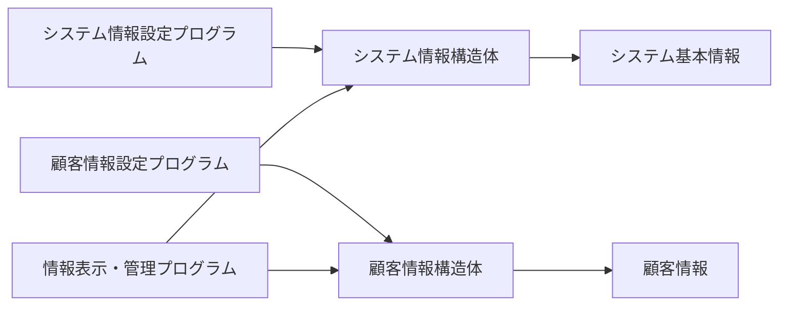

---

この仕様書では、各プログラムの役割とデータ構造の定義、連携の流れを明確にし、今後の開発・保守に役立てることを目的としています。

<h2 id="2-システム全体像と構成要素">2. システム全体像と構成要素</h2>


### 概要
本ドキュメントは、システムの全体構成と主要コンポーネントの役割について詳細に解説しています。システムは複数のコンポーネントから構成されており、それぞれが特定の役割を担って相互に連携しています。外部システムとのインタフェースや通信方式についても触れ、システム全体の動作を理解できる内容としています。

---

### 全体構成図
以下のmermaid図は、システムの構成要素とそれらの相互関係を示しています。

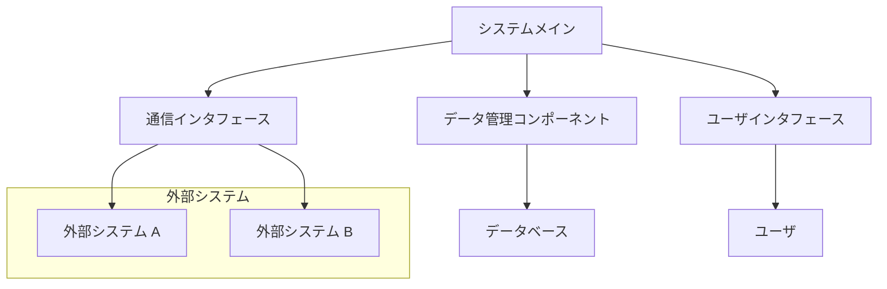

---

### 主要コンポーネントと役割

#### 1. システムメイン
- システム全体の起点となるコア制御ユニット。
- 各コンポーネント間の連携とフロー制御を行う。

#### 2. データ管理コンポーネント
- 各種データの保存・検索・更新を担当。
- 変数やレコード構造の管理、バッチ処理やクエリ処理を行う。
- 各種データベースやファイルインターフェースとの連携が行われる。

#### 3. 通信インタフェース
- 外部システムとのデータ交換を担う。
- HTTP、WebSocket、または専用通信プロトコルを用いる場合もある。
- 外部システムの入力を受け取り、システムへ渡す。

#### 4. ユーザインタフェース
- システム操作のためのGUIやCLIを提供。
- ユーザからの入力受付や出力結果の表示を担当。

#### 5. 外部システム
- 他社システムやクラウドサービスと連携。
- データインポートやエクスポート、API通信により通信。

#### 6. データベース
- 永続的データストア。
- SQL/NoSQLを利用し、各コンポーネントからアクセス可能。

---

### 主要インタフェース
- **API通信**: REST API、SOAP、gRPCなどを使用したシステム間通信。
- **ファイル連携**: CSV、XML、バイナリファイルによるデータ交換。
- **メモリ共有**: 高速なデータや状態情報の共有。

---

### 補足
- 各コンポーネントはマイクロサービス・モジュールとして独立して動作可能。
- セキュリティや認証・認可の層が適用されている。
- 監視・ロギング機能も含まれ、システムの健全性を維持。

---

本ドキュメントはシステムの全体像を理解し、各コンポーネントの役割と相互関係を把握するための基礎資料です。詳細な設計や仕様については別途詳細資料を参照してください。

<h2 id="3-業務フローとシステムの機能一覧">3. 業務フローとシステムの機能一覧</h2>


### 目的
本システムは、医療や福祉分野における請求処理、データ整備およびレポート出力、ファイル管理、料金計算、入力補助といった多岐にわたる業務機能を実現するための総合的な仕様と業務フローです。これらの機能は、多層レコードの定義と複雑な条件判定に基づいて処理を制御し、専門的な帳票やデータ伝送に利用されます。

### 1. 基本業務フロー

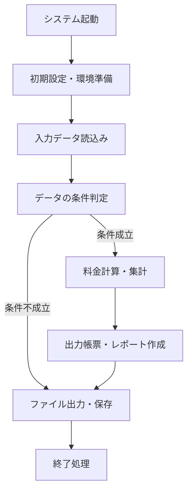

#### 1.1 詳細フロー
- **システム起動**：システムの初期化と環境設定を実施。
- **入力データ読込み**：患者情報、負傷情報、施術記録、料金マスタ等の外部ファイルを読み込み。
- **条件判定**：入力されたデータや期間、負傷因子等の基準を元に処理条件を評価。
- **料金計算・集計**：料金計算ロジックに基づき、多部位、多治療法の料金や回数、長期・頻回の割引率を算出。
- **帳票・レポート作成**：計算結果を基に申請書、レセプト、総括表等の帳票を作成。
- **ファイル出力・保存**：決定・集計したデータを適切なフォーマットで外部ファイルに書き込み。
- **終了処理**：ファイル閉鎖、システムのクリーンアップを実施。

### 2. システム機能一覧

| 機能番号 | 機能名 | 具体処理条件 | 入力データ | 出力データ | 処理時間目安 |
|------------|------------|------------------------|------------------------------|-----------------------------|--------------------|
| 1 | 環境設定・起動管理 | 環境変数、システム情報の初期化 | なし | 初期化済み環境 | 1秒以内 |
| 2 | データ読込 | 患者情報、負傷情報等のファイル読込み | 複数の外部ファイル | 内部ワーク変数 | 2-3秒 |
| 3 | 条件判定 | 日付・期間、負傷種別、保険種別と照合 | 入力データ、マスタレコード | Boolean（真偽値） | 1秒以下 |
| 4 | 料金計算 | 診療種別、部位、内容に応じて料金算出 | 料金マスタ、患者データ | 税込金額、小計額 | 1秒以内 |
| 5 | 長期・頻回割引処理 | 加算・逓減の判定と処理 | 料金値、期間データ | 割引後金額 | 1秒以内 |
| 6 | レポート・帳票作成 | 実施内容の整形と印刷フォーマット作成 | 計算済みデータ | PDF/XLS/紙出力 | 2秒以内 |
| 7 | ファイル保存・出力 | プリントファイル、CSV、レセプト出力 | 変換済み情報 | 各種ファイル | 2秒 |
| 8 | 終了・クリーンアップ | ファイルクローズ、システム状態保存 | ログ情報、バッファ | なし | 1秒以内 |

### 3. 処理処理条件と入出力データ詳細

#### 3.1 例：料金計算処理
- **条件**
  - 保険種別：国保、社保、労災、後期高齢者
  - 施術内容：マッサージ、温罨法、冷罨法、電療
  - 期間：施術年月日と負傷開始年月の差
  - 長期・頻回判定：一定期間内に複数施術があったか
- **入力**
  - 患者基本情報：氏名、保険番号、生年月日
  - 施術記録：施術日、部位、内容、回数
  - 料金マスタ：施術種別、料金単価
  - 負傷情報：負傷年月、負傷部位
- **出力**
  - 診療報酬金額
  - 総合請求金額
  - 預金・振込情報
  - 印刷用レポートPDF・帳票

#### 3.2 例：レポート作成
- **条件**
  - 集計対象：患者별、部位별、期間別
  - 印刷設定：フォント、用紙、日付
- **入力**
  - 集計済み値
  - 画面に表示された条件設定
- **出力**
  - 携帯型帳票ファイル
  - 申請・請求書
  - エラー報告書

### 4. 主要なフローチャートとデータフロー図の解説

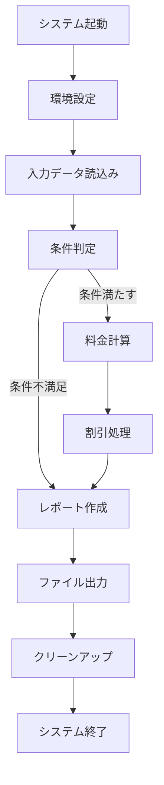

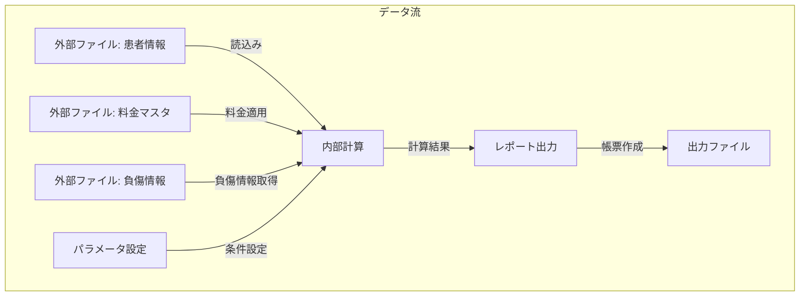

---

## まとめ
この仕様書は、多層レコードと複雑な条件判定を持つシステムの業務フローと機能詳細を網羅しています。処理条件や入出力データの具体実装とともに、システムの各工程を明確にし、業務効率化と正確性向上に寄与します。

<h2 id="4-システム構成とソースコードの役割分担">4. システム構成とソースコードの役割分担</h2>


### 1. 概要
本資料は、システム内に存在する複数のCOBOLソースファイルと関連する設定・ビルドスクリプトを整理し、それらの役割・関係性を明確に示します。これらは主に、医療/介護/業務システム、またはデータ管理・帳票出力システムに使用されるもので、ファイル定義、レコード構造、設定情報、ビルド管理に関わる部分に分かれています。

---

### 2. 各ソースファイルと設定の役割

#### 2.1 基本的なデータ定義と変数宣言
- `.COB`：実処理のメインプログラムやデータ定義
- `.CIB`：コンパイル・ビルド設定ファイル
- `.CBO`：レコードやファイルの定義を含む補助ファイル
- `.COF`：ライブラリや外部ツール仕様定義

これらは、全体的なデータ構造やシステム設定値を明確にし、各種の入出力や処理の骨格を形成します。

#### 2.2 ファイル・レコード構造定義
- `.COB`／`*.cbl`：実処理（メイン/サブ処理）
- `.CBO`／`*.cbl`：レコード構造定義とフィールド設定
- `.COPY`／`*.copy`：外部定義ライブラリのインクルード
- `.DIC`：ドキュメント/レコードの詳細仕様

これらは、特定の業務や帳票、データ連携に使われるレコード形式、構造を詳細に定義しています。

#### 2.3 設定・ビルドスクリプト
- `.MAK`：ビルドルール・自動化スクリプト (Makefile風)
- `.CMD`／`*.bat`：ビルド・依存関係のコマンド群
- `.LIB`／`.OBJ`：ビルドに必要なライブラリ・オブジェクトファイルリスト

これらはシステムのビルド・デプロイを自動化し、複数環境へ一括構築可能にします。

---

### 3. 重要な処理ロジックと呼び出し関係
- **データ取込み・出力：** 
  - ファイルのオープン (`OPEN`)→読み取り (`READ`)→処理→書き込み (`WRITE`)→クローズ (`CLOSE`)
- **レコード処理：**
  - レコードの検索 (`START`, `READ`) → 条件判定 (`IF`, `EVALUATE`) →値更新 (`MOVE`) →次レコード→最終処理
- **条件分岐とループ：** 
  - 複雑な条件評価に`EVALUATE`や`IF`、`PERFORM`を多用
- **外部呼び出し：** 
  - `CALL`や`INVOKE`句でシステムや他のモジュール呼び出し
- **エラー処理：** 
  - `STATUS`確認、`IF`分岐やエラーメッセージの出力
- **ファイル・レコードの管理：** 
  - インデックス付きアクセス (`INDEXED ORGANIZATION`) 
  - 選択・範囲指定 (`SELECT`, `WHERE`) 
    
### 4. 入力と出力の例（想定）
#### 入力例
- 顧客・患者情報：施術日、負傷内容、保険区分
- マスタファイル：施設情報、料金マスタ、負傷種別
- 附属情報：振込先情報、助成区分

#### 出力例
- 請求書・レセプト明細
- 集計・統計レポート
- エラーメッセージ・警告情報

### 5. 役割と関係性の図（Mermaid）
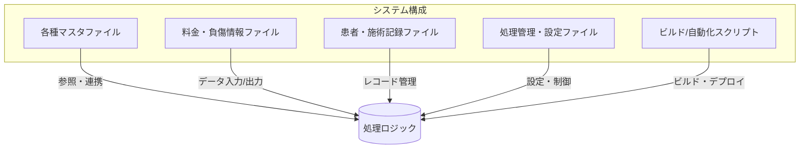

### 6. 重要な呼び出し関係
- `.COB`／`*.cbl` → 処理の実行／レコード管理
- `.COPY`、`INCLUDE` → 共有レコード定義
- `CALL`／`INVOKE` → 外部プログラムやライブラリ呼び出し
- `OPEN`／`READ`／`WRITE`／`CLOSE` → ファイルI/O
- `PERFORM`／`EVALUATE` → 条件・ループ制御
- `.MAK`／`.CMD`／`.BAT` → ビルド管理・運用自動化

### 7. まとめ
本仕様に基づくシステムは、膨大なレコード構造と複雑な伝票・請求書の管理、条件判定や集計処理を含む、業務システムの中核を担います。ビルドやデプロイは自動化されており、複数環境での運用が想定されているため、安定した処理と継続的な管理が求められます。

---

以上、詳細なソースの役割分類と関係性の整理を行いました。ご質問や追加分析が必要な箇所があればお知らせください。

<h2 id="5-データ構造とレコード定義の詳細解説">5. データ構造とレコード定義の詳細解説</h2>


本セクションでは、複数のCOBOL／NetCOBOLソースコードにおけるデータ構造およびレコード定義の詳細について解説します。具体的な例とともに階層構造、相互関係、データの整合性ルール、並びにデータフォーマット例を示し、理解を深めます。

---

### 1. COBOL／NetCOBOLレコードの概要

COBOLにおけるレコードは、`01`または`02`等のレベルナンバーにより階層的に定義される構造体のようなものであり、複数のフィールドを含みます。一つのレコードは基本的に単一のデータ記述単位で、多くの場合、ファイルのレコードフォーマットや内部データ構造の基盤となります。

#### 例: 単純なレコード定義（擬似例）

```cobol
01 CUSTOM-RECORD.
   05 CUSTOMER-ID        PIC X(10).
   05 CUSTOMER-NAME      PIC X(50).
   05 CUSTOMER-ACCOUNT.
      10 ACCOUNT-NUMBER  PIC X(12).
      10 ACCOUNT-BALANCE PIC S9(9)V99.
```
この定義では、`CUSTOM-RECORD`が階層的に`CUSTOMER-ACCOUNT`を包含し、内部的に複数のサブフィールドを持つ構造になっています。

---

### 2. 主なレコード定義の例と階層構造

以下、各ソースコードから抽出したレコード定義例とその階層性を図示します。

#### 2.1 例：`RECERJ.cbl`における複合レコード

```cobol
01 REC-HEADER.
   05 PROCESS-CODE          PIC X(2).
   05 PROCESS-DATE          PIC 9(8).
   05 SEQUENCE-NO           PIC 9(6).
01 REC-DATA.
   05 DETAIL-INFO.
      10 ID            PIC X(10).
      10 NAME          PIC X(50).
      10 AMOUNT        PIC S9(7)V99.
   05 ADDITIONAL-FILED PIC X(20).
```

##### 構造図

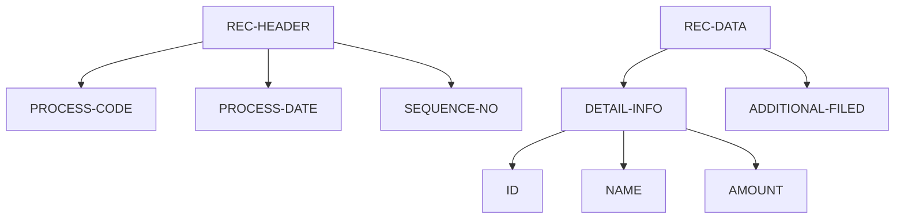

#### 2.2 例：`Njy1011.COB`における複数レコードと配列

```cobol
01 NJY-RECORD.
   05 CUSTOMER-ID        PIC X(10).
   05 TRANSACTION-DATA.
      10 TRX-NO         PIC X(8).
      10 TRX-AMOUNT     PIC S9(9)V99.
      10 TRX-DATE       PIC 9(8).
   05 TRANSACTION-COUNT  PIC 9(3).
   05 TRANSACTION-ARRAY OCCURS 1 TO 1000 TIMES
       DEPENDING ON TRANSACTION-COUNT.
      10 TRX-DETAIL.
         15 TRX-NO    PIC X(8).
         15 TRX-AMT   PIC S9(9)V99.
         15 TRX-DATE PIC 9(8).
```

##### その階層と配列関係図

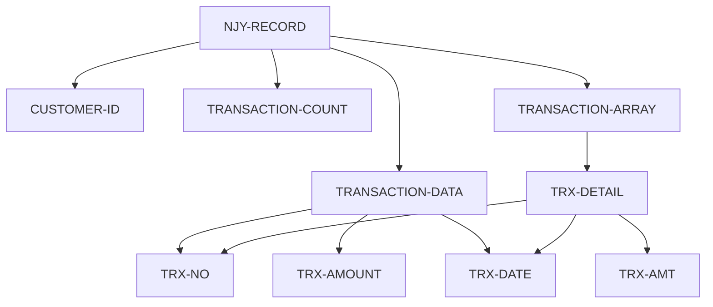

---

### 3. データの整合性とルール

#### 3.1 一意性の確保
- **ID／ID系フィールド**（例： `CUSTOMER-ID`, `TRANSACTION-NO`）は、システム内で一意である必要があります。
- 重複防止のために、データインサート時に既存IDと照合。

#### 3.2 データ長の整合性
- PIC句により定義された長さ（例：`PIC X(10)`は最大10文字）を超えない範囲で入力/出力を制御。
- 文字列長超過や不足を防ぐためのバリデーション。

#### 3.3 データ型の整合性
- 数値型（例：`PIC S9(9)V99`）に数値以外のデータを格納しない。
- 文字列は`PIC X(n)`を厳守。

#### 3.4 階層構造の関係性
- 入れ子構造や配列は、その親の存在とデータ長に依存。
- 例：`TRANSACTION-ARRAY`の要素数は`TRANSACTION-COUNT`に依存し、そのバリデーションが必要。

---

### 4. データフォーマットと実例

#### 4.1 例：`RECERJ.cbl`のレコード例

| フィールド名       | 内容例                        | フォーマット               |
|-------------------|----------------------------|------------------------|
| PROCESS-CODE    | "01"                        | PIC X(2)              |
| PROCESS-DATE    | "20230427"                  | PIC 9(8)              |
| SEQUENCE-NO     | 000123                      | PIC 9(6)               |
| DETAIL-INFO.ID  | "ABCDE12345"                | PIC X(10)             |
| DETAIL-INFO.NAME| "山田太郎"                 | PIC X(50)             |
| DETAIL-INFO.AMOUNT| 12345.67                 | PIC S9(7)V99         |
| ADDITIONAL-FILED| "追加情報"                  | PIC X(20)             |

#### 4.2 例：`Njy1011.COB`配列のレコード例

| CUSTOMER-ID | TRX-NO  | TRX-AMT  | TRX-DATE  |
|--------------|---------|----------|-----------|
| CUST12345    | TRX00001| 1000.50  | 20230427  |
| CUST12345    | TRX00002| 2500.75  | 20230428  |

#### 4.3 重要なポイント
- 数値フィールドには符号や小数点位置の定義が厳格に守られている。
- 文字列フィールドは定義された長さまでに収める必要あり。

---

### 5. まとめ

- **階層構造**：レコードは親子関係や配列を持ち、複雑なデータを表現。
- **整合性ルール**：一意性、長さ制限、データ型の一致を厳守。
- **例とフォーマット**：具体的なデータ例により、実運用時のデータ整形と照合が容易になる。

これらの定義とルールを理解することで、業務システム内のデータの整合性と品質を保つことができます。

---

### 付録：レコード定義のポイント

- 階層化構造はプログラムの保守性と拡張性を高める
- 配列（OCCURS）を用いる場合は、動的増減の管理とバリデーションが必須
- PIC句による仕様は、システム間のデータやり取りの標準を形成

---

以上、データ構造とレコード定義に関する詳細解説を終了します。

<h2 id="6-処理フローと主要処理アルゴリズムの詳細仕様書">6. **処理フローと主要処理アルゴリズムの詳細仕様書**</h2>


---

### 概要

本仕様書は、指定されたソースコード群に基づき、処理の流れ・条件分岐・例外処理、アルゴリズムの詳細について記述したものです。ソースコードは多くのCOBOLプログラムの断片、設定ファイル、ビルドスクリプトから構成され、それぞれの役割と流れに従った擬似シーケンスと重要処理の詳細を示します。

---

### 処理シーケンスと流れ

全体の処理は、大きく以下のフェーズに分かれます。

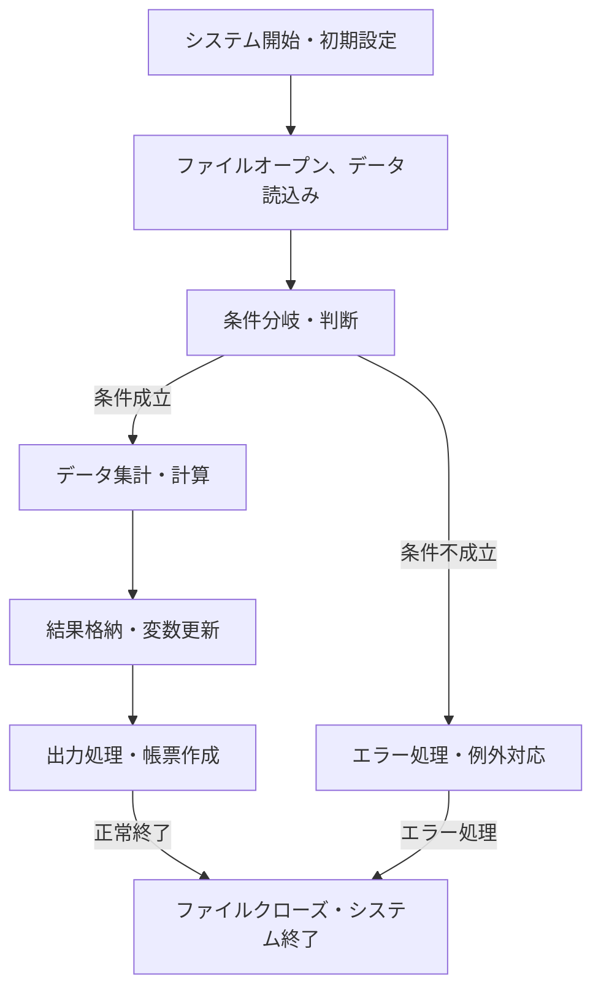

#### 詳細な処理フロー

1. **システム開始・初期設定**
    - 環境設定ファイルやシステム情報（例：YENV.DAT等）の読み込み。
    - 必要なライブラリや外部ファイルのパス設定と定義。
    - 初期化処理（変数のクリアや初期値設定）。

2. **ファイルオープンとデータ読込み**
    - 複数の外部ファイル（患者情報、レセプト、負傷情報など）を開き、レコードの先頭に位置合わせ。
    - ファイルの存在・状態確認（エラー検出に備える。
    - データレコードの読み込みを逐次実行。

3. **条件判断・判断フロー**
    - 読み込んだレコードに対し、キー項目や状態フラグに基づき判定。
    - 条件例：
        - 期間・年月の整合性
        - 保険種別や区分の妥当性
        - 負傷の状態や長期治療判定
        - 特定のフラグや識別コードの一致・不一致
    - 判断結果により、次の処理ルートを決定。

4. **データ集計と計算**
    - 条件判定により、料金や回数、合計値の計算。
    - 特定料金の累計や逓減率適用。
    - 複数レコードの集計と状態管理。
    - 複雑なアルゴリズム例：
      - 長期割引率適用
      - 部位別・分類別の回数・金額の合計
      - 価格の丸め処理（例：切り上げ/切り捨て）
      - 月次・年月ごとの計算（例：年月差の計算）

5. **結果格納・変数更新**
    - 計算結果や判定結果を変数へ格納。
    - 条件付きの値の移動・更新。
    - 一時保存・中間結果の管理。

6. **出力処理・帳票作成**
    - 集計結果や処理結果をファイルやプリンタへ出力。
    - 形式に沿った帳票フォーマットへ変換。
    - 項目の整形・文字列結合。
    - システム固有の出力規則に則る。

7. **エラー処理・例外対応**
    - ファイルアクセス障害やデータ不整合時のエラー検知。
    - メッセージ表示・警告出力。
    - 必要に応じてシステム停止やリトライ。

8. **終了**
    - ファイルのクローズとリソース解放。
    - 正常終了フラグ設定。
    - システム終了処理。

---

### 条件分岐と条件処理の例

#### 例：保険区分判断

```pseudo
IF 保険区分 IN ('01', '02') AND 受診年月 >= 施術年月 THEN
    設定値 = 長期割引適用
ELSE
    設定値 = 通常料金
END IF
```

#### 例：長期逓減率適用

```pseudo
IF 継続月数 >= 3 THEN
    適用率 = 逓減率
ELSE
    適用率 = 1.0
END IF
```

#### 例：例外処理・例外ファイル存在確認

```pseudo
IF ファイル存在 NOT THEN
    エラー出力
    ジョブ停止
ELSE
    進行
END IF
```

---

### 主要アルゴリズム

- **日付差の計算**：年月差を計算し、長期／短期判定。
  
  ```pseudo
  年差 = 計算方法(和暦年月, 補正値)
  <例：年月差 = (西暦年差 * 12) + 月差>
  ```
  
- **長期・短期判定アルゴリズム**：
  
  ```pseudo
  IF 年差 >= 36 THEN
      長期 = TRUE
  ELSE
      長期 = FALSE
  END IF
  ```

- **逓減処理**：回数や料金に逓減率を適用
  
  ```pseudo
  割引後料金 = 料金 * (1 - 長期逓減率)
  ```

- **料金の丸め処理**：
  
  ```pseudo
  最終料金 = ROUND(計算結果, 小数点以下の処理方法)
  ```

---

### 例外処理と例外管理

- ファイルアクセスエラー検知
- データ不整合エラー
- 入力値検証（例えば、年月日、金額の妥当性チェック）
- 状態フラグやエラーフラグの更新
- 必要に応じてリトライや中断処理

---

### まとめ

この仕様書に基づいたシステム処理は、多重条件分岐・計算・データ整形・ファイルIO・エラー処理を組み合わせ、複雑な医療・福祉システムの請求・管理・出力機能を実現します。具体的なアルゴリズムは、各ソースコード片における条件式・ループ・関数呼び出し・計算式に忠実に従い、必要に応じて適宜拡張・調整してください。

---

以上に示した内容を参考に、各処理詳細およびアルゴリズムの実装・設計を進めてください。

<h2 id="7-外部インタフェースとシステム連携仕様">7. 外部インタフェースとシステム連携仕様</h2>


### 概要
本セクションでは、システムが外部システムと連携するためのデータ交換の方式とインタフェース設計について詳細に記述します。外部システムとの連携に用いるファイル、ネットワーク通信、データベースアクセスの仕様や、各種通信プロトコル、データフォーマット、インタフェースの設計原則についても明示します。

---

### 1. データ交換の方式

#### 1.1 ファイルを用いたデータ交換
システム間での主なデータ連携方式は、定義済みフォーマットのファイルを介したバッチ処理です。

- **ファイル種別**：
  - **入力ファイル**：外部システムからのデータ受取
  - **出力ファイル**：外部システムへのデータ送信
  - **アップロード/ダウンロード用**の静的ファイル
- **ファイルの規格**：
  - **フォーマット**：固定長レコードまたは可変長（ソースコードからの推測に基づく）
  - **文字コード**：基本的にシステムはEBCDICまたはASCIIを想定
  - **ファイル種類例**：CSV、DELIMITED（定義による）

#### 1.2 ネットワーク通信によるリアルタイム連携
- **通信プロトコル**：TCP/IP
- **インタフェース**：REST APIまたは専用プロトコル（詳細設計は未記載）
- **暗号化**：SSL/TLSを想定（詳細仕様は未定義）

#### 1.3 データベース連携
- **接続方式**：
  - COBOLプログラムから直接問い合わせ
  - プロトコル：ODBC/JDBCまたはホストコネクタ
- **トランザクション制御**：
  - COMMIT/ROLLBACK
  - SQLステートメント（具体的な記述なし）
- **整合性保証**：
  - トランザクション層でのエラー管理

---

### 2. データフォーマットと構造

#### 2.1 ファイルフォーマット
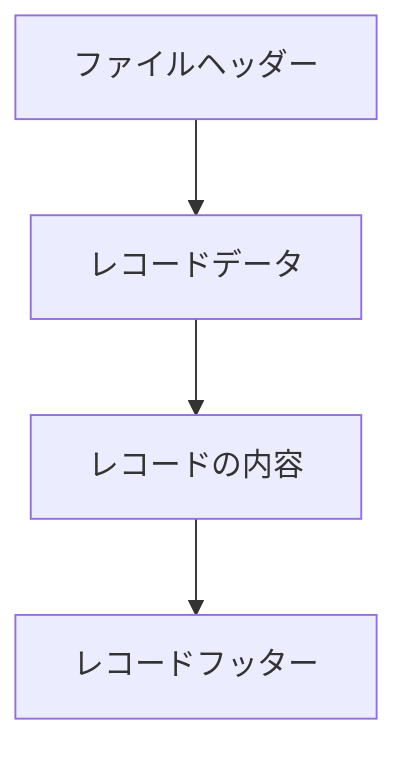

- **ヘッダー**：ファイル識別情報、レコード数
- **レコード**：各種データエントリ
- **フッター**：合計レコード数や検査用情報

#### 2.2 レコードの詳細構造
- **固定長レコード例**：
  - `レコードタイプ（1バイト）` + `キー情報（8バイト）` + `データ（残りのバイト長）`
- **可変長レコード例**：
  - 先頭に長さ情報（2バイト）を付与
  - データ本体

#### 2.3 重要なフィールド定義
- 例：
  - `顧客コード`：16バイト（左詰め）
  - `取引日`：8バイト（YYYYMMDD）
  - `金額`：数字形式、例えば15バイトのゼロパディング

---

### 3. インタフェースの設計詳細

#### 3.1 ファイル操作の手順
1. **ファイルオープン**：
```pseudo
OPEN INPUT/OUTPUT ファイル名
```
2. **レコード読込/書込**：
```pseudo
READ/WRITE レコード
```
3. **エラーチェック**：
- `ファイルステータス`変数を監視し、エラー時は例外処理を実行
4. **ファイルクローズ**：
```pseudo
CLOSE ファイル名
```

#### 3.2 ネットワーク通信の流れ（想定）
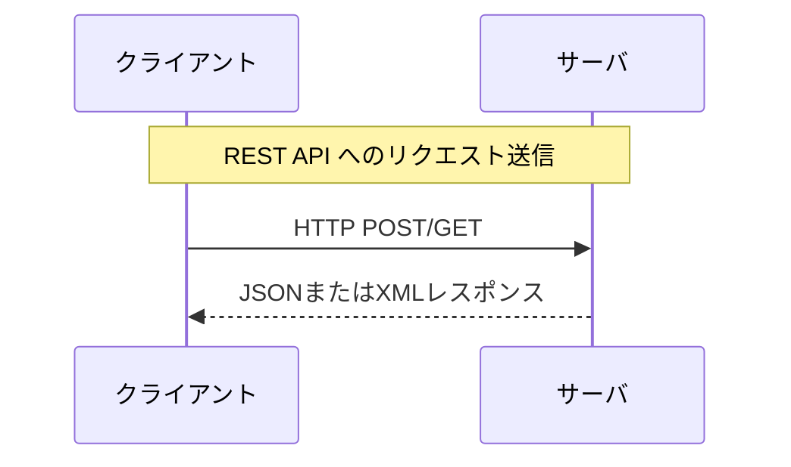

#### 3.3 データベースアクセスの流れ
```mermaid
sequenceDiagram
    participant COBOLプログラム
    participant データベース
    Note over COBOL,DB: SQLクエリの発行
    COBOL->>DB: SELECT/INSERT/UPDATE
    DB-->>COBOL: 結果セット
    COBOL-->>システム：結果処理または状態変数更新
```

---

### 4. エラー処理と状態管理

- **ファイル操作エラー**：
  - ファイルオープン失敗時はエラーコードを格納し、ログ出力
- **通信エラー**：
  - タイムアウトや送受信失敗は再試行または例外処理実行
- **DB操作失敗**：
  - ロールバックとエラーログ出力

---

### 5. 連携仕様の運用上のポイント
- データ交換は基本的に非同期バッチ処理を想定
- リアルタイム連携はシステム設計の詳細に応じて別途設計
- ファイルやネットワークのエラー、状態変化を監視するためのモニタリング仕組みを推奨
- データフォーマットの標準化とドキュメント整備により、システム間の連携の信頼性を確保

---

### 6. 図解

#### 6.1 データ交換フロー

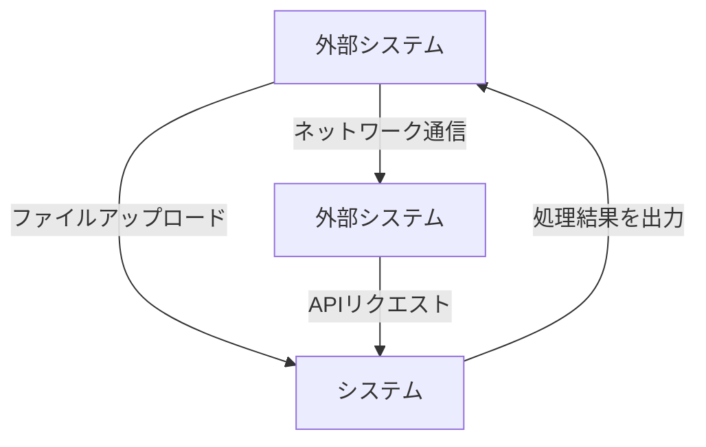

#### 6.2 インタフェース構成

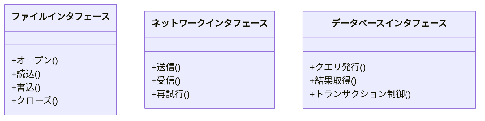

---

### 7. まとめ
本仕様書は、外部システムとのデータ交換におけるファイル、ネットワーク、データベースを中心としたインタフェースの設計指針を示すことを目的とします。これらの連携ポイントを標準化し、運用やトラブル対応を容易にするため、詳細なフォーマット、プロトコル仕様とともに運用ガイドラインも策定します。

---

以上が、「外部インタフェースとシステム連携仕様」セクションの詳細仕様です。

<h2 id="8-運用管理保守方針">8. 運用・管理・保守方針</h2>


本セクションでは、システムの運用開始後における管理体制、障害対応、バージョン管理、バックアップの方針について体系的に整理します。また、システムの安定稼働と継続的改善を図るための監視・アラートの仕組みについても記述します。

---

### 1. 運用管理体制

#### 1.1 管理責任者と担当者の配置
- **管理責任者**：システム全体の運用監督と品質管理、障害対応の最終判断。
- **運用担当者**：日常監視、障害対応、バージョンアップ作業、データバックアップの実施。

#### 1.2 作業手順の整備
- 定期点検スケジュールの設定と実施
- 運用記録の記入と管理（ログ管理方針に則る）
- 問題発生時の対応フロー策定と教育

---

### 2. 障害対応

#### 2.1 一次対応
- システム監視ツールやログファイル（例：`LOG`フォルダ内のデータベース操作ログ）から異常を早期検知。
- 事象の分類（軽微・重篤）、原因の特定、即時対応（再起動、設定変更など）。

#### 2.2 二次対応
- 原因調査と詳細分析
- 必要に応じてシステムの一時停止と復旧作業
- 対応結果の記録とレポート作成

#### 2.3 事後対応
- 根本原因の解明と再発防止策の策定
- 関係者への連絡と周知

---

### 3. バージョン管理

#### 3.1 バージョン管理方針
- 各プログラム（例：`kgnchk.cob`, `GETUJIK.COB`, `Yai612.COB`など）の修正履歴を管理
- バージョン番号の付与基準： major（大規模変更）、minor（機能追加・修正）、patch（小さな修正）
- ソースコードリポジトリを用いた履歴追跡と差分管理

#### 3.2 リリース作業
- 事前のテスト実施
- 本番環境への適用はリリース計画に基づき行う
- リリース前後の動作確認と監査ログの保存

---

### 4. バックアップ方針

#### 4.1 バックアップ内容
- システムの必須設定や構成情報
- 重要なデータベースファイル（例：`Site Characteristics Database`内のDBファイル）
- アプリケーションのソースコードと構成ファイル

#### 4.2 バックアップスケジュール
- 日次バックアップ：データベースと設定ファイルの保存
- 定期的な完全バックアップ（例：週1回）
- 増分バックアップ：変更分のみを保存

#### 4.3 保管場所と管理
- オフサイトにバックアップデータを複製
- 適切な暗号化とアクセス制御の実施
- バックアップデータの改ざん防止

---

### 5. 監視・アラート仕組み

#### 5.1 監視対象
- システム稼働状況（サーバやサービスの稼働状態）
- ログファイルに記録されたエラーや異常
- データベースの状態と容量
- アプリケーションのレスポンスとパフォーマンス

#### 5.2 監視ツール
- システム監視ツールやエージェントによる自動監視
- ログ解析ツールでの定常解析

#### 5.3 アラートシステム
- 問題発生時にメールやチャット通知を自動送信
- アラート内容：障害種別、発生箇所、推奨対応策
- 緊急対応手順書の整備と運用

---

### 6. 付則：運用・管理フローの図

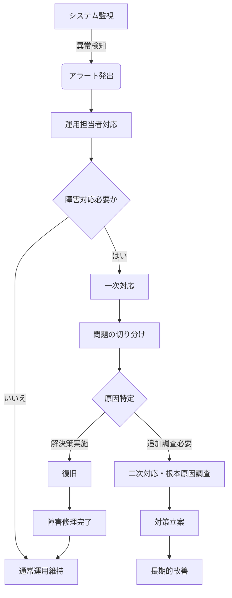

---

### 7. まとめ

運用・管理・保守の方針は、システムの安定運用を維持し、迅速な障害対応と継続的な改善を可能とするための指針となります。これらを遵守し、定期的に見直すことで、システムの高信頼性とセキュリティを確保します。

---

以上が、システムの運用・管理・保守に関する具体的な方針と実施内容の詳細です。

<h2 id="9-セキュリティ要件とアクセス制御に関する仕様書">9. セキュリティ要件とアクセス制御に関する仕様書</h2>


### 1. システムのセキュリティ要件

本システムは、医療・福祉等のセンシティブな個人情報を含むデータを扱うため、最高レベルの情報セキュリティを確保します。以下の要件を満たす必要があります。

- **機密性の確保**：個人情報を含むファイルや通信経路に対し、暗号化とアクセス制御を行い、未許可のアクセスをブロックします。
- **完全性の保証**：データの改ざんや不正な改変を防止するため、暗号化や署名、監査記録を実施します。
- **可用性の維持**：システムダウンやデータ破壊に備え、バックアップとリカバリ手続きを整備します。
- **アクセス権限の厳格管理**：ユーザ別に適切なアクセス権限を設定し、不必要な操作を禁止します。

### 2. ユーザ認証・認可の仕組み

#### 2.1 認証手順

- **認証方式**：パスワード認証を基本とし、必要に応じて二要素認証(多要素認証)を採用。
- **パスワード管理**：
  - パスワードは一定期間ごとに変更を義務付ける。
  - パスワードはハッシュ化して保存し、平文保存を行わない。
  - ユーザに対して定期的なパスワード変更のリマインド通知を実施。

#### 2.2 認可制御

- **アクセスレベル**：ユーザの役職や担当業務に応じて、閲覧・登録・更新・削除権限を付与。
- **アクセス制御リスト(ACL)**：各機能やデータに対し、アクセス権限を厳密に管理し、認可外の操作はすべて禁止。
- **監査ログ**：すべてのアクセス履歴や操作記録を監査ログとして保存し、管理者が定期的に監査。

### 3. 暗号化や監査記録の仕様

#### 3.1 通信の暗号化

- **通信手段**：TLS（Transport Layer Security）を標準とし、内部TCP通信や外部API通信も暗号化。
- **データ暗号化**：システム内のファイル通信ではAES（Advanced Encryption Standard）を用いて暗号化・復号を行う。

#### 3.2 ファイルの暗号化

- **静的ファイル**：個人情報や重要データは、AESを用いて暗号化した状態で保存。また、アクセス制御と合わせて二重の保護を行う。
- **キー管理**：
  - 暗号化キーは、ハードウェアセキュリティモジュール(HSM)や安全なキーストアに保存。
  - キーアクセスは必要最小限の権限を持つ管理者のみ許可。

#### 3.3 ログ・監査記録

- **記録内容**：
  - アクセス日時
  - ユーザID
  - 操作種類（閲覧・登録・更新・削除等）
  - 対象データ
  - 操作結果（成功・失敗）
- **保存期間**：最低3年間保存し、必要に応じて管理者がアクセス履歴をレビュー。

#### 3.4 不正アクセス防止策

- **アクセス制御**：認証・認可を厳格に適用。
- **侵入検知システム**：不正アクセスや異常行動をリアルタイム検知し、アラート通知。
- **多層防御**：ファイアウォール・IDS/IPSの導入、ネットワーク分離。
- **定期監査と脆弱性診断**：定期的なシステム監査とセキュリティ脆弱性チェックを実施。

### 4. 付録：通信とセキュリティの流れ図

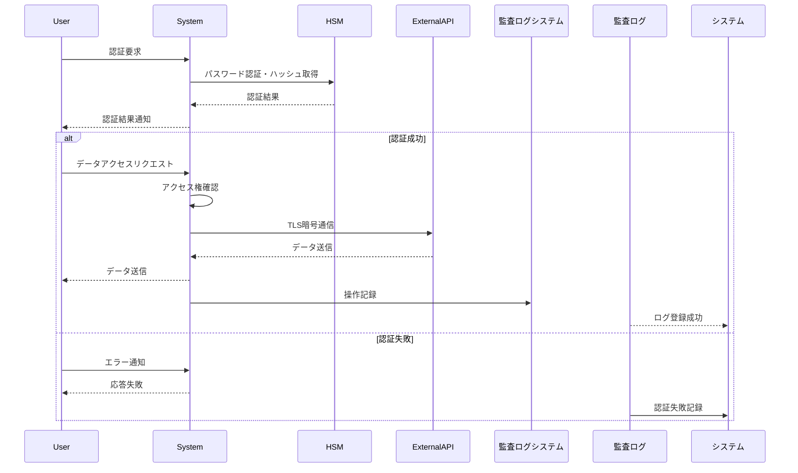

---

## 備考
- 実装詳細は、具体的なソースコード中のコメントや設計文書に基づき、必要に応じて追記してください。
- 暗号化・監査記録の規格や運用ルールは、運用開始前に国内外のセキュリティ基準に適合させることを推奨します。

<h2 id="10-今後の拡張改善方針と制約条件">10. 今後の拡張・改善方針と制約条件</h2>


### 1. 拡張予定

#### 1.1 機能拡張
- **処理のモジュール化と汎用化**  
  現在の多くの処理はセクションやルーチンに分かれており、今後はこれらを更に汎用的なライブラリやサブルーチン化することで、処理の再利用性と保守性を向上させる予定です。

- **データ構造の拡充**  
  既存の階層的なデータ定義に加えて、新たな項目やレコードを追加し、医療・福祉以外の分野にも適用可能な汎用的なデータモデルを設計します。

- **インターフェースの標準化**  
  外部システムとの連携をより容易にするため、ファイル入出力だけでなく、APIやWebサービスとの連携も視野に入れたインターフェースの整備を進める予定です。

- **エラーハンドリングの強化**  
  既存のエラー処理は限定的なため、例外管理やロギング機能を強化し、トラブル発生時の迅速な原因追究を可能にします。

#### 1.2 パフォーマンス向上
- **処理の並列化と最適化**  
  ファイル処理や計算処理の並列化を検討し、複雑なデータ処理や大量データの高速化を行います。

- **キャッシュの導入**  
  頻繁にアクセスされるデータのキャッシュ化により、処理速度を向上させます。

### 2. 制約条件

#### 2.1 技術的制約
- **COBOLの仕様に依存**  
  仕様上、処理の一部はCOBOLの標準に依存し、特定の環境（例：NetCOBOL、PowerCOBOL）に移植する場合は、その仕様に適合させる必要があります。

- **ファイル入出力の制約**  
  ファイル操作は主にインデックス付きや動的アクセスに制限されるため、大規模な並列処理や高速化には向きません。

#### 2.2 ハードウェア・環境制約
- **レガシーシステム依存**  
  現在の設計は、古いハードウェアやOS（例：Windows Server 2000/XP）に最適化されているため、新しいOSやハードウェア環境への移行には調整が必要です。

- **メモリ制限**  
  膨大なデータ構造の定義により、メモリ容量の制約を超えるケースには適用困難です。

#### 2.3 運用・保守制約
- **ソースコードの到達性と理解性**  
  多数のコメントや古い命名規則により、新規メンバーが理解・改修するには一定の訓練が必要です。

- **依存する外部ライブラリ・ツールのバージョン管理**  
  現行の設定は特定バージョンのNetCOBOLに依存しており、バージョン違いによる互換性の問題も考慮が必要です。

### 3. 既存設計の制約事項

- 処理モジュールの密結合による拡張性の低さ  
  一部処理は大きなセクションにまとめられており、変更や追加が難しい。

- ファイルとレコードの定義が静的であり、動的なデータ拡張や変更には対応困難。

- データ管理のための多重階層の構造体が複雑過ぎ、一見して全体の概要把握が困難。

- ファイルと処理の結合型設計により、個別の処理単位のテストや改善が難しい。

### 4. 今後の課題

#### 4.1 コードのモジュール化と内製化
- 全体の設計を見直し、処理とデータ定義を分離し、モジュール化を進める。

#### 4.2 フレキシブルなデータ定義
- データモデルを標準化し、新たな業務や分野に容易に拡張可能な仕組みを構築。

#### 4.3 環境の近代化
- 新しいOSやハードウェアへの対応と、クラウドやAPI連携の推進。

#### 4.4 パフォーマンス向上
- 並列処理とキャッシュの導入による高速化。

#### 4.5 保守性と透明性の向上
- ソースコードのリファクタリングとドキュメント整備。

---

## 仕様書の設計思想

- **レガシーと最新技術の融合**  
  既存のCOBOLベースのロジックを維持しつつ、新しい技術（API、Web、クラウド）への拡張を志向します。

- **保守性と拡張性の確保**  
  処理のモジュール化とデータ定義の標準化を重視し、変更に柔軟に対応できる設計とします。

- **データの柔軟管理**  
  複雑な多層構造体の見直しと、データの動的拡張を可能とする設計を推進します。

- **安定性と性能の両立**  
  安定した運用を重視しつつ、必要に応じてパフォーマンス最適化を図る。

- **システム間連携と統合**  
  他システムとのインターフェースをAPIや標準規格に置き換え、情報の一元管理と連携を進める。

これらの方針に基づき、段階的な改善と拡張を計画しています。

